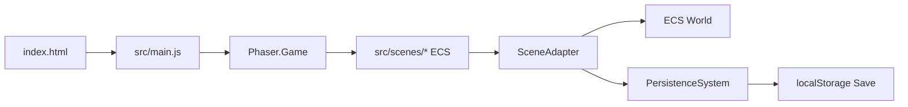

# ECS Big Bang Migration Plan

## Цель
Переключить приложение на единый ECS runtime (без параллельных legacy/ECS путей), чтобы `main.js` перестал быть монолитом бизнес-логики и стал тонким bootstrap/registry-слоем.

## Текущее состояние (по коду)
- Активный entrypoint: [`index.html`](index.html) загружает [`src/main.js`](src/main.js), где создается `new Phaser.Game(...)`.
- Параллельный ECS entry есть, но не используется и конфликтный: [`src/main-ecs.js`](src/main-ecs.js) (включая side-effect `import './main.js'`).
- ECS инфраструктура зрелая: [`src/ecs/adapters/SceneAdapter.js`](src/ecs/adapters/SceneAdapter.js), [`src/ecs/systems/index.js`](src/ecs/systems/index.js), [`src/ecs/adapters/GameStateAdapter.js`](src/ecs/adapters/GameStateAdapter.js), [`src/ecs/systems/PersistenceSystem.js`](src/ecs/systems/PersistenceSystem.js).
- ECS-сцены уже есть, но не все подключены в runtime: [`src/scenes/MainGameSceneECS.js`](src/scenes/MainGameSceneECS.js), [`src/scenes/RecoveryScene.js`](src/scenes/RecoveryScene.js), [`src/scenes/CareerScene.js`](src/scenes/CareerScene.js), [`src/scenes/FinanceScene.js`](src/scenes/FinanceScene.js), [`src/scenes/EducationScene.js`](src/scenes/EducationScene.js), [`src/scenes/EventQueueScene.js`](src/scenes/EventQueueScene.js), [`src/scenes/SkillsScene.js`](src/scenes/SkillsScene.js).

## Архитектурное решение
- Оставить **один** bootstrap и **один** `Phaser.Game`.
- Runtime scene graph собирать из модулей `src/scenes/*`, а не из inline-классов в `main.js`.
- Источник состояния: ECS world + persistence pipeline (через `SceneAdapter`/`PersistenceSystem`), без прямой доменной мутации в legacy-пути.

## Этапы внедрения

### 1) Нормализация bootstrap
#### Цель этапа
Оставить в проекте один понятный runtime-путь запуска, без скрытых side effects и двойной инициализации `Phaser.Game`.

#### Детальные шаги
1. Зафиксировать canonical entrypoint:
   - `index.html` -> `src/main.js` (или другой, но ровно один).
2. Развести роли файлов:
   - `src/main.js` = bootstrap/wiring (`imports`, `config.scene`, `new Phaser.Game`).
   - scene-логика и домен — вне bootstrap.
3. Убрать конфликтные side effects:
   - в [`src/main-ecs.js`](src/main-ecs.js) убрать `import './main.js'`.
   - исключить сценарий, где возможно создание второго `Phaser.Game`.
4. Если `main-ecs.js` остается, сделать его «безопасным»:
   - либо удалить из активного потока,
   - либо превратить в чисто архивный/экспериментальный модуль без bootstrap.

#### Проверки этапа
- По коду найден ровно один `new Phaser.Game(` в активной сборке.
- Нет import-цепочек, которые косвенно тянут чужой bootstrap.
- `npm run dev` поднимает приложение без дублирующихся canvas/игр.

#### Артефакты
- Обновленный entrypoint mapping в [`doc/README.md`](doc/README.md) и/или [`doc/core/README.md`](doc/core/README.md).

#### Критерий Done
- Bootstrap детерминирован и однозначен, этап 2 можно делать без риска двойного runtime.

---

### 2) Переключение main scene graph на ECS-реализации
#### Цель этапа
Перенаправить активный `config.scene` на ECS-сцены, устранив параллельное выполнение legacy-классов.

#### Детальные шаги
1. В [`src/main.js`](src/main.js) сформировать scene registry из модулей `src/scenes/*`.
2. Подключить ECS-классы в `config.scene`:
   - [`src/scenes/MainGameSceneECS.js`](src/scenes/MainGameSceneECS.js)
   - [`src/scenes/RecoveryScene.js`](src/scenes/RecoveryScene.js)
   - [`src/scenes/CareerScene.js`](src/scenes/CareerScene.js)
   - [`src/scenes/FinanceScene.js`](src/scenes/FinanceScene.js)
   - [`src/scenes/EducationScene.js`](src/scenes/EducationScene.js)
   - [`src/scenes/EventQueueScene.js`](src/scenes/EventQueueScene.js)
3. Для каждой сцены сверить ключ:
   - `super('SceneKey')` совпадает со всеми `scene.start('SceneKey')`.
4. Составить карту переходов и проверить критические маршруты:
   - `Start -> MainGame`,
   - `MainGame -> Recovery/Skills/Career/...`,
   - `EventQueue -> hostScene`.

#### Проверки этапа
- Все ключи сцен резолвятся без runtime ошибок.
- Переходы по кнопкам и модалкам работают без падений.
- Не осталось активных inline-классов, которые дублируют те же scene keys.

#### Критерий Done
- Активный graph полностью зарегистрирован через ECS-сцен-модули.

---

### 3) Приведение Intro/Start flow к единому persistence-пути
#### Цель этапа
Убрать рассинхрон между стартовыми сценами и ECS persistence-контуром.

#### Детальные шаги
1. Унифицировать контракты чтения/записи в:
   - [`src/scenes/StartScene.js`](src/scenes/StartScene.js)
   - [`src/scenes/SchoolIntroScene.js`](src/scenes/SchoolIntroScene.js)
   - [`src/scenes/InstituteIntroScene.js`](src/scenes/InstituteIntroScene.js)
2. Принять один путь persistence:
   - через [`src/ecs/systems/PersistenceSystem.js`](src/ecs/systems/PersistenceSystem.js) + [`src/ecs/adapters/GameStateAdapter.js`](src/ecs/adapters/GameStateAdapter.js),
   - либо временно через фасад совместимости с одинаковым интерфейсом.
3. Проверить миграцию save-версий:
   - старый сейв корректно читается и нормализуется,
   - новый сейв не ломает legacy-reader (если он еще нужен на период миграции).

#### Проверки этапа
- Новая игра, загрузка старого сейва, переход через интро и возврат в main — без потери состояния.
- После прохождения интро все ключевые поля (`education`, `skills`, `currentAge`, `currentJob`) синхронизированы.

#### Критерий Done
- Start/Intro flow не использует ad hoc сохранение в обход ECS-контракта.

---

### 4) Изоляция и удаление legacy-дублей
#### Цель этапа
Сократить поверхность legacy-кода, чтобы исключить дубли поведения.

#### Детальные шаги
1. В [`src/main.js`](src/main.js) удалить inline-классы сцен, уже замещенные ECS-версиями.
2. Сделать `main.js` тонким:
   - wiring + registry + инициализация.
3. Роль [`src/game-state.js`](src/game-state.js):
   - либо оставить только минимальные pure-утилиты/форматирование,
   - либо перенести оставшуюся бизнес-логику в ECS systems.
4. Прояснить судьбу [`src/ecs/adapters/LegacyFacade.js`](src/ecs/adapters/LegacyFacade.js):
   - интегрировать как единый compatibility слой на переходный период,
   - или удалить, если не используется.

#### Проверки этапа
- Нет двойных реализаций одной сцены/флоу.
- Новые фичи меняются в одном месте, без правок в legacy-копиях.

#### Критерий Done
- Legacy-дубли исключены из активного runtime.

---

### 5) Консолидация MainGameScene
#### Цель этапа
Зафиксировать одну canonical реализацию главной сцены и закрыть все расхождения UX/логики.

#### Детальные шаги
1. Выбрать canonical класс:
   - из [`src/scenes/MainGameSceneECS.js`](src/scenes/MainGameSceneECS.js) (или единый новый модуль).
2. Перенести все актуальные UI/UX правки из текущей активной версии `main.js`:
   - layout/адаптив,
   - модалки,
   - tooltip/интеракции,
   - новые кнопки и поведение (`Esc`, `Мои навыки`, интерьер и т.д.).
3. Разделить ответственность внутри MainGame:
   - render/layout helpers,
   - input handlers,
   - interaction with ECS systems.

#### Проверки этапа
- Визуальный и функциональный паритет с текущей рабочей версией.
- Не осталось альтернативных MainGameScene классов в runtime.

#### Критерий Done
- Одна main-сцена, одно место правок, предсказуемая архитектура.

---

### 6) QA-паритет и финальный cutover
#### Цель этапа
Подтвердить, что ECS runtime эквивалентен (или лучше) legacy-поведения и готов к закреплению.

#### Детальные шаги
1. Пройти e2e smoke-маршруты:
   - старт новой игры,
   - рабочий период,
   - recovery,
   - карьера,
   - финансы,
   - обучение,
   - event queue,
   - навыки,
   - intro flow.
2. Сверить parity с документами:
   - [`doc/ecs/ECS_PARITY_TABLE.md`](doc/ecs/ECS_PARITY_TABLE.md)
   - [`doc/ecs/ECS_DOMAIN_MAP.md`](doc/ecs/ECS_DOMAIN_MAP.md)
3. Проверить техническую устойчивость:
   - ошибки в консоли,
   - сохранение/перезагрузка,
   - resize/масштаб,
   - отсутствие dead imports и неиспользуемых entrypoints.
4. После успешной проверки удалить остатки legacy runtime-веток.

#### Критерий Done
- ECS runtime стабилен, legacy runtime больше не участвует в рабочем потоке.

---

## Инструкции по выполнению каждого этапа

### Формат работы
- Делать этапы атомарно: один этап — одна логическая серия изменений.
- Не переходить к следующему этапу, пока текущий не прошел минимальный smoke.
- Поддерживать актуальность плана в frontmatter (`status` у todos).

### Правило принятия решений
- При конфликте между «быстро» и «безопасно» выбирать обратимую миграцию с явной точкой отката.
- На период миграции не смешивать два пути сохранения в рамках одного user flow.

### Стратегия отката
- Перед крупным переключением registry хранить рабочую ветку с предыдущим сценарием запуска.
- Если этап ломает критичный flow (старт/сейв/переходы), откатить только последний атомарный шаг и зафиксировать причину в плане.

### Definition of Ready для этапа
- Ясно определены файлы, которые затрагиваются.
- Понятен критерий done и список обязательных проверок.
- Нет неоднозначности в canonical реализации сцен/entrypoint.

## Критерии готовности
- В проекте только один активный `Phaser.Game` bootstrap.
- `config.scene` состоит из модульных ECS-сцен, без inline монолита.
- Нет продакшн-критичных переходов, ведущих в legacy-only код.
- Сохранение/загрузка стабильны на всех переходах сцен.
- Объем `src/main.js` существенно снижен до bootstrap + wiring.

## Риски и контроль
- Риск несовпадения scene keys -> контроль через инвентаризацию `scene.start(...)` и `super('...')`.
- Риск поведения при сохранении -> контроль через smoke-прохождение полного цикла и сравнение save snapshot до/после.
- Риск UX-регрессий из-за дублированных реализаций -> выбираем canonical сцену до массовых правок и убираем дубли рано, а не в конце.