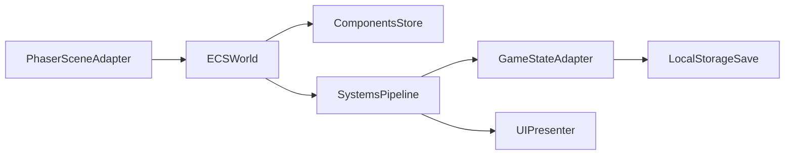

# План миграции на Entity-Component архитектуру

## Текущее основание
- Основной монолит сцен находится в [`e:/project/games/game_life/src/main.js`](e:/project/games/game_life/src/main.js) (все ключевые `*Scene` в одном файле).
- Данные, правила и операции над состоянием сконцентрированы в [`e:/project/games/game_life/src/game-state.js`](e:/project/games/game_life/src/game-state.js).
- Базовые UI-примитивы уже выделены в [`e:/project/games/game_life/src/ui-kit.js`](e:/project/games/game_life/src/ui-kit.js), что удобно для перехода на компонентную сборку экрана.
- Архитектурные вводные и риски зафиксированы в [`e:/project/games/game_life/doc/ARCHITECTURE_ANALYSIS.md`](e:/project/games/game_life/doc/ARCHITECTURE_ANALYSIS.md).

## Целевая архитектура (Entity-Component)
- `Entity` — идентификатор игрового объекта/экрана/карточки.
- `Component` — данные (без бизнес-логики): `StatsComponent`, `CareerComponent`, `WalletComponent`, `UiLayoutComponent` и т.д.
- `System` — чистая логика обработки компонентов: `WorkCycleSystem`, `RecoverySystem`, `CareerSystem`, `FinanceSystem`, `TimeSystem`, `PersistenceSystem`.
- `SceneAdapter` — тонкий слой Phaser-сцены, который связывает ECS-мир и рендер/UI.

## Этапы миграции

### 1) Подготовка и инвентаризация домена
- Зафиксировать карту доменных областей и текущих API из [`e:/project/games/game_life/src/game-state.js`](e:/project/games/game_life/src/game-state.js):
  - Core loop (work/recovery/time)
  - Career, Education, Finance, Housing, Random Events
  - Save/load/persist
- Составить таблицу соответствия: `функции game-state -> будущие systems/components`.
- Определить минимальный ECS-скоуп первой итерации: только `MainGameScene + RecoveryScene`.

### 2) Введение ECS-ядра без изменения поведения
- Добавить новый слой:
  - `src/ecs/world.js` (регистрация entity/component/system)
  - `src/ecs/components/*`
  - `src/ecs/systems/*`
  - `src/ecs/adapters/game-state-adapter.js`
- Сохранить совместимость: существующие функции из [`e:/project/games/game_life/src/game-state.js`](e:/project/games/game_life/src/game-state.js) продолжают работать как источник истины, ECS пока читает через адаптер.
- Добавить контракты событий кадра/тика (`beforeTick`, `afterTick`) для интеграции со сценами.

### 3) Вынос сцен из монолита и ввод SceneAdapter
- Разделить [`e:/project/games/game_life/src/main.js`](e:/project/games/game_life/src/main.js) на отдельные файлы в `src/scenes/` (без логических изменений).
- Для `MainGameScene` и `RecoveryScene` внедрить `SceneAdapter`, который:
  - создаёт ECS-мир
  - инициализирует базовые entities/components
  - вызывает systems в `update()`
- UI продолжает использовать примитивы из [`e:/project/games/game_life/src/ui-kit.js`](e:/project/games/game_life/src/ui-kit.js), но данные для отрисовки получает из ECS.

### 4) Поэтапный перенос доменной логики в Systems
- Переносить логику вертикальными срезами (feature slices), чтобы уменьшить риск регрессий:
  - Срез A: work period + stat changes + time progression
  - Срез B: recovery actions + validation
  - Срез C: career progression
  - Срез D: finance settlements/investments
- Для каждого среза:
  - добавить/расширить компоненты
  - реализовать system
  - заменить прямой вызов функций `game-state` во scene на вызов ECS
  - оставить fallback через adapter до полного переноса

### 5) Сохранения и миграция формата данных
- Ввести версионирование save schema (`saveVersion`) и мигратор в `PersistenceSystem`.
- На первом шаге — read-compatibility: старые сохранения читаются и нормализуются в ECS-компоненты.
- На втором шаге — write-through: ECS пишет обратно в текущий формат, чтобы не ломать пользовательские сейвы.

### 6) Тестирование и контроль регрессий
- Добавить smoke-сценарии на ключевой цикл: `start work -> event -> recovery -> save/load`.
- Для каждого перенесённого system добавить unit-тесты на детерминированные правила (например, расчёт зарплаты, изменение статов, прогресс курсов).
- Ввести чеклист паритета поведения старой и новой реализации до удаления legacy-кода.

### 7) Декомпозиция legacy и финализация
- После переноса всех срезов удалить прямые обращения сцен к `game-state`.
- Сузить [`e:/project/games/game_life/src/game-state.js`](e:/project/games/game_life/src/game-state.js) до фасада совместимости или удалить модуль после полного перехода.
- Обновить архитектурные документы:
  - [`e:/project/games/game_life/doc/ARCHITECTURE_ANALYSIS.md`](e:/project/games/game_life/doc/ARCHITECTURE_ANALYSIS.md)
  - [`e:/project/games/game_life/doc/IMPLEMENTATION_STATUS.md`](e:/project/games/game_life/doc/IMPLEMENTATION_STATUS.md)

## Порядок внедрения по приоритету
- Волна 1: `MainGameScene`, `RecoveryScene` (максимум core loop ценности).
- Волна 2: `CareerScene`, `EducationScene`.
- Волна 3: `FinanceScene`, `EventQueueScene`, `SchoolScene`, `InstituteScene`, `InteractiveWorkEventScene`.

## Критерии готовности миграции
- Все сцены работают через `SceneAdapter + ECSWorld`.
- Нет прямых бизнес-мутаций состояния в scene-классах.
- Сохранения старых версий открываются без потерь.
- Поведение core loop совпадает с текущей реализацией по smoke-чеклисту.