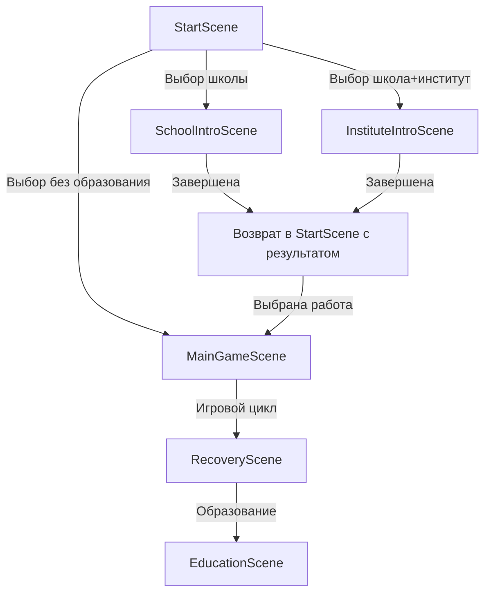

# План реализации StartScene и начального образования

## Текущее состояние

### Что существует:
- `DEFAULT_SAVE` в [`src/game-state.js`](src/game-state.js) (строки 167-238) - дефолтное сохранение с уже пройденной школой
- `SchoolScene` в [`src/main.js`](src/main.js) (строки 2918-3116) - мини-игра для курсов
- `InstituteScene` в [`src/main.js`](src/main.js) (строки 3118-3312) - мини-игра для института
- `EducationScene` в [`src/main.js`](src/main.js) (строки 1872-2273) - экран образования
- `loadSave()` и `persistSave()` в [`src/game-state.js`](src/game-state.js) (строки 773-840)

### Что отсутствует:
- `StartScene` - нет экрана старта игры
- Нет выбора начального образования
- Нет UI для "Новой игры"
- Школа сразу помечена как "completed"

---

## Задача 1: Обновить DEFAULT_SAVE для нового персонажа

### Изменения в [`src/game-state.js`](src/game-state.js) (строки 167-238):

**Текущие значения для сброса:**
```javascript
{
  playerName: 'Алексей',
  startAge: 23,
  currentAge: 24,
  gameDays: 146,
  gameWeeks: 20,
  money: 68450,
  education: {
    school: 'completed',  // ⚠️ Убрать это
    institute: 'none',
    educationLevel: 'Среднее'
  }
}
```

**Новые значения для "чистого старта":**
```javascript
{
  version: '0.2.0',
  playerName: '',  // Будет заполнено в StartScene
  startAge: 18,
  currentAge: 18,
  gameDays: 0,
  gameWeeks: 0,
  gameMonths: 0,
  gameYears: 0,
  money: 5000,  // Стартовый капитал
  totalEarnings: 0,
  totalSpent: 0,
  currentJob: null,  // Будет выбран в StartScene
  housing: {
    level: 0,
    name: 'Комната',
    comfort: 0,
    furniture: [],
    lastWeeklyBonus: null,
  },
  skills: {
    // Базовые навыки с уровнем 1 (выбираются в StartScene)
    professionalism: 0,
    communication: 0,
    timeManagement: 0,
    healthyLifestyle: 0,
    financialLiteracy: 0,
    stressResistance: 0,
  },
  education: {
    school: 'none',  // Будет изменено в StartScene
    institute: 'none',
    educationLevel: 'Нет',
    activeCourses: [],
  },
  relationships: [],
  investments: [],
  finance: {
    reserveFund: 0,
    monthlyExpenses: {
      housing: 0,
      food: 0,
      transport: 0,
      leisure: 0,
      education: 0,
    },
    lastMonthlySettlement: null,
  },
  eventHistory: [],
  pendingEvents: [],
  lifetimeStats: {
    totalWorkDays: 0,
    totalEvents: 0,
    maxMoney: 0,
  },
  stats: {
    hunger: 80,
    energy: 80,
    stress: 20,
    mood: 70,
    health: 90,
    physical: 70,
  },
}
```

---

## Задача 2: Создать StartScene

### Новый файл: `src/scenes/StartScene.js`

### Требуемые элементы согласно GDD:

#### 1. Ввод имени персонажа
- TextField для ввода имени
- Валидация: не пустой, 2-20 символов
- Placeholder: "Введите имя"

#### 2. Выбор стартового возраста
- Slider или Select для выбора возраста (18–30 лет)
- Отображение возраста при выборе
- Подсказка: "Рекомендуется 18–25 лет"

#### 3. Выбор первой работы

**Доступные работы для старта** (из [`src/balance/career-jobs.js`](src/balance/career-jobs.js) или создать отдельный массив):

| ID | Название | График | ЗП в неделю | Требования |
|----|----------|--------|--------------|------------|
| courier | Курьер | Свободный | 12 000 - 18 000 | Нет |
| waiter | Официант | 2/2 или 3/3 | 22 000 - 28 000 | Коммуникация 1 |
| office_worker | Офисный сотрудник | 5/2 | 35 000 - 45 000 | Тайм-менеджмент 2 |
| specialist | Специалист (IT/инженер) | 5/2 | 55 000 - 75 000 | Профессионализм 3 |

**UI:**
- Карточки для каждой работы
- Описание работы
- График и ЗП
- Выбор через клик

#### 4. Выбор пути образования

**Три варианта:**

**Вариант А — "Сразу в жизнь":**
```javascript
{
  id: 'none',
  label: 'Сразу в жизнь',
  description: 'Пропустить образование и начать работать',
  result: {
    educationLevel: 'Нет',
    skills: {
      timeManagement: 1,
      communication: 1,
      financialLiteracy: 1
    },
    startAge: 18
  }
}
```

**Вариант Б — Пройти школу:**
```javascript
{
  id: 'school',
  label: 'Пройти школу',
  description: 'Мини-игра на 10–12 минут для получения базовых навыков',
  result: {
    educationLevel: 'Среднее',
    skills: {
      timeManagement: 1,
      communication: 1,
      financialLiteracy: 1,
      healthyLifestyle: 1
    },
    startAge: 18
  },
  scene: 'SchoolIntroScene'  // Новая сцена
}
```

**Вариант В — Пройти школу + Институт:**
```javascript
{
  id: 'institute',
  label: 'Пройти школу + Институт',
  description: 'Полный путь образования с получением продвинутого навыка',
  result: {
    educationLevel: 'Высшее',
    skills: {
      timeManagement: 1,
      communication: 1,
      financialLiteracy: 1,
      healthyLifestyle: 1,
      professionalism: 1  // Продвинутый навык
    },
    startAge: 18
  },
  scenes: ['SchoolIntroScene', 'InstituteIntroScene']  // Две новые сцены
}
```

#### 5. Кнопка "Начать игру"
- Валидация: имя заполнено, работа выбрана, путь образования выбран
- Создание нового saveData из DEFAULT_SAVE с выбранными значениями
- Переход в MainGameScene

---

## Задача 3: Создать сцены начального образования

### 3.1 SchoolIntroScene (Мини-игра школы)

**Новый файл:** `src/scenes/SchoolIntroScene.js`

**Требования по GDD:**
- Длительность: 10–12 минут реального времени
- Раундов: 4–5
- Длительность раунда: 2–2,5 минуты

**Структура раундов:**

**Раунд 1 - Математика:**
- Быстрый тест (10 вопросов за 60 секунд)
- Или кликер-задача (нажать правильные ответы)

**Раунд 2 - Русский язык:**
- Мини-игра "соедини пары" (слово-определение)
- 5–7 пар за 90 секунд

**Раунд 3 - История:**
- Викторина с выбором ответов
- 5 вопросов по истории

**Раунд 4 - Биология:**
- Интерактивная задача (собрать пазл или соедини органы)

**Награда:**
- После каждого раунда: +1 уровень к базовому навыку
- По окончании: переход к выбору работы или в StartScene (если институт)

**UI:**
- Таймер раунда
- Прогресс-бар раундов
- Задача в центре экрана
- Кнопки ответов (для викторин)
- Награда после завершения

### 3.2 InstituteIntroScene (Мини-игра института)

**Новый файл:** `src/scenes/InstituteIntroScene.js`

**Требования по GDD:**
- Длительность: 8–10 минут реального времени
- Раундов: 3–4
- Длительность раунда: 2–3 минуты

**Структура раундов:**

**Раунд 1 - Кейс-задача:**
- Бизнес-кейс с 3–4 вариантами решения
- Выбор оптимального решения

**Раунд 2 - Мини-симуляция проекта:**
- Ресурсы (время, деньги, команда)
- Задачи (планирование, исполнение, контроль)
- Управление через кнопки

**Раунд 3 - Интерактивная презентация:**
- Слайды с вопросами
- Выбор правильных ответов или кликер

**Раунд 4 - Финальный проект:**
- Сборка всего пройденного
- Получение оценки

**Награда:**
- По окончании: +1 уровень продвинутого навыка (профессионализм)
- Переход к выбору работы

**UI:**
- Сложнее, чем школа
- Больше текста и контекста
- Мультишаговые задачи

---

## Задача 4: Интеграция с существующей системой

### 4.1 Обновить функцию loadSave()

В [`src/game-state.js`](src/game-state.js) (строки 773-828):

**Добавить параметр для нового сброса:**
```javascript
export function resetGame() {
  localStorage.removeItem('game-life-save');
  return clone(DEFAULT_SAVE);
}
```

### 4.2 Обновить конфигурацию Phaser

В [`src/main.js`](src/main.js):

**Добавить StartScene в конфигурацию:**
```javascript
config: {
  scene: [
    StartScene,  // Добавить первым
    MainGameScene,
    RecoveryScene,
    // ... другие сцены
    SchoolIntroScene,  // Новые сцены
    InstituteIntroScene,
  ]
}
```

### 4.3 Обновить навигацию в MainGameScene

**Добавить кнопку "Новая игра"** в меню:
- В настройках или отдельной кнопке
- Вызов функции `resetGame()`
- Перезагрузка страницы или переход в StartScene

---

## Порядок реализации

### Фаза 1: Подготовка (2-3 часа)
1. Обновить `DEFAULT_SAVE` в [`src/game-state.js`](src/game-state.js)
2. Добавить функцию `resetGame()` в [`src/game-state.js`](src/game-state.js)
3. Подготовить массив работ для старта (в [`src/game-state.js`](src/game-state.js) или новый файл)

### Фаза 2: StartScene (4-6 часов)
4. Создать `src/scenes/StartScene.js`
5. Реализовать UI для ввода имени
6. Реализовать выбор возраста (slider/select)
7. Реализовать выбор работы (карточки)
8. Реализовать выбор образования (три варианта)
9. Добавить валидацию и кнопку "Начать игру"
10. Интегрировать с системой сохранений

### Фаза 3: SchoolIntroScene (6-8 часов)
11. Создать `src/scenes/SchoolIntroScene.js`
12. Реализовать 4 раунда с разными мини-играми
13. Добавить таймеры и прогресс-бары
14. Реализовать систему наград (+1 навык за раунд)
15. Обработать завершение и переход

### Фаза 4: InstituteIntroScene (6-8 часов)
16. Создать `src/scenes/InstituteIntroScene.js`
17. Реализовать 3-4 раунда с более сложными задачами
18. Добавить UI для многошаговых задач
19. Реализовать награду (+1 продвинутый навык)
20. Обработать завершение и переход к выбору работы

### Фаза 5: Интеграция и тестирование (2-3 часа)
21. Добавить новые сцены в конфигурацию Phaser в [`src/main.js`](src/main.js)
22. Обновить навигацию (кнопка "Новая игра")
23. Тестировать все пути (без образования, школа, институт)
24. Тестировать сохранение/загрузку
25. Проверить адаптивность UI

---

## Технические детали

### Зависимости:

**Из существующих файлов:**
- [`src/game-state.js`](src/game-state.js) - для сохранений, DEFAULT_SAVE, работ
- [`src/ui-kit.js`](src/ui-kit.js) - для UI компонентов (кнопки, панели, текст)
- [`src/main.js`](src/main.js) - для интеграции сцен

**Новые данные:**
- Стартовые работы (можно использовать из [`src/balance/career-jobs.js`](src/balance/career-jobs.js))
- Раунды школы (математика, русский, история, биология)
- Раунды института (кейсы, симуляции, презентации)

### UI Компоненты из ui-kit.js:

**Использовать:**
- `createRoundedPanel()` - для карточек
- `createRoundedButton()` - для кнопок
- `textStyle()` - для текста
- `COLORS` - для цветовой схемы

### Флоу данных:



---

## Советы по реализации

### 1. Переиспользование кода
- Использовать существующие `SchoolScene` и `InstituteScene` как референс
- Скопировать паттерны UI из `MainGameScene`
- Переиспользовать мини-игровые механики из `WorkEventScene`

### 2. Постепенная реализация
- Сначала сделать базовый StartScene без образования
- Потом добавить выбор образования
- В конце реализовать мини-игры для школы и института

### 3. Валидация
- Проверять все данные перед сохранением
- Показывать понятные сообщения об ошибках
- Не позволять начинать игру без имени

### 4. Адаптивность
- Использовать `Phaser.Scale.RESIZE` для адаптивности
- Тестировать на мобильных устройствах
- Использовать относительные размеры (проценты от ширины/высоты)

### 5. Сохранение состояния
- Сохранять выборы между сценами (registry или временный объект)
- Корректно обрабатывать возврат из SchoolIntroScene/InstituteIntroScene

---

## Варианты реализации

### Вариант 1: Полная реализация (рекомендуется)
- Все три варианта образования
- Полноценные мини-игры для школы и института
- Соответствует GDD на 100%
- Время: 20–25 часов

### Вариант 2: Упрощённая реализация
- StartScene с выбором имени, возраста, работы
- Только вариант "без образования" и "школа" (без мини-игр)
- Школа даёт навыки сразу без мини-игры
- Время: 8–10 часов

### Вариант 3: Минимальная реализация
- StartScene с выбором имени и работы
- Три варианта образования (без мини-игр)
- Мгновенное получение навыков
- Время: 4–6 часов

---

## Вопросы для уточнения

1. Какой вариант реализации предпочитаете? (полный/упрощённый/минимальный)
2. Нужно ли реализовывать мини-игры для школы и института сразу или можно отложить?
3. Использовать ли существующие `SchoolScene` и `InstituteScene` как базу для новых сцен?