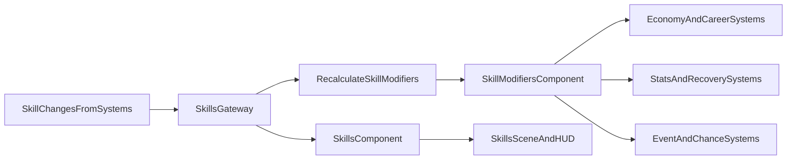

# Полная переработка системы навыков

## Цель
Сделать навыки полноценной механикой: не только хранить уровни, но и централизованно пересчитывать и применять эффекты ко всем ключевым подсистемам (статы, экономика, карьера, события, обучение) на базе спецификации из [e:\project\games\game_life\doc\skills.txt](e:\project\games\game_life\doc\skills.txt).

## Границы этапа
- Делаем один большой релиз по навыкам без сохранения совместимости старого формата сейва.
- Legacy-слой в [e:\project\games\game_life\src\game-state.js](e:\project\games\game_life\src\game-state.js) не удаляем в этом заходе, но исключаем его из критического пути ECS-логики навыков.
- Баланс-коэффициенты берём из `doc/skills.txt` как baseline; финальный тюнинг чисел допускается отдельным коммитом после интеграции.

## Текущее состояние (что подтверждено)
- Каталог навыков сейчас ограничен и частично декларативен в [e:\project\games\game_life\src\balance\skills-constants.js](e:\project\games\game_life\src\balance\skills-constants.js).
- Из эффектов реально в системах полноценно используется в основном ветка `professionalism -> career` через [e:\project\games\game_life\src\ecs\systems\CareerProgressSystem.js](e:\project\games\game_life\src\ecs\systems\CareerProgressSystem.js).
- Изменение навыков размазано по нескольким системам (`EducationSystem`, `RecoverySystem`, `FinanceActionSystem`, `EventChoiceSystem`) вместо единого шлюза.

## Целевая архитектура
- Ввести единый модуль расчёта модификаторов навыков (по аналогии со структурой из `doc/skills.txt`) и сделать его источником правды.
- Перевести ECS-системы на чтение итоговых модификаторов, а не на локальные «ручные» вычисления.
- Сделать единый API изменения навыков (одна точка записи + принудительный пересчёт модификаторов).
- Обновить UI навыков для новых категорий и ключей.
- Обновить формат сейва под новую структуру (без миграционной совместимости).

## Детальная модель данных
- `skills` (component): плоский объект `{ [skillKey]: level }`, где `level` в диапазоне `0..10`.
- `skillModifiers` (new component/resource): итоговый снимок агрегированных модификаторов за текущий тик.
- Категории навыков:
  - `basic`
  - `professional`
  - `social`
  - `creative`
- Для UI и фильтрации в каталоге навыков ввести единый контракт:
  - `key`, `category`, `title`, `description`, `maxLevel`, `effects`, `milestones`.
- Правило пересчёта:
  - reset к базовым значениям;
  - применение эффектов по каждому навыку в фиксированном порядке;
  - clamp итоговых значений на безопасные пределы.

## Файлы и изменения
- Расширить каталог навыков и категории:
  - [e:\project\games\game_life\src\balance\skills-constants.js](e:\project\games\game_life\src\balance\skills-constants.js)
- Добавить централизованный runtime модификаторов:
  - новый файл `src/balance/skill-modifiers.js` (или эквивалент в `src/ecs/systems/`)
- Перевести запись навыков на единый шлюз:
  - [e:\project\games\game_life\src\ecs\systems\SkillsSystem.js](e:\project\games\game_life\src\ecs\systems\SkillsSystem.js)
  - [e:\project\games\game_life\src\ecs\systems\EducationSystem.js](e:\project\games\game_life\src\ecs\systems\EducationSystem.js)
  - [e:\project\games\game_life\src\ecs\systems\RecoverySystem.js](e:\project\games\game_life\src\ecs\systems\RecoverySystem.js)
  - [e:\project\games\game_life\src\ecs\systems\FinanceActionSystem.js](e:\project\games\game_life\src\ecs\systems\FinanceActionSystem.js)
  - [e:\project\games\game_life\src\ecs\systems\EventChoiceSystem.js](e:\project\games\game_life\src\ecs\systems\EventChoiceSystem.js)
- Подключить модификаторы в системы, где они должны влиять:
  - [e:\project\games\game_life\src\ecs\systems\CareerProgressSystem.js](e:\project\games\game_life\src\ecs\systems\CareerProgressSystem.js)
  - [e:\project\games\game_life\src\ecs\systems\WorkPeriodSystem.js](e:\project\games\game_life\src\ecs\systems\WorkPeriodSystem.js)
  - [e:\project\games\game_life\src\ecs\systems\MonthlySettlementSystem.js](e:\project\games\game_life\src\ecs\systems\MonthlySettlementSystem.js)
  - при необходимости системы восстановления/статов
- Обновить сохранение под новый формат:
  - [e:\project\games\game_life\src\ecs\systems\PersistenceSystem.js](e:\project\games\game_life\src\ecs\systems\PersistenceSystem.js)
  - [e:\project\games\game_life\src\ecs\adapters\GameStateAdapter.js](e:\project\games\game_life\src\ecs\adapters\GameStateAdapter.js)
  - [e:\project\games\game_life\src\balance\default-save.js](e:\project\games\game_life\src\balance\default-save.js)
- Обновить отображение навыков и вкладок:
  - [e:\project\games\game_life\src\scenes\SkillsScene.js](e:\project\games\game_life\src\scenes\SkillsScene.js)
  - [e:\project\games\game_life\src\scenes\MainGameSceneECS.js](e:\project\games\game_life\src\scenes\MainGameSceneECS.js)

## Пошаговая реализация
### Этап 1: Нормализовать каталог навыков
- Переписать [e:\project\games\game_life\src\balance\skills-constants.js](e:\project\games\game_life\src\balance\skills-constants.js) под 4 категории из `doc/skills.txt`.
- Добавить экспорт `SKILLS_TABS`, чтобы устранить текущий разрыв контракта со `SkillsScene`.
- Проверить уникальность `skill.key` и соответствие ключей в источниках наград (`education-programs`, `events`, `recovery`).

### Этап 2: Ввести единый пересчёт модификаторов
- Создать `src/balance/skill-modifiers.js`:
  - `createBaseSkillModifiers()`
  - `recalculateSkillModifiers(skillLevels)`
  - `clampSkillModifiers(modifiers)`
- Маппинг эффектов из `doc/skills.txt`:
  - процентные эффекты -> multiplicative multiplier;
  - фиксированные рублёвые бонусы -> additive bonuses;
  - пороговые бонусы -> `milestone`-флаги в результирующем объекте модификаторов.

### Этап 3: Единый шлюз изменения навыков
- Расширить [e:\project\games\game_life\src\ecs\systems\SkillsSystem.js](e:\project\games\game_life\src\ecs\systems\SkillsSystem.js):
  - `applySkillChanges(entityId, deltaMap, reason)`
  - автоматический вызов `recalculateSkillModifiers` после любого изменения.
- Во всех системах-источниках (`EducationSystem`, `RecoverySystem`, `FinanceActionSystem`, `EventChoiceSystem`) заменить прямые мутации `skills` на вызов `SkillsSystem`.

### Этап 4: Подключить модификаторы к геймплею
- Карьера/доход:
  - [e:\project\games\game_life\src\ecs\systems\CareerProgressSystem.js](e:\project\games\game_life\src\ecs\systems\CareerProgressSystem.js)
  - [e:\project\games\game_life\src\ecs\systems\WorkPeriodSystem.js](e:\project\games\game_life\src\ecs\systems\WorkPeriodSystem.js)
- Статы/расходы/восстановление:
  - `energy/hunger/stress/mood/health` читать через `skillModifiers`.
- События:
  - [e:\project\games\game_life\src\ecs\systems\MonthlySettlementSystem.js](e:\project\games\game_life\src\ecs\systems\MonthlySettlementSystem.js) применять модификаторы шанса/штрафов.

### Этап 5: Сейв и UI
- Обновить формат `save` в [e:\project\games\game_life\src\ecs\systems\PersistenceSystem.js](e:\project\games\game_life\src\ecs\systems\PersistenceSystem.js) и [e:\project\games\game_life\src\ecs\adapters\GameStateAdapter.js](e:\project\games\game_life\src\ecs\adapters\GameStateAdapter.js):
  - сохраняем расширенный `skills`;
  - сохраняем/восстанавливаем `skillModifiers` (или пересчитываем при загрузке, если решим не хранить снимок).
- Обновить [e:\project\games\game_life\src\balance\default-save.js](e:\project\games\game_life\src\balance\default-save.js) под новый набор ключей.
- В UI (`SkillsScene`, `MainGameSceneECS`) вывести новые вкладки, прогресс и ключевые активные бонусы.

## Правила и guardrails реализации
- Все импорты держать вверху файлов, без inline import.
- Не вводить дублирующие формулы в системах: любая формула эффекта живёт только в `skill-modifiers`.
- Любое изменение навыка должно быть трассируемо причиной (`reason`) для отладки и баланса.
- Для нестабильных или сложных эффектов сначала добавить feature-flag/мягкую деградацию (чтобы не ломать игровой цикл).

## План проверки (verification)
- Unit/logic smoke:
  - `recalculateSkillModifiers` корректно считает multipliers/additive бонусы.
  - Проверка milestone-порогов (`6`, `10`) на типовых навыках.
- Integration:
  - изменение навыка через любой источник награды сразу меняет `skillModifiers`;
  - карьерный доход и цены/расходы меняются в ожидаемую сторону.
- Save/load:
  - новый save создаётся, перезапуск игры восстанавливает актуальные уровни и эффекты.
- UI:
  - все 4 категории видны, карточки навыков не падают на отсутствующих полях.
- Stability:
  - линтер чистый на изменённых файлах;
  - нет runtime-ошибок при старте сцены и переходах.

## Риски и ранние меры
- Риск: слишком сильный суммарный буст при композиции множителей.
  - Мера: централизованный clamp + верхние/нижние пределы по доменам.
- Риск: несоответствие ключей навыков между контентом и кодом.
  - Мера: единый словарь ключей + проверка наличия неизвестных ключей в runtime.
- Риск: регресс в карьере из-за дублирующей логики между системами.
  - Мера: убрать/свести дубли после подключения единого модификаторного слоя.

## Критерии приёмки
- Все навыки из `doc/skills.txt` доступны в каталоге и корректно отображаются в UI по категориям.
- Любое изменение навыка проходит через единый шлюз и запускает пересчёт модификаторов.
- Ключевые ECS-подсистемы читают итоговые модификаторы и демонстрируют ожидаемое влияние на геймплей.
- Новый формат сейва стабильно сохраняет/восстанавливает полную структуру навыков и модификаторов.
- Нет линтер-ошибок в затронутых файлах, игровой цикл стартует без runtime-ошибок.