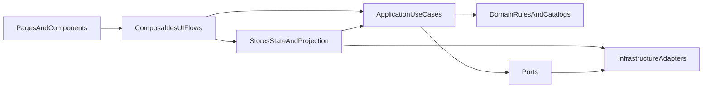

# Архитектурное исследование проекта `game_life`
`r`n> **Статус:** исторический анализ до server-first extraction. Для текущего состояния используйте [`doc/core/IMPLEMENTATION_STATUS.md`](../core/IMPLEMENTATION_STATUS.md), [`doc/SERVER_MIGRATION.md`](../SERVER_MIGRATION.md) и [`specs/server-first-arch/plan.md`](../../specs/server-first-arch/plan.md).`r`n
## 1. Контекст

Проект находится в переходной точке:

- сейчас это клиентское Nuxt-приложение с `ssr: false` и без серверного слоя;
- игровая логика для удобства разработки и отладки исполняется на клиенте;
- в дальнейшем проект планируется готовить к публикации в ЯндексИгры и оборачивать в нативное приложение для Google Play;
- из этого следует, что текущая архитектура должна быть удобной для разработки сейчас, но при этом не мешать постепенному переходу к server-authoritative модели.

Это важно, потому что архитектура, которая хорошо работает для "толстого клиента", не всегда хорошо переживает вынос игровой логики на сервер. Если не подготовить границы заранее, будущая миграция превращается в массовое переписывание store/composable/UI-кода.

## 2. Краткий вывод

Текущая архитектура уже содержит полезные заделы:

- есть попытка формализовать слои в [`../.cursor/rules/30-architecture.mdc`](../../.cursor/rules/30-architecture.mdc);
- есть отдельный `domain`-слой с игровыми каталогами и pure-утилитами, например [`../src/domain/balance/actions/index.ts`](../../src/domain/balance/actions/index.ts) и [`../src/domain/balance/utils/build-new-game-save.ts`](../../src/domain/balance/utils/build-new-game-save.ts);
- есть зачаток application-слоя в [`../src/application/game/index.ts`](../../src/application/game/index.ts);
- есть порт для сохранений [`../src/application/game/ports/SaveRepository.types.ts`](../../src/application/game/ports/SaveRepository.types.ts) и инфраструктурная реализация [`../src/infrastructure/persistence/LocalStorageSaveRepository.ts`](../../src/infrastructure/persistence/LocalStorageSaveRepository.ts).

Но в целом по проекту действительно видны разные архитектурные подходы одновременно:

- часть игровой логики живет в stores;
- часть в composables;
- часть в `application`;
- часть UI-потоков имеет по два параллельных решения;
- правила проекта и реальная структура кода местами расходятся.

Главный вывод исследования: **текущий `mixed approach` уже начинает мешать расширяемости**. Для этого проекта наиболее уместен не резкий переход сразу в полностью server-authoritative архитектуру, а **переходный `application-first / ports-and-adapters` подход**: единая точка входа для use-case логики, stores как слой состояния и проекций, composables как UI-оркестрация, инфраструктура за портами, а будущий сервер как естественная следующая замена локальным адаптерам.

## 3. Что есть сейчас

### 3.1. Фактическая структура

По конфигурации [`../nuxt.config.ts`](../../nuxt.config.ts) приложение работает как SPA:

- `ssr: false`;
- нет `server/` директории;
- в `src/` нет признаков клиент-серверного обмена через `useFetch`, `$fetch` или `fetch`;
- состояние и игровая логика фактически исполняются в браузере.

Слои в коде сейчас выглядят так:

- `domain` содержит игровые каталоги, константы, типы и pure-утилиты;
- `application/game` содержит отдельные команды и запросы;
- `stores` хранят state, но при этом нередко сами исполняют бизнес-логику;
- `composables` местами выступают как UI helper-слой, а местами как второй application-слой;
- `infrastructure` пока почти полностью сводится к persistence через localStorage.

### 3.2. Где расположена "серверная" логика сегодня

Хотя серверного слоя нет, часть обязанностей, которые в будущем почти наверняка должны принадлежать серверу, уже присутствует на клиенте:

- orchestration игровой сессии в [`../src/stores/game-store/index.ts`](../../src/stores/game.store.ts);
- проверки и применение действий в [`../src/stores/actions-store/index.ts`](../../src/stores/actions-store/index.ts) и [`../src/composables/useActions/index.ts`](../../src/composables/useActions/index.ts);
- работа с очередями событий в [`../src/stores/events-store/index.ts`](../../src/stores/events-store/index.ts);
- сборка/восстановление save payload в [`../src/stores/game-store/index.ts`](../../src/stores/game.store.ts);
- инициализация игры и загрузка сохранения в [`../src/middleware/game-init.ts`](../../src/middleware/game-init.ts);
- автосохранение и lifecycle-side effects в [`../src/plugins/auto-save.client.ts`](../../src/plugins/auto-save.client.ts).

Иначе говоря, сегодня клиент не просто отображает игру, а является источником истины почти для всей игровой сессии.

## 4. Сильные стороны текущего подхода

Ниже не только проблемы. У текущей архитектуры уже есть хорошие качества, которые стоит сохранить.

### 4.1. Плюсы

1. **Быстрый цикл разработки**
   Весь gameplay находится рядом с UI, поэтому новую механику можно быстро добавить и сразу проверить в браузере.

2. **Уже есть намек на правильные слои**
   Правила проекта и наличие `domain`, `application`, `infrastructure` задают направление, даже если оно пока соблюдается не полностью.

3. **Есть полезные точки для будущего выделения логики**
   `SaveRepository` уже оформлен как порт, а `LocalStorageSaveRepository` как адаптер. Это хороший паттерн для будущей замены localStorage на API или cloud save.

4. **Domain-данные в целом отделены от UI**
   Каталоги действий, образования, событий и стартовых данных сосредоточены в `domain`, а не размазаны по Vue-компонентам.

5. **Pinia удобен для текущего этапа**
   Для локальной игры без сервера stores дают хороший DX: просто, прозрачно, без лишней инфраструктуры.

## 5. Недостатки текущего подхода

### 5.1. Нет единого места для use-case логики

Сейчас игровая логика распределена между несколькими слоями:

- [`../src/stores/game-store/index.ts`](../../src/stores/game.store.ts);
- [`../src/stores/actions-store/index.ts`](../../src/stores/actions-store/index.ts);
- [`../src/composables/useActions/index.ts`](../../src/composables/useActions/index.ts);
- [`../src/application/game/commands.ts`](../../src/application/game/commands.ts);
- [`../src/application/game/queries.ts`](../../src/application/game/queries.ts).

Это создает несколько проблем:

- сложно понять, где должен жить новый сценарий;
- одинаковые проверки легко дублируются;
- поведение может начать расходиться между разными точками входа;
- тестирование use-case логики усложняется, потому что она размазана по Pinia и UI-oriented composables.

Пример: выполнение действий существует и в `actions-store`, и в `useActions`. В одном месте выполняется state mutation через store, в другом одновременно есть UI toast, activity log и вызов модалки результата. Это признак смешения application- и presentation-обязанностей.

### 5.2. Stores стали не только state, но и application-слоем

[`../src/stores/game-store/index.ts`](../../src/stores/game.store.ts) сегодня фактически выполняет роль orchestration-сервиса:

- координирует работу множества stores;
- собирает и грузит save payload;
- управляет стартом новой игры;
- меняет карьеру;
- запускает учебные сценарии;
- двигает мировой тик.

Плюс такого подхода: все рядом.

Минус: store становится "бог-объектом", который сложнее расширять и переносить на сервер. Чем больше бизнес-правил будет накапливаться в store, тем труднее будет отделить "источник истины" от "клиентского кэша и проекций UI".

### 5.3. Composables местами выполняют не свою роль

По правилам проекта composables должны быть reusable logic-слоем между UI и нижележащими слоями. Но в реальности некоторые composables становятся альтернативным application-слоем.

Пример:

- [`../src/composables/useActions/index.ts`](../../src/composables/useActions/index.ts) одновременно:
  - проверяет возможность действия;
  - мутирует кошелек/время/статы;
  - пишет в activity log;
  - показывает модалку результата.

Такой composable удобен локально, но он смешивает:

- use-case логику;
- state mutation;
- UI feedback.

Это снижает расширяемость и мешает будущему выносу логики за API.

### 5.4. Есть параллельные архитектурные решения для одной и той же задачи

Самый явный пример: модалки.

В [`../src/app.vue`](../../src/app.vue) одновременно используются:

- `GameModalHost`;
- `ModalStackHost`.

А в [`../src/composables/useGameModal/index.ts`](../../src/composables/useGameModal/index.ts) одновременно сосуществуют:

- legacy shared state через `useState`;
- stack-based API поверх `useModalStack`.

Это не просто "исторический код". Это архитектурный сигнал, что проект допускает несколько равноправных способов решать одну и ту же задачу. Пока таких мест мало, это управляемо. Когда их станет больше, исчезнет единообразие и предсказуемость.

### 5.5. Правила архитектуры и реальный код расходятся

В [`../.cursor/rules/30-architecture.mdc`](../../.cursor/rules/30-architecture.mdc) описана более строгая архитектура с `domain/engine`, `domain/game-facade` и четким направлением зависимостей.

Но фактический `domain` сейчас экспортирует только:

- [`../src/domain/index.ts`](../../src/domain/index.ts) -> `balance` и `education`.

Это значит:

- целевая архитектурная модель уже задекларирована;
- фактическая реализация от нее отклоняется;
- команда и агентам сложнее понимать, что считается "каноническим" путем.

Когда архитектурное правило и реальное дерево проекта расходятся, правило перестает быть надежным ориентиром.

### 5.6. Сохранения и жизненный цикл завязаны на клиентскую среду

Сегодня это естественно, но важно понимать ограничения.

[`../src/plugins/auto-save.client.ts`](../../src/plugins/auto-save.client.ts) и [`../src/middleware/game-init.ts`](../../src/middleware/game-init.ts) предполагают, что:

- игра инициализируется только на клиенте;
- текущий save store доступен синхронно;
- localStorage является основным persistence-источником;
- автосохранение можно строить на подписках к Pinia и browser events.

Плюс: очень простой локальный режим.

Минус: при переходе к удаленному хранилищу и серверной логике придется менять не только инфраструктуру, но и саму модель управления жизненным циклом игры.

### 5.7. API портов пока слишком тонкий для будущего сервера

[`../src/application/game/ports/SaveRepository.types.ts`](../../src/application/game/ports/SaveRepository.types.ts) сейчас задает простой synchronous API:

```ts
save(payload: Record<string, unknown>): void
load(): Record<string, unknown> | null
clear(): void
```

Для localStorage этого достаточно. Для реального бэкенда в будущем почти наверняка понадобятся:

- async операции;
- ошибки и retry;
- конфликт версий;
- возможно partial sync или команды вместо полной сериализации snapshot.

То есть сам факт порта полезен, но его текущая форма пока соответствует только локальному клиентскому режиму.

## 6. Критерии сравнения целевых подходов

Для проекта в переходном состоянии важно сравнивать архитектуру не по абстрактной "чистоте", а по практической пригодности.

Я предлагаю использовать такие критерии:

| Критерий | Почему важен для проекта |
| --- | --- |
| Единообразие слоев | Чтобы новые сценарии добавлялись по одному и тому же шаблону |
| Расширяемость механик | Игра будет расти по количеству систем, действий, событий и контента |
| Тестируемость | Бизнес-правила должны проверяться без обязательного участия UI |
| Готовность к server-authoritative модели | Нужно уменьшить будущую стоимость миграции |
| Сложность внедрения сейчас | Нельзя останавливать разработку ради тотальной перестройки |
| Риск переусложнения | На текущем этапе архитектура должна оставаться практичной |

## 7. Сравнение архитектурных подходов

### 7.1. Подход A: текущий mixed approach

#### Mixed approach: суть

Логика распределена между stores, composables, `application`, частично страницами и UI service-слоем. Разрешено несколько путей для решения одной и той же задачи.

#### Mixed approach: плюсы

- очень низкий порог для добавления новых фич;
- быстрый локальный цикл разработки;
- минимум архитектурной бюрократии;
- удобно на раннем этапе, когда нужно быстро проверять гипотезы.

#### Mixed approach: минусы

- нет единого места для use-case логики;
- дублирование и дрейф правил почти неизбежны;
- stores и composables начинают разрастаться по ответственности;
- плохо масштабируется на командную работу;
- тяжело готовить к переносу логики на сервер.

#### Mixed approach: когда уместен

- прототип;
- ранняя инди-разработка;
- этап, где скорость важнее устойчивости структуры.

#### Mixed approach: оценка для текущего проекта

Подход уже начинает упираться в потолок. Для небольшого прототипа он оправдан, но для игры, которую планируют публиковать на нескольких платформах и переводить к серверной модели, он становится источником будущих затрат.

### 7.2. Подход B: layered application-first

#### Application-first: суть

Выделяется один основной слой use-case логики:

- `domain` хранит правила, формулы, справочники и pure-функции;
- `application` становится единой точкой входа для команд и запросов;
- `stores` отвечают за состояние, snapshot/projection и реактивность UI;
- `composables` занимаются только orchestration на уровне интерфейса;
- `infrastructure` скрывается за портами и адаптерами.

Схематично это выглядит так:



#### Application-first: плюсы

- появляется единый шаблон развития новых сценариев;
- бизнес-правила легче тестировать отдельно от UI;
- stores перестают разрастаться как application-service объекты;
- future migration to server становится значительно проще;
- локальный клиентский режим все еще остается удобным.

#### Application-first: минусы

- придется дисциплинированно переносить use-case логику из stores/composables;
- на коротком отрезке кажется медленнее, чем писать "сразу в store";
- есть риск сделать слишком абстрактный `application`, если не держать его практичным.

#### Application-first: когда уместен

- продукт уже вышел из стадии прототипа;
- механики становятся разнообразнее;
- важно сохранить скорость, но снизить хаос;
- впереди ожидается миграция к API или серверной логике.

#### Application-first: оценка для текущего проекта

Это лучший переходный вариант. Он достаточно "чистый", чтобы навести порядок, но не требует прямо сейчас строить полноценный серверный runtime внутри фронтенд-репозитория.

### 7.3. Подход C: future server-authoritative target

#### Server-authoritative: суть

Сервер становится источником истины:

- клиент отправляет команды;
- сервер применяет правила и хранит состояние;
- клиент получает обновленную проекцию состояния;
- local stores становятся кэшем, view-model слоем и источником UI derived state.

#### Server-authoritative: плюсы

- лучшая готовность к мультиплатформенности;
- легче контролировать целостность правил и сохранений;
- проще защищаться от нечестной игры и рассинхронизации;
- естественная основа для облачных сохранений, синхронизации и будущих онлайн-возможностей.

#### Server-authoritative: минусы

- высокий порог внедрения;
- нужны API, аутентификация, обработка ошибок, сетевые ретраи и модель синхронизации;
- локальная разработка усложняется;
- для текущего состояния проекта это избыточно как немедленная цель.

#### Server-authoritative: когда уместен

- когда уже выделяется серверный слой;
- когда нужны облачные сохранения, античит, кросс-платформенная синхронизация;
- когда игра готова жить как сервис, а не только как локальный SPA-клиент.

#### Server-authoritative: оценка для текущего проекта

Это правильная **долгосрочная целевая архитектура**, но плохой кандидат на немедленную перестройку всей кодовой базы. Сначала нужен промежуточный стабилизирующий слой.

## 8. Краткие примеры плюсов и минусов разных подходов

### Пример 1. Выполнение действия игрока

#### Пример 1: Mixed approach

- плюс: можно быстро сделать `useActions()` и сразу обновить UI;
- минус: проверка, мутация стора, логирование и модалка оказываются в одном месте.

#### Пример 1: Application-first

- плюс: `application.executeAction()` хранит правила, а UI только вызывает use-case и показывает результат;
- минус: требуется заранее договориться о контракте результата.

#### Пример 1: Server-authoritative

- плюс: действие подтверждается единым серверным правилом;
- минус: появляется сетевой слой и латентность.

### Пример 2. Сохранение игры

#### Пример 2: Mixed/client-authoritative

- плюс: localStorage дает мгновенное сохранение и простую отладку;
- минус: состояние и формат сейва завязаны на клиентские stores.

#### Пример 2: Application-first

- плюс: save/load можно держать за портом и постепенно менять адаптеры;
- минус: нужно дисциплинированно выровнять snapshot boundary.

#### Пример 2: Server-authoritative

- плюс: сохранения становятся централизованными и платформенно устойчивыми;
- минус: появляется проблема версионирования, конфликтов и сетевых ошибок.

### Пример 3. UI-сценарии вроде модалок

#### Пример 3: Mixed approach

- плюс: легко добавлять локальные решения по месту;
- минус: быстро появляется несколько параллельных API, как сейчас с `GameModalHost` и `ModalStackHost`.

#### Пример 3: Application-first

- плюс: UI-паттерны можно тоже стабилизировать вокруг одного service/composable фасада;
- минус: потребуется миграция старых call sites.

#### Пример 3: Server-authoritative

- плюс: UI получает более чистые доменные события и статусы;
- минус: сам по себе сервер не решает хаос UI-архитектуры, если клиентский слой не структурирован.

## 9. Рекомендуемый измененный подход

### 9.1. Рекомендация

Рекомендую выбрать **эволюционный переход к `application-first / ports-and-adapters`**.

Это значит:

- **не** пытаться немедленно вытащить все на сервер;
- **не** продолжать развивать текущий mixed approach как есть;
- постепенно сделать `application` единой точкой входа для игровых сценариев;
- сохранить `domain` как место для правил и игровых каталогов;
- ограничить stores ролью состояния и реактивных проекций;
- оставить composables на уровне UI flows;
- заранее проектировать инфраструктуру так, чтобы localStorage был лишь одним из адаптеров.

### 9.2. Почему это лучший компромисс

1. **Дает единообразие уже сейчас**
   Команде становится понятно, куда помещать новый сценарий и где искать существующий.

2. **Не ломает текущий DX**
   Игра может оставаться клиентской в разработке.

3. **Снижает стоимость будущей серверной миграции**
   Когда use-cases уже отделены от UI и stores, вынести их в API или backend-сервис намного проще.

4. **Не требует преждевременного усложнения**
   Не нужно сразу тащить сетевой протокол, серверное состояние, очереди синхронизации и прочую тяжелую инфраструктуру.

## 10. Плюсы и минусы измененного подхода

### Плюсы переходного подхода

- один основной архитектурный путь вместо нескольких конкурирующих;
- проще сопровождать и объяснять структуру проекта;
- use-case логика лучше тестируется;
- легче добавлять новые игровые системы без разрастания stores;
- проще подготовить проект к remote persistence и серверным командам;
- лучше контролируются зависимости между слоями.

### Минусы переходного подхода

- потребуется миграция существующих сценариев;
- на короткой дистанции возрастет объем архитектурной дисциплины;
- часть текущих удобных shortcut-решений придется убрать;
- нужен контроль, чтобы `application` не превратился в новый "god layer".

## 11. Практические шаги миграции без большого взрыва

### Этап 1. Зафиксировать каноническую архитектурную модель

- обновить архитектурное описание так, чтобы оно соответствовало реальному дереву проекта;
- решить, что в проекте считается каноническим местом для use-case логики;
- запретить новые параллельные подходы для одинаковых задач.

### Этап 2. Выделить use-case слой для ключевых игровых сценариев

В первую очередь стоит стабилизировать:

- выполнение действий;
- карьерные сценарии;
- образование;
- события;
- save/load lifecycle.

Цель: чтобы новый gameplay flow сначала оформлялся в `application`, а уже потом подключался к stores и UI.

### Этап 3. Ограничить ответственность stores

Stores должны постепенно смещаться в сторону:

- хранения состояния;
- derived/computed проекций;
- локальных state mutations без UI-side effects;
- snapshot serialization/deserialization.

Но не быть главным местом для бизнес-оркестрации всего приложения.

### Этап 4. Очистить composables от domain/use-case логики

Composables стоит оставлять для:

- UI flows;
- coordination между UI и application;
- переиспользуемого presentation-level поведения.

При этом правила игры и применение эффектов лучше вытеснять ниже.

### Этап 5. Расширить портовую модель под будущее удаленное хранилище

Следующий логичный шаг после выравнивания use-case слоя:

- эволюционировать `SaveRepository` в более реалистичный контракт;
- предусмотреть async API;
- заложить версионирование и обработку ошибок;
- отделить локальный адаптер от будущего remote/cloud-адаптера.

### Этап 6. Подготовить client/server boundary

Когда use-cases стабилизируются, можно начинать планировать будущий вынос логики:

- какие команды останутся клиентскими;
- какие правила должны стать серверными;
- где нужна authoritative validation;
- какие данные клиент может хранить только как проекцию.

## 12. Итог

Текущая архитектура не является "плохой" сама по себе. Она типична для проекта, который вырос из быстрых продуктовых решений. Проблема в другом: **внутри проекта уже накопилось несколько разных способов организовывать одну и ту же ответственность**.

Если продолжать в том же режиме, проект станет сложнее расширять, тестировать и переносить к будущей серверной модели. Если же зафиксировать переходный `application-first` подход сейчас, можно сохранить скорость разработки и одновременно подготовить архитектуру к следующему этапу развития.

Итоговая рекомендация:

- **сейчас**: наводить единообразие через `application-first / ports-and-adapters`;
- **позже**: использовать этот слой как мост к server-authoritative архитектуре;
- **не делать**: ни продолжать бесконтрольный mixed approach, ни пытаться одномоментно перепрыгнуть сразу в полную серверную модель.
