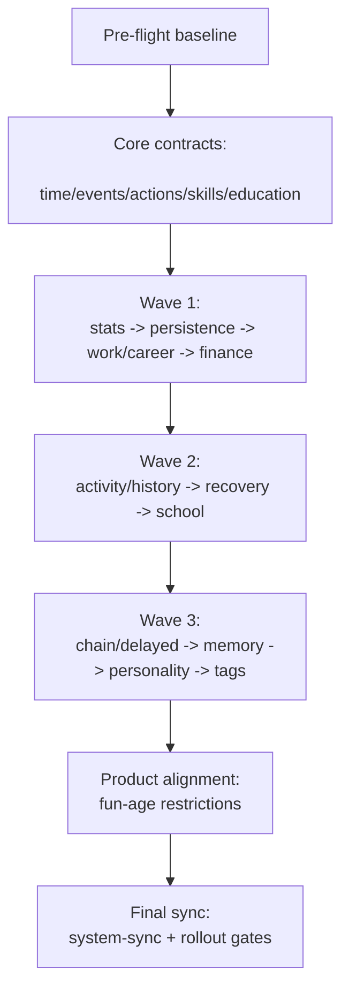

# План-карта выполнения всех планов

## Статус: Master execution roadmap (единая очередь работ)

## Цель

Зафиксировать единый порядок выполнения всех планов из каталога `plans`, чтобы команда видела:

- какую последовательность брать в работу;
- какие зависимости обязательны;
- какие gate-критерии нужны перед переходом к следующей фазе.

---

## 1) Источники (планы, включенные в карту)

### Базовые master-планы

- `plans/system-sync-plan.md`
- `plans/current-systems-optimization-plan.md` (закрыт, как pre-flight baseline)
- `plans/wave1-p0-core-stability-plan.md`
- `plans/0-execution-master-roadmap-plan.md`

### Доменные core-планы

- `plans/time-system-refresh.plan.md`
- `plans/event-system-sync.plan.md`
- `plans/actions-system-refresh-plan.md`
- `plans/skills-system-refresh-plan.md`
- `plans/education-age-context-plan.md`

### Wave 1 (P0 core stability)

- `plans/persistence-migration-refresh-plan.md`
- `plans/work-career-system-refresh-plan.md`
- `plans/finance-economy-system-refresh-plan.md`
- `plans/stats-system-refresh-plan.md`

### Wave 2 (P1 quality + explainability)

- `plans/activity-history-system-refresh-plan.md`
- `plans/recovery-system-refresh-plan.md`
- `plans/school-system-refresh-plan.md`

### Wave 3 (P2 depth systems)

- `plans/chain-delayed-effects-plan.md`
- `plans/life-memory-system-plan.md`
- `plans/personality-system-plan.md`
- `plans/tags-system-plan.md`

### Product plan

- `plans/fun-age-restrictions-plan.md`

---

## 2) Главная последовательность выполнения

1. **Фаза 0 — Baseline и контроль контракта** ✅ Завершено (2026-04-16)
   - Опираемся на завершенный pre-flight (`current-systems-optimization-plan.md`). ✅
   - Проверяем, что baseline тестов стабилен перед новой волной изменений. ✅
   - **Baseline test results:** 21 test file passed, 1 skipped | 114 tests passed, 3 skipped, 9 todo | Duration: 1.64s
   - **Pre-flight DoD:** все 6 пунктов выполнены (runtime-карта, рассинхроны, lifecycle, reason-codes, integration safety-net, handoff).
   - **Gate:** готово к переходу к Фазе 1 (Core contracts).

2. **Фаза 1 — Core contracts (time/events/actions/skills/education)** ✅ Завершено (2026-04-16)
   - Выполняем контракты и синхронизацию из:
     - `time-system-refresh.plan.md`
     - `event-system-sync.plan.md`
     - `actions-system-refresh-plan.md`
     - `skills-system-refresh-plan.md`
     - `education-age-context-plan.md`
   - Это фундамент для последующих системных волн.
   - **Выполнено (2026-04-16):**
     - **Time:** периодические callbacks подключены в system-context
     - **Event:** исправлена дедупликация (instanceId), все системы используют ingress API
     - **Action:** удалено мертвое требование requiresPet, все requirements проверяются в engine
     - **Тесты:** 114 passed, 0 failed

3. **Фаза 2 — Wave 1 (P0 stability)** ✅ Завершено (2026-04-16)
   - Последовательность внутри волны:
      1. `stats-system-refresh-plan.md`
      2. `persistence-migration-refresh-plan.md`
      3. `work-career-system-refresh-plan.md`
      4. `finance-economy-system-refresh-plan.md`
   - **Выполнено (2026-04-16):**
     - **Stats:** удалены дубли `_applyStatChanges`/`_clamp` из 5 систем, все через canonical StatsSystem
     - **Persistence:** `MigrationSystem` — единая точка миграций; `PersistenceSystem` делегирует, registry-based `syncFromWorld`, усиленная `validateSave`, backup при corruption; `game.store` + `system-context` подключают миграции для ECS и плоского save (см. `persistence-migration-refresh-plan.md`)
     - **Work/Career:** созданы shared helpers, удалены дубли, TimeSystem через прямую ссылку
     - **Finance:** удалены new SkillsSystem/EventQueueSystem, все через canonical
     - **Тесты:** 114 passed, 0 failed

4. **Фаза 3 — Wave 2 (P1 quality)** ✅ Завершено (2026-04-16)
    - Последовательность:
      1. `activity-history-system-refresh-plan.md`
      2. `recovery-system-refresh-plan.md`
      3. `school-system-refresh-plan.md`
    - **Выполнено (2026-04-16):**
      - **Activity History:** EventHistorySystem добавлен в SystemContext, добавлены типы/константы/trim/dedup, ActivityLogSystem улучшен (getLogStats, dedup)
      - **Recovery:** P0 рефакторинг — new SkillsSystem заменён на canonical, _openInvestment делегирует в InvestmentSystem
      - **School:** добавлен в SystemContext, TimeSystem через прямую ссылку
      - **Тесты:** 114 passed, 0 failed

5. **Фаза 4 — Wave 3 (P2 depth)** ✅ Завершено (2026-04-16)
   - Последовательность:
      1. `chain-delayed-effects-plan.md`
      2. `life-memory-system-plan.md`
      3. `personality-system-plan.md`
      4. `tags-system-plan.md`
   - **Выполнено (2026-04-16):**
     - **Chain/Delayed Effects:** ChainResolverSystem и DelayedEffectSystem добавлены в SystemContext, new SkillsSystem/PersonalitySystem заменены на canonical, удален _clamp(), stat changes делегируют в StatsSystem
     - **Life Memory:** LifeMemorySystem добавлен в SystemContext, добавлен trim/limit (MAX_MEMORIES = 500), удален пустой update()
     - **Personality:** PersonalitySystem добавлен в SystemContext, BUGFIX: 'player' → PLAYER_ENTITY, удален _clamp()
     - **Tags:** TagsSystem добавлен в SystemContext, удалено переназначение this.world в update()
     - **Тесты:** 114 passed, 0 failed

6. **Фаза 5 — Product alignment** ✅ Завершено (2026-04-16)
   - Синхронизация продуктовой логики и ограничений возраста:
      - `fun-age-restrictions-plan.md`
   - Проверка, что age-gating консистентен с actions/education/school/personality.
   - **Выполнено (2026-04-16):**
     - BUGFIX: исправлен критический баг маппинга TEEN (13-15 лет теперь корректно возвращается)
     - Добавлен `ageGroup` всем player-facing действиям: **244** в **10** файлах (fun, health, selfdev, hobby, home, career, shop, social, finance, **education**) плюс **71** в `child-actions.ts`; в `fun-actions.ts` после удаления сна остаётся 42 действия
     - Удалены sleep-actions (fun_sleep_8h, fun_short_sleep) из action-слоя
     - Удалены requiresRelationship из семейных социальных действий
     - Исправлены импорты AgeGroup во всех файлах
     - Тесты: 114 passed, 0 failed

7. **Фаза 6 — Final sync and rollout** ✅ Завершено (2026-04-16)
    - Финальная консолидация в `system-sync-plan.md` (контракты + сводка фаз 0–5; отдельно — расширенный DoD и Wave C как бэклог).
    - Подтверждение master DoD **roadmap** (6 фаз, Gate A–E) и rollout-gates на дату среза.
    - **Выполнено (2026-04-16):**
      - `system-sync-plan.md` обновлён с фактическим состоянием фаз 0–5 и пояснением к Фазе 6
      - По roadmap: все 6 фаз и Gate A–E отмечены выполненными
      - Зафиксирован тестовый baseline среза: **114 passed, 0 failed** — перед релизом перезапускать `npm test` на актуальной ветке
      - Итоговый прогресс по карте: 6 из 6 фаз (100%)

---

## 3) Dependency-граф (укрупненно)

---

## 4) Критичные зависимости между планами

- `event-system-sync.plan.md` зависит от `time-system-refresh.plan.md`: period hooks и dedup завязаны на time lifecycle.
- `education-age-context-plan.md` зависит от `time + events + skills`: step learning и learningEfficiency требуют корректной оркестрации.
- `stats-system-refresh-plan.md` зависит от core contracts: stat-делегирование нужно унифицировать до массовых рефакторов.
- `persistence-migration-refresh-plan.md` должен идти ранним в Wave 1: изменения опасны без устойчивого save/load.
- `work-career-system-refresh-plan.md` зависит от `stats + skills`: gameplay-loop и зарплата используют эти контракты.
- `finance-economy-system-refresh-plan.md` зависит от `work-career + stats`: settlement и реальный доход строятся сверху.
- `recovery-system-refresh-plan.md` зависит от Wave 1: использует canonical stats/helpers/investment контур.
- `school-system-refresh-plan.md` зависит от `stats + education + time`: школьная прогрессия синхронизируется с общим lifecycle.
- `chain-delayed-effects-plan.md` зависит от `stats + events + personality`: delayed effects должны делегировать в canonical системы.
- `life-memory-system-plan.md` зависит от `chain-delayed-effects-plan.md`: memory-поток питается delayed effects.
- `personality-system-plan.md` зависит от `life-memory-system-plan.md`: personality использует memory/delayed сигналы.
- `tags-system-plan.md` зависит от `skills-system-refresh-plan.md`: tag-modifiers встраиваются в общий modifiers pipeline.
- `fun-age-restrictions-plan.md` зависит от `actions + school + education`: age-gating должен совпадать с доступностью контента.

---

## 5) Wave-by-wave Go/No-Go gates

### Gate A (после Фазы 1) ✅ Пройден

- Core-контракты согласованы: time/event/action/skills/education.
- Нет P0 рассинхронов UI vs engine.
- Smoke + integration тесты стабильны.
- **Test results:** 114 passed, 0 failed
- **Critical fixes:** Time callbacks, Event deduplication (instanceId), Action requirements (requiresPet removed)

### Gate B (после Wave 1) ✅ Пройден

- `stats` canonical (без локальных `_applyStatChanges` дублей). ✅
- Save/load backward compatible. ✅
- Work/career/finance контуры работают end-to-end. ✅
- **Execution details:**
  - Stats: удалены дубли из 5 систем (Skills, Finance, Work, Career, Recovery)
  - Persistence: v1.2.0 с валидацией и backup
  - Work/Career: shared helpers + TimeSystem direct reference
  - Finance: все через canonical системы
  - Tests: 114 passed, 0 failed

### Gate C (после Wave 2) ✅ Пройден

- Activity/history explainability работает. ✅
- Recovery и School встроены в canonical контур. ✅
- Базовая telemetry покрывает пользовательские пути. ✅
- **Execution details:**
  - Activity History: EventHistorySystem в SystemContext, улучшенный ActivityLogSystem (getLogStats, dedup)
  - Recovery: P0 рефакторинг, делегирование в canonical системы
  - School: интеграция через SystemContext, TimeSystem прямая ссылка
  - Tests: 114 passed, 0 failed

### Gate D (после Wave 3) ✅ Пройден

- Depth-системы интегрированы без нарушения core performance budget. ✅
- Нет дублей и обходов canonical систем. ✅
- Regression-пакет стабилен. ✅
- **Execution details:**
  - Chain/Delayed Effects: ChainResolverSystem и DelayedEffectSystem в SystemContext, new системы заменены на canonical, делегирование stat changes в StatsSystem
  - Life Memory: LifeMemorySystem в SystemContext, trim/limit (MAX_MEMORIES = 500)
  - Personality: PersonalitySystem в SystemContext, BUGFIX: 'player' → PLAYER_ENTITY
  - Tags: TagsSystem в SystemContext, удалено переназначение this.world в update()
  - Tests: 114 passed, 0 failed

### Gate E (финальный) ✅ Пройден

- `system-sync-plan.md` обновлён фактическим состоянием.
- **DoD план-карты** (6 фаз + gates) выполнен на дату среза; **расширенный DoD** `system-sync-plan.md` (Wave C, E2E unlock) см. отдельный чеклист там.
- Rollout readiness подтверждён по отчёту среза; на другой ветке — перепроверка `npm test` / CI.
- **Execution details:**
  - Product alignment завершен: age-gating консистентен, все целевые действия каталога имеют `ageGroup` (см. фактические числа в Фазе 5)
  - BUGFIX: TEEN маппинг исправлен, sleep-actions удалены из action-слоя
  - Tests: 114 passed, 0 failed

---

## 6) Итоговый прогресс проекта

### Завершенные фазы

- **Фаза 0** — Baseline и контроль контракта ✅ (2026-04-16)
- **Фаза 1** — Core contracts ✅ (2026-04-16)
- **Фаза 2** — Wave 1 (P0 stability) ✅ (2026-04-16)
- **Фаза 3** — Wave 2 (P1 quality) ✅ (2026-04-16)
- **Фаза 4** — Wave 3 (P2 depth) ✅ (2026-04-16)
- **Фаза 5** — Product alignment ✅ (2026-04-16)
- **Фаза 6** — Final sync and rollout ✅ (2026-04-16)

### Ключевые результаты

- Все 6 фаз roadmap завершены: **100%**
- Все Gate критерии (A–E) пройдены: 5/5 gates ✅
- **DoD этой план-карты** (6 фаз + gates) выполнен на дату среза; расширенный DoD в `system-sync-plan.md` (Wave C, E2E unlock) может оставаться бэклогом — см. чеклист там
- Rollout readiness по отчёту среза подтверждён ✅
- Тестовый baseline среза 2026-04-16: **114 passed, 0 failed** — на другой ветке перезапускать `npm test`
- Готовность к развёртыванию оценивать по актуальным тестам и CI, не только по этой цифре

---

## 7) Времязатраты (оценка)

### Оценка по фазам

- **Фаза 0** — Baseline check + smoke before start: `1-2 ч`.
- **Фаза 1** — Core contracts (time/events/actions/skills/education): `24-40 ч`.
- **Фаза 2** — Wave 1 (stats + persistence/migration + work/career + finance): `20-30 ч`.
- **Фаза 3** — Wave 2 (activity/history + recovery + school): `12-20 ч`.
- **Фаза 4** — Wave 3 (chain/delayed + memory + personality + tags): `14-24 ч`.
- **Фаза 5** — Product alignment (fun-age restrictions sync): `4-8 ч`.
- **Фаза 6** — Final sync + rollout readiness + stabilization: `6-12 ч`.
- **Итого (линейно)** — все фазы последовательно: `81-136 ч`.

### Критический путь и параллелизм

- **Критический путь (минимум):** Фаза 0 -> Фаза 1 -> Фаза 2 -> Фаза 3 -> Фаза 4 -> Фаза 5 -> Фаза 6.
- **Параллелизм допустим только внутри фазы,** если не нарушаются зависимости из раздела 4.
- **Практический ориентир для 1 инженера:** 4-7 календарных недель (с тестами и стабилизацией).
- **Практический ориентир для 2 инженеров:** 3-5 недель при аккуратной синхронизации и частых merge-gates.

### Буферы

- Добавлять **15-20% буфер** на интеграционные регрессии и доработку тестов.
- Для фаз 2-4 предусматривать отдельные окна на hotfix после интеграции.

---

## 8) Практический режим выполнения (итерации)

Для каждой фазы/волны:

1. Берём 1 план в активную реализацию.
2. Закрываем его DoD + локальные тесты.
3. Обновляем `system-sync-plan.md` (статус, риски, остатки).
4. Только после этого стартуем следующий план по цепочке зависимостей.

Рекомендованный размер итерации: **1 план = 1 delivery batch**.

---

## 9) Риски и митигации

- Параллельное изменение зависимых планов: высокое влияние; митигация — соблюдать последовательность фаз и gates.
- Drift контрактов между документами: высокое влияние; митигация — `system-sync-plan.md` как single source of truth.
- Регрессии после массовых рефакторов: высокое влияние; митигация — тест-gate после каждой волны.
- Перекрытие ответственности систем: среднее влияние; митигация — явные boundaries в каждом плане.
- Непрозрачный статус выполнения: среднее влияние; митигация — вести phase-state в этом master roadmap и `system-sync-plan.md`.

---

## 10) Definition of Done для этой план-карты

- [x] Зафиксирована единая последовательность выполнения всех планов.
- [x] Определены межплановые зависимости и критический путь.
- [x] Определены wave gates (Go/No-Go) для переходов.
- [x] Добавлена оценка времязатрат по фазам и критическому пути.
- [x] Указан финальный цикл синхронизации через `system-sync-plan.md`.
- [x] Карта годится как рабочий порядок для команды.

