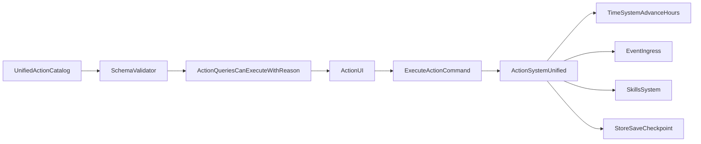

# План: Актуализация и оптимизация системы действий

## Статус: Запланировано (v1)

## Цель

Привести систему действий к единому, предсказуемому и реалистичному контуру:

- единая модель данных action-каталога;
- единая проверка доступности и причин отказа;
- единый execution flow без дублирующих контуров;
- корректная синхронизация с обновлёнными time/event/skills системами.

---

## Текущее состояние (as-is)

Система действий сейчас фрагментирована:

- основной action-контур (`ActionSystem`);
- отдельный finance-контур (`FinanceActionSystem` + legacy finance cards);
- отдельный education-контур (через `EducationSystem`, а не через `EDUCATION_ACTIONS`);
- отдельный childhood-контур (`child-actions`), слабо подключенный к runtime.

Ключевые последствия:

- дубли и расхождения правил;
- несоответствие ID и источников данных;
- часть ограничений действует только в UI, но не в engine;
- трудно поддерживать реализм и explainability причин “почему действие недоступно/сработало”.

---

## Ключевые файлы

- Каталоги действий:  
  - `src/domain/balance/actions/index.ts`  
  - `src/domain/balance/actions/types.ts`  
  - `src/domain/balance/actions/*.ts`
- Исполнение и проверки:  
  - `src/domain/engine/systems/ActionSystem/index.ts`  
  - `src/domain/engine/systems/FinanceActionSystem/index.ts`
- UI/store/composables:  
  - `src/composables/useActions/index.ts`  
  - `src/stores/game.store.ts`  
  - `src/components/game/ActionCardList/ActionCardList.vue`  
  - `src/components/pages/finance/FinanceActionList/FinanceActionList.vue`
- Age gating:  
  - `src/composables/useAgeRestrictions/index.ts`  
  - `src/composables/useAgeRestrictions/age-unlocks.ts`
- Legacy finance data:  
  - `src/domain/balance/constants/legacy-finance-scene-actions.ts`  
  - `src/domain/engine/systems/FinanceActionSystem/index.constants.ts`

---

## Проблемы, которые нужно исправить

### Critical / High

1. Finance UI и Finance engine работают с разными action ID и наборами действий.
2. Часть требований из action data не проверяется в engine (`requiresPet` и подобные).
3. Возрастная модель разблокировок и фильтрации рассинхронизирована.
4. `processSubscriptions` в action-контуре не встроен в стабильный lifecycle.
5. `child-actions` фактически выпадают из канонического runtime-потока.

### Medium

1. Ограничения по возрасту частично применяются только в UI.
2. Модель отношений и часть требований действий неустойчивы к масштабированию.
3. Для disabled actions нет нормализованной причины отказа.
4. Дубли каталогов и частичное несовпадение payload-контрактов.

---

## Приоритизация (P0 / P1 / P2)

### P0 — Блокеры корректности (обязательно до расширения фич)

- Устранить finance id/source mismatch между UI и engine.
- Вынести критичные проверки доступности в engine (`canExecuteWithReason`), включая age/requirements.
- Закрыть “мертвые” requirement-ключи (`requiresPet` и др.) через schema validation.
- Зафиксировать lifecycle recurring/subscription эффектов (когда и как они применяются).

### P1 — Стабилизация UX и интеграций

- Единый reason-code контракт для disabled действий.
- Нормализация child/education/finance контуров относительно общего action pipeline.
- Синхронизация action-time-event-skill цепочки через канонические контракты.
- Базовые integration тесты по ключевым страницам действий.

### P2 — Расширения и полировка

- Расширенная explainability (вклад needs/skills/knowledge в исход действия).
- Data-driven tuning каталогов и prerequisite правил.
- Улучшения производительности (агрессивное кэширование availability, батч-сохранения).

---

## Target architecture

---

## Execution plan

### Этап 1: Единый schema-контракт действий (M)

- Ввести валидатор action schema (runtime + compile-time guard).
- Запретить “неизвестные” requirement keys.
- Зафиксировать обязательные поля и reason-codes для отказа.

**Выход:** каталог действий валиден и предсказуем.

### Этап 2: Единый контур исполнения (M-L)

- Определить стратегию finance:
  - либо migration в общий `ActionSystem`,
  - либо жёсткая граница, но без дублирующих ID/данных.
- Убрать рассинхрон legacy finance cards и `FinanceActionSystem`.
- Явно решить судьбу `child-actions`: интеграция или архивирование.

**Выход:** один канонический execution flow на домен.

### Этап 3: Каноническая доступность с причинами (M)

- Перенести критичные проверки доступности в engine (`canExecuteWithReason`).
- UI использует engine reason-codes, не ad-hoc условия.
- Возрастные ограничения проверяются и в engine, и в UI-consistency слое.

**Выход:** игрок всегда видит, почему действие недоступно.

### Этап 4: Реализм и баланс поведения (M)

- Подключить проверки needs/энергии/времени в доступности и эффекте действий.
- Внедрить anti-spam/anti-grind для повторяемых действий.
- Для действий с “сильным эффектом” добавить prerequisites (knowledge/skill/age).

**Выход:** действия ведут себя реалистично и не ломают баланс спамом.

### Этап 5: Интеграция с time/events/skills (M)

- Все action effects, меняющие время, идут только через `advanceHours`.
- Action-driven события публикуются через `EventIngress`.
- Skill gain от действий нормализован под обновленный skill-контур.

**Выход:** нет расхождений между действиями и системами времени/событий/навыков.

### Этап 6: Тесты и rollout (M)

- Unit:
  - `canExecuteWithReason`
  - schema validation
  - requirements/cooldown/one-time/age checks
- Integration:
  - action->time->event->save flow
  - finance flow без id mismatch
- Feature flags:
  - `actions.schemaV2`
  - `actions.engineReasonsV2`
  - `actions.financeUnifiedV2`

---

## Стартовый спринт (3 дня)

### День 1 (P0)

- Починить finance mismatch (UI IDs <-> engine IDs).
- Включить schema guard для action requirements.
- Добавить engine-level reason codes для top-критичных отказов.

### День 2 (P0/P1)

- Протянуть `canExecuteWithReason` в UI action cards.
- Закрыть age-consistency между UI фильтрами и engine проверками.
- Зафиксировать/встроить lifecycle для recurring/subscription effects.

### День 3 (P1)

- Integration тесты:
  - основной action flow;
  - finance flow;
  - age/restriction reasons.
- Включить feature flags для staged rollout.
- Снять baseline метрики availability latency и error rate.

---

## Оптимизации

1. Кэш доступности действий на `worldVersion`.
2. Предрасчёт action view model по категориям.
3. Уменьшение лишних save/checkpoint вызовов.
4. Контракт-тесты каталога: уникальность id, валидные requirements, обязательные metadata.

## Реализм и разнообразие действий (фичи и улучшения)

1. **Context-aware outcomes**
   - Результат действия зависит от needs, времени суток, места и текущего состояния персонажа.
   - Пример: “пробежка” ночью/при истощении даёт иной эффект, чем днём и в нормальном состоянии.

2. **Action quality tiers**
   - Для ряда действий ввести уровни качества исполнения (`poor/normal/great`) на основе skills + needs.
   - Это повышает вариативность без взрывного роста числа карточек.

3. **Diminishing returns per action family**
   - Повторение действий одной группы подряд снижает эффект (реализм насыщения).
   - Восстановление эффективности через смену активности/отдых.

4. **Knowledge-gated action unlock**
   - Новые знания открывают новые действия в соответствующих разделах (fun/health/career).
   - Locked карточки имеют прозрачный reason text.

5. **Synergy and conflict matrix**
   - Действия могут усиливать или ослаблять друг друга (например, сон усиливает обучение, переработка ослабляет развлечения).
   - Матрица должна быть data-driven и ограниченной по сложности в v1.

6. **Action trace explainability**
   - Для ключевых действий показывать “почему получился такой результат” (вклад skills/needs/time/modifiers).
   - Это снижает ощущение случайности и улучшает доверие к системе.

---

## Зависимости

- `time-system-refresh`: единый `advanceHours`, period hooks.
- `event-system-sync`: единый `EventIngress`, dedup/idempotency.
- `education-age-context-plan`: реалистичные unlock/age правила.
- `system-sync-plan`: мастер-координация knowledge-gating и межсистемной синхронизации.

---

## Оценка трудозатрат

| Этап | Время |
|------|-------|
| Этап 1 | 1–2 ч |
| Этап 2 | 2–4 ч |
| Этап 3 | 1–2 ч |
| Этап 4 | 1–3 ч |
| Этап 5 | 1–2 ч |
| Этап 6 | 2–3 ч |
| **Итого** | **8–16 часов** |

---

## Definition of Done

- [ ] Нет рассинхрона между UI-каталогом действий и engine execution.
- [ ] Для всех критичных отказов есть machine-readable reason codes.
- [ ] Возрастные и requirement-ограничения проверяются на engine уровне.
- [ ] Finance контур не имеет id mismatch/unsupported action paths.
- [ ] Все action-time-event связи идут через канонические контракты.
- [ ] Добавлены unit + integration тесты ключевых action flows.
- [ ] Реалистичные ограничения (needs/anti-grind/prerequisites) внедрены для v1.
