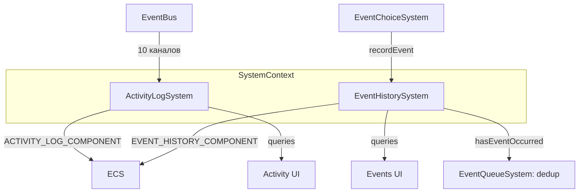

# План: Актуализация ActivityLogSystem + EventHistorySystem

## Статус: Draft (Wave 2 — P1)

## Цель

Создать единый explainability-контур для трассировки решений игрока и диагностики баланса:
- объединить логику логирования активности и истории событий;
- обеспечить canonical wiring через SystemContext;
- устранить дублирование и улучшить query-возможности.

---

## 1. Текущий срез (as-is)

### ActivityLogSystem

| Аспект | Состояние |
|--------|-----------|
| Файл | `src/domain/engine/systems/ActivityLogSystem/index.ts` (234 строки) |
| Типы | `src/domain/engine/systems/ActivityLogSystem/index.types.ts` — `LogEntry`, `LogTimestamp`, `LogComponent`, `GetEntriesOptions`, `GetEntriesResult`, `GetEntriesWindowOptions`, `GetEntriesWindowResult` |
| Константы | `src/domain/engine/systems/ActivityLogSystem/index.constants.ts` — `LOG_ENTRY_TYPES` (10 типов), `MAX_ENTRIES = 200` |
| Wiring | В `system-context.ts` через `resolveActivityLogSystem()` (lazy init) |
| Подписка | На 10 eventBus-каналов: `activity:action`, `activity:event`, `activity:stat`, `activity:skill`, `activity:finance`, `activity:career`, `activity:navigation`, `activity:prevented`, `activity:time`, `activity:education` |

#### API

```
ActivityLogSystem
├── init(world: GameWorld): void
├── addEntry(entryData): LogEntry | null              // добавить запись
├── getEntries(options): GetEntriesResult               // пагинация + фильтр
├── getEntriesWindowEndingAt(options): GetEntriesWindowResult  // window query
├── getRecentEntries(count): LogEntry[]                 // последние N
├── getEntriesByType(type, limit): LogEntry[]           // по типу
├── clearOldEntries(maxAge): number                     // очистка старых
├── _filterEntries(entries, opts): LogEntry[]           // внутренний фильтр
├── _ensureComponent(): void                            // создать компонент если нет
├── _getLog(): LogComponent | null
├── _getCurrentTimestamp(): LogTimestamp                 // из TIME_COMPONENT
├── _subscribeToEvents(): void                          // подписка на eventBus
├── _trimEntriesIfNeeded(): void                        // обрезать до MAX_ENTRIES
└── destroy(): void                                     // отписка от eventBus
```

### EventHistorySystem

| Аспект | Состояние |
|--------|-----------|
| Файл | `src/domain/engine/systems/EventHistorySystem/index.ts` (169 строк) |
| Типы | `src/domain/engine/systems/EventHistorySystem/index.types.ts` — пусто (типы inline) |
| Константы | `src/domain/engine/systems/EventHistorySystem/index.constants.ts` — пусто |
| Wiring | **Partial** — не в `system-context.ts`, используется локально |
| Компонент | `EVENT_HISTORY_COMPONENT` — `{ events: HistoryEvent[], totalEvents: number }` |

#### API

```
EventHistorySystem
├── init(world: GameWorld): void
├── recordEvent(eventId, title, type?, actionSource?): boolean  // записать событие
├── getEventHistory(limit): HistoryEvent[]                        // последние N
├── getEventsById(eventId): HistoryEvent[]                        // по eventId
├── getRecentEvents(days): HistoryEvent[]                         // за последние N дней
├── getEventStats(): EventStats                                   // статистика
├── hasEventOccurred(eventId): boolean                            // проверка
├── getLastEventOccurrence(eventId): HistoryEvent | null          // последнее
├── clearHistory(): void                                          // очистка
└── getTotalEventCount(): number
```

### Пересечение ответственностей

| Аспект | ActivityLogSystem | EventHistorySystem |
|--------|-------------------|-------------------|
| Назначение | Лог всех действий игрока | История story-событий |
| Компонент | `ACTIVITY_LOG_COMPONENT` | `EVENT_HISTORY_COMPONENT` |
| Источник данных | eventBus (10 каналов) | Ручной вызов `recordEvent()` |
| Timestamp | `LogTimestamp` (day/week/month/year/hour/totalHours/age) | `HistoryEvent` (day/week/timestampHours) |
| Фильтрация | type, sinceTotalHours, pagination, window | eventId, days, limit |
| Статистика | Нет | `getEventStats()` |
| Dedup | Нет | Нет |
| Wiring | В system-context | **Не в system-context** |

---

## 2. Проблемы

### P0 — Блокеры

| # | Проблема | Влияние |
|---|----------|---------|
| AH-1 | **EventHistorySystem не в system-context** — используется локально, нельзя получить через canonical context | Системы создают свои экземпляры или не могут получить доступ |
| AH-2 | **Два параллельных лога** с пересекающимся функционалом — и ActivityLog и EventHistory хранят timestamped записи | Дублирование данных, рассинхрон |

### P1 — Качество

| # | Проблема | Влияние |
|---|----------|---------|
| AH-3 | **EventHistorySystem: типы inline** — `HistoryEvent`, `EventStats` определены в файле системы, не в `.types.ts` | Плохая переиспользуемость |
| AH-4 | **EventHistorySystem: нет констант** — `index.constants.ts` пуст | Нет MAX_ENTRIES, типов событий |
| AH-5 | **ActivityLogSystem: нет dedup** — повторные события могут дублироваться | Раздувание лога |
| AH-6 | **ActivityLogSystem: нет статистики** — нет аналога `getEventStats()` | Невозможно анализировать лог |
| AH-7 | **Нет telemetry** на логирование | Невозможно отслеживать объём и частоту |
| AH-8 | **EventHistorySystem: нет trim/limit** — неограниченный рост массива `events` | Потенциальная проблема памяти |

### P2 — Расширения

| # | Проблема | Влияние |
|---|----------|---------|
| AH-9 | **Нет полнотекстового поиска** по логу | Ограниченные query-возможности |
| AH-10 | **Нет экспорта лога** | Невозможно выгрузить для анализа |
| AH-11 | **Нет агрегации по периодам** (день/неделя/месяц) | Сложно анализировать тренды |

---

## 3. Целевая архитектура

### Contracts + Boundaries



### Разделение ответственности

| Ответственность | Владелец |
|----------------|----------|
| Все действия игрока (work, finance, education, recovery, skills, navigation) | **ActivityLogSystem** |
| Story-события и event choices | **EventHistorySystem** |
| Timestamp формат | Единый `LogTimestamp` (из ActivityLogSystem) |
| Query API | Каждая система предоставляет свой query-интерфейс |
| Dedup | ActivityLog — по `type + title + timestamp.hour`; EventHistory — по `eventId + day` |

### Контракт ActivityLogSystem v2

```typescript
interface ActivityLogSystemV2 {
  init(world: GameWorld): void
  addEntry(entryData: EntryData): LogEntry | null
  getEntries(options?: GetEntriesOptions): GetEntriesResult
  getEntriesWindowEndingAt(options?: GetEntriesWindowOptions): GetEntriesWindowResult
  getRecentEntries(count?: number): LogEntry[]
  getEntriesByType(type: string, limit?: number): LogEntry[]
  getLogStats(): LogStats                    // NEW
  clearOldEntries(maxAge: number): number
  destroy(): void
}
```

### Контракт EventHistorySystem v2

```typescript
interface EventHistorySystemV2 {
  init(world: GameWorld): void
  recordEvent(eventId: string, title: string, type?: string, actionSource?: string | null): boolean
  getEventHistory(limit?: number): HistoryEvent[]
  getEventsById(eventId: string): HistoryEvent[]
  getRecentEvents(days?: number): HistoryEvent[]
  getEventStats(): EventStats
  hasEventOccurred(eventId: string): boolean
  getLastEventOccurrence(eventId: string): HistoryEvent | null
  clearHistory(): void
  getTotalEventCount(): number
}
```

---

## 4. Синхронизация с другими системами

| Система | Что синхронизировать | Контракт |
|---------|---------------------|----------|
| `system-context.ts` | Добавить `eventHistory: EventHistorySystem` | Canonical access |
| `EventChoiceSystem` | Записывать выборы через `ctx.eventHistory.recordEvent()` | Explainability |
| `EventQueueSystem` | Проверять `hasEventOccurred()` для dedup | Event dedup |
| `TimeSystem` | Timestamp из `TIME_COMPONENT` | Единый источник времени |
| `PersistenceSystem` | Оба компонента в save/load | Persistence mappers |
| `StatsSystem` | (Wave 1) Stat change events → ActivityLog | Event pipeline |

---

## 5. Execution plan

### Этап 1: Canonical wiring (~30 мин)

| Шаг | Описание | Файлы |
|-----|----------|-------|
| 1.1 | Добавить `EventHistorySystem` в `SystemContext` как `eventHistory` | `system-context.ts`, `index.types.ts` |
| 1.2 | Инициализировать EventHistorySystem в `getSystemContext()` | `system-context.ts` |

### Этап 2: EventHistorySystem рефакторинг (~1.5 ч)

| Шаг | Описание | Файлы |
|-----|----------|-------|
| 2.1 | Вынести типы `HistoryEvent`, `EventStats` в `index.types.ts` | `EventHistorySystem/index.types.ts` |
| 2.2 | Добавить константы: `MAX_HISTORY_ENTRIES = 500`, `EVENT_TYPES` | `EventHistorySystem/index.constants.ts` |
| 2.3 | Добавить trim при превышении `MAX_HISTORY_ENTRIES` | `EventHistorySystem/index.ts` |
| 2.4 | Добавить dedup: не записывать если `eventId + day` уже есть | `EventHistorySystem/index.ts` |
| 2.5 | Использовать canonical `LogTimestamp` вместо inline day/week/timestampHours | `EventHistorySystem/index.ts` |

### Этап 3: ActivityLogSystem улучшения (~1 ч)

| Шаг | Описание | Файлы |
|-----|----------|-------|
| 3.1 | Добавить `getLogStats()` — аналогично `getEventStats()` | `ActivityLogSystem/index.ts` |
| 3.2 | Добавить базовый dedup: не записывать если `type + title + timestamp.hour` совпадает с последней записью | `ActivityLogSystem/index.ts` |
| 3.3 | Добавить telemetry: `activity_log_entry:{type}`, `activity_log_total` | `ActivityLogSystem/index.ts` |

### Этап 4: Integration (~1 ч)

| Шаг | Описание | Файлы |
|-----|----------|-------|
| 4.1 | EventChoiceSystem: записывать выборы через `ctx.eventHistory.recordEvent()` | `EventChoiceSystem/index.ts` |
| 4.2 | Проверить, что все системы используют canonical ActivityLogSystem (через SystemContext) | Audit |

### Этап 5: Тесты (~1.5 ч)

| Шаг | Описание | Файлы |
|-----|----------|-------|
| 5.1 | Unit: EventHistorySystem — record, query, stats, dedup, trim | `test/unit/domain/engine/event-history.test.ts` |
| 5.2 | Unit: ActivityLogSystem — addEntry, getEntries, getLogStats, dedup | `test/unit/domain/engine/activity-log.test.ts` |
| 5.3 | Unit: Integration — eventBus → ActivityLog entry | там же |
| 5.4 | Regression: все существующие тесты зелёные | — |

---

## 6. Telemetry + Tests

### Telemetry-счётчики

| Счётчик | Когда инкрементируется |
|---------|------------------------|
| `activity_log_entry:{type}` | При каждой записи (по типу) |
| `activity_log_total` | Общее количество записей |
| `activity_log_trimmed` | При обрезке лога |
| `event_history_record` | При записи события |
| `event_history_dedup` | При пропуске дубликата |

### Тесты

| Тип | Количество | Что покрывает |
|-----|-----------|---------------|
| Unit (EventHistory) | ≥3 | record, query, dedup, trim |
| Unit (ActivityLog) | ≥3 | addEntry, getEntries, getLogStats, dedup |
| Integration | ≥1 | eventBus → ActivityLog |
| Regression | все существующие | Нет регрессий |

---

## 7. Definition of Done

- [ ] **EventHistorySystem в SystemContext** — доступен через `ctx.eventHistory`.
- [ ] **Типы вынесены** в `index.types.ts` для обеих систем.
- [ ] **Константы** добавлены для EventHistorySystem (`MAX_HISTORY_ENTRIES`, `EVENT_TYPES`).
- [ ] **Dedup** работает в обеих системах.
- [ ] **Trim** ограничивает рост EventHistory.
- [ ] **`getLogStats()`** добавлен в ActivityLogSystem.
- [ ] **Telemetry** покрывает обе системы.
- [ ] **EventChoiceSystem** записывает через canonical EventHistorySystem.
- [ ] **Все существующие тесты зелёные** + ≥7 новых unit-тестов.
- [ ] **`SYSTEM_REGISTRY.md`** обновлён: EventHistorySystem → Active.

---

## Связанные документы

- [Дорожная карта](plans/systems-planning-roadmap.md)
- [Master sync plan](plans/system-sync-plan.md)
- [Stats system refresh](plans/stats-system-refresh-plan.md) (Wave 1)
- [System Registry](src/domain/engine/systems/SYSTEM_REGISTRY.md)
