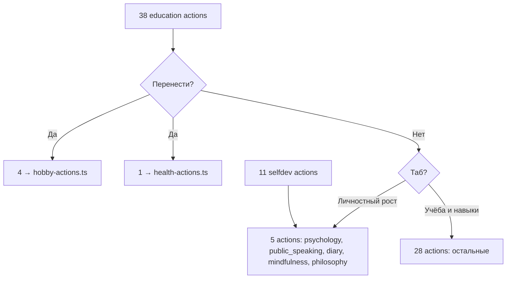

# План реорганизации страницы «Обучение»

## Цель
Заменить 3 таба (Программы / Занятия / Саморазвитие) на новую структуру:
**Программы → Учёба и навыки → Личностный рост**

## Инвентаризация действий

### Education-действия (38 шт.)

| # | ID | Название | Решение |
|---|-----|----------|---------|
| 1 | edu_read_textbook | Чтение учебника | → Учёба и навыки |
| 2 | edu_online_course | Онлайн-курс | → Учёба и навыки |
| 3 | edu_practical_task | Практическое задание | → Учёба и навыки |
| 4 | edu_edu_video | Образовательное видео | → Учёба и навыки |
| 5 | edu_exam_prep | Подготовка к экзамену | → Учёба и навыки |
| 6 | edu_webinar | Вебинар | → Учёба и навыки |
| 7 | edu_foreign_lang | Иностранный язык | → Учёба и навыки |
| 8 | edu_write_article | Написание статьи | → Учёба и навыки |
| 9 | edu_public_speaking | Публичные выступления | → **Личностный рост** |
| 10 | edu_financial_lit | Финансовая литература | → Учёба и навыки |
| 11 | edu_programming | Программирование | → Учёба и навыки |
| 12 | edu_cooking_masterclass | Мастер-класс по кулинарии | → **ПЕРЕНОС в hobby** |
| 13 | edu_research | Исследование | → Учёба и навыки |
| 14 | edu_memory_training | Тренировка памяти | → Учёба и навыки |
| 15 | edu_psychology | Психология | → **Личностный рост** |
| 16 | edu_mba | MBA | → Учёба и навыки |
| 17 | edu_negotiation_practice | Переговоры | → Учёба и навыки |
| 18 | edu_design | Дизайн | → Учёба и навыки |
| 19 | edu_fitness_theory | Теория тренировок | → **ПЕРЕНОС в health** |
| 20 | edu_invest_course | Курс по инвестированию | → Учёба и навыки |
| 21 | edu_marketing | Маркетинг | → Учёба и навыки |
| 22 | edu_photo_practice | Фотография | → **ПЕРЕНОС в hobby** |
| 23 | edu_diary | Дневник рефлексии | → **Личностный рост** |
| 24 | edu_time_management | Тайм-менеджмент | → Учёба и навыки |
| 25 | edu_leadership_course | Лидерство | → Учёба и навыки |
| 26 | edu_mindfulness | Осознанность и медитация | → **Личностный рост** |
| 27 | edu_gardening | Садоводство | → **ПЕРЕНОС в hobby** |
| 28 | edu_acting | Актёрское мастерство | → **ПЕРЕНОС в hobby** |
| 29 | edu_podcasts | Подкасты | → Учёба и навыки |
| 30 | edu_resume | Резюме и портфолио | → Учёба и навыки |
| 31 | edu_library | Библиотека | → Учёба и навыки |
| 32 | edu_hackathon | Хакатон | → Учёба и навыки |
| 33 | edu_history | История | → Учёба и навыки |
| 34 | edu_philosophy | Философия | → **Личностный рост** |
| 35 | edu_speed_reading | Скорочтение | → Учёба и навыки |
| 36 | edu_law | Право | → Учёба и навыки |
| 37 | edu_online_test | Онлайн-тест | → Учёба и навыки |
| 38 | edu_ecology | Экология | → Учёба и навыки |

### Selfdev-действия (11 шт.) — все → Личностный рост

| # | ID | Название |
|---|-----|----------|
| 1 | self_morning_routine | Утренняя рутина |
| 2 | self_evening_routine | Вечерняя рутина |
| 3 | self_digital_detox | Цифровой детокс |
| 4 | self_gratitude | Практика благодарности |
| 5 | self_personality_test | Личностный тест |
| 6 | self_coaching | Сеанс с коучем |
| 7 | self_journaling | Ведение дневника |
| 8 | self_reading_nonfiction | Чтение развивающей литературы |
| 9 | self_meditation_practice | Медитация |
| 10 | self_goal_setting | Постановка целей |
| 11 | self_public_speaking | Публичные выступления онлайн |

### Итого по табам

| Таб | Кол-во | Источник |
|-----|--------|----------|
| 🎓 Программы | — | Без изменений — EducationLevel + ProgramList |
| 📚 Учёба и навыки | ~28 | education category, кроме 5 в growth и 5 перенесённых |
| 🧘 Личностный рост | ~16 | 5 из education + все 11 из selfdev |

---

## Архитектура решения

### Подход: ID-based фильтрация + перенос категории



### Почему ID-based, а не новое поле в типе

1. Не требует изменения `BalanceAction` типа и Zod-схемы
2. Не требует миграции всех 100+ действий
3. Всего 5 действий из education нужно выделить в «Личностный рост» — проще задать их ID явно
4. Selfdev-действия все идут в «Личностный рост» — фильтрация по category

---

## Шаги реализации

### Шаг 1. Перенос 5 действий в другие категории

**Файлы:** `education-actions.ts`, `hobby-actions.ts`, `health-actions.ts`

Перенести из `EDUCATION_ACTIONS` в `HOBBY_ACTIONS`:
- `edu_cooking_masterclass` → изменить `category: hobby`, `actionType: hobby`
- `edu_gardening` → изменить `category: hobby`, `actionType: hobby`
- `edu_acting` → изменить `category: hobby`, `actionType: hobby`
- `edu_photo_practice` → изменить `category: hobby`, `actionType: hobby`

Перенести из `EDUCATION_ACTIONS` в `HEALTH_ACTIONS`:
- `edu_fitness_theory` → изменить `category: health`, `actionType: health`

> ID действий **НЕ меняем** — `edu_` префикс оставляем для обратной совместимости с сохранениями.

### Шаг 2. Создать конфиг education-tab-groups

**Новый файл:** `src/config/education-tab-groups.ts`

```ts
// ID education-действий, относящихся к табу Личностный рост
export const GROWTH_ACTION_IDS: ReadonlySet<string> = new Set([
  'edu_public_speaking',
  'edu_psychology',
  'edu_diary',
  'edu_mindfulness',
  'edu_philosophy',
])
```

### Шаг 3. Обновить education page

**Файл:** `src/pages/game/education/index.vue`

Изменения:
1. Обновить массив `tabs`:
   ```ts
   const tabs = [
     { id: 'programs', icon: '🎓', title: 'Программы', shortDesc: 'Курсы и программы обучения' },
     { id: 'study', icon: '📚', title: 'Учёба и навыки', shortDesc: 'Формальное обучение и профессиональные навыки' },
     { id: 'growth', icon: '🧘', title: 'Личностный рост', shortDesc: 'Развитие soft skills и привычек' },
   ]
   ```

2. Заменить `activeTab === 'lessons'` → `activeTab === 'study'`
3. Заменить `activeTab === 'selfdev'` → `activeTab === 'growth'`

4. Обновить логику фильтрации:
   ```ts
   import { GROWTH_ACTION_IDS } from '@/config/education-tab-groups'

   const educationActions = getActionsByCategory('education')
   const selfdevActions = getActionsByCategory('selfdev')

   // Учёба и навыки: education БЕЗ growth-действий
   const studyActions = computed(() =>
     educationActions.filter(a => !GROWTH_ACTION_IDS.has(a.id))
   )

   // Личностный рост: growth из education + все selfdev
   const growthActions = computed(() => [
     ...educationActions.filter(a => GROWTH_ACTION_IDS.has(a.id)),
     ...selfdevActions,
   ])
   ```

5. Обновить template: `sortedStudyActions` и `sortedGrowthActions`

### Шаг 4. Визуальная проверка

- Открыть `/game/education` — проверить 3 таба
- Проверить таб «Учёба и навыки» — должно быть ~28 карточек
- Проверить таб «Личностный рост» — должно быть ~16 карточек
- Проверить мобильную версию — только иконки
- Проверить страницу «Действия» → таб «Хобби» — должны появиться 4 новых действия
- Проверить страницу «Действия» → таб «Здоровье» — должно появиться 1 новое действие

---

## Затрагиваемые файлы

| Файл | Изменение |
|------|-----------|
| `src/domain/balance/actions/education-actions.ts` | Удалить 5 действий |
| `src/domain/balance/actions/hobby-actions.ts` | Добавить 4 действия |
| `src/domain/balance/actions/health-actions.ts` | Добавить 1 действие |
| `src/config/education-tab-groups.ts` | **Новый файл** — Set ID для growth-таба |
| `src/pages/game/education/index.vue` | Обновить табы и фильтрацию |

## Не затрагиваемые файлы

- `action-schema.ts` — категория уже включает `hobby` и `health`
- `types.ts` — `ActionCategory` уже включает все нужные значения
- `BalanceAction` тип — не меняем
- `useActions` composable — не меняем
- `ActionCardList` — не меняем
- Тесты — нет тестов, ссылающихся на переносимые action ID
