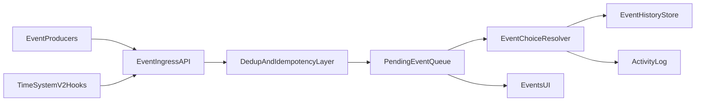

# План актуализации системы событий (sync с Time v2)

## Task Brief

### Goal
Обновить event-систему до единого и предсказуемого контура: стабилизировать enqueue/resolve pipeline, убрать дубли и рассинхроны идентификаторов, снизить избыточную нагрузку в UI/store и синхронизировать порядок обработки с будущей Time System v2.

### Current slice (as-is)
- Очередь событий живет в `eventQueue.pendingEvents`; события поступают из нескольких источников (time micro events, monthly finance, work events), часть путей ставит в очередь напрямую.
- Обработка выбора идет через `applyEventChoice` -> `EventChoiceSystem`: применяются эффекты, пишется история, событие удаляется из `pendingEvents`.
- Есть рассинхрон dedup: часть проверок ориентируется на `instanceId`, а в history нередко пишется `event.id`.
- Периодическая инфраструктура времени (weekly/monthly/yearly callbacks) есть, но ее wiring в runtime неполный; это риск для корректного event lifecycle после Time v2.
- Контракт события между runtime и UI неоднороден (`choices` и метаданные времени могут различаться по форме).

### Affected files/systems
- Event core: [e:\project\games\game_life\src\domain\engine\systems\EventQueueSystem\index.ts](e:/project/games/game_life/src/domain/engine/systems/EventQueueSystem/index.ts), [e:\project\games\game_life\src\domain\engine\systems\EventChoiceSystem\index.ts](e:/project/games/game_life/src/domain/engine/systems/EventChoiceSystem/index.ts)
- Event producers: [e:\project\games\game_life\src\domain\engine\systems\TimeSystem\index.ts](e:/project/games/game_life/src/domain/engine/systems/TimeSystem/index.ts), [e:\project\games\game_life\src\domain\engine\systems\MonthlySettlementSystem\index.ts](e:/project/games/game_life/src/domain/engine/systems/MonthlySettlementSystem/index.ts), [e:\project\games\game_life\src\domain\engine\systems\WorkPeriodSystem\index.ts](e:/project/games/game_life/src/domain/engine/systems/WorkPeriodSystem/index.ts)
- Wiring and facade: [e:\project\games\game_life\src\domain\game-facade\system-context.ts](e:/project/games/game_life/src/domain/game-facade/system-context.ts), [e:\project\games\game_life\src\domain\game-facade\commands.ts](e:/project/games/game_life/src/domain/game-facade/commands.ts), [e:\project\games\game_life\src\domain\game-facade\queries.ts](e:/project/games/game_life/src/domain/game-facade/queries.ts)
- Contracts and constants: [e:\project\games\game_life\src\domain\engine\types\index.ts](e:/project/games/game_life/src/domain/engine/types/index.ts), [e:\project\games\game_life\src\domain\balance\constants\game-events.ts](e:/project/games/game_life/src/domain/balance/constants/game-events.ts), [e:\project\games\game_life\src\domain\engine\constants\component-keys.ts](e:/project/games/game_life/src/domain/engine/constants/component-keys.ts)
- UI/store and persistence: [e:\project\games\game_life\src\pages\game\events\index.vue](e:/project/games/game_life/src/pages/game/events/index.vue), [e:\project\games\game_life\src\components\pages\events\EventChoices\EventChoices.vue](e:/project/games/game_life/src/components/pages/events/EventChoices/EventChoices.vue), [e:\project\games\game_life\src\composables\useEvents\index.ts](e:/project/games/game_life/src/composables/useEvents/index.ts), [e:\project\games\game_life\src\stores\game.store.ts](e:/project/games/game_life/src/stores/game.store.ts), [e:\project\games\game_life\src\domain\engine\systems\PersistenceSystem\index.ts](e:/project/games/game_life/src/domain/engine/systems/PersistenceSystem/index.ts)

### Guardrails
- Не менять игровые нарративные тексты и баланс-эффекты событий в этом цикле, кроме обязательных правок для корректности контракта.
- Сохранить совместимость save/load для `pendingEvents`, `eventHistory`, `eventState`.
- Исключить параллельные новые пути enqueue/resolve: один канонический ingress и единый контракт event payload.
- Синхронизация с Time v2 обязательна по порядку обработки: `advance -> period hooks -> enqueue -> resolve/log`.

### Acceptance criteria
- Все события попадают в очередь только через единый ingress API с общей дедупликацией.
- `instanceId` детерминирован и одинаково используется в queue, history, dedup и persistence.
- Period-driven события не дублируются и не пропускаются после подключения Time v2 hooks.
- UI получает стабильный типизированный payload (`event`, `choices`, timestamp/day/week/month), без ad-hoc преобразований в компонентах.
- Добавлены тесты на order/idempotency/dedup/save-load для event pipeline.

## Event architecture target

## Execution Plan

1. **Unify event contract and ingress**
- Ввести канонический `enqueueEvent` API (source, templateId, instanceId, payload, timeSnapshot).
- Убрать прямые `pendingEvents.push` из `TimeSystem`, `MonthlySettlementSystem`, `WorkPeriodSystem`; перевести на ingress.
- Согласовать runtime- и UI-контракт choices (гарантированные `id` и `text`).

2. **Fix identity, dedup, idempotency**
- Сделать детерминированный `instanceId` (templateId + totalHours + sequence).
- Унифицировать запись истории: хранить `instanceId` как primary key события; `eventId/templateId` как secondary metadata.
- Добавить защиту от повторной обработки при повторном enqueue и при повторном apply choice.

3. **Wire with Time v2 period hooks**
- Явно зарегистрировать weekly/monthly/yearly callbacks через `system-context` и подключить producer-path событий.
- Добавить idempotency guards по периодам (`lastProcessedWeek/month/year`) для event-producing handlers.
- Зафиксировать порядок вызовов и shared contract с time-планом.

4. **Normalize queue/history model**
- Свести legacy-представления (`queue/currentEvent`) к одному каноническому (`pendingEvents` + normalized history schema).
- Обновить persistence/migration логику для новой схемы без потери старых сохранений.
- Добавить bounded retention/index для dedup (без бесконечного линейного роста history checks).

5. **UI/store performance and correctness**
- Упростить путь `getNextEvent/applyEventChoice` в store/composable, исключив лишние преобразования payload.
- Стабилизировать рендер event choices (key/label/id), чтобы избежать скрытых UX-ошибок выбора.
- Уменьшить лишний churn сохранений в событиях (batched save или commit points по завершению event-resolve).

6. **Testing and observability**
- Unit: ingress/dedup/id generation/history write invariants.
- Integration: `advanceHours -> period hooks -> enqueue -> applyChoice -> history/log`.
- Regression: save/load со старыми и новыми save snapshot, double-enqueue, large time jumps.
- Добавить event diagnostics (enqueue count, dedup hits, dropped/blocked events, resolve latency).

7. **Rollout strategy (sync with time plan)**
- PR1: контракт ingress + identity/dedup ядро + базовые unit tests.
- PR2: wiring с Time v2 hooks + period idempotency + интеграционные тесты.
- PR3: UI/store/persistence оптимизации + diagnostics + миграционная полировка.
- Включение через флаги: `events.ingressV2`, `events.dedupV2`, `events.payloadV2`, с rollback инструкциями.

## Detailed implementation notes

### EventIngress API shape
- Ввести единый входной DTO: `source`, `templateId`, `priority`, `instanceId`, `timeSnapshot`, `choices`, `meta`.
- Нормализация на входе: гарантировать `choices[].id` и `choices[].text`, проставлять отсутствующие поля из шаблона.
- Контракт ошибок ingress: `rejected_duplicate`, `rejected_invalid_payload`, `accepted`.

### Queue policy and scheduling
- Ввести явные приоритеты событий: `critical`, `high`, `normal`, `low` (FIFO внутри приоритета).
- Добавить политику starvation guard: событие низкого приоритета не может быть отложено более N циклов.
- Ограничить размер очереди верхним порогом и добавить fallback-стратегию (coalesce/drop-with-log) для не-критичных событий.

### Idempotency and dedup design
- Хранить два ключа: `instanceId` (уникальный инстанс) и `templateId` (тип события).
- Добавить bounded индекс `seenInstanceIds` с retention по `totalHours` окну, чтобы dedup был O(1), а не через линейный поиск в history.
- Для period-событий ввести `periodDedupKey` (`templateId:year:month:week`) и использовать его как дополнительный guard.

### Resolve transaction semantics
- Обрабатывать `applyEventChoice` как атомарный pipeline: validate -> apply effects -> write history -> emit log -> remove from queue.
- При ошибке в середине pipeline фиксировать policy явно: `rollback` или `mark_failed_and_keep`.
- Для observability логировать `resolveFailureReason` и `failedAtStage`.

### Persistence and migration
- Версионировать event-схему (`eventSchemaVersion`) в save.
- Добавить миграции: legacy `history`/`queue` -> canonical `pendingEvents` + `eventHistory.events`.
- Ввести checksum/shape validation для сохраненных событий при загрузке.

## Additional optimization backlog

1. **Coalescing repeated events**
- Склеивать повторяющиеся не-критичные события в агрегат (например, накопительные уведомления) вместо множества однотипных карточек.

2. **Lazy event payload expansion**
- Хранить в очереди легкий payload (id + references), а тяжелые тексты/ветки подтягивать лениво при показе события.

3. **Adaptive enqueue throttling**
- Ограничивать частоту генерации micro-events при burst-активности (на основе окна `totalHours`), чтобы снизить queue spikes.

4. **Precomputed UI view model**
- Формировать stable `EventCardViewModel` в store на `worldVersion`, чтобы минимизировать вычисления в Vue-компонентах.

5. **Batch logging and save checkpoints**
- Пакетировать запись activity/history и save в контрольные точки, а не на каждый микрошаг event-pipeline.

6. **Replay-first debugging tools**
- Добавить команду debug-replay по диапазону `totalHours` и фильтру `templateId`, чтобы быстро воспроизводить event-регрессии.

7. **Contract tests between layers**
- Ввести слой contract-тестов `producer -> ingress -> UI payload`, чтобы ловить несовместимость формата до интеграционных тестов.

## Performance and reliability budgets

- `enqueueEvent` p95: не более 2 ms на событие при размере очереди до 200 элементов.
- `applyEventChoice` p95: не более 8 ms без учета сохранения на диск.
- Dedup hit-check: O(1) доступ через индекс, без линейного сканирования полной истории.
- Queue growth control: не более 250 pending событий в штатном режиме; при превышении включается деградационная стратегия с диагностикой.
- Error budget: не более 0.1% failed resolves на 10k resolve операций (исключая намеренные тестовые fault-injection кейсы).

## Sync matrix with Time System plan

- Использовать общий identity standard из time-плана (`instanceId` и replay-friendly sequence).
- Переиспользовать общий порядок выполнения lifecycle, чтобы избежать двойных period triggers.
- Делить один diagnostics слой (time + events), чтобы видеть причинно-следственную цепочку от `advanceHours` до `event resolve`.
- Совместно валидировать save compatibility по обоим планам в одном regression-наборе.

## Phase roadmap (S/M/L + dependencies)

### Phase 1 — Stabilize core contracts (S-M)
- **Scope**
  - Канонический `EventIngress` и единый DTO.
  - Детерминированный `instanceId`, унификация history keys.
  - Базовый dedup/idempotency (`seenInstanceIds`, duplicate guard на resolve).
  - Unit-тесты инвариантов ingress/dedup/history.
- **Estimated size**
  - `EventQueueSystem`: M
  - `EventChoiceSystem`: M
  - `engine/types` + `game-events` mapping: S
  - Базовые тесты: S
- **Dependencies**
  - Требует из time-плана только согласования identity-стандарта (`instanceId` формат), без полного Time v2 wiring.
- **Exit criteria**
  - Нет прямых `pendingEvents.push` вне ingress-path.
  - Повторный enqueue/resolve не создает дублей.

### Phase 2 — Time-v2 integration and lifecycle safety (M-L)
- **Scope**
  - Wiring event producers к `weekly/monthly/yearly` hooks через `system-context`.
  - Idempotency guards по периодам (`lastProcessedWeek/month/year` + `periodDedupKey`).
  - Нормализация порядка lifecycle: `advance -> hooks -> enqueue -> resolve/log`.
  - Интеграционные тесты period-driven сценариев и large time jumps.
- **Estimated size**
  - `system-context` + `TimeSystem` интеграция: M
  - `MonthlySettlementSystem` + `WorkPeriodSystem` + producer paths: M-L
  - Интеграционные тесты и regression сценарии: M
- **Dependencies**
  - Зависит от time-плана: `Unify time contract` и `Wire periodic orchestration`.
  - Рекомендуется запускать после PR1 time-плана и параллельно PR2.
- **Exit criteria**
  - Period-события не дублируются и не теряются на границах недели/месяца/года.
  - Manual override не приводит к двойной обработке.

### Phase 3 — Performance, migration, and rollout hardening (M)
- **Scope**
  - Оптимизация queue/history checks (O(1) dedup индекс, bounded retention).
  - UI/store-path стабилизация (`EventCardViewModel`, меньше ad-hoc трансформаций).
  - Persistence migration (`eventSchemaVersion`, legacy -> canonical).
  - Diagnostics/метрики + feature-flag rollout + rollback playbook.
- **Estimated size**
  - Store/UI оптимизации: M
  - Persistence/migrations: M
  - Diagnostics + feature flags: S-M
- **Dependencies**
  - Зависит от завершения Phase 1.
  - Для полной синхронизации с time-планом — после PR2 time-плана; можно выпускать совместно с PR3 time-плана.
- **Exit criteria**
  - Производительность соответствует budget секции.
  - Save/load проходит migration regression suite.
  - Включение `events.*V2` безопасно через staged rollout.

## Cross-plan release choreography

- **Wave A (foundation)**: Time PR1 + Event Phase 1.
- **Wave B (orchestration)**: Time PR2 + Event Phase 2 (единый lifecycle).
- **Wave C (hardening)**: Time PR3 + Event Phase 3 (perf, migration, diagnostics).
- **Go/No-Go gates на каждую волну**
  - Зеленые unit/integration/regression тесты.
  - Нет роста critical багов по dedup/order.
  - Метрики p95 и queue growth в пределах budget.

## Definition of Done

- Event pipeline полностью канонизирован и типизирован от producer до UI.
- Дедуп и idempotency подтверждены тестами на повторные enqueue/resolve.
- Синхронизация с Time v2 подтверждена интеграционными сценариями period hooks.
- Производительность queue/resolve/store-path соответствует бюджетам и не деградирует на массовых сценариях.
- Save/load совместимость подтверждена миграционными тестами старых snapshot.
- Включены diagnostics по enqueue/resolve/reject/fail с понятной трассировкой причин.
- Подготовлен backlog post-refactor оптимизаций (coalescing, lazy payload, replay tooling) с приоритетами.
