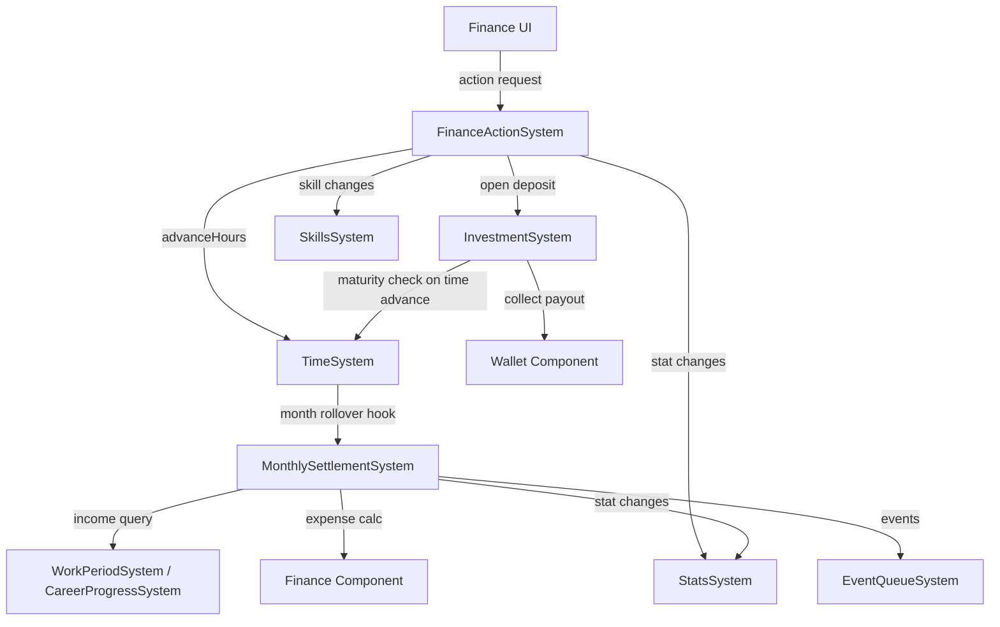

# План: Актуализация FinanceActionSystem + MonthlySettlementSystem + InvestmentSystem

## Статус: Draft (Wave 1 — P0)

## Цель

Создать единый, предсказуемый финансовый контур:
- устранить дублирование investment-логики;
- починить MonthlySettlement (реальный доход вместо hardcoded 0);
- обеспечить canonical wiring через SystemContext;
- делегировать stat/skill мутации в canonical системы.

---

## 1. Текущий срез (as-is)

### FinanceActionSystem

| Аспект | Состояние |
|--------|-----------|
| Файл | `src/domain/engine/systems/FinanceActionSystem/index.ts` (309 строк) |
| Типы | `src/domain/engine/systems/FinanceActionSystem/index.types.ts` |
| Константы | `src/domain/engine/systems/FinanceActionSystem/index.constants.ts` — `FINANCE_ACTIONS` (6 действий) |
| Wiring | В `system-context.ts` как `financeAction` |
| SkillsSystem | Создаёт `new SkillsSystem()` в `init()` |
| TimeSystem | Прямая ссылка через `_resolveTimeSystem()` (исправлено в pre-flight) |

#### API

```
FinanceActionSystem
├── init(world: GameWorld): void
├── getFinanceOverview(): FinanceOverview | null       // агрегированный обзор
├── getFinanceActions(): FinanceActionWithAvailability[] // каталог + availability
├── applyFinanceAction(actionId): FinanceActionResult   // исполнение действия
├── _openInvestment(action): void                       // ДУБЛИРУЕТ InvestmentSystem
├── _getInvestmentState(investment, day): string        // ДУБЛИРУЕТ InvestmentSystem
├── _applyStatChanges(stats, changes): void             // ДУБЛИРУЕТ StatsSystem
├── _applySkillChanges(skills, changes): void           // локальная реализация
├── _clamp(value, min, max): number                     // ДУБЛИРУЕТ StatsSystem
├── _summarizeStatChanges(changes): string              // ДУБЛИРУЕТ StatsSystem
├── _formatMoney(value): string                         // ДУБЛИРУЕТ
├── _normalizePlayerTime(): Record | null
├── _resolveHourCost(action): number
└── _resolveSalaryPerHour(career): number               // ДУБЛИРУЕТ
```

### MonthlySettlementSystem

| Аспект | Состояние |
|--------|-----------|
| Файл | `src/domain/engine/systems/MonthlySettlementSystem/index.ts` (150 строк) |
| Типы | `src/domain/engine/systems/MonthlySettlementSystem/index.types.ts` |
| Константы | `src/domain/engine/systems/MonthlySettlementSystem/index.constants.ts` |
| Wiring | В `system-context.ts` как `monthlySettlement` |
| SkillsSystem | Создаёт `new SkillsSystem()` в `init()` |
| EventQueueSystem | Создаёт `new EventQueueSystem()` в `init()` |

#### API

```
MonthlySettlementSystem
├── init(world: GameWorld): void
├── applyMonthlySettlement(monthNumber): SettlementResult  // месячный расчёт
├── _queuePendingEvent(event): void                         // делегирует в EventQueueSystem
├── _applyStatChanges(stats, changes): void                 // ДУБЛИРУЕТ StatsSystem
├── _clamp(value, min, max): number                         // ДУБЛИРУЕТ StatsSystem
└── _formatMoney(value): string                             // ДУБЛИРУЕТ
```

### InvestmentSystem

| Аспект | Состояние |
|--------|-----------|
| Файл | `src/domain/engine/systems/InvestmentSystem/index.ts` (154 строки) |
| Типы | `src/domain/engine/systems/InvestmentSystem/index.types.ts` |
| Константы | `src/domain/engine/systems/InvestmentSystem/index.constants.ts` |
| Wiring | В `system-context.ts` как `investment` |

#### API

```
InvestmentSystem
├── init(world: GameWorld): void
├── openInvestment(config): InvestmentResult         // открыть вклад
├── collectInvestment(investmentId): InvestmentResult // закрыть вклад
├── getAllInvestments(): InvestmentWithState[]         // все инвестиции
├── getActiveInvestments(): InvestmentWithState[]      // активные
├── getMaturedInvestments(): InvestmentWithState[]     // готовые к закрытию
├── _getInvestmentState(investment, day): string
├── _formatMoney(value): string
└── _getInvestmentsArray(playerId): InvestmentRecord[]
```

### Дублирование между системами

| Метод / Логика | FinanceActionSystem | MonthlySettlementSystem | InvestmentSystem |
|----------------|--------------------|------------------------|------------------|
| `_openInvestment()` | ✅ (строка 226) | — | ✅ canonical |
| `_getInvestmentState()` | ✅ (строка 249) | — | ✅ canonical |
| `_applyStatChanges()` + `_clamp()` | ✅ (строка 262) | ✅ (строка 134) | — |
| `_formatMoney()` | ✅ (строка 283) | ✅ (строка 145) | ✅ (строка 143) |
| `_summarizeStatChanges()` | ✅ (строка 275) | — | — |
| `new SkillsSystem()` | ✅ (строка 29) | ✅ (строка 36) | — |
| `new EventQueueSystem()` | — | ✅ (строка 38) | — |

---

## 2. Проблемы

### P0 — Блокеры

| # | Проблема | Влияние |
|---|----------|---------|
| F-1 | **Дублирование investment-логики:** `FinanceActionSystem._openInvestment()` и `_getInvestmentState()` полностью дублируют InvestmentSystem | Рассинхрон при изменении investment-формата; FinanceActionSystem обходит canonical InvestmentSystem |
| F-2 | **Дублирование `_applyStatChanges` / `_clamp`** в FinanceActionSystem и MonthlySettlementSystem | Расхождение логики clamp; при изменении bounds нужно править 3+ мест |
| F-3 | **MonthlySettlement не считает реальный доход** — hardcoded `Доход: 0 ₽` в activity log (строка 109) | Игрок видит неверную информацию; невозможно отслеживать финансовый баланс |

### P1 — Качество

| # | Проблема | Влияние |
|---|----------|---------|
| F-4 | **MonthlySettlement создаёт свой EventQueueSystem** (`new EventQueueSystem()`) вместо canonical | Два экземпляра EventQueueSystem; рассинхрон pending events |
| F-5 | **FinanceActionSystem создаёт свой SkillsSystem** (`new SkillsSystem()`) вместо canonical | Два экземпляра; рассинхрон modifiers |
| F-6 | **Нет интеграции Investment maturity с TimeSystem** — инвестиции не проверяются при advance time | Игрок может пропустить момент закрытия вклада |
| F-7 | **Нет telemetry** на финансовые операции | Невозможно диагностировать баланс |
| F-8 | **`_resolveHourCost`** — формула `dayCost * 2` не объяснима и не документирована | Непредсказуемое потребление времени |

### P2 — Расширения

| # | Проблема | Влияние |
|---|----------|---------|
| F-9 | **Нет кредитной системы** | Ограниченный финансовый gameplay |
| F-10 | **Нет инфляции / экономических циклов** | Статичная экономика |
| F-11 | **Нет финансовой аналитики для игрока** | Игрок не понимает свои траты |

---

## 3. Целевая архитектура

### Contracts + Boundaries



### Разделение ответственности

| Ответственность | Владелец | Потребитель |
|----------------|----------|-------------|
| Финансовые действия (reserve, deposit, budget, debt) | **FinanceActionSystem** | UI |
| Инвестиции (open, track, collect) | **InvestmentSystem** | FinanceActionSystem, UI |
| Месячный расчёт (expenses, income, settlement) | **MonthlySettlementSystem** | TimeSystem (month hook) |
| `_applyStatChanges` / `_clamp` | **StatsSystem** (canonical) | Все три системы |
| `_formatMoney()` | **Shared helpers** | Все три системы |
| SkillsSystem / EventQueueSystem | **SystemContext** (canonical) | Все три системы |

### Контракт FinanceActionSystem v2

```typescript
interface FinanceActionSystemV2 {
  init(world: GameWorld): void
  getFinanceOverview(): FinanceOverview | null
  getFinanceActions(): FinanceActionWithAvailability[]
  applyFinanceAction(actionId: string): FinanceActionResult
  // _openInvestment УДАЛЁН — делегирует в InvestmentSystem
}
```

### Контракт MonthlySettlementSystem v2

```typescript
interface MonthlySettlementSystemV2 {
  init(world: GameWorld): void
  applyMonthlySettlement(monthNumber: number): SettlementResult
  // Доход запрашивается из WorkPeriodSystem/CareerProgressSystem
}
```

### Контракт InvestmentSystem v2

```typescript
interface InvestmentSystemV2 {
  init(world: GameWorld): void
  openInvestment(config: InvestmentConfig): InvestmentResult
  collectInvestment(investmentId: string): InvestmentResult
  getAllInvestments(): InvestmentWithState[]
  getActiveInvestments(): InvestmentWithState[]
  getMaturedInvestments(): InvestmentWithState[]
  checkMaturities(currentDay: number): void  // NEW: вызывается при time advance
}
```

---

## 4. Синхронизация с другими системами

| Система | Что синхронизировать | Контракт |
|---------|---------------------|----------|
| `WorkPeriodSystem` | Monthly income для settlement (salary info) | MonthlySettlement запрашивает через query |
| `CareerProgressSystem` | Salary per hour для income calc | Через `_resolveSalaryPerHour` из shared helpers |
| `StatsSystem` | Все stat-мутации через canonical | `ctx.stats.applyStatChanges()` |
| `SkillsSystem` | Finance skill effects через canonical | `ctx.skills` через SystemContext |
| `TimeSystem` | `advanceHours()` для finance actions; month rollover hook для settlement | Canonical time contract |
| `EventQueueSystem` | Financial events через canonical ingress | `ctx.eventQueue` через SystemContext |
| `PersistenceSystem` | `wallet`, `finance`, `investment` компоненты | Mapper registry |

---

## 5. Execution plan

### Этап 1: Устранение дубля investment-логики (~1 ч)

| Шаг | Описание | Файлы |
|-----|----------|-------|
| 1.1 | **FinanceActionSystem._openInvestment()** → делегировать в `InvestmentSystem.openInvestment()` | `FinanceActionSystem/index.ts:226-247` |
| 1.2 | **FinanceActionSystem._getInvestmentState()** → делегировать в `InvestmentSystem._getInvestmentState()` | `FinanceActionSystem/index.ts:249-260` |
| 1.3 | Убедиться, что InvestmentSystem корректно создаёт investment через ECS | `InvestmentSystem/index.ts` |
| 1.4 | FinanceActionSystem: получить InvestmentSystem через SystemContext или `world.getSystem()` | `FinanceActionSystem/index.ts` |

### Этап 2: Canonical wiring (~1 ч)

| Шаг | Описание | Файлы |
|-----|----------|-------|
| 2.1 | **FinanceActionSystem:** заменить `new SkillsSystem()` на canonical через SystemContext | `FinanceActionSystem/index.ts:29-30` |
| 2.2 | **MonthlySettlementSystem:** заменить `new SkillsSystem()` + `new EventQueueSystem()` на canonical | `MonthlySettlementSystem/index.ts:36-39` |
| 2.3 | **Удалить `_applyStatChanges` / `_clamp`** из FinanceActionSystem и MonthlySettlementSystem — делегировать в StatsSystem | Обе системы |
| 2.4 | **Удалить `_summarizeStatChanges`** из FinanceActionSystem — делегировать в StatsSystem | `FinanceActionSystem/index.ts` |
| 2.5 | **Вынести `_formatMoney()`** в shared helpers (`utils/format-helpers.ts`) | Все три системы |

### Этап 3: Реальный доход в MonthlySettlement (~1.5 ч)

| Шаг | Описание | Файлы |
|-----|----------|-------|
| 3.1 | **Добавить расчёт дохода:** запросить salary из WorkPeriodSystem/CareerProgressSystem | `MonthlySettlementSystem/index.ts` |
| 3.2 | **Обновить activity log:** заменить `Доход: 0 ₽` на реальный calculated income | `MonthlySettlementSystem/index.ts:109` |
| 3.3 | **Учесть modifiers:** salaryMultiplier, passiveIncomeBonus из SkillsSystem | `MonthlySettlementSystem/index.ts` |
| 3.4 | **Обновить SettlementData:** добавить поле `income` в тип | `MonthlySettlementSystem/index.types.ts` |

### Этап 4: Investment maturity hook (~30 мин)

| Шаг | Описание | Файлы |
|-----|----------|-------|
| 4.1 | Добавить `InvestmentSystem.checkMaturities(currentDay)` — помечает matured инвестиции | `InvestmentSystem/index.ts` |
| 4.2 | (Опционально) Вызывать из TimeSystem при day rollover | `TimeSystem/index.ts` |

### Этап 5: Telemetry (~30 мин)

| Шаг | Описание | Файлы |
|-----|----------|-------|
| 5.1 | FinanceActionSystem: `finance_action:{actionId}`, `finance_action_amount` | `FinanceActionSystem/index.ts` |
| 5.2 | MonthlySettlementSystem: `monthly_settlement`, `monthly_settlement_shortage` | `MonthlySettlementSystem/index.ts` |
| 5.3 | InvestmentSystem: `investment_open`, `investment_collect`, `investment_matured` | `InvestmentSystem/index.ts` |

### Этап 6: Тесты (~1.5 ч)

| Шаг | Описание | Файлы |
|-----|----------|-------|
| 6.1 | Unit: FinanceActionSystem делегирует в InvestmentSystem (mock) | `test/unit/domain/engine/finance-action.test.ts` |
| 6.2 | Unit: MonthlySettlement считает реальный доход | `test/unit/domain/engine/monthly-settlement.test.ts` |
| 6.3 | Unit: InvestmentSystem maturity check | `test/unit/domain/engine/investment.test.ts` |
| 6.4 | Integration: полный финансовый цикл (work → salary → settlement → investment) | `test/integration/finance/finance-flow.test.ts` |
| 6.5 | Regression: все существующие тесты зелёные | — |

---

## 6. Telemetry + Tests

### Telemetry-счётчики

| Счётчик | Когда инкрементируется |
|---------|------------------------|
| `finance_action:{actionId}` | При каждом финансовом действии |
| `finance_action_amount` | Сумма транзакции |
| `monthly_settlement` | При каждом месячном расчёте |
| `monthly_settlement_shortage` | При дефиците (сумма) |
| `monthly_settlement_income` | Реальный доход за месяц |
| `investment_open` | При открытии вклада |
| `investment_collect` | При закрытии вклада |
| `investment_matured` | При переходе в статус matured |

### Тесты

| Тип | Количество | Что покрывает |
|-----|-----------|---------------|
| Unit (finance action) | ≥1 | Делегирование в InvestmentSystem |
| Unit (settlement) | ≥1 | Реальный доход |
| Unit (investment) | ≥1 | Maturity check |
| Integration | ≥1 | Полный финансовый цикл |
| Regression | все существующие | Нет регрессий |

---

## 7. Definition of Done

- [ ] **FinanceActionSystem не содержит investment-логики** — делегирует в InvestmentSystem.
- [ ] **MonthlySettlement считает реальный доход** из WorkPeriodSystem/CareerProgressSystem.
- [ ] **Нет локальных `_applyStatChanges` / `_clamp`** — всё через StatsSystem.
- [ ] **Нет `new SkillsSystem()` / `new EventQueueSystem()`** — canonical через SystemContext.
- [ ] **`_formatMoney()`** в shared helpers, не дублируется.
- [ ] **Investment maturity** проверяется при time advance.
- [ ] **Telemetry** покрывает все финансовые операции.
- [ ] **Все существующие тесты зелёные** + ≥4 новых тестов (unit + integration).
- [ ] **`SYSTEM_REGISTRY.md`** обновлён.

---

## Связанные документы

- [Wave 1 общий план](plans/wave1-p0-core-stability-plan.md)
- [Дорожная карта](plans/systems-planning-roadmap.md)
- [Master sync plan](plans/system-sync-plan.md)
- [Stats system refresh](plans/stats-system-refresh-plan.md)
- [Work-career system refresh](plans/work-career-system-refresh-plan.md)
- [System Registry](src/domain/engine/systems/SYSTEM_REGISTRY.md)
