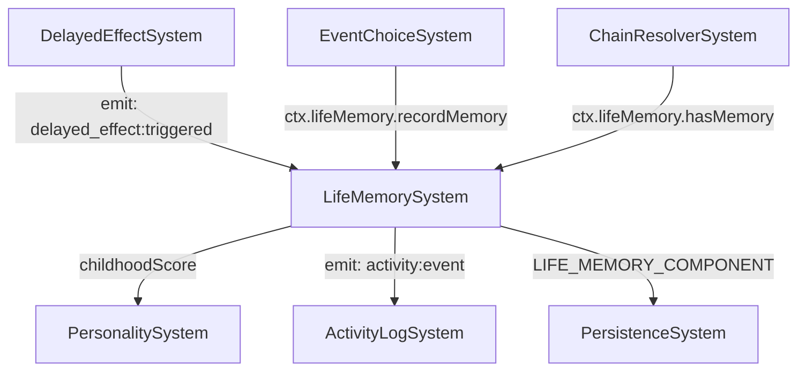

# План: Актуализация LifeMemorySystem

## Статус: Draft (Wave 3 — P2)

## Цель

Превратить LifeMemorySystem из экспериментальной системы в полноценный контур воспоминаний:
- canonical wiring через SystemContext;
- интеграция с ActivityLog, EventHistory, Personality;
- улучшение query-возможностей и persistence.

---

## 1. Текущий срез (as-is)

| Аспект | Состояние |
|--------|-----------|
| Файл | `src/domain/engine/systems/LifeMemorySystem/index.ts` (249 строк) |
| Типы | `@/domain/balance/types/life-memory` — `LifeMemoryEntry`, `LifeMemoryComponent` |
| Wiring | **Partial** — не в `system-context.ts` |
| Подписка | На `delayed_effect:triggered` через `world.onDomainEvent()` |
| Компонент | `LIFE_MEMORY_COMPONENT` — `{ memories: LifeMemoryEntry[], childhoodScore: number }` |

### API

```
LifeMemorySystem
├── init(world: GameWorld): void
├── update(world, deltaHours): void                    // пустой — event-driven
├── recordMemory(entry): LifeMemoryEntry               // записать воспоминание
├── getMemories(filter?): LifeMemoryEntry[]             // с фильтрацией
├── getChildhoodScore(): number                         // средний emotionalWeight до 18
├── hasMemory(memoryId): boolean                        // проверка наличия
├── getMemoryById(memoryId): LifeMemoryEntry | undefined
├── getAllTags(): string[]                              // все уникальные теги
├── deactivateMemory(memoryId): boolean                 // деактивировать
├── _subscribeToDelayedEffects(): void                  // подписка на domain events
├── _recalculateChildhoodScore(component): void
├── _calculateEmotionalWeight(statChanges): number
├── _getCurrentAge(): number | null
├── _getCurrentGameDay(): number
├── _ensureComponent(): void
└── _getComponent(): LifeMemoryComponent | null
```

### LifeMemoryEntry

```typescript
interface LifeMemoryEntry {
  id: string
  age: number
  gameDay: number
  summary: string
  emotionalWeight: number  // -100..+100
  tags: string[]
  sourceEventId: string
  active: boolean
}
```

---

## 2. Проблемы

### P0 — Блокеры

| # | Проблема | Влияние |
|---|----------|---------|
| LM-1 | **Не в system-context.ts** — нельзя получить через canonical context | Системы не могут проверить `hasMemory()` |
| LM-2 | **Нет trim/limit** — массив `memories` растёт неограниченно | Потенциальная проблема памяти и save size |

### P1 — Качество

| # | Проблема | Влияние |
|---|----------|---------|
| LM-3 | **`update()` пустой** — мёртвый код | Путаница |
| LM-4 | **Нет ActivityLog интеграции** — воспоминания не логируются | Игрок не видит новые воспоминания |
| LM-5 | **Нет telemetry** | Невозможно отслеживать |
| LM-6 | **`_nextMemoryId` глобальный счётчик** (если есть) — нестабилен в тестах | Хрупкие тесты |
| LM-7 | **Нет query по emotionalWeight** — нельзя найти самые значимые воспоминания | Ограниченная аналитика |
| LM-8 | **Нет интеграции с PersonalitySystem** — воспоминания не влияют на personality axes | Упущенная механика |

### P2 — Расширения

| # | Проблема | Влияние |
|---|----------|---------|
| LM-9 | **Нет воспоминаний-триггеров** — воспоминания не могут вызывать новые события | Пассивная модель |
| LM-10 | **Нет воспоминаний-модификаторов** — не влияют на skill/stat rates | Упущенная глубина |
| LM-11 | **Нет UI для воспоминаний** — игрок не видит свои воспоминания | Неполный gameplay |

---

## 3. Целевая архитектура

### Contracts + Boundaries



### Контракт LifeMemorySystem v2

```typescript
interface LifeMemorySystemV2 {
  init(world: GameWorld): void
  recordMemory(entry: Omit<LifeMemoryEntry, 'gameDay'>): LifeMemoryEntry
  getMemories(filter?: MemoryFilter): LifeMemoryEntry[]
  getChildhoodScore(): number
  hasMemory(memoryId: string): boolean
  getMemoryById(memoryId: string): LifeMemoryEntry | undefined
  getAllTags(): string[]
  deactivateMemory(memoryId: string): boolean
  getMemoryStats(): MemoryStats  // NEW
  getTopMemories(count: number, by?: 'emotionalWeight' | 'age'): LifeMemoryEntry[]  // NEW
}
```

---

## 4. Синхронизация с другими системами

| Система | Что синхронизировать | Контракт |
|---------|---------------------|----------|
| `system-context.ts` | Добавить `lifeMemory: LifeMemorySystem` | Canonical access |
| `DelayedEffectSystem` | Уже подписана через `onDomainEvent` — не меняется | Event pipeline |
| `EventChoiceSystem` | Записывать memories через canonical | Делегирование |
| `ChainResolverSystem` | Проверять `hasMemory()` для conditional chains | Query |
| `PersonalitySystem` | `childhoodScore` → влияет на initial personality drift | Integration |
| `ActivityLogSystem` | Emit `activity:event` при recordMemory | Logging |
| `PersistenceSystem` | `LIFE_MEMORY_COMPONENT` в save/load | Persistence |

---

## 5. Execution plan

### Этап 1: Canonical wiring (~30 мин)

| Шаг | Описание | Файлы |
|-----|----------|-------|
| 1.1 | Добавить `LifeMemorySystem` в `SystemContext` как `lifeMemory` | `system-context.ts`, `index.types.ts` |

### Этап 2: Улучшения (~1.5 ч)

| Шаг | Описание | Файлы |
|-----|----------|-------|
| 2.1 | Добавить `MAX_MEMORIES = 500` константу и trim | `LifeMemorySystem/index.ts` |
| 2.2 | Удалить пустой `update()` | `LifeMemorySystem/index.ts:33-35` |
| 2.3 | Добавить `getMemoryStats()` — total, active, by tag, by age range | `LifeMemorySystem/index.ts` |
| 2.4 | Добавить `getTopMemories(count, by)` — самые значимые/недавние | `LifeMemorySystem/index.ts` |
| 2.5 | Emit `activity:event` при `recordMemory()` | `LifeMemorySystem/index.ts` |

### Этап 3: Telemetry (~30 мин)

| Шаг | Описание | Файлы |
|-----|----------|-------|
| 3.1 | Telemetry: `life_memory_recorded`, `life_memory_deactivated`, `life_memory_childhood_score` | `LifeMemorySystem/index.ts` |

### Этап 4: Тесты (~1 ч)

| Шаг | Описание | Файлы |
|-----|----------|-------|
| 4.1 | Unit: recordMemory, getMemories, hasMemory | `test/unit/domain/engine/life-memory.test.ts` |
| 4.2 | Unit: childhoodScore calculation | там же |
| 4.3 | Unit: trim at MAX_MEMORIES | там же |
| 4.4 | Unit: getMemoryStats, getTopMemories | там же |
| 4.5 | Regression: все существующие тесты зелёные | — |

---

## 6. Telemetry + Tests

### Telemetry-счётчики

| Счётчик | Когда инкрементируется |
|---------|------------------------|
| `life_memory_recorded` | При записи воспоминания |
| `life_memory_deactivated` | При деактивации |
| `life_memory_trimmed` | При обрезке |
| `life_memory_childhood_score` | При пересчёте (значение) |

### Тесты

| Тип | Количество | Что покрывает |
|-----|-----------|---------------|
| Unit | ≥4 | record, query, childhood score, trim, stats |
| Regression | все существующие | Нет регрессий |

---

## 7. Definition of Done

- [ ] **LifeMemorySystem в SystemContext** — `ctx.lifeMemory`.
- [ ] **Trim** ограничивает рост массива memories.
- [ ] **`getMemoryStats()`** и **`getTopMemories()`** добавлены.
- [ ] **ActivityLog** логирует новые воспоминания.
- [ ] **Telemetry** покрывает систему.
- [ ] **Все существующие тесты зелёные** + ≥4 новых unit-тестов.
- [ ] **`SYSTEM_REGISTRY.md`** обновлён.

---

## Связанные документы

- [Дорожная карта](plans/systems-planning-roadmap.md)
- [Chain + Delayed effects plan](plans/chain-delayed-effects-plan.md)
- [Personality system plan](plans/personality-system-plan.md)
- [System Registry](src/domain/engine/systems/SYSTEM_REGISTRY.md)
