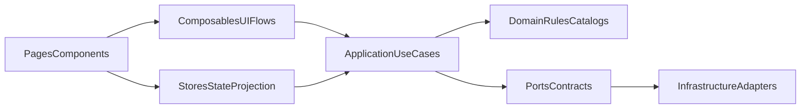
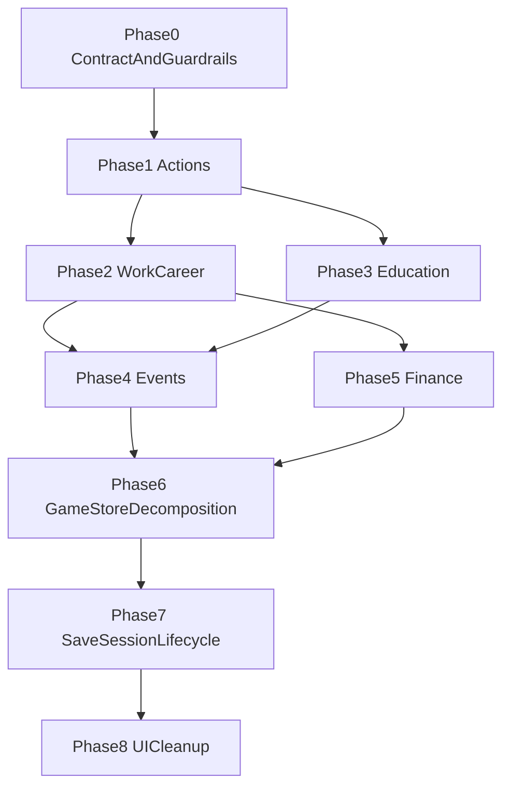

# План миграции на layered application-first архитектуру

## Цель
Перевести проект к единому архитектурному подходу, в котором:
- `domain` хранит правила, справочники и pure-логику;
- `application` становится единой точкой входа для use-case команд и запросов;
- `stores` отвечают за состояние, slice-level мутации и сериализацию своего состояния;
- `composables` остаются UI orchestration-слоем;
- `infrastructure` скрывается за портами и адаптерами.

Итоговый эффект: код остается удобным для текущей клиентской разработки, но становится существенно лучше подготовлен к будущему выносу игровой логики на сервер.

## Что уже определяет приоритет волн
Ключевые проблемные узлы уже видны в текущем коде:
- дублирование execution path для действий между [`src/composables/useActions/index.ts`](src/composables/useActions/index.ts), [`src/stores/actions-store/index.ts`](src/stores/actions-store/index.ts) и [`src/stores/game-store/index.ts`](src/stores/game-store/index.ts);
- `game-store` как orchestration hub в [`src/stores/game-store/index.ts`](src/stores/game-store/index.ts);
- session/save lifecycle, завязанный на клиентскую среду, в [`src/middleware/game-init.ts`](src/middleware/game-init.ts), [`src/plugins/auto-save.client.ts`](src/plugins/auto-save.client.ts), [`src/infrastructure/persistence/LocalStorageSaveRepository.ts`](src/infrastructure/persistence/LocalStorageSaveRepository.ts);
- параллельные UI API, особенно в модальном слое: [`src/app.vue`](src/app.vue), [`src/composables/useGameModal/index.ts`](src/composables/useGameModal/index.ts).

## Целевой поток ответственности

## Архитектурный контракт перед началом миграции
До первой волны нужно зафиксировать канонические правила, которыми будет руководствоваться миграция:
- `application` не импортирует `stores` и не использует Pinia;
- новая use-case логика не добавляется в `pages`, `components` и `composables`;
- `stores` могут вызывать `application`, но не должны становиться местом для новых cross-store бизнес-сценариев;
- `composables` могут вызывать `application` и `stores`, но только для UI-level orchestration;
- `domain` не знает о Nuxt, Pinia, persistence и browser API;
- `infrastructure` реализует порты, а не содержит продуктовые правила.

## Фазы миграции

### Фаза 0. Зафиксировать каноническую модель и миграционные guardrails
**Цель:** перед переносом логики остановить дальнейший рост архитектурного хаоса.

**Файлы:**
- [`src/application/game/index.ts`](src/application/game/index.ts)
- [`src/application/game/index.types.ts`](src/application/game/index.types.ts)
- [`src/domain/index.ts`](src/domain/index.ts)
- [`src/stores/game-store/index.ts`](src/stores/game-store/index.ts)
- [`test/unit/architecture/layer-boundaries.test.ts`](test/unit/architecture/layer-boundaries.test.ts)
- [`test/unit/architecture/store-boundaries.test.ts`](test/unit/architecture/store-boundaries.test.ts)
- [`docs/architecture-research-report.md`](docs/architecture-research-report.md)

**Шаги:**
1. Уточнить и документировать, какие обязанности остаются в `domain`, `application`, `stores`, `composables`, `infrastructure`.
2. Зафиксировать критерий “новая логика идет в `application` first”.
3. Обновить архитектурные тесты/guardrails так, чтобы они проверяли новую каноническую модель, а не старые упоминания `domain/engine`.
4. Добавить короткий decision guide в документацию: “куда класть новый код”.

**Критерий завершения:** новые изменения в проекте уже нельзя обоснованно добавлять в `pages/composables` как use-case логику без явного нарушения правила.

### Фаза 1. Убрать дублирование execution path для действий
**Цель:** сделать один канонический путь `can execute -> execute -> apply effects -> return result` для игровых действий.

**Файлы:**
- [`src/application/game/commands.ts`](src/application/game/commands.ts)
- [`src/application/game/queries.ts`](src/application/game/queries.ts)
- [`src/application/game/index.ts`](src/application/game/index.ts)
- [`src/application/game/index.types.ts`](src/application/game/index.types.ts)
- [`src/stores/actions-store/index.ts`](src/stores/actions-store/index.ts)
- [`src/composables/useActions/index.ts`](src/composables/useActions/index.ts)
- [`src/stores/game-store/index.ts`](src/stores/game-store/index.ts)
- [`src/pages/game/actions/index.vue`](src/pages/game/actions/index.vue)
- [`src/pages/game/home/index.vue`](src/pages/game/home/index.vue)
- [`src/pages/game/shop/index.vue`](src/pages/game/shop/index.vue)
- [`src/pages/game/finance/index.vue`](src/pages/game/finance/index.vue)
- [`src/pages/game/education/index.vue`](src/pages/game/education/index.vue)
- `test/unit/application/game/actions-command.test.ts`
- `test/unit/application/game/actions-query.test.ts`

**Шаги:**
1. Выделить единый application-level query для проверки возможности действия с учетом денег, времени, возраста, навыков и других инвариантов.
2. Выделить единый application-level command/result contract для выполнения действия.
3. Свести `useActions` к UI orchestration: toast/modal/activity вызываются после результата use-case, а не вперемешку с правилами.
4. Либо упростить `actions-store` до effect applier/state holder, либо сделать его thin-wrapper поверх `application`.
5. Перевести страницы, которые сейчас используют смешанные пути, на один и тот же API.
6. Закрыть расхождения между `gameStore.canExecuteAction()` и `useActions().canExecute()`.

**Критерий завершения:** в кодовой базе остается один источник истины для action preconditions и один источник истины для action execution semantics.

### Фаза 2. Вынести work/career use cases из `game-store`
**Цель:** убрать из `game-store` карьерные и рабочие бизнес-сценарии как встроенные service-methods.

**Файлы:**
- [`src/stores/game-store/index.ts`](src/stores/game-store/index.ts)
- [`src/stores/career-store/index.ts`](src/stores/career-store/index.ts)
- [`src/stores/wallet-store/index.ts`](src/stores/wallet-store/index.ts)
- [`src/stores/stats-store/index.ts`](src/stores/stats-store/index.ts)
- [`src/stores/time-store/index.ts`](src/stores/time-store/index.ts)
- [`src/stores/activity-store/index.ts`](src/stores/activity-store/index.ts)
- [`src/application/game/commands.ts`](src/application/game/commands.ts)
- [`src/application/game/queries.ts`](src/application/game/queries.ts)
- [`src/pages/game/work/index.vue`](src/pages/game/work/index.vue)
- [`src/components/pages/dashboard/WorkButton/WorkButton.vue`](src/components/pages/dashboard/WorkButton/WorkButton.vue)
- `test/unit/application/game/work-command.test.ts`
- `test/unit/application/game/career-command.test.ts`

**Шаги:**
1. Выделить application use cases для `canApplyWorkShift`, `applyWorkShift`, `changeCareer`, `quitCareer`, `getCareerTrack`.
2. Передавать в `application` только нужные snapshots/inputs, а не весь store.
3. Возвращать из use-case явный результат: effect payload, reason, UI-facing message при необходимости.
4. Оставить в stores только применение effect payload и хранение runtime state.
5. Упростить `game-store`: он либо делегирует use-case, либо вообще перестает быть местом бизнес-логики для career/work.

**Критерий завершения:** карьерная логика больше не развивается напрямую в `game-store`; новый career/work behavior добавляется через `application`.

### Фаза 3. Вынести education use cases
**Цель:** выровнять обучение по тому же паттерну, что actions/work/career.

**Файлы:**
- [`src/stores/game-store/index.ts`](src/stores/game-store/index.ts)
- [`src/stores/education-store/index.ts`](src/stores/education-store/index.ts)
- [`src/application/game/commands.ts`](src/application/game/commands.ts)
- [`src/application/game/queries.ts`](src/application/game/queries.ts)
- [`src/domain/education/index.ts`](src/domain/education/index.ts)
- [`src/pages/game/education/index.vue`](src/pages/game/education/index.vue)
- [`src/components/pages/education/ProgramList/ProgramList.vue`](src/components/pages/education/ProgramList/ProgramList.vue)
- [`src/components/pages/education/EducationLevel/EducationLevel.vue`](src/components/pages/education/EducationLevel/EducationLevel.vue)
- `test/unit/application/game/education-command.test.ts`
- `test/unit/application/game/education-query.test.ts`

**Шаги:**
1. Отделить domain-level education rules от application-level сценариев запуска/проверки программы.
2. Перенести `startEducationProgram` и связанные проверки в `application`.
3. Привести UI к чтению application result models вместо размазанной логики между store/page/component.
4. Явно определить, что образование хранится в `education-store`, а решение “можно/нельзя/что произойдет” формируется в `application`.

**Критерий завершения:** обучение следует тому же слоистому паттерну, что и другие игровые сценарии, без особых исключений.

### Фаза 4. Вынести event use cases и эффекты выбора
**Цель:** прекратить хранить event resolution semantics только в store/composable комбинации.

**Файлы:**
- [`src/stores/events-store/index.ts`](src/stores/events-store/index.ts)
- [`src/composables/useEvents/index.ts`](src/composables/useEvents/index.ts)
- [`src/stores/stats-store/index.ts`](src/stores/stats-store/index.ts)
- [`src/stores/activity-store/index.ts`](src/stores/activity-store/index.ts)
- [`src/stores/game-store/index.ts`](src/stores/game-store/index.ts)
- [`src/application/game/commands.ts`](src/application/game/commands.ts)
- [`src/application/game/index.types.ts`](src/application/game/index.types.ts)
- `test/unit/application/game/events-command.test.ts`

**Шаги:**
1. Выделить application contract для event resolution: `resolveChoice`, `skipEvent`, `appendHistory`, `deriveEffects`.
2. Оставить `events-store` владельцем очереди, current event и history state.
3. Перенести sequence logic из `composables/store` в `application`.
4. Свести `useEvents` к UI reaction-слою: открыть/закрыть модалку, показать результат, вызвать store/app command.

**Критерий завершения:** поведение выбора в событиях определяется не Vue-composable логикой, а application-level use-case.

### Фаза 5. Вынести finance use cases и snapshot/read models
**Цель:** перестать смешивать финансовые правила, store mutation и UI queries.

**Файлы:**
- [`src/stores/finance-store/index.ts`](src/stores/finance-store/index.ts)
- [`src/stores/game-store/index.ts`](src/stores/game-store/index.ts)
- [`src/stores/wallet-store/index.ts`](src/stores/wallet-store/index.ts)
- [`src/application/game/commands.ts`](src/application/game/commands.ts)
- [`src/application/game/queries.ts`](src/application/game/queries.ts)
- [`src/pages/game/finance/index.vue`](src/pages/game/finance/index.vue)
- `test/unit/application/game/finance-command.test.ts`
- `test/unit/application/game/finance-query.test.ts`

**Шаги:**
1. Отделить read models (`overview`, `snapshot`, `monthly summary`) от store internals.
2. Перенести финансовые продуктовые правила в `application`.
3. Оставить в `finance-store` только состояние инвестиций, резервного фонда и локальные slice-mutations.
4. Явно зафиксировать границу между `wallet-store` и `finance-store`: кто владеет балансом, кто владеет investment state, а кто вычисляет policy.

**Критерий завершения:** finance UI не зависит от внутренних структур store для product semantics, а использует application query/result models.

### Фаза 6. Пересобрать `game-store` как facade/delegator, а не business hub
**Цель:** после выноса use cases уменьшить `game-store` до агрегирующего фасада и session coordinator.

**Файлы:**
- [`src/stores/game-store/index.ts`](src/stores/game-store/index.ts)
- [`src/stores/player-store/index.ts`](src/stores/player-store/index.ts)
- [`src/stores/time-store/index.ts`](src/stores/time-store/index.ts)
- [`src/stores/stats-store/index.ts`](src/stores/stats-store/index.ts)
- [`src/stores/wallet-store/index.ts`](src/stores/wallet-store/index.ts)
- [`src/stores/career-store/index.ts`](src/stores/career-store/index.ts)
- [`src/stores/education-store/index.ts`](src/stores/education-store/index.ts)
- [`src/stores/events-store/index.ts`](src/stores/events-store/index.ts)
- [`src/stores/finance-store/index.ts`](src/stores/finance-store/index.ts)
- [`src/stores/activity-store/index.ts`](src/stores/activity-store/index.ts)
- `test/unit/stores/game-store.test.ts`

**Шаги:**
1. Выделить, какие методы `game-store` еще действительно нужны как фасад приложения.
2. Удалить из него use-case logic, которая уже переехала в `application`.
3. Оставить только orchestration минимального уровня: сбор snapshots, делегирование use-case, применение effect payload, session-wide reset/init coordination.
4. Проверить, что `game-store` больше не является местом, куда по умолчанию добавляется новая игровая логика.

**Критерий завершения:** `game-store` перестает быть “god store” и становится тонким агрегирующим фасадом.

### Фаза 7. Перевести session/save lifecycle на application-first контракты
**Цель:** подготовить save/load/bootstrap к будущей замене localStorage на удаленный адаптер.

**Файлы:**
- [`src/application/game/ports/SaveRepository.types.ts`](src/application/game/ports/SaveRepository.types.ts)
- [`src/application/game/commands.ts`](src/application/game/commands.ts)
- [`src/application/game/queries.ts`](src/application/game/queries.ts)
- [`src/application/game/index.types.ts`](src/application/game/index.types.ts)
- [`src/infrastructure/persistence/LocalStorageSaveRepository.ts`](src/infrastructure/persistence/LocalStorageSaveRepository.ts)
- [`src/middleware/game-init.ts`](src/middleware/game-init.ts)
- [`src/plugins/auto-save.client.ts`](src/plugins/auto-save.client.ts)
- [`src/stores/game-store/index.ts`](src/stores/game-store/index.ts)
- [`src/domain/balance/utils/build-new-game-save.ts`](src/domain/balance/utils/build-new-game-save.ts)
- `test/unit/application/game/save-session.test.ts`

**Шаги:**
1. Определить explicit application-level save contract: aggregate save DTO/versioned payload.
2. Свести `gameStore.save()`/`load()` к предсказуемому aggregate boundary.
3. Изолировать ответственность:
   - `application` знает, как собрать/разобрать payload;
   - `stores` отдают и принимают свои slice snapshots;
   - `infrastructure` только сохраняет/читает данные;
   - `middleware/plugin` только запускают lifecycle hooks.
4. Подготовить контракт `SaveRepository` к будущему async/remote варианту, не ломая локальный режим сразу.
5. Явно определить место для save versioning/migration.

**Критерий завершения:** переход от localStorage к будущему remote/cloud persistence больше не требует переписывать половину store-слоя.

### Фаза 8. UI/service cleanup и унификация call-site паттернов
**Цель:** после переноса логики убрать legacy/mixed API, которые поддерживали старую архитектуру.

**Файлы:**
- [`src/composables/useGameModal/index.ts`](src/composables/useGameModal/index.ts)
- [`src/composables/useModalStack/index.ts`](src/composables/useModalStack/index.ts)
- [`src/app.vue`](src/app.vue)
- [`src/components/ui/GameModalHost/GameModalHost.vue`](src/components/ui/GameModalHost/GameModalHost.vue)
- [`docs/unified-modal-service_c0df6832.plan.md`](docs/unified-modal-service_c0df6832.plan.md)
- `test/e2e/routes/routes-smoke.test.ts`

**Шаги:**
1. Удалить или мигрировать оставшиеся параллельные UI APIs, мешающие единой модели.
2. Привести composables к роли UI adapter/facade, а не альтернативного application слоя.
3. Проверить, что страницы и компоненты больше не выбирают между несколькими равноправными путями выполнения одного сценария.

**Критерий завершения:** в UI остается один канонический способ инициировать use case и один канонический способ показать результат.

## Порядок волн и зависимостей

## Тестовая стратегия по ходу миграции
План рассчитан на сопровождение migration wave-by-wave через новые application-level unit tests и ограниченное количество regression tests:
- для каждой новой application команды/запроса добавлять отдельные тесты в `test/unit/application/game/`;
- для store-фасадов оставлять только thin integration coverage на делегирование и применение effect payload;
- архитектурные тесты обновлять вместе с миграцией, чтобы они закрепляли новый путь, а не прошлую структуру;
- smoke coverage для основных маршрутов сохранить в [`test/e2e/routes/routes-smoke.test.ts`](test/e2e/routes/routes-smoke.test.ts).

## Риски и как их снизить
- **Риск:** `application` превратится в новый god layer.
  - **Снижение:** группировать use cases по bounded areas (`actions`, `career`, `education`, `events`, `finance`, `session`), а не сливать все в один бесконечный файл.
- **Риск:** миграция затянется из-за попытки сделать все идеально.
  - **Снижение:** завершать каждую фазу независимым архитектурным checkpoint с конкретным критерием done.
- **Риск:** UI временно будет жить на смешанных API.
  - **Снижение:** каждая фаза должна заканчиваться миграцией call sites в затронутой области.
- **Риск:** save/load boundary сломается слишком рано.
  - **Снижение:** session/save lifecycle переносить только после стабилизации основных gameplay use cases.

## Практический rollout
Если нужен безопасный порядок внедрения, начинать стоит с такого маршрута:
1. Фаза 0
2. Фаза 1
3. Фаза 2
4. Фаза 3
5. Фаза 6 частично
6. Фаза 4 и Фаза 5
7. Фаза 7
8. Фаза 8

Такой rollout сначала устраняет самое опасное дублирование путей, затем уменьшает роль `game-store`, и только потом переводит lifecycle/persistence на новую модель.

## Что считать итогом миграции
Миграция считается успешной, когда:
- новый gameplay behavior больше не пишется напрямую в `pages`, `components`, `composables` и толстые store-фасады;
- у каждой крупной игровой области есть application-level commands/queries;
- `stores` стали тоньше и предсказуемее по ответственности;
- `SaveRepository` и session lifecycle готовы к эволюции в сторону remote/server persistence;
- в проекте остается один канонический путь для выполнения ключевых пользовательских сценариев.