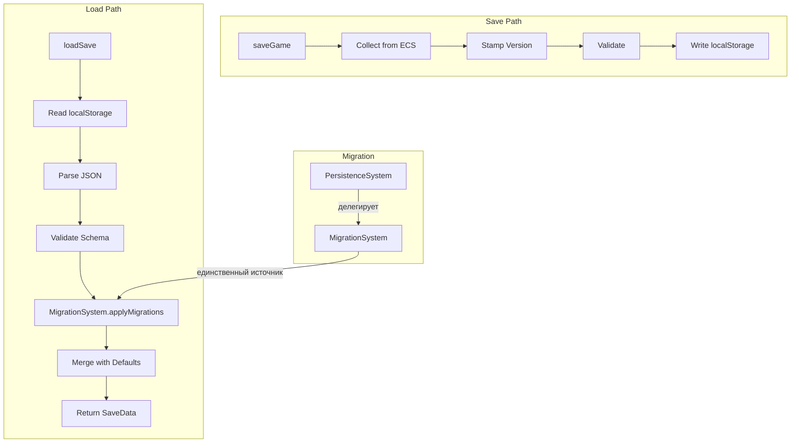

# План: Актуализация PersistenceSystem + MigrationSystem

## Статус: Draft (Wave 1 — P0)

## Цель

Создать устойчивый, предсказуемый и расширяемый контур save/load + миграций:
- единая точка миграций (MigrationSystem);
- type-safe сериализация/десериализация;
- надёжная валидация и восстановление при corruption.

---

## 1. Текущий срез (as-is)

### PersistenceSystem

| Аспект | Состояние |
|--------|-----------|
| Файл | `src/domain/engine/systems/PersistenceSystem/index.ts` (575 строк) |
| Типы | `src/domain/engine/systems/PersistenceSystem/index.types.ts` |
| Константы | `src/domain/engine/systems/PersistenceSystem/index.constants.ts` |
| Версия | `currentVersion = '1.1.0'`, `currentSaveVersion = 2` |
| Save key | `game-life-save` (localStorage) |
| Wiring | Через store/world, **не в `system-context.ts`** |

#### API

```
PersistenceSystem
├── init(world: GameWorld): void
├── loadSave(): SaveData                              // загрузка + миграция + merge
├── saveGame(saveData): void                           // ECS → saveData → localStorage
├── _createDefaultSave(): SaveData                     // structuredClone(DEFAULT_SAVE)
├── _mergeAndMigrate(parsed): Record<string, unknown>  // deep merge с дефолтами
├── _syncFromWorld(saveData): void                     // ECS → saveData маппинг
├── _applyMigrations(saveData): Record<string, unknown> // миграции (дублируют MigrationSystem)
├── _migrateFrom_0_1_0(saveData): Record<string, unknown>
├── _migrateFrom_0_2_0(saveData): Record<string, unknown>
├── _validateSave(saveData): ValidationResult          // минимальная валидация
├── normalizeJobShape(currentJob): Record<string, unknown> | null
├── clearSave(): void
└── hasSave(): boolean
```

### MigrationSystem

| Аспект | Состояние |
|--------|-----------|
| Файл | `src/domain/engine/systems/MigrationSystem/index.ts` (47 строк) |
| Типы | `src/domain/engine/systems/MigrationSystem/index.types.ts` |
| Версия | `currentVersion = '1.0.0'` |
| Миграции | **Пустые** — `migrations: {}` |
| Wiring | Partial, не в `system-context.ts` |

#### API

```
MigrationSystem
├── init(world: GameWorld): void
├── getCurrentVersion(): string
├── applyMigrations(saveData): Record<string, unknown>  // пустой цикл
├── validateSave(saveData): { isValid, errors, warnings } // заглушка
└── createDefaultSave(): Record<string, unknown>          // { version }
```

### Конфликт версий

| | PersistenceSystem | MigrationSystem |
|---|---|---|
| `currentVersion` | `'1.1.0'` | `'1.0.0'` |
| Реальные миграции | 2 (`0.1.0`, `0.2.0`) | 0 |
| Используется в runtime | Да (через store) | Нет |

---

## 2. Проблемы

### P0 — Блокеры

| # | Проблема | Влияние |
|---|----------|---------|
| P-1 | **Две системы с перекрывающейся миграционной логикой** — PersistenceSystem имеет реальные миграции, MigrationSystem — пустой стаб с другой версией | Рассинхрон версий; при добавлении миграции непонятно куда её добавлять |
| P-2 | **`_syncFromWorld()` — ручной маппинг 12+ компонентов** — при добавлении нового компонента легко забыть обновить | Потеря данных при save/load |
| P-3 | **`_mergeAndMigrate()` — spread-based deep merge** — может потерять вложенные данные (например, массивы) | Потеря данных при загрузке старых сейвов |

### P1 — Качество

| # | Проблема | Влияние |
|---|----------|---------|
| P-4 | **Минимальная валидация** — проверяет только `money`, `gameDays`, `totalHours`, `stats`, `housing` | Повреждённые сейвы могут пройти валидацию |
| P-5 | **Нет стратегии восстановления при corruption** — при ошибке просто fallback на default save, сломанный сейв теряется | Невозможно диагностировать причину corruption |
| P-6 | **`normalizeJobShape()` дублирует логику** из WorkPeriodSystem/CareerProgressSystem | Расхождение при изменении формата работы |
| P-7 | **PersistenceSystem не в `system-context.ts`** — доступ через store/world, не через canonical context | Неудобно тестировать и использовать |

### P2 — Расширения

| # | Проблема | Влияние |
|---|----------|---------|
| P-8 | **Нет auto-save** — сохранение только по действию игрока | Потеря прогресса при краше |
| P-9 | **Нет сжатия/оптимизации** — полный JSON в localStorage | Может превысить лимит при длинной игре |
| P-10 | **Нет экспорта/импорта** сейвов | Невозможно перенести прогресс |

---

## 3. Целевая архитектура

### Contracts + Boundaries



### Контракт PersistenceSystem v2

```typescript
interface PersistenceSystemV2 {
  // Core
  loadSave(): SaveData
  saveGame(saveData: Record<string, unknown>): void
  clearSave(): void
  hasSave(): boolean
  
  // ECS sync (registry-based)
  registerComponentMapper(component: string, mapper: ComponentMapper): void
  syncFromWorld(saveData: Record<string, unknown>): void
  
  // Validation
  validateSave(saveData: Record<string, unknown>): ValidationResult
}

interface ComponentMapper {
  component: string                    // ECS component key
  toSave(ecsData: unknown): unknown    // ECS → save format
  toECS(saveData: unknown): unknown    // save → ECS format
}
```

### Контракт MigrationSystem v2

```typescript
interface MigrationSystemV2 {
  readonly currentVersion: string
  
  registerMigration(version: string, fn: MigrationFn): void
  applyMigrations(saveData: Record<string, unknown>): Record<string, unknown>
  validateSave(saveData: Record<string, unknown>): ValidationResult
}
```

### Границы ответственности

- **MigrationSystem** — единственный владелец миграций и версии сейва.
- **PersistenceSystem** — владелец save/load flow, делегирует миграции в MigrationSystem.
- **Component mappers** — регистрируются один раз, обеспечивают type-safe маппинг.

---

## 4. Синхронизация с другими системами

| Система | Что синхронизировать | Контракт |
|---------|---------------------|----------|
| `TimeSystem` | `time` компонент — канонический источник времени | `_syncFromWorld` через mapper |
| `WorkPeriodSystem` | `work` компонент — canonical runtime-истина | mapper для work |
| `CareerProgressSystem` | `career` компонент — зеркало work для UI | mapper для career |
| `FinanceActionSystem` | `wallet` + `finance` компоненты | mapper для wallet/finance |
| `StatsSystem` | `stats` компонент | mapper для stats |
| `SkillsSystem` | `skills` + `skillModifiers` компоненты | mapper для skills |
| `InvestmentSystem` | `investment` компонент (array) | mapper для investments |
| `EducationSystem` | `education` компонент | mapper для education |
| `EventQueueSystem` | `eventQueue` компонент | mapper для pending events |
| `EventHistorySystem` | `eventHistory` компонент | mapper для event history |

---

## 5. Execution plan

### Этап 1: Консолидация миграций (~1.5 ч)

| Шаг | Описание | Файлы |
|-----|----------|-------|
| 1.1 | Перенести миграции `_migrateFrom_0_1_0` и `_migrateFrom_0_2_0` из PersistenceSystem в MigrationSystem | `MigrationSystem/index.ts`, `MigrationSystem/index.utils.ts` |
| 1.2 | Установить единую версию `currentVersion = '1.2.0'` в MigrationSystem | `MigrationSystem/index.ts` |
| 1.3 | PersistenceSystem: удалить `_migrateFrom_0_1_0`, `_migrateFrom_0_2_0`, `_applyMigrations`; делегировать в `MigrationSystem.applyMigrations()` | `PersistenceSystem/index.ts` |
| 1.4 | Удалить дублирующий `currentVersion` / `currentSaveVersion` из PersistenceSystem; брать из MigrationSystem | `PersistenceSystem/index.ts` |

### Этап 2: Registry-based syncFromWorld (~2 ч)

| Шаг | Описание | Файлы |
|-----|----------|-------|
| 2.1 | Создать интерфейс `ComponentMapper` | `PersistenceSystem/index.types.ts` |
| 2.2 | Реализовать `registerComponentMapper()` и переписать `_syncFromWorld()` на registry | `PersistenceSystem/index.ts` |
| 2.3 | Зарегистрировать mappers для всех 12 компонентов (time, stats, skills, work, wallet, education, housing, finance, lifetimeStats, relationships, eventHistory, eventQueue, investments) | `PersistenceSystem/index.ts` или отдельный файл mappers |
| 2.4 | Убедиться, что `_mergeAndMigrate()` корректно обрабатывает массивы (не заменяет, а merge-ит) | `PersistenceSystem/index.ts` |

### Этап 3: Усиление валидации (~1 ч)

| Шаг | Описание | Файлы |
|-----|----------|-------|
| 3.1 | Расширить `_validateSave()`: проверить все критичные поля (time.totalHours, wallet.money, stats, work.id, education.educationLevel) | `PersistenceSystem/index.ts` |
| 3.2 | Добавить schema validation: required fields + type checks | `PersistenceSystem/index.ts` |
| 3.3 | MigrationSystem: перенести `validateSave()` из заглушки в реальную реализацию | `MigrationSystem/index.ts` |

### Этап 4: Backup при corruption (~30 мин)

| Шаг | Описание | Файлы |
|-----|----------|-------|
| 4.1 | Перед fallback на default save — сохранить сломанный сейв в `game-life-save-backup` | `PersistenceSystem/index.ts` |
| 4.2 | Логировать причину corruption в console.warn | `PersistenceSystem/index.ts` |

### Этап 5: Тесты (~1.5 ч)

| Шаг | Описание | Файлы |
|-----|----------|-------|
| 5.1 | Unit: миграции `0.1.0` → `1.2.0` (chain) | `test/unit/domain/engine/persistence-migration.test.ts` |
| 5.2 | Unit: валидация (valid/invalid/corrupted saves) | там же |
| 5.3 | Unit: merge с дефолтами (missing fields, nested objects, arrays) | там же |
| 5.4 | Unit: backup при corruption | там же |
| 5.5 | Unit: registry-based syncFromWorld (все компоненты) | там же |
| 5.6 | Regression: все существующие тесты зелёные | — |

---

## 6. Telemetry + Tests

### Telemetry-счётчики

| Счётчик | Когда инкрементируется |
|---------|------------------------|
| `persistence_save` | При каждом saveGame() |
| `persistence_load` | При каждом loadSave() |
| `persistence_migration_applied:{version}` | При каждой применённой миграции |
| `persistence_validation_error` | При ошибке валидации |
| `persistence_corruption_backup` | При backup сломанного сейва |

### Тесты

| Тип | Количество | Что покрывает |
|-----|-----------|---------------|
| Unit | ≥6 | Миграции, валидация, merge, backup, registry sync |
| Regression | все существующие | Нет регрессий |

---

## 7. Definition of Done

- [ ] **Единая точка миграций** — все миграции только в MigrationSystem.
- [ ] **PersistenceSystem не содержит `_migrateFrom_*`** — делегирует в MigrationSystem.
- [ ] **Единая версия** — `currentVersion` только в MigrationSystem.
- [ ] **Registry-based `_syncFromWorld`** — не ручной маппинг, а регистрация mappers.
- [ ] **Валидация** проверяет ≥5 критичных полей (time, money, stats, work, education).
- [ ] **Backup при corruption** — сломанный сейв сохраняется перед fallback.
- [ ] **Все существующие тесты зелёные** + ≥6 новых unit-тестов.
- [ ] **Save/load backward compatible** с текущими сейвами игроков.
- [ ] **`SYSTEM_REGISTRY.md`** обновлён: PersistenceSystem → Active (canonical), MigrationSystem → Active.

---

## Связанные документы

- [Wave 1 общий план](plans/wave1-p0-core-stability-plan.md)
- [Дорожная карта](plans/systems-planning-roadmap.md)
- [Master sync plan](plans/system-sync-plan.md)
- [System Registry](src/domain/engine/systems/SYSTEM_REGISTRY.md)
