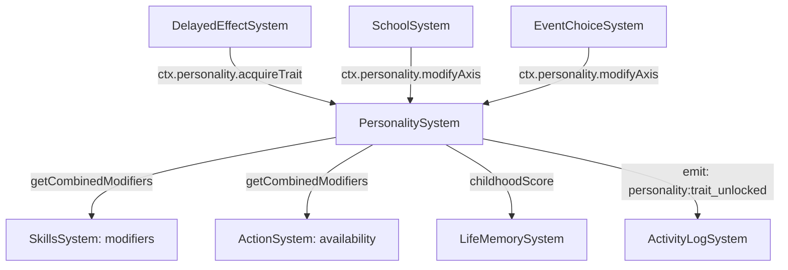

# План: Актуализация PersonalitySystem

## Статус: Draft (Wave 3 — P2)

## Цель

Превратить PersonalitySystem из экспериментальной системы в полноценный контур черт характера:
- canonical wiring через SystemContext;
- устранить баги и дублирование;
- связать с LifeMemorySystem, DelayedEffectSystem, SchoolSystem;
- обеспечить влияние personality на gameplay через modifiers.

---

## 1. Текущий срез (as-is)

| Аспект | Состояние |
|--------|-----------|
| Файл | `src/domain/engine/systems/PersonalitySystem/index.ts` (161 строка) |
| Типы | `@/domain/balance/types/personality` — `PersonalityComponent`, `PersonalityAxis` |
| Константы | `@/domain/balance/constants/personality-traits` — `PERSONALITY_TRAITS` |
| Wiring | **Experimental** — не в `system-context.ts` |
| Компонент | `PERSONALITY_COMPONENT` — `{ axes: Record<Axis, AxisState>, traits: Trait[], driftSpeed: number }` |

### API

```
PersonalitySystem
├── init(world: GameWorld): void
├── update(world, deltaHours): void                    // axis drift + trait unlock check
├── modifyAxis(axis, delta): void                      // изменить ось
├── getCombinedModifiers(): Record<string, number>     // сумма modifiers от unlocked traits
├── acquireTrait(traitId): boolean                     // принудительно дать черту
├── _ensurePersonalityComponent(): void
├── _applyAxisDrift(personality, deltaHours): void     // дрейф осей + childhood multiplier
├── _getCurrentAge(): number | null                    // BUG: использует 'player' вместо PLAYER_ENTITY
├── _checkTraitUnlocks(personality): void              // проверка порогов
└── _clamp(value, min, max): number                    // ДУБЛИРУЕТ StatsSystem
```

### Модель данных

**5 осей (Big Five):**
- `openness` (открытость)
- `conscientiousness` (добросовестность)
- `extraversion` (экстраверсия)
- `agreeableness` (доброжелательность)
- `neuroticism` (нейротизм)

Каждая ось: `{ value: -100..100, drift: number, lastUpdateAt: number }`

**Черты (traits):** определяются порогом на оси + возрастным окном. Имеют `modifiers` — влияние на gameplay.

---

## 2. Проблемы

### P0 — Блокеры

| # | Проблема | Влияние |
|---|----------|---------|
| PS-1 | **Не в system-context.ts** — нельзя получить через canonical context | DelayedEffectSystem создаёт свой экземпляр |
| PS-2 | **BUG: `_getCurrentAge()` использует `'player'` вместо `PLAYER_ENTITY`** (строка 103) | Возраст всегда null → drift multiplier = 1.0 вместо childhood 2.0 |
| PS-3 | **`_clamp()` дублирует StatsSystem** | Расхождение при изменении bounds |

### P1 — Качество

| # | Проблема | Влияние |
|---|----------|---------|
| PS-4 | **`getCombinedModifiers()` не документирован** — непонятно какие ключи возвращаются | Сложно использовать в других системах |
| PS-5 | **Нет telemetry** на trait unlocks, axis changes | Невозможно отслеживать |
| PS-6 | **Нет ActivityLog интеграции** — trait unlocks не логируются | Игрок не видит изменения характера |
| PS-7 | **`_checkTraitUnlocks` читает `formAgeStart/formAgeEnd` через `as unknown as`** — type-unsafe | Хрупкий код |
| PS-8 | **Нет query API** — нельзя получить список unlocked traits, текущие значения осей | Неполный API |

### P2 — Расширения

| # | Проблема | Влияние |
|---|----------|---------|
| PS-9 | **Нет влияния на SchoolSystem** — personality не влияет на skip chance | Нереалистично |
| PS-10 | **Нет влияния на RecoverySystem** — personality не влияет на recovery effectiveness | Упущенная механика |
| PS-11 | **Нет UI для personality** — игрок не видит свой характер | Неполный gameplay |
| PS-12 | **Нет событий от действий** — действия не смещают оси | Односторонняя модель |

---

## 3. Целевая архитектура

### Contracts + Boundaries



### Контракт PersonalitySystem v2

```typescript
interface PersonalitySystemV2 {
  init(world: GameWorld): void
  update(world: GameWorld, deltaHours: number): void
  
  // Мутации
  modifyAxis(axis: PersonalityAxis, delta: number): void
  acquireTrait(traitId: string): boolean
  
  // Queries
  getCombinedModifiers(): Record<string, number>
  getAxisValue(axis: PersonalityAxis): number
  getAllAxes(): Record<PersonalityAxis, number>
  getUnlockedTraits(): Trait[]
  hasTrait(traitId: string): boolean
}
```

---

## 4. Синхронизация с другими системами

| Система | Что синхронизировать | Контракт |
|---------|---------------------|----------|
| `system-context.ts` | Добавить `personality: PersonalitySystem` | Canonical access |
| `DelayedEffectSystem` | `new PersonalitySystem()` → canonical | Делегирование |
| `SkillsSystem` | `getCombinedModifiers()` → skill modifiers | Integration |
| `SchoolSystem` | `modifyAxis()` на основе school events | Integration |
| `ActivityLogSystem` | Emit `activity:event` при trait unlock | Logging |
| `PersistenceSystem` | `PERSONALITY_COMPONENT` в save/load | Persistence |

---

## 5. Execution plan

### Этап 1: Canonical wiring + багфикс (~1 ч)

| Шаг | Описание | Файлы |
|-----|----------|-------|
| 1.1 | Добавить `PersonalitySystem` в `SystemContext` как `personality` | `system-context.ts`, `index.types.ts` |
| 1.2 | **BUGFIX:** `_getCurrentAge()` — заменить `'player'` на `PLAYER_ENTITY` | `PersonalitySystem/index.ts:103` |
| 1.3 | Удалить `_clamp()` — делегировать в StatsSystem | `PersonalitySystem/index.ts:157-159` |

### Этап 2: Query API (~1 ч)

| Шаг | Описание | Файлы |
|-----|----------|-------|
| 2.1 | Добавить `getAxisValue(axis)` | `PersonalitySystem/index.ts` |
| 2.2 | Добавить `getAllAxes()` | `PersonalitySystem/index.ts` |
| 2.3 | Добавить `getUnlockedTraits()` | `PersonalitySystem/index.ts` |
| 2.4 | Добавить `hasTrait(traitId)` | `PersonalitySystem/index.ts` |
| 2.5 | Починить type-safety в `_checkTraitUnlocks` — убрать `as unknown as` | `PersonalitySystem/index.ts:117-118` |

### Этап 3: Интеграция + Telemetry (~1 ч)

| Шаг | Описание | Файлы |
|-----|----------|-------|
| 3.1 | Emit `activity:event` при trait unlock | `PersonalitySystem/index.ts` |
| 3.2 | Telemetry: `personality_axis_change:{axis}`, `personality_trait_unlocked:{traitId}` | `PersonalitySystem/index.ts` |
| 3.3 | DelayedEffectSystem: использовать canonical PersonalitySystem | `DelayedEffectSystem/index.ts` |

### Этап 4: Тесты (~1 ч)

| Шаг | Описание | Файлы |
|-----|----------|-------|
| 4.1 | Unit: modifyAxis — clamp, drift | `test/unit/domain/engine/personality.test.ts` |
| 4.2 | Unit: trait unlock — threshold, age window | там же |
| 4.3 | Unit: acquireTrait — forced unlock | там же |
| 4.4 | Unit: getCombinedModifiers — sum of unlocked traits | там же |
| 4.5 | Unit: BUGFIX — _getCurrentAge with PLAYER_ENTITY | там же |
| 4.6 | Regression: все существующие тесты зелёные | — |

---

## 6. Telemetry + Tests

### Telemetry-счётчики

| Счётчик | Когда инкрементируется |
|---------|------------------------|
| `personality_axis_change:{axis}` | При изменении оси |
| `personality_trait_unlocked:{traitId}` | При разблокировке черты |
| `personality_drift_applied` | При применении drift |

### Тесты

| Тип | Количество | Что покрывает |
|-----|-----------|---------------|
| Unit | ≥5 | axis modify, trait unlock, acquireTrait, modifiers, age bugfix |
| Regression | все существующие | Нет регрессий |

---

## 7. Definition of Done

- [ ] **PersonalitySystem в SystemContext** — `ctx.personality`.
- [ ] **BUGFIX:** `_getCurrentAge()` использует `PLAYER_ENTITY`.
- [ ] **Нет `_clamp()`** — делегирование в StatsSystem.
- [ ] **Query API** — `getAxisValue`, `getAllAxes`, `getUnlockedTraits`, `hasTrait`.
- [ ] **Type-safety** в `_checkTraitUnlocks` — без `as unknown as`.
- [ ] **ActivityLog** логирует trait unlocks.
- [ ] **Telemetry** покрывает систему.
- [ ] **Все существующие тесты зелёные** + ≥5 новых unit-тестов.
- [ ] **`SYSTEM_REGISTRY.md`** обновлён.

---

## Связанные документы

- [Дорожная карта](plans/systems-planning-roadmap.md)
- [Chain + Delayed effects plan](plans/chain-delayed-effects-plan.md)
- [Life memory system plan](plans/life-memory-system-plan.md)
- [System Registry](src/domain/engine/systems/SYSTEM_REGISTRY.md)
