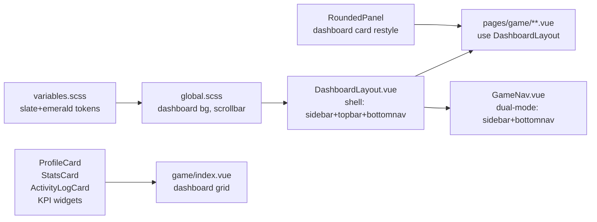

# План: Dashboard restyle (admin panel aesthetic)

## Цель и границы

Перевести визуал игры на эстетику современной админ-панели: виджеты/карточки, метрики, плотный dashboard-grid. **Функционал не трогать** — меняются только SCSS, layout-обёртки и template-разметка страниц. Stores, composables, domain, application — без изменений.

**Решения:**
- Палитра: **Slate + emerald accent** (нейтрально-серый с зелёным акцентом, SaaS-стиль)
- Layout: **Sidebar desktop + bottom nav mobile** (responsive)

## Архитектура изменений



## Этапы

### 1. Design tokens — [src/assets/scss/variables.scss](src/assets/scss/variables.scss)

- Заменить primitive colors на slate-шкалу (`$color-neutral-*` → slate-stepens: #0F172A, #1E293B, #334155, #475569, #64748B, #94A3B8, #CBD5E1, #E2E8F0, #F1F5F9, #F8FAFC)
- `$color-brand-primary` → emerald `#10B981`, hover `#059669`, active `#047857`
- Новый accent emerald-soft `#ECFDF5` для бейджей
- `$card-padding: 20px` (плотнее), `$card-radius: $radius-xl` (20px — меньше текущих 24px)
- Новые semantic: `$color-bg-app` (canvas фон dashboard), `$color-bg-surface-2` (sub-card)
- Новые tokens: `$sidebar-width`, `$bottomnav-height`, `$topbar-height`
- Тёмная тема: slate-900/800 вместо blue-greys

### 2. Global styles — [src/assets/scss/global.scss](src/assets/scss/global.scss)

- Body background: тонкий slate gradient (без ярких radial-glow как сейчас)
- Скроллбары: 8px slate-300 thumb, slate-100 track
- Новые utility-классы: `.kpi-grid` (4 cols → 2 → 1), `.widget`, `.widget__header`, `.widget__title`, `.widget__body`, `.badge`, `.badge--success/warning/danger`
- `.dashboard-grid` переопределить под виджетную сетку (12-col на desktop)

### 3. Dashboard shell layout — новый [src/components/layout/DashboardLayout/DashboardLayout.vue](src/components/layout/DashboardLayout/DashboardLayout.vue) + `.scss`

Структура template (без логики, чисто визуал):
```
<div class="dashboard-shell">
  <aside class="dashboard-shell__sidebar"><slot name="sidebar" /></aside>
  <div class="dashboard-shell__main">
    <header class="dashboard-shell__topbar"><slot name="topbar" /></header>
    <main class="dashboard-shell__content"><slot /></main>
  </div>
  <nav class="dashboard-shell__bottomnav"><slot name="bottomnav" /></nav>
</div>
```
- Desktop (≥1024px): sidebar fixed 240px слева, topbar 56px, контент скроллится; bottomnav hidden
- Tablet/mobile (<1024px): sidebar hidden, topbar compact с бургер/логотипом, bottomnav fixed снизу 64px
- Props: `title`, `subtitle`, `breadcrumbs?` (необязательно)

### 4. GameNav → dual-mode navigation — [src/components/global/GameNav/GameNav.vue](src/components/global/GameNav/GameNav.vue) + `.scss`

Логика навигации (store, route, age-restrictions) полностью сохраняется. Меняется только template/styles:
- Wrapper с двумя рендер-режимами через CSS (`display:none/block` по breakpoint), **одни и те же** nav items
- Sidebar mode: вертикальный список с иконкой+лейблом, active-item — emerald left-border + soft emerald bg, locked items dimmed
- Bottom nav mode: горизонтальная полоса, 4-5 видимых items + "Ещё" (показываем 4 основных: Дом/Работа/Финансы/Действия, остальные в more-menu — но это менять логику; простое решение: показывать все с обрезкой, scroll-x)
- Иконки: оставить эмодзи из `NAV_ITEMS`, обернуть в круглый avatar-контейнер (как в Material You)

### 5. GameLayout → обёртка над DashboardLayout — [src/components/layout/GameLayout/GameLayout.vue](src/components/layout/GameLayout/GameLayout.vue)

Два варианта (рекомендую **B**):
- **A)** Полная замена GameLayout на DashboardLayout; рефактор всех 8 страниц на новый компонент
- **B)** GameLayout остаётся, но внутри использует DashboardLayout (page-title уходит в topbar slot); страницы не трогаем

Выбор **B** — минимизирует изменения в страницах.

### 6. RoundedPanel → dashboard card — [src/components/ui/RoundedPanel/index.vue](src/components/ui/RoundedPanel/index.vue) + `style.scss`

- Default radius 20px, padding 20px, border `1px solid var(--color-border)`, subtle shadow на hover
- Добавить slot `#header` (для виджет-тайтлов с action-button справа) — backwards-compatible (текущие вызовы без slot продолжают работать)
- Декоративная полоса-accent слева (4px emerald) опционально через prop `accent`

### 7. Главная dashboard страница — [src/pages/game/index.vue](src/pages/game/index.vue) + `index.scss`

- Переразметка: top-row из 3 KPI-карточек (ProfileCard, StatsCard, ActivityLogCard) в равные колонки; ниже — 2-колоночная сетка (HomePreview + WorkButton как крупный CTA-widget)
- Mobile: всё в одну колонку, KPI-карточки 2+1
- `index.scss`: CSS Grid `grid-template-columns: repeat(12, 1fr)`, KPI-блоки `span 4`, нижние виджеты `span 6`/`span 6`

### 8. KPI-виджеты — `ProfileCard`/`StatsCard`/`ActivityLogCard`

- **[ProfileCard.vue](src/components/pages/dashboard/ProfileCard/ProfileCard.vue)** + `.scss`: виджет с avatar (кружок с инициалом), name+job, 2-3 KPI-метрики крупно (Деньги, Возраст, Комфорт) в ряд, кнопки внизу
- **[StatsCard.vue](src/components/pages/dashboard/StatsCard/StatsCard.vue)**: заголовок "Состояние", 6 stat-bars в 2 колонки на desktop
- **[ActivityLogCard.vue](src/components/pages/dashboard/ActivityLogCard/ActivityLogCard.vue)**: виджет "Лента событий", список с иконками и таймстампом, footer-link "Все события →"

### 9. Остальные страницы (8 шт.) — исключительно стилевое выравнивание

Список: [home](src/pages/game/home/index.vue), [actions](src/pages/game/actions/index.vue), [work](src/pages/game/work/index.vue), [finance](src/pages/game/finance/index.vue), [education](src/pages/game/education/index.vue), [skills](src/pages/game/skills/index.vue), [events](src/pages/game/events/index.vue), [shop](src/pages/game/shop/index.vue), [activity](src/pages/game/activity/index.vue), [selfdev](src/pages/game/selfdev/index.vue)

- Главная задача: убрать локальные `chip`/`card`/`meta-tag` styles из [work/index.vue](src/pages/game/work/index.vue) (lines 140-321) и заменить на новые global utility-классы (`.badge`, `.chip` из global.scss)
- [ActionCard.vue](src/components/game/ActionCard/ActionCard.vue), [ActionTabs.vue](src/components/game/ActionTabs/ActionTabs.vue) — обновить стили под новую палитру (slate card, emerald CTA)
- [BalancePanel.vue](src/components/pages/finance/BalancePanel/BalancePanel.vue), [CareerTrack.vue](src/components/pages/career/CareerTrack/CareerTrack.vue), [ProgramList.vue](src/components/pages/education/ProgramList/ProgramList.vue), [SkillList.vue](src/components/pages/skills/SkillList/SkillList.vue), [EventCard.vue](src/components/pages/events/EventCard/EventCard.vue) — обновить SCSS под slate/emerald

### 10. Start page — [src/pages/index.vue](src/pages/index.vue) + `index.scss`

Рестайлинг как admin login screen:
- Split-screen: слева slate-950 gradient с лого/брендингом, справа форма на белой/светлой панели
- Mobile: только форма, slate-фон страницы
- Form: утонченные inputs (slate-200 border, emerald focus), emerald CTA-кнопка

### 11. Escape-меню (app.vue) — [src/app.vue](src/app.vue)

Минимальный рестайлинг: Existing стили в `<style scoped>` обновить под slate/emerald палитру (lines 144-273).

### 12. Проверка

- `npm run lint` для всех затронутых файлов
- ReadLints на отредактированных `.vue`/`.scss`
- Запуск dev-сервера не делаем (по запросу пользователя)

## Файлы к изменению (краткий список)

**Создать:**
- `src/components/layout/DashboardLayout/DashboardLayout.vue` + `.scss`

**Существенно изменить:**
- `src/assets/scss/variables.scss` (палитра + tokens)
- `src/assets/scss/global.scss` (utility + bg)
- `src/components/global/GameNav/GameNav.scss` (sidebar+bottomnav)
- `src/components/ui/RoundedPanel/index.vue` + `style.scss` (header slot)
- `src/components/layout/GameLayout/GameLayout.vue` + `.scss` (delegate to DashboardLayout)
- `src/pages/index.vue` + `index.scss` (split-screen)
- `src/pages/game/index.vue` + `index.scss` (dashboard grid)
- `src/components/pages/dashboard/{ProfileCard,StatsCard,ActivityLogCard,HomePreview}/*.{vue,scss}`

**Точечные стилевые правки:**
- 8 страниц `src/pages/game/*/index.vue`
- `src/components/game/{ActionCard,ActionTabs,StatBar,SectionHeader,EmptyState,IndustryFilter,WorkTabs,ActionCardList}/*.{vue,scss}`
- `src/components/pages/{career,finance,education,skills,events,activity}/**/*.{vue,scss}`
- `src/app.vue` (scoped styles)

## Риски и компромиссы

- **GameLayout B-вариант**: `page-title` сейчас центрирован в header; в dashboard topbar — слева. Потребуется минимальная правка template GameLayout.
- **Bottom nav со множеством пунктов**: 8 nav items в bottom nav плохо помещаются. Решение: показывать 4 main (Дом/Работа/Финансы/Действия) + кнопка "Ещё" (но это новая UI-логика — модалка/дропдаун). Альтернатива: горизонтальный scroll. Оставлю **scroll** (не добавляет логики).
- **Modal/Toast/GameModalHost**: не рестайлю (вне скоупа, если пользователь не попросит). Используют CSS vars и подтянутся автоматически.