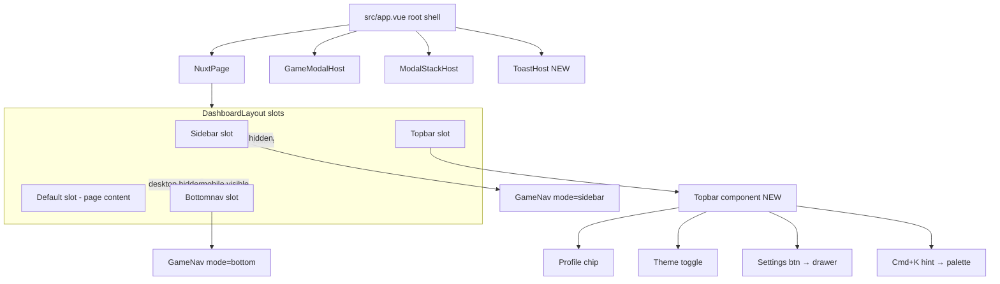

# План v2: Dashboard restyle — Extended scope + Linear эстетика

## Контекст и решения

**Проект:** Game Life — Nuxt 4 (ssr: false) + Vue 3 + Pinia + TypeScript. Пошаговый life sim. Слоистая архитектура `utils → domain → application → infrastructure → stores/composables → components → pages`.

**Ключевые находки research (важно для исполнения):**
1. **Toast host сломан** — `useToast()` вызывается из 12+ мест, но никто не рендерит массив toasts. `vue3-toastify` в deps, но нигде не импортируется. Пользователь не видит toasts.
2. **Нет topbar** — Escape-меню в [app.vue](src/app.vue) спрятано за клавишей Esc. Theme-toggle доступен только оттуда.
3. **Dark mode работает end-to-end** через `@nuxtjs/color-mode` (`dataValue: 'theme'`) + `html[data-theme="dark"]` overrides в [global.scss](src/assets/scss/global.scss).
4. **GameNav** — floating fixed-right rail, 8 пунктов из [navigation.ts](src/constants/navigation.ts).
5. **GameLayout** — ручная обёртка (не Nuxt layout). Dashboard [src/pages/game/index.vue](src/pages/game/index.vue) его не использует.
6. **8 компонентов и 5 страниц** нарушают правило «no inline `<style>` в .vue» — суммарно ~500 строк inline-стилей.
7. **GameButton баг**: `CurrentJobPanel` и `GameModalHost` передают `accent-key=\"danger\"`, но пропа `accentKey` нет — silently ignored.
8. **3 дубликата tabs**: ActionTabs/WorkTabs/SkillList (+ shop/edu). Orphan `WorkTabs.scss`.

**Решения пользователя:**
- Палитра: **полный migrate на slate** (neutral-50→0 → slate шкала) + **emerald accent #10B981** (hover #059669, active #047857)
- Навигация: **left sidebar (desktop ≥1024px) + bottom nav (mobile)** — Linear-like
- Extended scope: **все 6 фич** — command palette, settings drawer, density toggle, topbar, toast host fix, onboarding tour
- Mono-шрифт: **НЕ подключать** (Inter везде)
- Палитра: **full migrate** на slate

## Архитектура shell



## Этапы

### Этап 1 — Design tokens (foundation)

**[src/assets/scss/variables.scss](src/assets/scss/variables.scss)** — full slate migrate:

- `$neutral-*` remap на slate: `50=#F8FAFC, 100=#F1F5F9, 200=#E2E8F0, 300=#CBD5E1, 400=#94A3B8, 500=#64748B, 600=#475569, 700=#334155, 800=#1E293B, 900=#0F172A`
- `$color-brand-primary` → emerald `#10B981`, hover `#059669`, active `#047857`
- Pastel-green soft `#ECFDF5` для emerald-бейджей
- Dark theme tokens: bg-page `#0F172A`, surface `#1E293B`, border `#334155`
- Новые layout tokens: `$sidebar-width: 240px`, `$bottomnav-height: 64px`, `$topbar-height: 56px`
- Density-варианты: `$card-padding-compact: 12px`, `$card-radius-compact: 12px`, `$element-gap-compact: 8px`

### Этап 2 — Global styles

**[src/assets/scss/global.scss](src/assets/scss/global.scss)**:

- Body background → тонкий slate gradient (dark-aware уже есть, обновить halos под emerald)
- Утилиты: `.kpi-grid` (3-4 равные колонки), `.widget`, `.widget__header/title/body`, `.badge--success/warning/danger`, `.dashboard-grid` (12-col desktop → 1-col mobile)
- Расширить `:root`: добавить отсутствующие `--space-0/7/9/10/12/16`, `--radius-xs`, `--color-bg-app`, `--color-bg-surface-2`
- Density: `html[data-density=\"compact\"]` блок переопределяет `--space-card-padding`, `--radius-card`, `--space-element-gap`

### Этап 3 — DashboardLayout shell (новый)

**[src/components/layout/DashboardLayout/DashboardLayout.vue](src/components/layout/DashboardLayout/DashboardLayout.vue)** + `.scss`:

Слоты: `sidebar`, `topbar`, `default`, `bottomnav`. Desktop (≥1024px): sidebar fixed 240px, topbar 56px sticky, bottomnav hidden. Mobile (<1024px): sidebar hidden, topbar compact, bottomnav fixed 64px.

### Этап 4 — Topbar (новый)

**[src/components/layout/Topbar/Topbar.vue](src/components/layout/Topbar/Topbar.vue)** + `.scss`:

- Слева: slot для page title
- Справа: profile chip (avatar initials + name), theme-toggle (перенести логику из [app.vue](src/app.vue)), settings-button (открывает SettingsDrawer), command-palette-trigger с `⌘K` hint
- backdrop-blur(12px), subtle bottom border `1px solid var(--color-border)`
- Compact mode на mobile (скрывает labels, оставляет icons)

### Этап 5 — GameNav dual-mode refactor

**[src/components/global/GameNav/GameNav.vue](src/components/global/GameNav/GameNav.vue)** + `.scss`:

- Prop `mode: 'sidebar' | 'bottom'`
- Sidebar mode: vertical list, иконка 28×28 + label справа, active = emerald left-border 2px + emerald-soft bg
- Bottom mode: horizontal scroll, иконка 32×32 + label 10px снизу, active = emerald dot indicator
- Удалить floating right-rail стили
- Логика `useAgeRestrictions` сохраняется

### Этап 6 — GameLayout делегирует

**[src/components/layout/GameLayout/GameLayout.vue](src/components/layout/GameLayout/GameLayout.vue)**:

Внутри рендерит `<DashboardLayout>` с заполнением слотов: `#sidebar` = `<GameNav mode=\"sidebar\" />`, `#topbar` = `<Topbar :title=\"title\" />`, default = slot. Страницы не трогать.

### Этап 7 — UI primitives restyle (параллельно)

- **[GameButton](src/components/ui/GameButton/)**: emerald primary variant, **починить баг** — добавить `accentKey?: 'primary'|'danger'|'ghost'` в defineProps, использовать для варианта (сейчас silently ignored)
- **[Modal](src/components/ui/Modal/)**: overlay → `rgba(15,23,42,.5)` (slate-950/50), content → slate-0 + shadow-popover, header с subtle bottom border
- **[RoundedPanel](src/components/ui/RoundedPanel/)**: default radius 20px, padding 20px, slot `#header` (backwards-compat), prop `accent` для декоративной emerald-полосы слева 3px
- **[ProgressBar](src/components/ui/ProgressBar/)**: track slate-100, fill emerald, height 8px, optional label
- **[Tooltip](src/components/ui/Tooltip/)**: slate-900 bg на light, slate-700 на dark

### Этап 8 — Toast host fix (КРИТИЧНО)

**[src/components/ui/ToastHost/ToastHost.vue](src/components/ui/ToastHost/ToastHost.vue)** (новый) + монтировать в [app.vue](src/app.vue):

- Teleport to body, fixed bottom-right, z-index `$z-toast`
- `<TransitionGroup name=\"pop\">` (transition уже есть в [transitions.scss](src/assets/scss/transitions.scss))
- Читает `useToast().toasts`, рендерит каждую с цветом по `toast.type`
- Удалить `vue3-toastify` из [package.json](package.json) (мертвая зависимость)
- Обновить или заменить [Toast/index.vue](src/components/ui/Toast/index.vue)

### Этап 9 — Settings store

**[src/stores/settings.store.ts](src/stores/settings.store.ts)** (новый):

```typescript
interface SettingsState {
  theme: 'light' | 'dark'
  density: 'comfortable' | 'compact'
  sidebarCollapsed: boolean
  onboardingCompleted: boolean
}
```

Actions: `setTheme`, `setDensity`, `toggleSidebar`, `completeOnboarding`. Persist через существующий infrastructure adapter (найти паттерн в [src/infrastructure/](src/infrastructure/), использовать тот же механизм что у game store).

### Этап 10 — SettingsDrawer

**[src/components/ui/SettingsDrawer/SettingsDrawer.vue](src/components/ui/SettingsDrawer/SettingsDrawer.vue)** + `.scss` (новый):

Right-side drawer, Teleport to body, `<Transition name=\"slide-left\">`. Секции: Внешний вид (theme toggle), Плотность (density toggle с превью comfortable/compact), Сворачивание sidebar, О программе. Открывается из Topbar settings-button, закрывается Esc/overlay.

### Этап 11 — Density toggle impl

При изменении `settings.density` watcher вешает `data-density=\"compact\"|\"comfortable\"` на `document.documentElement`. CSS-вары в `html[data-density=\"compact\"]` (этап 2) активируются → all components using `var(--space-card-padding)` etc. подстраиваются автоматически.

### Этап 12 — Command palette (Cmd+K)

**[src/composables/useCommandPalette/index.ts](src/composables/useCommandPalette/index.ts)** (новый) + **[src/components/ui/CommandPalette/CommandPalette.vue](src/components/ui/CommandPalette/CommandPalette.vue)** (новый):

- Composable: global `keydown` listener для Cmd+K / Ctrl+K, register/unregister в onMounted/onUnmounted, exposes `{ isOpen, open, close, query, results }`
- Источники: `NAV_ITEMS` (navigation), быстрые действия (toggle theme, open settings, advance time, restart game)
- Fuzzy-поиск по label, стрелки ↑↓ навигация, Enter выполняет, Esc закрывает
- Modal: top-centered, max-width 560px, backdrop blur, z-index `$z-modal`

### Этап 13 — Onboarding tour

**[src/components/ui/OnboardingTour/OnboardingTour.vue](src/components/ui/OnboardingTour/OnboardingTour.vue)** (новый):

Запускается при заходе на `/game` если `!settings.onboardingCompleted`. 4-5 шагов: welcome → sidebar (data-tour=\"sidebar\") → topbar (data-tour=\"topbar\") → profile card (data-tour=\"profile\") → command palette hint. Подсветка целевого элемента через `box-shadow: 0 0 0 9999px rgba(0,0,0,.5)` + tooltip рядом. Skip/Next/Done. По Done — `settings.completeOnboarding()`.

### Этап 14 — Dashboard cards restyle

- **[ProfileCard](src/components/pages/dashboard/ProfileCard/)**: avatar с initials (emerald ring), name+job, KPI grid (3-4 числа: age, money, happiness, energy)
- **[StatsCard](src/components/pages/dashboard/StatsCard/)**: stat-bars в 2 колонки, emerald fill, slate-100 track, hover tooltip
- **[ActivityLogCard](src/components/pages/dashboard/ActivityLogCard/)**: лента с timestamp слева (Inter tabular-nums), иконка события, текст. Footer-link «Все события →».

### Этап 15 — Dashboard page layout

**[src/pages/game/index.vue](src/pages/game/index.vue)** + [index.scss](src/pages/game/index.scss):

- Top-row: 3 KPI карточки равные колонки через `.kpi-grid`
- Ниже: `.dashboard-grid` 2-колоночный (HomePreview + WorkButton CTA)
- Mobile: 1 колонка

### Этап 16 — Extract inline styles (compliance fix)

Перенести inline `<style>` в отдельные `.scss` (правило 20-code-style):

- [src/pages/game/work/index.vue](src/pages/game/work/index.vue) (181 строка → `work.scss`)
- [src/pages/game/education/index.vue](src/pages/game/education/index.vue) (100 → `education.scss`)
- [src/pages/game/shop/index.vue](src/pages/game/shop/index.vue) (100 → `shop.scss`)
- [src/pages/game/finance/index.vue](src/pages/game/finance/index.vue), [events](src/pages/game/events/index.vue), [activity](src/pages/game/activity/index.vue) (по 6 строк)
- 8 компонентов: StatChange, GameModalHost, WorkChoiceModal, WorkResultModal, SkillsModal, EventModal, StudyModal, NewbornWelcomeScreen, StatBar

### Этап 17 — Dedup tabs

Создать **[src/components/ui/Tabs/Tabs.vue](src/components/ui/Tabs/Tabs.vue)** (новый) с slot-based API. Мигрировать: ActionTabs, WorkTabs, SkillList tabs, shop tabs, edu tabs. Удалить orphan `WorkTabs.scss`.

### Этап 18 — Other pages restyle

home, actions, finance, education, skills, events, shop, activity — стилевое выравнивание под slate/emerald. Обновить ActionCard, ActionTabs (→ Tabs), BalancePanel, CareerTrack, ProgramList, SkillList, EventCard. Убрать локальные chip/card/meta-tag definitions.

### Этап 19 — Start page restyle

**[src/pages/index.vue](src/pages/index.vue)** + [index.scss](src/pages/index.scss):

Split-screen: слева slate-950 gradient с logomark «GL» emerald, справа форма на slate-0. Убрать `<style src=...>` тег → `import './index.scss'` в script setup.

### Этап 20 — Escape menu cleanup

**[app.vue](src/app.vue)**: theme-toggle переезжает в Topbar (primary location). Escape-меню остаётся как compact fallback (без дублирования theme-toggle). Монтировать `<ToastHost />` здесь же. Убрать дублирующий theme-toggle scoped styles.

### Этап 21 — Verify

- `npm run lint`
- `nuxt prepare && npm run typecheck`
- ReadLints на отредактированных файлах
- Smoke-test каждой страницы в dev: light + dark, comfortable + compact density
- Проверить: Cmd+K открывается, toasts рендерятся, settings drawer открывается, onboarding запускается один раз

## Риски и mitigation

| Риск | Mitigation |
|---|---|
| Sidebar ломает layout существующих страниц | GameLayout делегирует в DashboardLayout, страницы не трогаем |
| Density toggle может сломать фиксированные heights | Использовать только для padding/radius/gap, не для heights компонентов |
| Cmd+K конфликтует с browser/OS shortcuts | Проверить `e.preventDefault()` только при Cmd/Ctrl+K, не перехватывать другие |
| Onboarding раздражает при повторных заходах | Persist `onboardingCompleted` в settings store, кнопка Skip доступна сразу |
| Toast host race condition с persisted state | Toasts не persist (эphemeral), хост только рендерит текущий массив |
| Dark mode regress после slate migrate | Полная перезапись dark tokens в одном PR, smoke-test всех страниц в обоих темах |

## Порядок исполнения

Фундамент (1-2) → shell (3-6) → primitives (7-8) → settings/density (9-11) → command palette (12) → onboarding (13) → dashboard cards/page (14-15) → compliance (16-17) → other pages (18-19) → cleanup (20) → verify (21).

Этапы 7, 14, 16, 18 можно параллелить — разные файлы, нет зависимостей.
