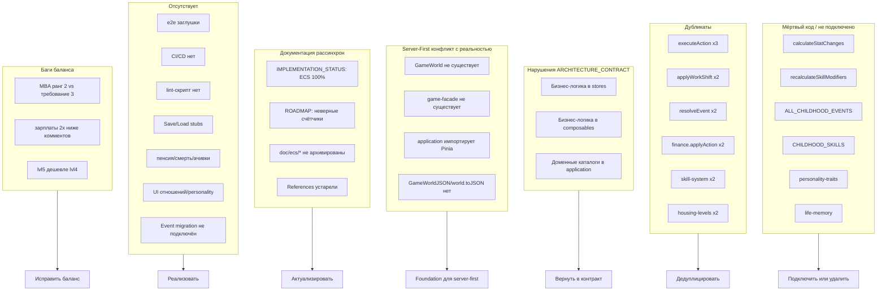
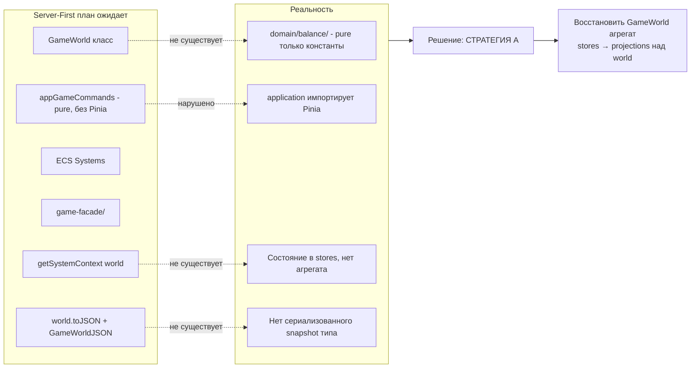

# Game Life — аудит и рекомендации

## Контекст

Аудит проведён 5 параллельными агентами по слоям: domain, stores/composables, UI/pages, infrastructure, game design. Проект — Nuxt 4 life sim, ~52 работы, 255 действий, 61 навык, 140 детских событий. Архитектура `utils → domain → application → stores/composables → components → pages` декларирована, но частично нарушена.

## Карта проблем

## Приоритизированные рекомендации

### P0 — Критичное (без чего игра ломается)

**1. Подключить `event-migration` к load-потоку**
- Файл: [src/infrastructure/persistence/event-migration.ts](src/infrastructure/persistence/event-migration.ts)
- Проблема: миграции написаны, но `load()` в [src/infrastructure/persistence/LocalStorageSaveRepository.ts](src/infrastructure/persistence/LocalStorageSaveRepository.ts) не вызывает их. Старые сохранения v1 грузятся некорректно.
- Действие: обернуть `load()` — после парсинга вызывать `migrateEventPayload()`.

**2. Исправить баг рангов образования**
- [src/domain/balance/utils/education-ranks.ts](src/domain/balance/utils/education-ranks.ts): MBA=2, но работы требуют ранг 3 ([src/constants/career-jobs.ts](src/constants/career-jobs.ts): `med_head`, `edu_professor`, `prod_director`).
- Действие: либо поднять MBA до 3 (5 уровней как в комментарии), либо опустить требования работ до 2. Рекомендация — первый вариант.

**3. Исправить зарплатный дисбаланс**
- [src/constants/career-jobs.ts](src/constants/career-jobs.ts): `salaryPerWeek` в 2× ниже текстовых комментариев (`it_junior` коммент "~50к/мес" при `salaryPerWeek:25000` → реально 100к/мес).
- Действие: либо править комментарии, либо править числа. Рекомендация — править комментарии (быстрее, менее инвазивно).

### P1 — Архитектурные долги (мешают развитию)

**4. Устранить тройной дубликат `executeAction`**
- 3 копии: [src/stores/actions-store/index.ts:51-86](src/stores/actions-store/index.ts), [src/composables/useActions/index.ts:44-72](src/composables/useActions/index.ts), [src/application/game/commands.ts:164-191](src/application/game/commands.ts).
- Действие: оставить одну реализацию в `application/game/commands.ts`, остальные делегируют в неё.

**5. Устранить дубликаты `applyWorkShift` и `resolveEvent`**
- [src/stores/game.store.ts:129-146](src/stores/game.store.ts) vs [src/application/game/commands.ts:40-66](src/application/game/commands.ts) (work).
- [src/composables/useEvents/index.ts:38-59](src/composables/useEvents/index.ts) vs [src/application/game/commands.ts:193-218](src/application/game/commands.ts) (events).
- Действие: бизнес-логику — в `application/`, store/composable только вызывают команды.

**6. Подключить `calculateStatChanges` к stores**
- [src/domain/balance/utils/hourly-rates.ts:115](src/domain/balance/utils/hourly-rates.ts) — мёртвый код, реализует старение/сон/модификаторы навыков.
- Действие: вызвать из `stats-store` или из `applyWorkShift`/`executeAction`. Без этого навыки `physical/stress` и возрастные пенальти не работают.

**7. Подключить `recalculateSkillModifiers`**
- [src/domain/balance/constants/skill-modifiers.ts:35](src/domain/balance/constants/skill-modifiers.ts) — мёртвый код.
- Действие: вызывать после `addSkillXp` в `skills-store`. Применять `salaryMultiplier` в `applyWorkShift`, `workEfficiencyMultiplier` в `WORK_RESULT_TIERS`.

### P1+ — Архитектурный compliance (чётко следовать контракту и правилам)

Контракт [doc/core/ARCHITECTURE_CONTRACT.md](doc/core/ARCHITECTURE_CONTRACT.md) и правило [.cursor/rules/30-architecture.mdc](.cursor/rules/30-architecture.mdc) нарушены в трёх направлениях. Без восстановления дальнейшее развитие будет плодить тот же долг.

**8. Вернуть код в соответствие Application-First контракту**
- [Контракт §1](doc/core/ARCHITECTURE_CONTRACT.md): «Новая use-case логика идёт в `application` first». Реальность: бизнес-логика живет в stores и composables (см. п. 4, 5).
- [Контракт §3](doc/core/ARCHITECTURE_CONTRACT.md): «Stores применяют эффекты, но не решают». Реальность: [src/stores/game.store.ts:129-146](src/stores/game.store.ts) и `applyWorkShift` в stores принимают продуктовые решения.
- [Контракт §4](doc/core/ARCHITECTURE_CONTRACT.md): «Composables — UI orchestration, не сами решения». Реальность: [src/composables/useEvents/index.ts:38-59](src/composables/useEvents/index.ts) инкапсулирует бизнес-логику выбора события.
- Действие: после дедупликации (п. 4-5) провести ревью каждого `src/stores/*.ts` и `src/composables/*/index.ts` на наличие бизнес-логики. Все use-case сценарии переносятся в `src/application/game/commands.ts`/`queries.ts`. Stores только применяют result payload.
- Проверка: при отсутствии — написать тесты `test/unit/architecture/layer-boundaries.test.ts` и `store-boundaries.test.ts` (упоминаются в контракте, но не найдены в `test/`).

**9. Запустить авто-аудит правил и исправить все нарушения**
- [package.json:15](package.json) уже содержит `rules:audit` и `rules:fix` (правила [.cursor/rules/10-typing.mdc](.cursor/rules/10-typing.mdc), [.cursor/rules/20-code-style.mdc](.cursor/rules/20-code-style.mdc)).
- Действие: `npm run rules:audit -- src/`, проанализировать отчёт, выполнить `npm run rules:fix -- src/`, повторить аудит до зелёного.
- Известные системные нарушения typing-правила: inline object-типы в аннотациях переменных (запрещено правилом 10-typing.mdc) — вынести в `*.types.ts`.

**10. Добавить lint-скрипт в `package.json`**
- [package.json:8-26](package.json): в `scripts` **отсутствует `lint`** при наличии `eslint`, `eslint-plugin-vue`, `stylelint`, `stylelint-config-standard-scss` в `devDependencies`. CI и pre-commit не имеют точки входа.
- Действие: добавить `"lint": "eslint --ext .ts,.vue src && stylelint 'src/**/*.{css,scss}'"` и `"lint:fix": "..."` в `scripts`.
- Настроить pre-commit hook (через `simple-git-hooks` или husky analogue) с `lint` + `typecheck`.

### P-Foundation — Предпосылки для Server-First миграции

Целевая архитектура описана в [.cursor/plans/server-first_architecture_migration_05bcd970.plan.md](.cursor/plans/server-first_architecture_migration_05bcd970.plan.md). Сопоставление с кодом выявило **блокирующие расхождения**: план опирается на сущности, которых в коде нет, а `application`-слой нарушает базовое требование чистоты.

**11. Принять архитектурное решение о стратегии state-abstraction — СТРАТЕГИЯ A (выбрано)**

Решение: **восстановить `GameWorld`-агрегат** над stores в рамках долгосрочной миграции на Node.js фреймворк (Этап 8 server-first плана).

Обоснование:
- Server-first MVP здесь не самоцель — финальная цель отдельный Node.js бекенд, где Domain Layer работает без Pinia вообще.
- Стратегия B (StoreFacade/snapshot) дала бы быстый MVP, но закрепила бы store-centric модель и потребовала бы переписывания при переходе на Этап 8.
- Стратегия A — единый source of truth в `domain/`, stores становятся тонкими projections/view-models над `GameWorld`. Это совпадает с исходным видением server-first плана и оригинальной ECS-архитектурой (до ADR-0002).

Конкретика по форме:
- **НЕ обязательно** восстанавливать именно ECS (Components/Systems/Entities). Достаточно `GameWorld` как state-container + command-handler pattern (actions как methods или как command-объекты).
- `GameWorld` живёт в `src/domain/game-world/` (не в `balance/` — там pure-каталоги).
- `game-facade/` восстанавливается как тонкий wrapper над `GameWorld` для application-слоя.
- Stores читают snapshot из `GameWorld.toJSON()` через подписку или явный poll, не хранят состояние как source of truth.
- Зафиксировать через ADR-0005 (см. п. 31 ниже). В ADR явно указать: это НЕ откат ADR-0002 (ECS как такового), а новая реализация агрегата на command-pattern.

**12. Сделать `application` layer чистым (убрать импорт Pinia)**
- [src/application/game/commands.ts:4-13](src/application/game/commands.ts) и [src/application/game/queries.ts:3-12](src/application/game/queries.ts) импортируют `useTimeStore`, `useStatsStore`, и т.д. — **прямое нарушение** [doc/core/ARCHITECTURE_CONTRACT.md §«application не импортирует stores»](doc/core/ARCHITECTURE_CONTRACT.md).
- Действие под стратегию A: signature становится `(world: GameWorld, params): CommandResult`. `GameWorld` прокидывается из store-фасада, application его трансформирует, возвращает result + мутирует world (или возвращает new immutable world — решение в ADR-0005).
- Это **прямая предпосылка** для server-first: в server mode `world` приходит deserialize-нутый из сессии, а не из Pinia.
- Эта работа — продолжение P1-compliance (п. 8).

**13. Восстановить `GameWorld` агрегат в `domain`**
- Создать `src/domain/game-world/`:
  - `GameWorld.ts` — класс-контейнер состояния (time, stats, wallet, skills, career, education, finance, events, activity slices).
  - `world.toJSON(): GameWorldJSON` + `GameWorld.fromJSON(json): GameWorld` — сериализация (заменит концептуальный тип из server-first плана реальным).
  - `game-facade/index.ts` — тонкая обёртка для application: `createWorldFromSave()`, `getGameFacade()`.
- Источник данных для миграции: текущие Pinia stores. На первом этапе `GameWorld.fromStores(...)` собирает world из stores, `world.applyToStores(stores)` пушит обратно — bridge для постепенного перехода.
- Перенос бизнес-логики из stores в domain поэтапно: actions → career → skills → finance → events. Stores остаются projections + UI state.
- Это **крупнейшая задача** плана — закладывать 2-3 недели. Разбить на подзадачи в отдельном плане после ADR-0005.

**14. Зафиксировать интерфейсы `GameExecutor`/`GameQueryExecutor`**
- [server-first план 1.2](.cursor/plans/server-first_architecture_migration_05bcd970.plan.md) описывает интерфейсы с `world?: GameWorld` параметром — под стратегию A эта сигнатура **корректна** (минус optional, world обязан быть).
- Действие: определить интерфейсы в [src/application/game/index.types.ts](src/application/game/index.types.ts) как `executeAction(world: GameWorld, actionId: string): Promise<ExecuteResult>`. Optional `world?` убрать — в server mode executor сам грузит world из сессии по sessionId, в SPA mode world обязателен.
- Уточнить в ADR-0005: SPAExecutor и ServerExecutor имеют одинаковую сигнатуру, разница только в том, кто поставляет `world`.

**15. Реализовать `SPAExecutor` как обёртку над `GameWorld` + чистым application layer**
- [server-first план 2.1](.cursor/plans/server-first_architecture_migration_05bcd970.plan.md) создаёт `SPAExecutor`, который вызывает `getSystemContext(world).action.execute()`. После восстановления `GameWorld` (п. 13) — это становится достижимым, но без ECS: executor вызывает `appGameCommands.executeAction(world, actionId)`.
- Действие: `createSPAExecutor()` возвращает executor, который: принимает `world` из Pinia store → вызывает pure `appGameCommands` (п. 12) → `triggerRef(world)` или явный push в stores через `world.applyToStores()`.
- После этого этапы 4-8 server-first плана (Nitro API, Server Executor, Node.js переезд) остаются в силе почти без изменений — план наконец-то соответствует коду.

### P2 — Дедуплицировать данные

**11. Унифицировать `housing-levels`**
- [src/domain/balance/constants/housing-levels.ts](src/domain/balance/constants/housing-levels.ts) (5 ур., `monthlyHousingCost`) vs [src/stores/housing-store/index.ts:6](src/stores/housing-store/index.ts) (6 ур., `rent`).
- Действие: одна источник правды в `domain/`, store только читает.

**12. Унифицировать `skill-system`**
- [src/domain/balance/utils/skill-system.ts](src/domain/balance/utils/skill-system.ts) (полная XP-формула) vs [src/stores/skills-store/index.ts:12-24](src/stores/skills-store/index.ts) (упрощённая).
- Действие: domain — источник правды, store использует `xpForLevel` из domain.

**13. Удалить мёртвый код**
- 9 thin-wrapper composables (`useTime`, `useStats`, и т.д.) — никто не использует вне своего файла.
- `EventModal` ([src/components/pages/events/EventModal/EventModal.vue](src/components/pages/events/EventModal/EventModal.vue)) — двойник events page.
- `child-actions.ts` — старая схема, заменена на `child-actions-registered.ts`.
- Stab-методы: `getFinanceActions(): never[]`, `canExecuteAction(): {canDo:true}`.
- Действие: удалить после подтверждения через grep.

### P3 — Подключить дисконнектнутые механики

**14. Подключить детские события и навыки к runtime**
- `ALL_CHILDHOOD_EVENTS` ([src/domain/balance/constants/childhood-events.ts](src/domain/balance/constants/childhood-events.ts)) и `CHILDHOOD_SKILLS` ([src/domain/balance/constants/childhood-skills.ts](src/domain/balance/constants/childhood-skills.ts)) — не используются.
- Действие: при `startMode === 'infancy'` ([src/pages/index.vue](src/pages/index.vue)) активировать child-event-queue и child-skill-growth.

**15. UI для отношений/personality/memory**
- 6 механик без UI: отношения, personality traits, life memories, childhood skills, investments, car/mortgage.
- Приоритет: **отношения** (требуются для `requiresRelationship: true` действий) → **investments** (есть в store) → **personality** (есть трейты, негде показать).
- Действие: страница `/game/profile` или модальные окошки.

### P4 — Зрелость инфраструктуры

**16. Настроить CI/CD**
- Отсутствует `.github/workflows/`.
- Действие: pipeline с `nuxt prepare` → `npm run typecheck` → `npx vitest run` → `npm run lint` → `npm run rules:audit`. На PR. Бейдж в README.

**17. Реализовать Save/Load (сейчас заглушки)**
- [src/app.vue:47,53](src/app.vue) — "Скоро появится", `disabled: true`.
- Действие: ручной save-slot manager (3 слота), использует существующий SaveRepository.

**18. Дописать e2e тесты**
- 13 unit-файлов под Vitest есть, e2e — заглушки. Playwright уже в `devDependencies` ([package.json:57](package.json)).
- Действие: Playwright для критических flow: start game → execute action → work shift → event resolve → save/load.

### P5 — Геймдизайн / Endgame

**19. Добавить endgame механики**
- Сейчас: нет пенсии, смерти, наследия, ачивок. `wisdom.lifeExpectancyBonus` даёт +1 год, но не потребляется.
- Действие: по приоритету — **achievements** (мета-цели) → **продвижение по карьере** (trigger при `professionalism ≥ N`) → **пенсия/наследие**.

**20. Расширить пул work/micro events**
- Work random events = 4, micro = 2 — критически мало для долгой сессии.
- Действие: добавить 15-20 work events, привязанных к профессии (мед. ошибки у медиков, аудиты у бухгалтеров).

**21. Привязать события к контексту**
- Adult events generic, не учитывают работу/образование/отношения.
- Действие: фильтр событий по текущему состоянию (job category, education level, relationship status).

**22. Исправить a11y**
- [src/components/ui/Modal/index.vue](src/components/ui/Modal/index.vue): нет `role="dialog"`/`aria-modal="true"`.
- [src/components/global/GameNav/GameNav.vue](src/components/global/GameNav/GameNav.vue): нет `aria-current` для активной ссылки.
- Действие: добавить ARIA-атрибуты.

### P-Docs — Актуализировать документацию и compliance (чётко следовать архитектуре)

Документация рассинхронизирована с кодом на 2-3 итерации. Самый тяжёлый случай — [doc/core/IMPLEMENTATION_STATUS.md](doc/core/IMPLEMENTATION_STATUS.md) описывает **фантомный ECS** (удалённый по ADR-0002) как «100% завершённый», упоминает несуществующие пути (`src/nuxt-pages/`, `src/domain/ecs/`). Это активный источник дезинформации для будущих итераций.

**23. Переписать `IMPLEMENTATION_STATUS.md`**
- Удалить всю секцию про ECS-миграцию и Nuxt-миграцию (это история, не текущее состояние).
- Актуализировать счётчики: действия (255, не 222), composables (19, не 17), страницы (новый Dashboard shell, SettingsDrawer, CommandPalette, OnboardingTour).
- Перенести «как было раньше» в `doc/archive/`.

**24. Обновить `ROADMAP.md`**
- Удалить `src/nuxt-pages/`-упоминания ([doc/core/ROADMAP.md:50,55](doc/core/ROADMAP.md)).
- Поправить счётчики住房 (6 уровней vs 5), composables, actions.
- В短期 plans добавить P0/P1 фиксы из этого аудита.

**25. Актуализировать `ARCHITECTURE_OVERVIEW.md` + STORES/COMPOSABLES/PAGES references**
- [doc/reference/STORES_REFERENCE.md](doc/reference/STORES_REFERENCE.md) — сверить со списком 13 stores (новые `settings-store`, `density-store`).
- [doc/reference/COMPOSABLES_REFERENCE.md](doc/reference/COMPOSABLES_REFERENCE.md) — сверить 19 composables.
- [doc/core/PAGES_REFERENCE.md](doc/core/PAGES_REFERENCE.md) — добавить новые dashboard-компоненты и pages.

**26. Дополнить `README.md`**
- В секцию «Текущие игровые системы» добавить: command palette, settings drawer, onboarding tour, density toggle (после dashboard-restyle-v2).
- В «Реализованные страницы» актуализировать dashboard shell.

**27. Создать ADR-0004 «Violations recovery plan»**
- В [doc/adr/](doc/adr/) после ADR-0003 — зафиксировать известные нарушения контракта (бизнес-логика в stores/composables, дубль-каталоги в domain+stores) и инкрементальный план восстановления.
- Статус: «Принято, в процессе восстановления».

**28. Расширить `ARCHITECTURE_CONTRACT.md`**
- Добавить секцию «Known violations» (точечный список с файлами и ссылками на P1-задачи этого плана).
- Добавить «Recovery plan» со сроками/итерациями.
- Проверить наличие архитектурных тестов `test/unit/architecture/{layer-boundaries,store-boundaries}.test.ts` (упоминаются в контракте, фактически отсутствуют). Если отсутствуют — создать.

**29. Заархивировать legacy ECS-документацию**
- [doc/archive/ecs/](doc/archive/ecs/) уже существует, но в `doc/` всё ещё лежат рассинхронные ECS-файлы (`doc/ecs/` если есть, упоминания в `IMPLEMENTATION_STATUS`).
- Действие: переместить все `doc/**/ecs*.md` и `ECS_*.md` в `doc/archive/ecs/`. Удалить из активных ссылок в README.

**30. Интегрировать server-first план в активные документы**
- [doc/core/ROADMAP.md](doc/core/ROADMAP.md): в «Среднесрочных планах» (стр. 95) нет упоминания server-first/offline-first миграции — добавить ссылку на план и этапы MVP (2-3 недели на foundation).
- [doc/core/ARCHITECTURE_CONTRACT.md](doc/core/ARCHITECTURE_CONTRACT.md): в «Когда правила можно нарушить» нет упоминания executor pattern и плановой миграции — добавить секцию «Target architecture: Server-First» с обоснованием текущих компромиссов.
- Пометить в [doc/README.md](doc/README.md) server-first план как active-plan (не archived).

**31. Создать ADR-0005 «GameWorld агрегат (стратегия A) + Executor pattern»**
- В [doc/adr/](doc/adr/) после ADR-0004 — зафиксировать выбранную **стратегию A**: восстановление `GameWorld`-агрегата в `src/domain/game-world/` как единого source of truth, stores становятся projections.
- Явно указать: это **НЕ откат ADR-0002** (ECS Components/Systems/Entities не возвращается). Новая реализация — на command-handler pattern, без Entity-Component-System инфраструктуры.
- Зафиксировать: `GameWorld` хранит state slices, `appGameCommands` работает с `world` как параметром, `world.toJSON()`/`fromJSON()` обеспечивают сериализацию для server-first.
- Указать этапы server-first плана, остающиеся в силе без изменений (4-8), и этап 2-3, требующие корректировки под конкретную реализацию `GameWorld`.
- Обосновать, почему не стратегия B (StoreFacade): долгосрочный переезд на Node.js (Этап 8 server-first плана) делает snapshot-pattern throwaway-работой.

## Рекомендованный порядок работ

1. **P0** (1-3) — фиксы багов, можно за 1 день
2. **P1** (4-10) — архитектурный рефакторинг + compliance + lint, 3-4 дня
3. **P-Foundation** (11-15) — **восстановление `GameWorld` + чистый application layer**, 2-3 недели. Делается до P-Docs и P2, т.к. определяет целевую архитектуру, под которую переписываются документы. Рекомендация: после п. 11-12 выделить п. 13 в отдельный детальный план-миграцию (поэтапный перенос slices из stores в world).
4. **P-Docs** (23-31) — после P-Foundation, параллельно с P2, 2-3 дня. **Делается до P3+**, чтобы новые фичи не плодились на рассинхронной документации.
5. **P2** (16-18) — дедупликация данных, 1-2 дня
6. **P3** (19-20) — подключение механик, 3-5 дней
7. **P4** (21-23) — инфраструктура, 2-3 дня
8. **P5** (24-27) — геймдизайн, итеративно
9. **Server-First миграция** (после P-Foundation) — продолжение по этапам 4-8 [server-first плана](.cursor/plans/server-first_architecture_migration_05bcd970.plan.md): Nitro API, Server Executor, Offline Queue, Node.js переезд. Теперь соответствует коду.

## Ключевые файлы для ближайших правок

- [src/infrastructure/persistence/LocalStorageSaveRepository.ts](src/infrastructure/persistence/LocalStorageSaveRepository.ts) — миграции
- [src/domain/balance/utils/education-ranks.ts](src/domain/balance/utils/education-ranks.ts) — ранги
- [src/application/game/commands.ts](src/application/game/commands.ts) — единая точка для business-logic; **убрать импорт Pinia** (P-Foundation п. 12)
- [src/application/game/queries.ts](src/application/game/queries.ts) — аналогично
- [src/application/game/index.types.ts](src/application/game/index.types.ts) — сюда добавить `GameExecutor`, `GameQueryExecutor`, `ExecuteResult` (P-Foundation п. 14)
- [src/domain/](src/domain/) — создать новую подпапку `game-world/` с `GameWorld.ts`, `world-json.ts`, `game-facade/` (P-Foundation п. 13)
- [src/domain/balance/utils/hourly-rates.ts](src/domain/balance/utils/hourly-rates.ts) — `calculateStatChanges`
- [src/domain/balance/constants/skill-modifiers.ts](src/domain/balance/constants/skill-modifiers.ts) — `recalculateSkillModifiers`
- [src/domain/balance/utils/skill-system.ts](src/domain/balance/utils/skill-system.ts) — единая XP-формула
- [package.json](package.json) — добавить `lint`-скрипт
- [doc/core/ARCHITECTURE_CONTRACT.md](doc/core/ARCHITECTURE_CONTRACT.md) — расширить Known violations + recovery + Target: Server-First (стратегия A)
- [doc/core/IMPLEMENTATION_STATUS.md](doc/core/IMPLEMENTATION_STATUS.md) — переписать без фантомного ECS
- [doc/core/ROADMAP.md](doc/core/ROADMAP.md) — актуализировать счётчики + добавить server-first + GameWorld восстановление как среднесрочный план
- [doc/adr/](doc/adr/) — ADR-0004 (violations recovery), ADR-0005 (GameWorld стратегия A + Executor pattern)
- [.cursor/plans/server-first_architecture_migration_05bcd970.plan.md](.cursor/plans/server-first_architecture_migration_05bcd970.plan.md) — после ADR-0005 становится достижимым почти без изменений