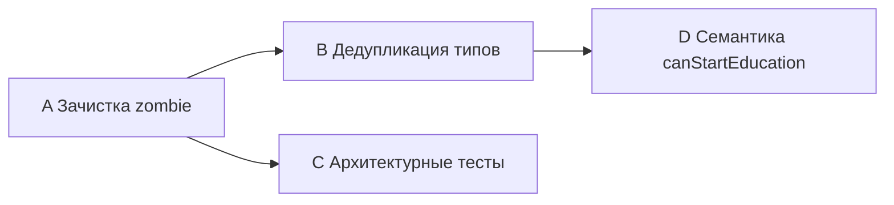

# План доработки после рефакторинга

## Контекст
В ходе миграции на application-first архитектуру остался zombie-код, дублирование типов и мёртвые тесты. Этот план закрывает 4 группы проблем, описанных в `docs/планы по доработке.md`.

---

## Группа A: Зачистка zombie-кода в stores

### A1. Удалить `FinanceSnapshot` из game-store types
- **Файл:** [src/stores/game-store/index.types.ts](src/stores/game-store/index.types.ts) (строка 75-77)
- **Действие:** Удалить `FinanceSnapshot` и `MonthlyExpense` (если он тоже orphan). Проверить, что `game-store/index.types.ts` не импортируется извне — подтвердлено, что никто не импортирует из этого файла.

### A2. Удалить `getStats()` из game-store
- **Файл:** [src/stores/game-store/index.ts](src/stores/game-store/index.ts) (строка 247)
- **Действие:** Удалить метод `getStats` из return-объекта и из тела store. Удалить `StatsShortSnapshot` из импортов/типов, если он больше нигде не нужен. Уже есть `stats` computed (строка 240), который возвращает полную `StatsSnapshot`.

### A3. Удалить `getEducationRequirementLabel` wrapper из game-store
- **Файл:** [src/stores/game-store/index.ts](src/stores/game-store/index.ts) (строки 138-140)
- **Действие:** Удалить функцию-обёртку. Она не включена в return-объект store и не вызывается извне. Application-layer функция `getEducationRequirementLabel` в [src/application/game/career-commands.ts](src/application/game/career-commands.ts) продолжает работать.

### A4. Решить судьбу `actions-store`
- **Файлы:** [src/stores/actions-store/index.ts](src/stores/actions-store/index.ts), [src/stores/game-store/index.ts](src/stores/game-store/index.ts), [src/stores/index.ts](src/stores/index.ts)
- **Действие (рекомендация: удаление):**
  1. Перенести `actions.reset()` вызов из game-store (строка 109) в `resetGame()` — заменить на `lastExecutedAction.value = null; actionResults.value = []` или просто убрать, так как эти значения никто не читает.
  2. Удалить `src/stores/actions-store/index.ts` и `src/stores/actions-store/index.types.ts`.
  3. Убрать реэкспорт из [src/stores/index.ts](src/stores/index.ts).
  4. Убрать `useActionsStore()` вызов из game-store (строка 35).

---

## Группа B: Дедупликация типов

### B1. Унифицировать `CareerTrackEntry`
- **Файлы:** [src/stores/game-store/index.types.ts](src/stores/game-store/index.types.ts), [src/stores/game-store/index.ts](src/stores/game-store/index.ts)
- **Действие:**
  1. Канонический тип — в [src/application/game/index.types.ts](src/application/game/index.types.ts) (строки 132-142), где все поля required.
  2. В game-store: импортировать `CareerTrackEntry` из `@application/game` вместо локального определения.
  3. Удалить `CareerTrackEntry` из [src/stores/game-store/index.types.ts](src/stores/game-store/index.types.ts) (строки 55-65).
  4. Обновить `getCareerTrack()` в game-store (строка 215) — убрать локальную типизацию, тип уже выводится из application функции.

### B2. Аудит оставшихся типов в game-store/index.types.ts
- **Файл:** [src/stores/game-store/index.types.ts](src/stores/game-store/index.types.ts)
- **Действие:** После удаления `FinanceSnapshot` и `CareerTrackEntry` проверить, какие типы остались в файле и действительно ли они нужны. Если файл опустел — удалить его, перенеся оставшиеся типы (если есть) в `index.ts` store или в application.

---

## Группа C: Починка архитектурных тестов

### C1. Починить "stores do not use Pinia internals in other layers"
- **Файл:** [test/unit/architecture/layer-boundaries.test.ts](test/unit/architecture/layer-boundaries.test.ts) (строки 149-164)
- **Проблема:** Пустое тело цикла — violations никогда не заполняется.
- **Действие:** Добавить проверки внутрь цикла: искать `defineStore` в файлах, не являющихся stores. Зафиксировать правило: `defineStore` используется только в `src/stores/`.

### C2. Починить "application exports from index.ts only"
- **Файл:** [test/unit/architecture/layer-boundaries.test.ts](test/unit/architecture/layer-boundaries.test.ts) (строки 128-147)
- **Проблема:** Инвертированная логика — `expect(module).toBeDefined()` всегда true.
- **Действие:** Переписать: при обнаружении импорта не из `validExports` — добавлять в violations-массив, затем `expect(violations).toEqual([])`.

### C3. Добавить тест "pages не вызывают game-store.canExecuteAction / executeAction"
- **Файл:** [test/unit/architecture/layer-boundaries.test.ts](test/unit/architecture/layer-boundaries.test.ts) (новый test case)
- **Действие:** Проверить, что файлы в `src/pages/` и `src/components/` не импортируют `canExecuteAction` или `executeAction` напрямую из game-store (эти методы должны идти через application).

---

## Группа D: Семантика canStartEducationProgram

### D1. Исправить `_programId` в canStartEducationProgramWithReason
- **Файлы:** [src/stores/game-store/index.ts](src/stores/game-store/index.ts) (строки 208-213), [src/application/game/queries.ts](src/application/game/queries.ts) (строки 75-85)
- **Действие (рекомендация: убрать параметр):**
  1. Переименовать функцию в `canStartEducationWithReason()` (без programId).
  2. Обновить сигнатуру в application-layer: `canStartEducationProgram` не принимает programId.
  3. Обновить call-sites в [src/components/pages/education/ProgramList/ProgramList.vue](src/components/pages/education/ProgramList/ProgramList.vue) (строки 247, 307) — не передавать `program.id`.
  4. Если в будущем понадобится program-specific проверка — добавить отдельный query с нужными параметрами.

---

## Порядок выполнения

Группы A и B можно делать последовательно. Группу C можно начать параллельно с A. Группа D независима, но логично идти после A.

**Рекомендуемый порядок:** A1 → A2 → A3 → B1 → B2 → A4 → C1 → C2 → C3 → D1

## Затронутые файлы

| Файл | Группы |
|---|---|
| `src/stores/game-store/index.ts` | A2, A3, A4, B1, D1 |
| `src/stores/game-store/index.types.ts` | A1, B1, B2 |
| `src/stores/actions-store/index.ts` | A4 |
| `src/stores/actions-store/index.types.ts` | A4 |
| `src/stores/index.ts` | A4 |
| `src/components/pages/education/ProgramList/ProgramList.vue` | D1 |
| `test/unit/architecture/layer-boundaries.test.ts` | C1, C2, C3 |
