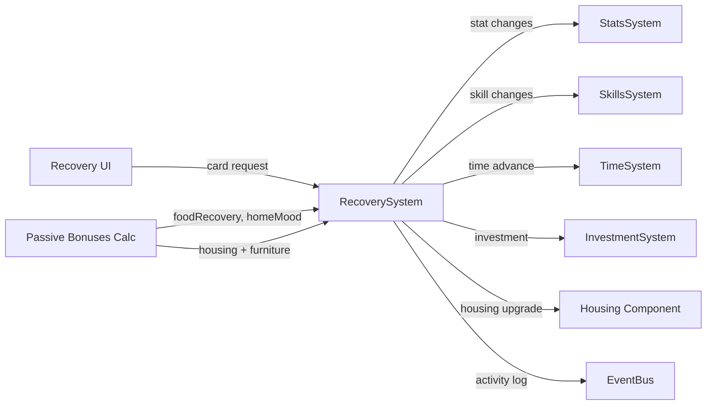

# План: Актуализация RecoverySystem

## Статус: Draft (Wave 2 — P1)

## Цель

Стабилизировать контур восстановления (needs-реализм, прогрессия, качество жизни):
- устранить дублирование с другими системами (StatsSystem, InvestmentSystem, shared helpers);
- обеспечить canonical wiring через SystemContext;
- улучшить explainability и предсказуемость recovery-эффектов.

---

## 1. Текущий срез (as-is)

| Аспект | Состояние |
|--------|-----------|
| Файл | `src/domain/engine/systems/RecoverySystem/index.ts` (274 строки) |
| Типы | `src/domain/engine/systems/RecoverySystem/index.types.ts` — пусто |
| Константы | `src/domain/engine/systems/RecoverySystem/index.constants.ts` — пусто |
| Wiring | В `system-context.ts` как `recovery` |
| SkillsSystem | Создаёт `new SkillsSystem()` в `init()` |
| TimeSystem | Разрешает через `_resolveTimeSystem(world)` (аналогично FinanceActionSystem) |
| Housing | Использует `HOUSING_LEVELS` из balance |

### API

```
RecoverySystem
├── init(world: GameWorld): void
├── recover(playerId, tab, cardId): string              // high-level: найти карточку, применить
├── applyRecoveryAction(cardData): string                // основная логика
├── _getPassiveBonuses(): { foodRecoveryMultiplier, workEnergyMultiplier, homeMoodBonus }
├── _hasFurniture(furniture, furnitureId): boolean
├── _upgradeHousing(targetLevel): void
├── _addFurniture(furnitureId): void
├── _applyRelationshipDelta(delta): void
├── _openInvestment(cardData): void                      // ДУБЛИРУЕТ InvestmentSystem
├── _buildRecoverySummary(cardData, statChanges, hourCost): string
├── _summarizeStatChanges(statChanges): string           // ДУБЛИРУЕТ StatsSystem
├── _applyStatChanges(stats, statChanges): void          // ДУБЛИРУЕТ StatsSystem
├── _applySkillChanges(skillChanges, reason): void       // делегирует в SkillsSystem
├── _clamp(value, min, max): number                      // ДУБЛИРУЕТ StatsSystem
├── _formatMoney(value): string                          // ДУБЛИРУЕТ
├── _resolveHourCost(cardData): number
├── _resolveSalaryPerHour(career): number                // ДУБЛИРУЕТ
└── _resolveActionType(cardData): string
```

### Потребители

| Компонент | Файл | Как использует |
|-----------|------|---------------|
| Recovery UI | `src/components/pages/` | Через store → `ctx.recovery.applyRecoveryAction()` |
| Home Preview | `src/components/pages/dashboard/HomePreview/` | Recovery cards |
| Activity Log | Через eventBus | `activity:action` events |

---

## 2. Проблемы

### P0 — Блокеры

| # | Проблема | Влияние |
|---|----------|---------|
| R-1 | **`_openInvestment()` дублирует InvestmentSystem** — RecoverySystem создаёт investment вручную вместо делегирования | Рассинхрон при изменении investment-формата |
| R-2 | **`_applyStatChanges()` + `_clamp()` дублируют StatsSystem** | Расхождение логики clamp (в RecoverySystem fallback `?? 1` вместо `?? 0`) |
| R-3 | **`new SkillsSystem()` в init()** вместо canonical через SystemContext | Два экземпляра SkillsSystem |

### P1 — Качество

| # | Проблема | Влияние |
|---|----------|---------|
| R-4 | **`_resolveSalaryPerHour()` дублирует** shared helpers (Wave 1) | Нужно синхронизировать с career-helpers |
| R-5 | **`_formatMoney()` дублирует** shared helpers | — |
| R-6 | **`_summarizeStatChanges()` дублирует** StatsSystem | — |
| R-7 | **Типы и константы пусты** — `RecoveryCard` импортируется из `@/domain/balance/types`, но локальные типы не определены | Плохая документируемость |
| R-8 | **Нет telemetry** на recovery actions | Невозможно отслеживать использование |
| R-9 | **`_resolveActionType()`** — определение типа по title (string includes) — хрупко | Ложные срабатывания при изменении названий |
| R-10 | **Passive bonuses не документированы** — формулы с magic numbers | Сложно настраивать баланс |

### P2 — Расширения

| # | Проблема | Влияние |
|---|----------|---------|
| R-11 | **Нет needs-based модификаторов** — hunger/energy/stress не влияют на эффективность recovery | Нереалистично |
| R-12 | **Нет diminishing returns** — спам recovery одинаково эффективен | Неестественная прогрессия |
| R-13 | **Нет time-of-day контекста** — отдых ночью не отличается от дневного | Упущенная механика |

---

## 3. Целевая архитектура

### Contracts + Boundaries



### Разделение ответственности

| Ответственность | Владелец | Примечание |
|----------------|----------|------------|
| Recovery card execution | **RecoverySystem** | Основной flow |
| Stat mutations | **StatsSystem** (canonical) | Делегирование |
| Skill mutations | **SkillsSystem** (canonical) | Делегирование |
| Investment creation | **InvestmentSystem** (canonical) | Делегирование |
| Time advance | **TimeSystem** (canonical) | Делегирование |
| Salary calculation | **Shared career helpers** | Из Wave 1 |
| Money formatting | **Shared format helpers** | Из Wave 1 |
| Passive bonuses | **RecoverySystem** (собственная логика) | На основе housing + furniture |

### Контракт RecoverySystem v2

```typescript
interface RecoverySystemV2 {
  init(world: GameWorld): void
  recover(playerId: string, tab: { cards?: RecoveryCard[] }, cardId?: string): string
  applyRecoveryAction(cardData: RecoveryCard): string
  getPassiveBonuses(): PassiveBonuses  // public для UI/diagnostics
}
```

---

## 4. Синхронизация с другими системами

| Система | Что синхронизировать | Контракт |
|---------|---------------------|----------|
| `StatsSystem` (Wave 1) | `_applyStatChanges` → `ctx.stats.applyStatChanges()` | Делегирование |
| `SkillsSystem` | `new SkillsSystem()` → canonical через SystemContext | Canonical wiring |
| `TimeSystem` | `_resolveTimeSystem()` → canonical через SystemContext | Canonical wiring |
| `InvestmentSystem` | `_openInvestment()` → `ctx.investment.openInvestment()` | Делегирование |
| `Shared career helpers` (Wave 1) | `_resolveSalaryPerHour()` → `resolveSalaryPerHour()` | Shared utils |
| `Shared format helpers` (Wave 1) | `_formatMoney()` → `formatMoney()` | Shared utils |
| `PersistenceSystem` | Housing, furniture, relationships в save/load | Persistence mappers |
| `ActivityLogSystem` | Recovery events через eventBus | Event pipeline |

---

## 5. Execution plan

### Предусловие: Wave 1 завершена

> RecoverySystem зависит от Wave 1 (StatsSystem canonical, shared career helpers, shared format helpers).

### Этап 1: Canonical wiring (~1 ч)

| Шаг | Описание | Файлы |
|-----|----------|-------|
| 1.1 | Заменить `new SkillsSystem()` на canonical через SystemContext | `RecoverySystem/index.ts:31-32` |
| 1.2 | Заменить `_resolveTimeSystem()` на canonical через SystemContext | `RecoverySystem/index.ts:33,36-42` |
| 1.3 | Удалить `_applyStatChanges()` / `_clamp()` — делегировать в StatsSystem | `RecoverySystem/index.ts:231-244` |
| 1.4 | Удалить `_summarizeStatChanges()` — делегировать в StatsSystem | `RecoverySystem/index.ts:227-229` |
| 1.5 | Заменить `_resolveSalaryPerHour()` на shared helper из Wave 1 | `RecoverySystem/index.ts:258-263` |
| 1.6 | Заменить `_formatMoney()` на shared helper из Wave 1 | `RecoverySystem/index.ts:246-248` |

### Этап 2: Устранение дубля investment-логики (~30 мин)

| Шаг | Описание | Файлы |
|-----|----------|-------|
| 2.1 | `_openInvestment()` → делегировать в `InvestmentSystem.openInvestment()` | `RecoverySystem/index.ts:193-215` |
| 2.2 | Получить InvestmentSystem через SystemContext | `RecoverySystem/index.ts` |

### Этап 3: Типы и константы (~30 мин)

| Шаг | Описание | Файлы |
|-----|----------|-------|
| 3.1 | Определить `PassiveBonuses` интерфейс в `index.types.ts` | `RecoverySystem/index.types.ts` |
| 3.2 | Добавить константы: `BASE_SKIP_CHANCE`, `FOOD_RECOVERY_BASE`, `HOME_MOOD_BASE` | `RecoverySystem/index.constants.ts` |
| 3.3 | Заменить magic numbers в `_getPassiveBonuses()` на константы | `RecoverySystem/index.ts:141-152` |

### Этап 4: Telemetry (~30 мин)

| Шаг | Описание | Файлы |
|-----|----------|-------|
| 4.1 | Добавить telemetry: `recovery_action:{type}`, `recovery_passive_bonus` | `RecoverySystem/index.ts` |
| 4.2 | Добавить telemetry: `recovery_housing_upgrade`, `recovery_furniture_add` | `RecoverySystem/index.ts` |

### Этап 5: Тесты (~1.5 ч)

| Шаг | Описание | Файлы |
|-----|----------|-------|
| 5.1 | Unit: `applyRecoveryAction` — stat changes, money, time advance | `test/unit/domain/engine/recovery.test.ts` |
| 5.2 | Unit: `_getPassiveBonuses` — housing level, furniture effects | там же |
| 5.3 | Unit: `_upgradeHousing` — level, comfort, monthly cost | там же |
| 5.4 | Unit: investment delegation — вызывает InvestmentSystem, не создаёт сам | там же |
| 5.5 | Unit: `_resolveActionType` — все типы | там же |
| 5.6 | Regression: все существующие тесты зелёные | — |

---

## 6. Telemetry + Tests

### Telemetry-счётчики

| Счётчик | Когда инкрементируется |
|---------|------------------------|
| `recovery_action:{type}` | При каждом recovery action (sleep, buy_groceries, sport, recovery_action) |
| `recovery_passive_bonus` | При расчёте passive bonuses (значения) |
| `recovery_housing_upgrade` | При апгрейде жилья |
| `recovery_furniture_add` | При добавлении мебели |
| `recovery_investment_open` | При делегировании в InvestmentSystem |

### Тесты

| Тип | Количество | Что покрывает |
|-----|-----------|---------------|
| Unit | ≥5 | applyRecovery, passive bonuses, housing, investment delegation, action type |
| Regression | все существующие | Нет регрессий |

---

## 7. Definition of Done

- [ ] **Нет `new SkillsSystem()`** — canonical через SystemContext.
- [ ] **Нет `_resolveTimeSystem()`** — canonical через SystemContext.
- [ ] **Нет `_applyStatChanges` / `_clamp`** — делегирование в StatsSystem.
- [ ] **Нет `_openInvestment()`** — делегирование в InvestmentSystem.
- [ ] **Нет `_resolveSalaryPerHour` / `_formatMoney`** — shared helpers.
- [ ] **Типы и константы** определены (не пустые файлы).
- [ ] **Magic numbers** заменены на константы.
- [ ] **Telemetry** покрывает recovery actions.
- [ ] **Все существующие тесты зелёные** + ≥5 новых unit-тестов.
- [ ] **`SYSTEM_REGISTRY.md`** обновлён.

---

## Связанные документы

- [Дорожная карта](plans/systems-planning-roadmap.md)
- [Master sync plan](plans/system-sync-plan.md)
- [Stats system refresh](plans/stats-system-refresh-plan.md) (Wave 1)
- [Finance economy refresh](plans/finance-economy-system-refresh-plan.md) (Wave 1 — InvestmentSystem)
- [Work career refresh](plans/work-career-system-refresh-plan.md) (Wave 1 — shared helpers)
- [System Registry](src/domain/engine/systems/SYSTEM_REGISTRY.md)
