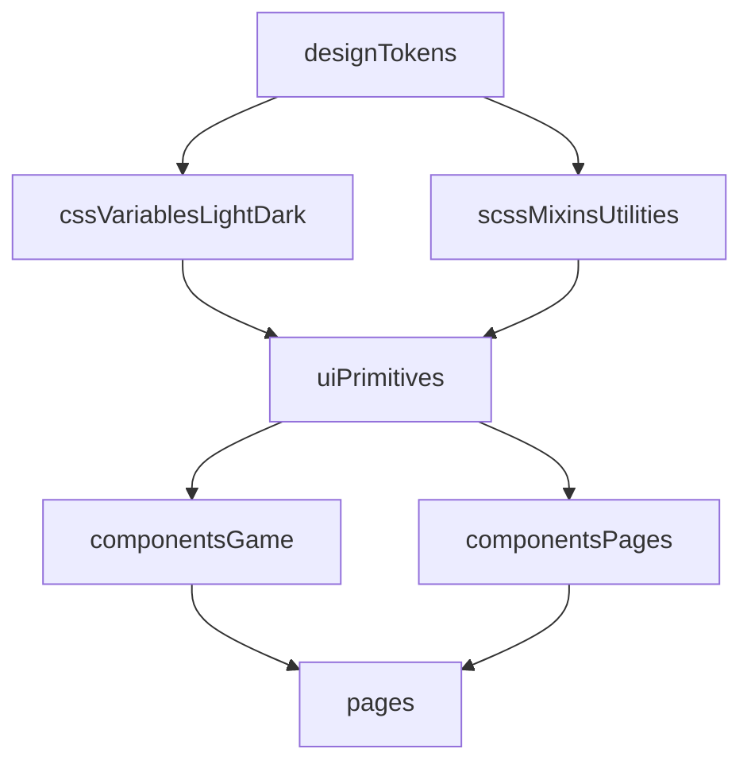

# План глобальной переработки UI (Design System + Big Bang)

## Цель
Перевести весь проект на единый UI-слой с предсказуемыми API и единой точкой изменений: токены, общие примитивы и полная миграция page/game-компонентов.

## Текущее состояние (ключевые проблемы)
- В `ui` есть только часть примитивов (`Modal`, `GameButton`, `RoundedPanel`, `Tooltip`, `ProgressBar`, `Toast`), но нет системных `Input`, `Select`, `Tabs`, `Badge`.
- Однотипные паттерны размножены в feature-компонентах:
  - табы дублируются в [`E:/project/games/game_life/src/components/game/WorkTabs/WorkTabs.vue`](E:/project/games/game_life/src/components/game/WorkTabs/WorkTabs.vue), [`E:/project/games/game_life/src/components/game/ActionTabs/ActionTabs.vue`](E:/project/games/game_life/src/components/game/ActionTabs/ActionTabs.vue), [`E:/project/games/game_life/src/components/pages/skills/SkillList/SkillList.vue`](E:/project/games/game_life/src/components/pages/skills/SkillList/SkillList.vue)
  - select-дропдауны дублируются в [`E:/project/games/game_life/src/components/game/IndustryFilter/IndustryFilter.vue`](E:/project/games/game_life/src/components/game/IndustryFilter/IndustryFilter.vue) и [`E:/project/games/game_life/src/components/pages/career/CareerTrack/CareerTrack.vue`](E:/project/games/game_life/src/components/pages/career/CareerTrack/CareerTrack.vue)
  - много локальных кнопок вне `ui` (например [`E:/project/games/game_life/src/components/pages/dashboard/WorkButton/WorkButton.vue`](E:/project/games/game_life/src/components/pages/dashboard/WorkButton/WorkButton.vue), [`E:/project/games/game_life/src/components/pages/education/StudyModal/StudyModal.vue`](E:/project/games/game_life/src/components/pages/education/StudyModal/StudyModal.vue))
- Токены частично централизованы, но есть рассинхрон между `$scss`-переменными, `var(--css)` и хардкодами в компонентных стилях:
  - [`E:/project/games/game_life/src/assets/scss/variables.scss`](E:/project/games/game_life/src/assets/scss/variables.scss)
  - [`E:/project/games/game_life/src/assets/scss/global.scss`](E:/project/games/game_life/src/assets/scss/global.scss)
  - [`E:/project/games/game_life/src/assets/scss/mixins.scss`](E:/project/games/game_life/src/assets/scss/mixins.scss)

## Целевая архитектура UI

- `ui` становится единственным слоем примитивов и паттернов отображения.
- `game/pages` используют только готовые UI-блоки и не создают новые «почти такие же» базовые элементы.
- Тема и визуальные решения управляются только через токены и их алиасы.

## План работ (big bang)

### 1) Заморозка UI API и инвентаризация
- Зафиксировать список целевых примитивов и их API-контракты в `ui`:
  - `UiButton`, `UiInput`, `UiSelect`, `UiTabs`, `UiBadge`, `UiCard` (на базе `RoundedPanel`), `UiModal` (вместо разрозненных путей), `UiToast`, `UiTooltip`.
- Выделить deprecated-компоненты/паттерны для удаления после миграции.

### 2) Нормализация токенов и тем
- Привести к одному каналу управления стилем:
  - tokens source в [`E:/project/games/game_life/src/assets/scss/variables.scss`](E:/project/games/game_life/src/assets/scss/variables.scss)
  - runtime aliases в [`E:/project/games/game_life/src/assets/scss/global.scss`](E:/project/games/game_life/src/assets/scss/global.scss)
- Убрать критичные хардкоды (цвета, тени, z-index) из компонентных SCSS в токены.
- Выровнять шкалу слоёв (`modal/toast/tooltip/welcome`) и задокументировать единый z-index ladder.

### 3) Создание полного UI-kit в `src/components/ui`
- Ввести недостающие примитивы и унифицированные props/events.
- Обновить существующие `GameButton`, `Modal`, `RoundedPanel` до системного API (или переименовать/обернуть в новые `Ui*` компоненты).
- Добавить единые варианты (`variant`, `size`, `tone`, `state`) и слоты для расширяемости.

### 4) Полная миграция всех потребителей за одну волну
- Заменить все локальные кнопки/селекты/табы/бейджи в `components/game` и `components/pages` на UI-kit.
- Удалить старые локальные стилевые блоки, ставшие лишними после переезда на примитивы.
- Убрать дублирующие компоненты (например, отдельные реализации фильтров и табов), оставив единые адаптеры только при реальной доменной специфике.

### 5) Cleanup + строгая стабилизация
- Удалить deprecated API и неиспользуемые компоненты/константы/SCSS.
- Провести проход по доступности и клавиатурной навигации на ключевых примитивах (modal/select/tabs/buttons).
- Проверить визуальную консистентность в light/dark на всех основных экранах.

## Приоритетные файлы/зоны изменений
- Токены и тема:
  - [`E:/project/games/game_life/src/assets/scss/variables.scss`](E:/project/games/game_life/src/assets/scss/variables.scss)
  - [`E:/project/games/game_life/src/assets/scss/global.scss`](E:/project/games/game_life/src/assets/scss/global.scss)
  - [`E:/project/games/game_life/src/assets/scss/mixins.scss`](E:/project/games/game_life/src/assets/scss/mixins.scss)
- Библиотека UI:
  - [`E:/project/games/game_life/src/components/ui`](E:/project/games/game_life/src/components/ui)
- Массовая миграция потребителей:
  - [`E:/project/games/game_life/src/components/game`](E:/project/games/game_life/src/components/game)
  - [`E:/project/games/game_life/src/components/pages`](E:/project/games/game_life/src/components/pages)
  - [`E:/project/games/game_life/src/app.vue`](E:/project/games/game_life/src/app.vue)

## Риски big bang и защита
- Массовые визуальные регрессии: нужна обязательная smoke-проверка всех ключевых маршрутов.
- Риск расхождения темы: отдельная проверка light/dark после каждого большого блока замен.
- Риск поведения overlay/stacking: заранее выровнять z-index policy до начала массовой миграции.
- Риск «недо-удаления» дублей: финальный cleanup должен удалять legacy-компоненты в той же ветке.

## Критерии завершения
- Все базовые UI-элементы используются только из `src/components/ui`.
- В `game/pages` нет новых самодельных реализаций кнопок/select/tabs/badge.
- Тема light/dark управляется токенами, без критичных визуальных расхождений.
- API примитивов стандартизирован и документирован, а legacy UI-пути удалены.