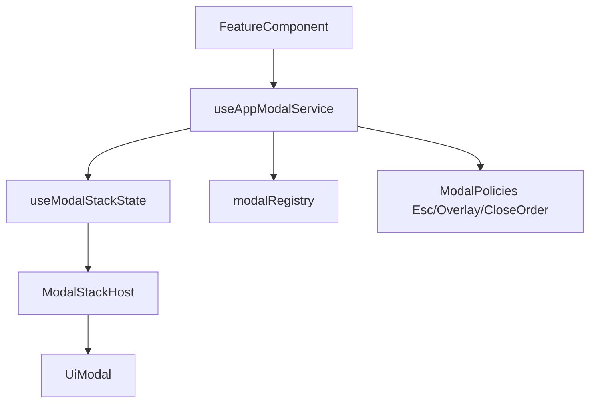

# План унификации Modal (service-first)

## Цель
Сделать один источник правды для модалок: единый сервисный API, единая политика поведения (Esc/overlay/stack), и полная миграция текущих кейсов на этот API.

## Что сейчас ломает единообразие
- Есть два параллельных канала:
  - `useModalStack` для стековых модалок: [`E:/project/games/game_life/src/composables/useModalStack/index.ts`](E:/project/games/game_life/src/composables/useModalStack/index.ts)
  - `useGameModal` + `GameModalHost` для legacy-сценариев: [`E:/project/games/game_life/src/composables/useGameModal/index.ts`](E:/project/games/game_life/src/composables/useGameModal/index.ts), [`E:/project/games/game_life/src/components/ui/GameModalHost/GameModalHost.vue`](E:/project/games/game_life/src/components/ui/GameModalHost/GameModalHost.vue)
- Базовый `Modal` и глобальный `Escape` в `app.vue` имеют независимые обработчики, что ухудшает предсказуемость закрытия: [`E:/project/games/game_life/src/components/ui/Modal/index.vue`](E:/project/games/game_life/src/components/ui/Modal/index.vue), [`E:/project/games/game_life/src/app.vue`](E:/project/games/game_life/src/app.vue)
- `ModalStackHost` использует слишком широкие типы (`Record<string, any>`), из-за чего API неочевиден и менее безопасен: [`E:/project/games/game_life/src/components/ui/ModalStackHost/ModalStackHost.vue`](E:/project/games/game_life/src/components/ui/ModalStackHost/ModalStackHost.vue)

## Целевая архитектура

- Один публичный API в composable-фасаде (например, `useAppModal`):
  - `open(component, options)`
  - `close(id)`
  - `closeTop()`
  - `closeAll()`
  - опционально: `confirm(...)` / `alert(...)` как thin wrappers
- Один хост стека в `app.vue`; `GameModalHost` и legacy state удаляются после миграции.
- Единые правила закрытия:
  - `Esc` закрывает только верхнюю модалку
  - `overlay` закрывает только верхнюю модалку (если разрешено)
  - порядок `onClose -> removeFromStack` фиксируется в одном месте
- Типобезопасные modal-entry и props-контракт без `any`.

## Этапы реализации
1. Подготовить новый фасад сервиса модалок
- Добавить `src/composables/useAppModal/index.ts` и `index.types.ts` как единую точку входа.
- Внутри использовать текущий `useModalStack`, но нормализовать опции открытия и callback lifecycle.

2. Укрепить базовый стек и host
- Обновить типы в [`E:/project/games/game_life/src/composables/useModalStack/index.types.ts`](E:/project/games/game_life/src/composables/useModalStack/index.types.ts) и [`E:/project/games/game_life/src/components/ui/ModalStackHost/ModalStackHost.vue`](E:/project/games/game_life/src/components/ui/ModalStackHost/ModalStackHost.vue): убрать `any`, закрепить интерфейс `onClose`.
- Добавить `closeTop()` в стек для предсказуемой обработки `Esc`.

3. Централизовать политику Escape/close
- Убрать конкурирующие обработчики `Escape` из `app.vue`/`Modal` в пользу одной политики:
  - `app.vue` сначала делегирует в modal-service (`closeTop`),
  - меню закрывается только если стек пуст.
- При необходимости добавить флаг приоритета для системных/немодальных оверлеев.

4. Мигрировать legacy `useGameModal` на stack-service
- Переписать `showGameResultModal` так, чтобы он открывал dedicated component через stack-service, а не через отдельный `game-modal-state`.
- Удалить `GameModalHost` из `app.vue` после полной миграции вызовов.

5. Полная миграция вызовов и cleanup
- Перевести все места вызова (`WorkButton`, `ProfileCard`, `useActions`, finance/education flows) на единый API.
- Удалить легаси-ветки API и устаревшие типы/константы.

## Файлы, которые будут ключевыми в изменении
- [`E:/project/games/game_life/src/composables/useModalStack/index.ts`](E:/project/games/game_life/src/composables/useModalStack/index.ts)
- [`E:/project/games/game_life/src/composables/useModalStack/index.types.ts`](E:/project/games/game_life/src/composables/useModalStack/index.types.ts)
- [`E:/project/games/game_life/src/composables/useGameModal/index.ts`](E:/project/games/game_life/src/composables/useGameModal/index.ts)
- [`E:/project/games/game_life/src/components/ui/ModalStackHost/ModalStackHost.vue`](E:/project/games/game_life/src/components/ui/ModalStackHost/ModalStackHost.vue)
- [`E:/project/games/game_life/src/components/ui/Modal/index.vue`](E:/project/games/game_life/src/components/ui/Modal/index.vue)
- [`E:/project/games/game_life/src/app.vue`](E:/project/games/game_life/src/app.vue)

## Критерии готовности
- Во всем приложении используется один сервисный API модалок.
- `Esc`/overlay/stack ведут себя одинаково во всех сценариях.
- `GameModalHost` и legacy modal-state удалены.
- Нет `any`/неявных проп-контрактов в modal stack chain.
- Регрессии покрыты smoke-проверкой основных пользовательских сценариев (работа, навыки, результаты действий, меню).