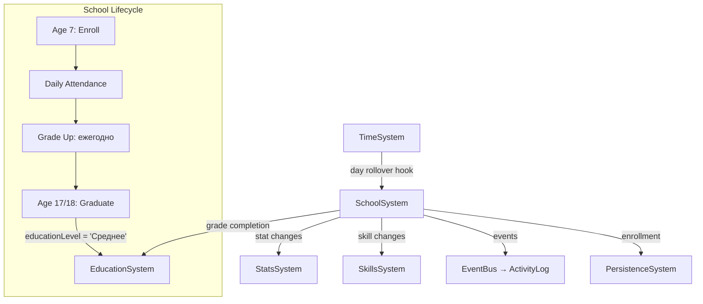

# План: Актуализация SchoolSystem

## Статус: Draft (Wave 2 — P1)

## Цель

Превратить SchoolSystem из экспериментального стаба в полноценную систему, критичную для early-age прогрессии:
- обеспечить canonical wiring через SystemContext;
- связать с EducationSystem, SkillsSystem, TimeSystem;
- добавить прогрессию, оценки и влияние на навыки.

---

## 1. Текущий срез (as-is)

| Аспект | Состояние |
|--------|-----------|
| Файл | `src/domain/engine/systems/SchoolSystem/index.ts` (119 строк) |
| Типы | Inline — `SchoolComponent` интерфейс в том же файле |
| Константы | Нет отдельных констант |
| Wiring | **Partial** — не в `system-context.ts` |
| TimeSystem | Разрешает через `this.world.systems.find(s => s instanceof TimeSystem)` — duck-typing |
| Компонент | `SCHOOL_COMPONENT` — `{ enrolled, grade, attendance, grades, skippedDays, lastAttendedDay, enrolledAt }` |

### API

```
SchoolSystem
├── init(world: GameWorld): void
├── update(world: GameWorld, deltaHours: number): void  // вызывается извне?
├── enrollInSchool(school, currentDay): void             // зачисление (private)
├── _processSchoolDay(school, currentDay): void          // обработка учебного дня
├── _calculateSkipChance(): number                       // шанс прогула (5%)
├── _processSchoolClasses(): void                        // эффекты школы
└── _ensureSchoolComponent(): void                       // создать компонент
```

### Что система делает сейчас

1. При достижении 7 лет — автоматическое зачисление в школу (grade 1).
2. Каждый учебный день (пн-пт) — проверка на прогул (5% шанс).
3. При посещении — `timeSystem.reserveHours(6)` и emit `school:day_completed`.
4. Emit событий: `school:enrolled`, `school:skipped`, `school:day_completed`.

### Что система НЕ делает

- Не даёт навыки/статы за посещение.
- Не повышает grade (класс) со временем.
- Не хранит оценки по предметам (поле `grades` есть, но не заполняется).
- Не влияет на EducationSystem.
- Не связана с ActivityLogSystem.
- Не подключена к SystemContext.

---

## 2. Проблемы

### P0 — Блокеры

| # | Проблема | Влияние |
|---|----------|---------|
| SC-1 | **Не в system-context.ts** — нельзя получить через canonical context | Система невидима для других систем |
| SC-2 | **Duck-typing для TimeSystem** — `world.systems.find(s => s instanceof TimeSystem)` | Хрупко, может не найти систему |
| SC-3 | **Нет интеграции с EducationSystem** — школа не влияет на `educationLevel` | Разрыв между school и education |
| SC-4 | **Нет прогрессии grade** — класс никогда не повышается | Школа бесконечна в 1-м классе |

### P1 — Качество

| # | Проблема | Влияние |
|---|----------|---------|
| SC-5 | **Нет skill/stat эффектов** — посещение школы не даёт знаний | Школа бесполезна для персонажа |
| SC-6 | **`grades` не заполняется** — поле существует, но всегда `{}` | Мёртвый код |
| SC-7 | **Типы inline** — `SchoolComponent` в файле системы | Плохая переиспользуемость |
| SC-8 | **Нет констант** — magic numbers (7 лет, 6 часов, 5% skip chance) | Сложно настраивать баланс |
| SC-9 | **Нет telemetry** | Невозможно отслеживать |
| SC-10 | **`update()` вызывается извне** — нет автоматического подключения к TimeSystem lifecycle | Зависит от внешнего вызова |
| SC-11 | **Нет ActivityLog интеграции** — школьные события не логируются | Игрок не видит историю |

### P2 — Расширения

| # | Проблема | Влияние |
|---|----------|---------|
| SC-12 | **Нет влияния черт характера** на skip chance (заглушка) | Нереалистично |
| SC-13 | **Нет экзаменов/контрольных** | Скучный gameplay |
| SC-14 | **Нет внеклассных занятий** | Ограниченная прогрессия |
| SC-15 | **Нет выпуска и перехода в вуз** | Разрыв с EducationSystem |

---

## 3. Целевая архитектура

### Contracts + Boundaries



### Разделение ответственности

| Ответственность | Владелец |
|----------------|----------|
| School lifecycle (enroll, attend, grade up, graduate) | **SchoolSystem** |
| Stat/skill effects от школы | **SchoolSystem** (формирует delta, делегирует в Stats/Skills) |
| Grade progression | **SchoolSystem** (на основе возраста или времени) |
| Transition to EducationSystem | **SchoolSystem** → устанавливает `education.educationLevel = 'Среднее'` |
| Time reservation | **TimeSystem** через canonical `reserveHours()` |
| Activity logging | **ActivityLogSystem** через eventBus |

### Контракт SchoolSystem v2

```typescript
interface SchoolSystemV2 {
  init(world: GameWorld): void
  
  // Lifecycle
  checkSchoolAge(): void                    // вызывается при time advance
  processSchoolDay(): void                  // обработка учебного дня
  
  // Queries
  getSchoolStatus(): SchoolStatus | null
  isEnrolled(): boolean
  getCurrentGrade(): number
  getAttendanceRate(): number
  
  // Events
  // emit: school:enrolled, school:day_completed, school:skipped,
  //       school:grade_up, school:graduated
}

interface SchoolStatus {
  enrolled: boolean
  grade: number
  attendance: number
  totalDays: number
  skippedDays: number
  attendanceRate: number
  grades: Record<number, number>
}
```

### Константы

```typescript
const SCHOOL_START_AGE = 7
const SCHOOL_END_AGE = 17
const SCHOOL_HOURS_PER_DAY = 6
const BASE_SKIP_CHANCE = 0.05
const GRADE_DURATION_YEARS = 1
const MAX_GRADE = 11
const SCHOOL_STAT_CHANGES_PER_DAY = {
  energy: -8,
  stress: 3,
  mood: -2,
}
const SCHOOL_SKILL_CHANGES_PER_DAY = {
  professionalism: 0.1,
}
```

---

## 4. Синхронизация с другими системами

| Система | Что синхронизировать | Контракт |
|---------|---------------------|----------|
| `system-context.ts` | Добавить `school: SchoolSystem` | Canonical access |
| `TimeSystem` | Day/year rollover hook → `ctx.school.checkSchoolAge()` | Lifecycle hook |
| `StatsSystem` (Wave 1) | School stat effects через `ctx.stats.applyStatChanges()` | Делегирование |
| `SkillsSystem` | School skill effects через `ctx.skills.applySkillChanges()` | Делегирование |
| `EducationSystem` | При выпуске: `education.educationLevel = 'Среднее'` | Transition |
| `ActivityLogSystem` | School events через eventBus `activity:education` | Logging |
| `PersistenceSystem` | `SCHOOL_COMPONENT` в save/load | Persistence |

---

## 5. Execution plan

### Предусловие: Wave 1 завершена

> SchoolSystem зависит от StatsSystem canonical (Wave 1).

### Этап 1: Canonical wiring (~1 ч)

| Шаг | Описание | Файлы |
|-----|----------|-------|
| 1.1 | Добавить `SchoolSystem` в `SystemContext` как `school` | `system-context.ts`, `index.types.ts` |
| 1.2 | Заменить duck-typing TimeSystem на canonical через SystemContext | `SchoolSystem/index.ts:28` |
| 1.3 | Подключить к TimeSystem lifecycle: day rollover → `checkSchoolAge()` | `TimeSystem/index.ts` или `SchoolSystem/index.ts` |

### Этап 2: Типы и константы (~30 мин)

| Шаг | Описание | Файлы |
|-----|----------|-------|
| 2.1 | Вынести `SchoolComponent`, `SchoolStatus` в `index.types.ts` | `SchoolSystem/index.types.ts` |
| 2.2 | Создать `index.constants.ts` с константами (SCHOOL_START_AGE, SCHOOL_HOURS_PER_DAY, и т.д.) | `SchoolSystem/index.constants.ts` |
| 2.3 | Заменить magic numbers на константы | `SchoolSystem/index.ts` |

### Этап 3: Прогрессия и эффекты (~2 ч)

| Шаг | Описание | Файлы |
|-----|----------|-------|
| 3.1 | **Grade progression:** повышать grade ежегодно (при `currentAge` увеличении на 1) | `SchoolSystem/index.ts` |
| 3.2 | **Stat effects:** при посещении — применять `SCHOOL_STAT_CHANGES_PER_DAY` через StatsSystem | `SchoolSystem/index.ts` |
| 3.3 | **Skill effects:** при посещении — применять `SCHOOL_SKILL_CHANGES_PER_DAY` через SkillsSystem | `SchoolSystem/index.ts` |
| 3.4 | **Grades:** генерировать оценки при grade completion (упрощённая модель) | `SchoolSystem/index.ts` |
| 3.5 | **Graduation:** при достижении SCHOOL_END_AGE — выпуск, `education.educationLevel = 'Среднее'` | `SchoolSystem/index.ts` |

### Этап 4: Интеграция с ActivityLog (~30 мин)

| Шаг | Описание | Файлы |
|-----|----------|-------|
| 4.1 | Emit `activity:education` events для school:enrolled, school:day_completed, school:grade_up, school:graduated | `SchoolSystem/index.ts` |
| 4.2 | Добавить metadata (grade, attendance, и т.д.) в event detail | `SchoolSystem/index.ts` |

### Этап 5: Telemetry (~30 мин)

| Шаг | Описание | Файлы |
|-----|----------|-------|
| 5.1 | Добавить telemetry: `school_enrolled`, `school_day_attended`, `school_day_skipped`, `school_grade_up`, `school_graduated` | `SchoolSystem/index.ts` |

### Этап 6: Тесты (~1.5 ч)

| Шаг | Описание | Файлы |
|-----|----------|-------|
| 6.1 | Unit: enrollment at age 7 | `test/unit/domain/engine/school.test.ts` |
| 6.2 | Unit: daily attendance / skip | там же |
| 6.3 | Unit: grade progression (annual) | там же |
| 6.4 | Unit: graduation at age 17 → educationLevel = 'Среднее' | там же |
| 6.5 | Unit: stat/skill effects delegation | там же |
| 6.6 | Regression: все существующие тесты зелёные | — |

---

## 6. Telemetry + Tests

### Telemetry-счётчики

| Счётчик | Когда инкрементируется |
|---------|------------------------|
| `school_enrolled` | При зачислении |
| `school_day_attended` | При посещении |
| `school_day_skipped` | При прогуле |
| `school_grade_up` | При переходе в следующий класс |
| `school_graduated` | При выпуске |

### Тесты

| Тип | Количество | Что покрывает |
|-----|-----------|---------------|
| Unit | ≥5 | Enrollment, attendance, grade progression, graduation, effects |
| Regression | все существующие | Нет регрессий |

---

## 7. Definition of Done

- [ ] **SchoolSystem в SystemContext** — доступен через `ctx.school`.
- [ ] **Нет duck-typing** для TimeSystem — canonical через SystemContext.
- [ ] **Типы вынесены** в `index.types.ts`.
- [ ] **Константы** определены в `index.constants.ts` (нет magic numbers).
- [ ] **Grade progression** работает — класс повышается ежегодно.
- [ ] **Stat/skill effects** применяются через canonical StatsSystem/SkillsSystem.
- [ ] **Graduation** — при достижении возраста выпуска устанавливает `educationLevel = 'Среднее'`.
- [ ] **ActivityLog** логирует школьные события.
- [ ] **Telemetry** покрывает school lifecycle.
- [ ] **Все существующие тесты зелёные** + ≥5 новых unit-тестов.
- [ ] **`SYSTEM_REGISTRY.md`** обновлён: SchoolSystem → Active.

---

## Связанные документы

- [Дорожная карта](plans/systems-planning-roadmap.md)
- [Master sync plan](plans/system-sync-plan.md)
- [Stats system refresh](plans/stats-system-refresh-plan.md) (Wave 1)
- [Education age context](plans/education-age-context-plan.md)
- [System Registry](src/domain/engine/systems/SYSTEM_REGISTRY.md)
