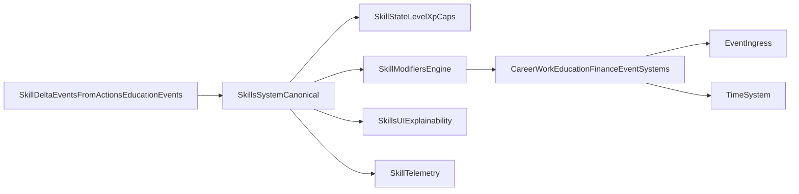

# План: Актуализация и оптимизация системы навыков

## Статус: Запланировано (v1)

## Цель

Стабилизировать и модернизировать систему навыков так, чтобы она была:

- корректной по контрактам данных (`skills` shape);
- реалистичной по прогрессии (обучение, практика, утомление, забывание);
- синхронизированной с действиями, обучением, временем и событиями;
- объяснимой для игрока (что и почему растёт/падает).

---

## Текущее состояние (as-is)

В проекте одновременно присутствуют:

1. Рабочий runtime-контур (`SkillsSystem` + `skill-modifiers`) с level-based моделью.
2. Частично подготовленный XP/decay/burnout-контур (`balance/utils/skill-system.ts`), который в runtime почти не используется.

Критическая проблема: часть систем продолжает читать навыки как `number`, хотя фактический формат уже объектный (`{ level, xp }`), из-за чего возможны ошибки в career unlock, skill-check и event/time логике.

---

## Ключевые файлы

- Core:
  - `src/domain/engine/systems/SkillsSystem/index.ts`
  - `src/domain/balance/constants/skill-modifiers.ts`
  - `src/domain/balance/constants/skills-constants.ts`
- Runtime integrators:
  - `src/domain/engine/systems/ActionSystem/index.ts`
  - `src/domain/engine/systems/EducationSystem/index.ts`
  - `src/domain/engine/systems/WorkPeriodSystem/index.ts`
  - `src/domain/engine/systems/MonthlySettlementSystem/index.ts`
  - `src/domain/engine/systems/EventChoiceSystem/index.ts`
  - `src/domain/engine/systems/TimeSystem/index.ts`
  - `src/domain/engine/systems/CareerProgressSystem/index.ts`
- Skill UI:
  - `src/components/pages/skills/SkillList/SkillList.vue`
  - `src/components/pages/skills/SkillCard/SkillCard.vue`
- Potential next-gen model:
  - `src/domain/balance/utils/skill-system.ts`
- Childhood skill specifics:
  - `src/domain/balance/constants/childhood-skills.ts`
  - `src/domain/balance/types/childhood-skill.ts`

---

## Проблемы, которые нужно исправить

### Critical / High

1. Несогласованный доступ к skill shape (`number` vs `{ level, xp }`) в ключевых системах.
2. Childhood skill caps заявлены, но неполностью интегрированы в `SkillsSystem`.
3. Несовпадение карьерных `minEducationRank` и доступной rank-шкалы.
4. Runtime/дизайн расхождение: есть dead-code XP модель, но active-модель level-only.

### Medium

1. Дублирование/рассинхрон между `skills-constants` и `skill-modifiers`.
2. Часть modifiers плохо объяснима игроку и слабо видна в UI.
3. Фрагментация education->skills flow (actions и programs дают прогресс разными путями).

---

## Приоритизация (P0 / P1 / P2)

### P0 — Блокеры корректности

- Унифицировать чтение skill shape (`{ level, xp }`) во всех runtime системах.
- Починить критичные интеграторы (`CareerProgressSystem`, `EventChoiceSystem`, `TimeSystem`).
- Зафиксировать согласованную шкалу education rank vs career requirements.

### P1 — Стабилизация модели и связей

- Выбрать и зафиксировать официальную progression модель (level-only v1 или XP v2).
- Встроить childhood caps/age windows в runtime-контур навыков.
- Нормализовать education->skills flow и убрать дубли progression path.

### P2 — Расширения реализма и explainability

- Decay/forgetting, burnout, recovery loops.
- Полная синхронизация описаний навыков и фактических modifiers.
- Расширенная UI explainability и аналитика вклада навыков.

---

## Target architecture

---

## Execution plan

### Этап 1: Унификация контракта навыков (M)

- Ввести единый helper доступа к уровню навыка (`getSkillLevel`).
- Заменить прямые чтения `skills[key]` во всех runtime системах.
- Добавить guard/check на shape навыков в save/load.

**Выход:** нет ошибок чтения skill shape.

### Этап 2: Критические фиксы интеграций (M)

- Починить `CareerProgressSystem`, `EventChoiceSystem`, `TimeSystem` под object-format навыков.
- Синхронизировать education-rank и career rank contract.
- Добавить regression кейсы для карьерных unlock и skill checks.

**Выход:** корректные unlock/skill-check эффекты.

### Этап 3: Решение по модели прогрессии (M-L)

- Зафиксировать стратегию:
  - либо официально level-only v1 (убрать dead XP layer),
  - либо ввести XP/decay/burnout как runtime v2.
- Документировать выбранный контракт и migration path.

**Выход:** одна официальная модель прогрессии без dead-code ambiguity.

### Этап 4: Реализм прогрессии (M)

- Ввести контур реализма:
  - diminishing returns;
  - forgetting/decay (опционально v1.1);
  - влияние needs/состояния на рост навыка.
- Согласовать с education learningEfficiency.

**Выход:** навыки растут правдоподобно, без exploit спама.

### Этап 5: Skill effects source-of-truth (M)

- Убрать drift между skill definitions и modifier engine.
- Либо генерировать modifiers из `SkillDef.effects`, либо документировать обратную зависимость.
- Добавить contract tests “описание навыка = фактический эффект”.

**Выход:** описание навыков соответствует реальному геймплею.

### Этап 6: UI explainability и telemetry (M)

- Показать игроку:
  - текущие суммарные modifiers;
  - вклад навыков в результат действия;
  - причины роста/падения прогресса.
- Добавить telemetry:
  - `skills.progress.delta`
  - `skills.level.up`
  - `skills.decay.applied`
  - `skills.modifier.contribution`

**Выход:** игрок и баланс-команда видят причинно-следственные связи.

### Этап 7: Тестовый пакет и rollout (M)

- Unit:
  - `SkillsSystem` apply/clamp;
  - modifiers/caps;
  - helpers `getSkillLevel`.
- Integration:
  - `action -> skill -> modifier -> work/career/event`
  - `education -> skill unlock/progress`.
- Feature flags:
  - `skills.shapeGuardV1`
  - `skills.progressModelV2`
  - `skills.explainabilityV1`

---

## Спецификация прогрессии v1.1 (реалистичный темп)

### Решение по шкале 10 vs 100

- Не переходить на "чистый уровень 0..100" в UI на первом шаге.
- Ввести двухконтурную модель:
  - `proficiencyScore: 0..100` (внутренняя точность прогресса),
  - `displayLevel: 0..10` (или ранги `Novice..Master` для игрока).
- Формула отображения: `displayLevel = floor(proficiencyScore / 10)`.

Это даёт реалистичную гранулярность без ломки текущего интерфейса и модификаторов.

### Каноническая формула роста

`xpGain = baseXp * actionQuality * needsMultiplier * antiGrindMultiplier * contextMultiplier`

- `baseXp`: базовая стоимость действия/учебного шага (обычно `0.6..2.0`).
- `actionQuality`: качество выполнения (`0.75..1.25`) от навыка и контекста.
- `needsMultiplier`: состояние needs (`0.5..1.1`).
- `antiGrindMultiplier`: штраф за повтор одной и той же активности (`0.4..1.0`).
- `contextMultiplier`: бонус за релевантный контекст (практика по профессии, повторение и т.п.) (`0.9..1.15`).

Ограничение: `xpGain` clamp в диапазоне `0.2..3.0`.

### Нелинейная кривая прогресса

- Ранние уровни растут быстрее, верхние — заметно медленнее:
  - `0..30`: коэффициент сложности `1.0`
  - `31..60`: `1.35`
  - `61..80`: `1.8`
  - `81..100`: `2.6`
- Фактический прирост: `effectiveGain = xpGain / difficultyCoefficient`.

### Decay и закрепление

- Если навык не используется N дней, применяется мягкий decay:
  - `scoreLossPerDay = 0.05..0.15` в зависимости от категории навыка.
- Нижний порог: decay не может опустить ниже `displayLevel floor` текущего тира за короткий период.
- Применение навыка в профильных действиях включает `reinforcement` и временно снижает decay.

### Целевой темп прокачки (калибровка)

- Из "0 до уверенного уровня" (`displayLevel 6`, score ~60): ~`25-40` релевантных действий.
- Из "0 до продвинутого" (`displayLevel 8`, score ~80): ~`50-80` действий.
- Из "0 до мастерства" (`displayLevel 10`, score 100): ~`90-140` действий.

Это целевой коридор реализма для balance tuning (вместо текущих 2-6 действий до cap).

### Миграция с текущей модели

1. Оставить текущие `maxLevel: 10` в публичном контракте UI.
2. Добавить `proficiencyScore` в state навыка и использовать его в росте.
3. Перевести текущие `skillChanges` из action-каталогов в `baseXp` таблицу.
4. Добавить обратную совместимость save-load:
   - если есть только `level`, то `score = level * 10`.
5. Обновить modifiers engine: считать эффекты от нормализованного `displayLevel`, не от сырых XP.

---

## Стартовый спринт (3 дня)

### День 1 (P0)

- Ввести `getSkillLevel`/shape guard и заменить самые рискованные прямые чтения.
- Быстро закрыть баги в `CareerProgressSystem` и `EventChoiceSystem`.

### День 2 (P0/P1)

- Закрыть интеграцию `TimeSystem` + skill shape.
- Синхронизировать rank contract карьеры/образования.
- Поднять базовые regression-тесты на skill-check и career unlock.

### День 3 (P1)

- Принять решение по progression модели (v1/v2) и зафиксировать в плане/код-комментариях.
- Добавить первые explainability поля в UI (вклад modifiers).
- Подключить feature flags и baseline telemetry.

---

## Оптимизации

1. Пересчёт modifiers только по dirty-flag.
2. Батч-применение skill deltas в action/event цепочках.
3. Контрактные snapshot тесты на форму `skills` в save/world.
4. Ограничение частоты UI-ререндеров skill cards через memoized selectors.

## Реализм и разнообразие навыков (фичи и улучшения)

1. **Skill domains and specialization**
   - Разделить навыки по доменам (когнитивные, социальные, физические, профессиональные) с локальными caps и темпом роста.
   - Поощрять специализацию и вводить trade-offs между доменами.

2. **Practice quality over raw repetition**
   - Рост навыка зависит не только от факта действия, но и от качества практики (needs + контекст + сложность).
   - Бессмысленный спам даёт минимальный прогресс.

3. **Forgetting and reinforcement**
   - При долгом неиспользовании навык частично деградирует.
   - Регулярная практика/применение стабилизирует навык и снижает темп деградации.

4. **Burnout and recovery loop**
   - Интенсивная прокачка без восстановления увеличивает burnout и уменьшает gain.
   - Отдых/сон/развлечения/баланс активности восстанавливают эффективный темп роста.

5. **Skill synergy matrix**
   - Соседние навыки дают бонус к росту друг друга (например, дисциплина усиливает обучение, коммуникация усиливает карьерные проверки).
   - Ограничить число активных синергий в v1, чтобы избежать непрозрачности.

6. **Unlock by competence**
   - Некоторые действия/карьерные шаги открываются не только знанием, но и достижением skill-порога.
   - Это усиливает связь “знаю -> умею -> могу сделать”.

7. **Player-facing explainability**
   - Показывать:
     - почему вырос/упал прогресс навыка;
     - какие факторы дали бонус/штраф;
     - что нужно сделать для следующего значимого unlock.

---

## Зависимости

- `actions-system-refresh-plan`: единые action-side skill deltas.
- `education-age-context-plan`: реалистичный learningEfficiency и шаги программ.
- `event-system-sync`: единый ingress unlock/progress событий.
- `time-system-refresh`: period-логика decay/recovery.
- `system-sync-plan`: мастер-координация knowledge-based unlock и межсистемной синхронизации.

---

## Оценка трудозатрат

| Этап | Время |
|------|-------|
| Этап 1 | 1–2 ч |
| Этап 2 | 1–3 ч |
| Этап 3 | 1–2 ч |
| Этап 4 | 1–3 ч |
| Этап 5 | 1–2 ч |
| Этап 6 | 1–2 ч |
| Этап 7 | 2–3 ч |
| **Итого** | **8–17 часов** |

---

## Definition of Done

- [ ] Все runtime-системы используют единый контракт чтения навыков.
- [ ] Нет regression по career unlock и skill checks из-за skill shape.
- [ ] Зафиксирована и документирована одна модель skill progression.
- [ ] Реалистичные ограничения роста навыков (anti-exploit) внедрены в v1/v1.1.
- [ ] Skill effects и их описания синхронизированы (без дрейфа).
- [ ] UI показывает объяснимый вклад навыков в результаты.
- [ ] Добавлены unit/integration/contract тесты по skill pipeline.
