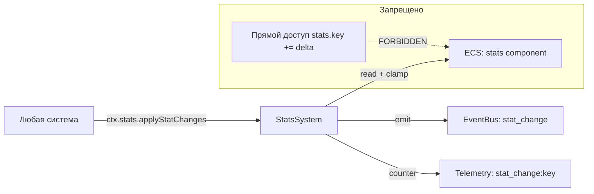

# План: Актуализация и стабилизация StatsSystem

## Статус: Draft (Wave 1 — P0)

## Цель

Превратить StatsSystem из «embedded удерга» в canonical-ядро, через которое проходят **все** мутации статов в проекте. Устранить дублирование `_applyStatChanges()` / `_clamp()` в 5+ системах.

---

## 1. Текущий срез (as-is)

### Источники данных

| Аспект | Состояние |
|--------|-----------|
| Файл | `src/domain/engine/systems/StatsSystem/index.ts` (70 строк) |
| Типы | `src/domain/engine/systems/StatsSystem/index.types.ts` |
| Константы | `src/domain/engine/systems/StatsSystem/index.constants.ts` — `STAT_DEFS` из `@/domain/balance/constants/stat-defs` |
| Утилиты | `src/domain/engine/systems/StatsSystem/index.utils.ts` |
| Wiring | **Не в `system-context.ts`** — embedded, каждая система создаёт `new StatsSystem()` вручную |

### API

```
StatsSystem
├── init(world: GameWorld): void
├── applyStatChanges(statChanges: StatChanges): void    // мутация ECS-компонента
├── getStats(): Record<string, number> | null            // чтение
├── summarizeStatChanges(statChanges: StatChanges): string
├── mergeStatChanges(...chunks): StatChanges              // merge нескольких дельт
└── _clamp(value, min=0, max=100): number
```

### Потребители (кто использует StatsSystem или дублирует его логику)

| Система | Как использует | Дублирует? |
|---------|---------------|------------|
| `ActionSystem` | Создаёт `new StatsSystem()` | Нет — делегирует |
| `WorkPeriodSystem` | Создаёт `new SkillsSystem()`, но статы мутирует **сам** | **Да** — `_applyStatChanges`, `_clamp` |
| `FinanceActionSystem` | Создаёт `new SkillsSystem()`, статы мутирует **сам** | **Да** — `_applyStatChanges`, `_clamp` |
| `MonthlySettlementSystem` | Создаёт `new SkillsSystem()`, статы мутирует **сам** | **Да** — `_applyStatChanges`, `_clamp` |
| `EducationSystem` | Создаёт `new SkillsSystem()`, статы мутирует **сам** | **Да** — `_applyStatChanges`, `_clamp` |
| `RecoverySystem` | Создаёт `new SkillsSystem()`, статы мутирует **сам** | **Да** — `_applyStatChanges`, `_clamp` |
| `EventChoiceSystem` | Через ActionSystem | Нет |

---

## 2. Проблемы

### P0 — Блокеры

| # | Проблема | Влияние |
|---|----------|---------|
| S-1 | **Дублирование `_applyStatChanges()` + `_clamp()`** в 5 системах (WorkPeriod, FinanceAction, MonthlySettlement, Education, Recovery) | Расхождение логики clamp, merge; при изменении bounds нужно править 6 мест |
| S-2 | **StatsSystem не в `system-context.ts`** — каждая система создаёт свой экземпляр `new StatsSystem()` | Нет единой точки; при добавлении hooks/events/telemetry нужно менять все системы |

### P1 — Качество

| # | Проблема | Влияние |
|---|----------|---------|
| S-3 | **Нет stat change events** — изменения статов не трассируются через eventBus | Невозможно логировать в ActivityLog, диагностировать баланс |
| S-4 | **Нет telemetry** на stat changes | Невозможно отслеживать частоту и величину изменений |
| S-5 | **Нет валидации stat keys** — неизвестные ключи молча применяются | Опечатки в ключах не обнаруживаются |

### P2 — Расширения

| # | Проблема | Влияние |
|---|----------|---------|
| S-6 | **Нет stat bounds по определению** — `STAT_DEFS` существует, но не используется для валидации | min/max могут расходиться с дизайном |
| S-7 | **Нет breakdown/explainability** — невозможно показать игроку вклад факторов | Плохой UX для понимания «почему статы изменились» |

---

## 3. Целевая архитектура

### Contracts + Boundaries



### Контракт StatsSystem v2

```typescript
interface StatsSystemV2 {
  // Мутация (единственная точка)
  applyStatChanges(changes: StatChanges, source?: string): void
  
  // Чтение
  getStats(): Record<string, number> | null
  getStat(key: string): number
  
  // Утилиты
  mergeStatChanges(...chunks: (StatChanges | null | undefined)[]): StatChanges
  summarizeStatChanges(changes: StatChanges): string
  
  // Валидация
  isValidKey(key: string): boolean
}
```

### Границы ответственности

- **StatsSystem** — единственная система, которая мутирует `STATS_COMPONENT`.
- **Другие системы** — формируют `StatChanges`-дельту и передают в `ctx.stats.applyStatChanges()`.
- **Прямой доступ** `stats[key] += value` — запрещён вне StatsSystem.

---

## 4. Синхронизация с другими системами

| Система | Что меняется | Контракт |
|---------|-------------|----------|
| `system-context.ts` | Добавить `stats: StatsSystem` в `SystemContext` | `ctx.stats` доступен всем |
| `WorkPeriodSystem` | Удалить `_applyStatChanges` / `_clamp`; использовать `ctx.stats.applyStatChanges()` | Делегирование |
| `FinanceActionSystem` | Удалить `_applyStatChanges` / `_clamp`; использовать `ctx.stats.applyStatChanges()` | Делегирование |
| `MonthlySettlementSystem` | Удалить `_applyStatChanges` / `_clamp`; использовать `ctx.stats.applyStatChanges()` | Делегирование |
| `EducationSystem` | Удалить `_applyStatChanges` / `_clamp`; использовать `ctx.stats.applyStatChanges()` | Делегирование |
| `RecoverySystem` | Удалить `_applyStatChanges` / `_clamp`; использовать `ctx.stats.applyStatChanges()` | Делегирование |
| `TimeSystem` | Нет изменений (не мутирует статы напрямую) | — |
| `PersistenceSystem` | Нет изменений (читает/пишет компонент как есть) | — |

---

## 5. Execution plan

### Этап 1: Canonical wiring (~30 мин)

| Шаг | Описание | Файлы |
|-----|----------|-------|
| 1.1 | Добавить `StatsSystem` в `SystemContext` как поле `stats` | `system-context.ts`, `index.types.ts` |
| 1.2 | Убедиться, что `StatsSystem.init(world)` вызывается в `getSystemContext()` | `system-context.ts` |

### Этап 2: Удаление дублей (~2 ч)

| Шаг | Описание | Файлы |
|-----|----------|-------|
| 2.1 | **WorkPeriodSystem:** удалить `_applyStatChanges`, `_clamp`; заменить вызовы на `ctx.stats.applyStatChanges()` | `WorkPeriodSystem/index.ts` |
| 2.2 | **FinanceActionSystem:** удалить `_applyStatChanges`, `_clamp`; заменить вызовы на `ctx.stats.applyStatChanges()` | `FinanceActionSystem/index.ts` |
| 2.3 | **MonthlySettlementSystem:** удалить `_applyStatChanges`, `_clamp`; заменить вызовы на `ctx.stats.applyStatChanges()` | `MonthlySettlementSystem/index.ts` |
| 2.4 | **EducationSystem:** удалить `_applyStatChanges`, `_clamp`; заменить вызовы на `ctx.stats.applyStatChanges()` | `EducationSystem/index.ts` |
| 2.5 | **RecoverySystem:** удалить `_applyStatChanges`, `_clamp`; заменить вызовы на `ctx.stats.applyStatChanges()` | `RecoverySystem/index.ts` |

> **Важно:** Каждая система должна получить `StatsSystem` через `SystemContext`, а не создавать `new StatsSystem()`. Для систем, уже имеющих ссылку на `world`, можно временно использовать `world.getSystem(StatsSystem)` или прокинуть через init-параметр.

### Этап 3: Telemetry + Events (~30 мин)

| Шаг | Описание | Файлы |
|-----|----------|-------|
| 3.1 | Добавить `telemetry.inc('stat_change:${key}', delta)` в `applyStatChanges()` | `StatsSystem/index.ts`, `utils/telemetry.ts` |
| 3.2 | (Опционально) Emit `stat_change` event в eventBus для ActivityLog | `StatsSystem/index.ts` |

### Этап 4: Тесты (~1 ч)

| Шаг | Описание | Файлы |
|-----|----------|-------|
| 4.1 | Unit: `applyStatChanges` — clamp, merge, unknown keys | `test/unit/domain/engine/stats-system.test.ts` |
| 4.2 | Unit: `mergeStatChanges` — несколько chunks, null/undefined | там же |
| 4.3 | Unit: `isValidKey` — известные/неизвестные ключи | там же |
| 4.4 | Regression: все существующие тесты зелёные | — |

---

## 6. Telemetry + Tests

### Telemetry-счётчики

| Счётчик | Когда инкрементируется |
|---------|------------------------|
| `stat_change:{key}` | При каждом применении stat change (positive/negative) |
| `stat_change_unknown_key` | При попытке применить неизвестный ключ |

### Тесты

| Тип | Количество | Что покрывает |
|-----|-----------|---------------|
| Unit | ≥4 | applyStatChanges, clamp, merge, unknown keys |
| Regression | все существующие | Нет регрессий от удаления дублей |

---

## 7. Definition of Done

- [ ] `StatsSystem` добавлен в `System-context.ts` как `ctx.stats`.
- [ ] Ни одна система не содержит локальных `_applyStatChanges()` / `_clamp()`.
- [ ] Все stat-мутации проходят через `StatsSystem.applyStatChanges()`.
- [ ] Telemetry считает `stat_change:{key}` для каждого применения.
- [ ] Все существующие тесты зелёные.
- [ ] ≥4 новых unit-теста на StatsSystem.
- [ ] `SYSTEM_REGISTRY.md` обновлён: StatsSystem → Active (canonical).

---

## Связанные документы

- [Wave 1 общий план](plans/wave1-p0-core-stability-plan.md)
- [Дорожная карта](plans/systems-planning-roadmap.md)
- [Master sync plan](plans/system-sync-plan.md)
- [System Registry](src/domain/engine/systems/SYSTEM_REGISTRY.md)
