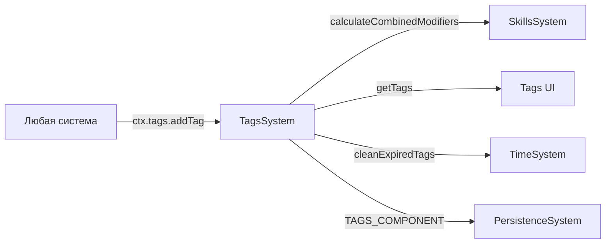

# План: Актуализация TagsSystem

## Статус: Draft (Wave 3 — P2)

## Цель

Превратить TagsSystem из слабо интегрированной системы в полноценный контур временных модификаторов:
- canonical wiring через SystemContext;
- интеграция с SkillsSystem для modifiers;
- улучшение expiry и stacking механик.

---

## 1. Текущий срез (as-is)

| Аспект | Состояние |
|--------|-----------|
| Файл | `src/domain/engine/systems/TagsSystem/index.ts` (104 строки) |
| Типы | `@/domain/balance/types` — `CharacterTag`, `SkillModifiers` |
| Wiring | **Partial** — не в `system-context.ts` |
| TimeSystem | Разрешает через `world.getSystem(TimeSystem)` — canonical |
| Компонент | `TAGS_COMPONENT` — `{ items: CharacterTag[] }` |

### API

```
TagsSystem
├── init(world: GameWorld): void
├── update(world, deltaTime): void                     // cleanExpiredTags
├── getTags(): CharacterTag[]                           // все теги
├── hasTag(tagId): boolean                              // проверка наличия
├── getTag(tagId): CharacterTag | null                  // получить по ID
├── addTag(tag): void                                   // добавить (с stacking)
├── removeTag(tagId): void                              // удалить
├── removeAllTags(): void                               // очистить все
├── cleanExpiredTags(): void                            // удалить истёкшие
├── calculateCombinedModifiers(): Partial<SkillModifiers>  // сумма modifiers
└── _ensureComponent(): void
```

### CharacterTag

```typescript
interface CharacterTag {
  id: string
  stackable: boolean
  maxStacks?: number
  stacks?: number
  expiresAt?: number  // totalHours
  modifiers?: Partial<SkillModifiers>
}
```

---

## 2. Проблемы

### P0 — Блокеры

| # | Проблема | Влияние |
|---|----------|---------|
| T-1 | **Не в system-context.ts** — нельзя получить через canonical context | Системы не могут добавлять/проверять теги |

### P1 — Качество

| # | Проблема | Влияние |
|---|----------|---------|
| T-2 | **`calculateCombinedModifiers()` не интегрирован** с SkillsSystem.getModifiers() | Модификаторы тегов не влияют на gameplay |
| T-3 | **Нет telemetry** на tag add/remove/expiry | Невозможно отслеживать |
| T-4 | **Нет ActivityLog интеграции** — добавление тегов не логируется | Игрок не видит изменения |
| T-5 | **Нет query по modifiers** — нельзя найти теги, влияющие на конкретный modifier | Ограниченная аналитика |
| T-6 | **`update()` переназначает `this.world`** — потенциальный side-effect | Некорректное поведение |

### P2 — Расширения

| # | Проблема | Влияние |
|---|----------|---------|
| T-7 | **Нет tag categories** — все теги плоские | Сложно фильтровать |
| T-8 | **Нет tag conflict rules** — нельзя указать взаимоисключающие теги | Нереалистичные комбинации |
| T-9 | **Нет UI для тегов** — игрок не видит активные эффекты | Неполный gameplay |

---

## 3. Целевая архитектура

### Contracts + Boundaries



### Контракт TagsSystem v2

```typescript
interface TagsSystemV2 {
  init(world: GameWorld): void
  update(world: GameWorld, deltaTime: number): void
  
  // Мутации
  addTag(tag: Omit<CharacterTag, 'stacks'> & { stacks?: number }): void
  removeTag(tagId: string): void
  removeAllTags(): void
  
  // Queries
  getTags(): CharacterTag[]
  hasTag(tagId: string): boolean
  getTag(tagId: string): CharacterTag | null
  getTagsByModifier(modifierKey: string): CharacterTag[]  // NEW
  
  // Modifiers
  calculateCombinedModifiers(): Partial<SkillModifiers>
  
  // Lifecycle
  cleanExpiredTags(): void
}
```

---

## 4. Синхронизация с другими системами

| Система | Что синхронизировать | Контракт |
|---------|---------------------|----------|
| `system-context.ts` | Добавить `tags: TagsSystem` | Canonical access |
| `SkillsSystem` | `calculateCombinedModifiers()` → включить в `getModifiers()` | Integration |
| `TimeSystem` | `cleanExpiredTags()` при time advance | Lifecycle |
| `PersistenceSystem` | `TAGS_COMPONENT` в save/load | Persistence |
| `ActivityLogSystem` | Emit при add/remove tag | Logging |

---

## 5. Execution plan

### Этап 1: Canonical wiring (~30 мин)

| Шаг | Описание | Файлы |
|-----|----------|-------|
| 1.1 | Добавить `TagsSystem` в `SystemContext` как `tags` | `system-context.ts`, `index.types.ts` |
| 1.2 | Убрать `this.world = world` из `update()` — world уже установлен в `init()` | `TagsSystem/index.ts:15` |

### Этап 2: Интеграция с SkillsSystem (~1 ч)

| Шаг | Описание | Файлы |
|-----|----------|-------|
| 2.1 | SkillsSystem: включить `ctx.tags.calculateCombinedModifiers()` в `getModifiers()` | `SkillsSystem/index.ts` |
| 2.2 | Добавить `getTagsByModifier(modifierKey)` для аналитики | `TagsSystem/index.ts` |

### Этап 3: Telemetry + Logging (~30 мин)

| Шаг | Описание | Файлы |
|-----|----------|-------|
| 3.1 | Telemetry: `tag_add:{tagId}`, `tag_remove:{tagId}`, `tag_expire:{tagId}` | `TagsSystem/index.ts` |
| 3.2 | Emit `activity:stat` при add/remove тегов с modifiers | `TagsSystem/index.ts` |

### Этап 4: Тесты (~1 ч)

| Шаг | Описание | Файлы |
|-----|----------|-------|
| 4.1 | Unit: addTag — new, stacking, maxStacks | `test/unit/domain/engine/tags.test.ts` |
| 4.2 | Unit: removeTag, removeAllTags | там же |
| 4.3 | Unit: cleanExpiredTags — expiry logic | там же |
| 4.4 | Unit: calculateCombinedModifiers — stacking multipliers | там же |
| 4.5 | Unit: getTagsByModifier | там же |
| 4.6 | Regression: все существующие тесты зелёные | — |

---

## 6. Telemetry + Tests

### Telemetry-счётчики

| Счётчик | Когда инкрементируется |
|---------|------------------------|
| `tag_add:{tagId}` | При добавлении тега |
| `tag_remove:{tagId}` | При удалении тега |
| `tag_expire:{tagId}` | При истечении тега |
| `tag_stack:{tagId}` | При увеличении стака |

### Тесты

| Тип | Количество | Что покрывает |
|-----|-----------|---------------|
| Unit | ≥5 | add, remove, stacking, expiry, modifiers, query |
| Regression | все существующие | Нет регрессий |

---

## 7. Definition of Done

- [ ] **TagsSystem в SystemContext** — `ctx.tags`.
- [ ] **`update()` не переназначает `this.world`**.
- [ ] **SkillsSystem включает tag modifiers** в `getModifiers()`.
- [ ] **`getTagsByModifier()`** добавлен.
- [ ] **Telemetry** покрывает tag lifecycle.
- [ ] **Все существующие тесты зелёные** + ≥5 новых unit-тестов.
- [ ] **`SYSTEM_REGISTRY.md`** обновлён.

---

## Связанные документы

- [Дорожная карта](plans/systems-planning-roadmap.md)
- [Stats system refresh](plans/stats-system-refresh-plan.md) (Wave 1)
- [Skills system refresh](plans/skills-system-refresh-plan.md) (Wave 1)
- [System Registry](src/domain/engine/systems/SYSTEM_REGISTRY.md)
