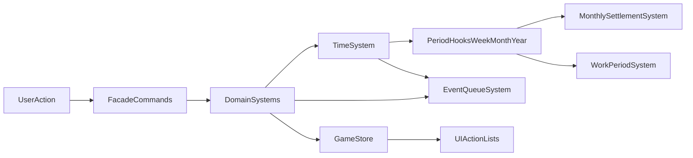

# План актуализации и оптимизации системы учета времени

## Task Brief

### Goal

Сделать систему игрового времени единой, предсказуемой и производительной: убрать расхождения между подсистемами, привязать периодические процессы к единому time-ядру, снизить лишние пересчеты в UI и закрыть ключевые тестовые пробелы.

### Context from existing implementation

- Канонический источник времени уже есть: `time.totalHours` в `TimeSystem`, но часть подсистем имеет fallback с прямой мутацией времени.
- Периодические процессы (week/month/year) реализованы частично и не везде явно подписаны на централизованные callbacks.
- В UI есть частые read-path вызовы `canExecute`, которые повторно трогают time-нормализацию и раздувают реактивную нагрузку.
- Есть риск рассинхрона в event-id/dedup и неполное покрытие boundary-кейсов времени.

### Affected files/systems

- Time orchestration: [e:\project\games\game_life\src\domain\engine\systems\TimeSystem\index.ts](e:/project/games/game_life/src/domain/engine/systems/TimeSystem/index.ts), [e:\project\games\game_life\src\domain\engine\systems\TimeSystem\index.types.ts](e:/project/games/game_life/src/domain/engine/systems/TimeSystem/index.types.ts)
- System wiring: [e:\project\games\game_life\src\domain\game-facade\system-context.ts](e:/project/games/game_life/src/domain/game-facade/system-context.ts), [e:\project\games\game_life\src\domain\game-facade\commands.ts](e:/project/games/game_life/src/domain/game-facade/commands.ts)
- Time consumers: [e:\project\games\game_life\src\domain\engine\systems\ActionSystem\index.ts](e:/project/games/game_life/src/domain/engine/systems/ActionSystem/index.ts), [e:\project\games\game_life\src\domain\engine\systems\EducationSystem\index.ts](e:/project/games/game_life/src/domain/engine/systems/EducationSystem/index.ts), [e:\project\games\game_life\src\domain\engine\systems\FinanceActionSystem\index.ts](e:/project/games/game_life/src/domain/engine/systems/FinanceActionSystem/index.ts), [e:\project\games\game_life\src\domain\engine\systems\WorkPeriodSystem\index.ts](e:/project/games/game_life/src/domain/engine/systems/WorkPeriodSystem/index.ts), [e:\project\games\game_life\src\domain\engine\systems\MonthlySettlementSystem\index.ts](e:/project/games/game_life/src/domain/engine/systems/MonthlySettlementSystem/index.ts)
- Store/UI hot paths: [e:\project\games\game_life\src\stores\game.store.ts](e:/project/games/game_life/src/stores/game.store.ts), [e:\project\games\game_life\src\components\game\ActionCardList\ActionCardList.vue](e:/project/games/game_life/src/components/game/ActionCardList/ActionCardList.vue), page-level action lists in `src/pages/game/*/index.vue`
- Event integrity: [e:\project\games\game_life\src\domain\engine\systems\EventQueueSystem\index.ts](e:/project/games/game_life/src/domain/engine/systems/EventQueueSystem/index.ts), [e:\project\games\game_life\src\domain\engine\systems\EventChoiceSystem\index.ts](e:/project/games/game_life/src/domain/engine/systems/EventChoiceSystem/index.ts)
- Tests: `test/unit/domain/**` (новые unit + интеграционные сценарии для time flow)

### Guardrails

- Без изменения геймдизайна баланса (стоимости/награды действий) в этом цикле; только корректность, производительность и надежность исполнения текущих правил.
- Сохранить обратную совместимость сохранений (save/load), любые изменения формата — только через безопасную миграцию.
- Не допустить роста когнитивной сложности в системах: централизация времени вместо новых параллельных путей.

### Acceptance criteria

- Все подсистемы двигают время только через единый канонический путь (`TimeSystem.advanceHours` или эквивалентный контракт).
- Week/month/year эффекты выполняются автоматически и предсказуемо при переходах времени.
- UI-слой не делает избыточные пересчеты доступности действий на каждый ререндер списка.
- Event dedup устойчив при быстрых последовательных событиях.
- Добавлено покрытие boundary-тестами (day/week/month/year rollover, large hour jumps, dedup, period callbacks).

## Архитектурный контур

## Execution Plan

1. **Unify time contract**

- Зафиксировать единый API продвижения времени (включая опции silent/emit), документировать инварианты `totalHours` и derived-полей.
- Убрать fallback-прямые мутации времени в `EducationSystem` и `FinanceActionSystem`; заменить на fail-fast/обработку через канонический путь.

1. **Wire periodic orchestration**

- Явно подключить weekly/monthly/yearly callbacks в `system-context`.
- Перевести `MonthlySettlementSystem` и `WorkPeriodSystem` на автоматические вызовы от period-hooks, сохранив ручную команду только как технический override (если нужна для debug/tools).

1. **Stabilize event identity and dedup**

- Ввести детерминированный `instanceId` на базе (event template + totalHours + sequence/nonce в рамках world state).
- Единообразно использовать `instanceId` в enqueue/history/dedup logic.

1. **Reduce UI/store recomputation pressure**

- Перенести проверку доступности действий в versioned snapshot (кэш по `worldVersion`) вместо N-кратных per-card `canExecute` вызовов.
- Уменьшить реактивный churn в `game.store.ts`: убрать debug/log из hot-path computed, пересмотреть стратегии копирования объектов.

1. **Normalize year/period representation**

- Унифицировать представление года/месяца для логов и UI (избежать смешения дробного и 0-based представлений).
- Добавить helper/селектор форматирования времени и использовать его в time-sensitive системах.

1. **Test hardening and regression safety**

- Добавить unit-тесты `TimeSystem` на rollover и large jumps.
- Добавить интеграционные тесты цепочки `advanceHours -> period hooks -> systems`.
- Добавить тесты на dedup и отсутствие дублей событий.
- Добавить smoke-тесты на доступность действий при массовых списках (чтобы поймать регрессии производительности).

1. **Rollout strategy**

- Реализовать в 3 последовательных PR:
  - PR1: единый time contract + удаление fallback-мутаций + базовые unit тесты
  - PR2: period orchestration + monthly/work integration + интеграционные тесты
  - PR3: UI/store perf оптимизации + event dedup hardening + финальная полировка
- Для каждого PR — короткий checklist: функциональная корректность, производительность (замер до/после), обратная совместимость save/load.

## Hardening Additions

1. **Time RFC and invariants**

- Добавить короткий RFC-документ по времени в `docs/` с формальными правилами: источники истины, порядок period hooks, требования к idempotency, договоренности по 1-based/0-based.
- Использовать RFC как gate для review изменений в time-related системах.

1. **Observability and diagnostics**

- Ввести `TimeDiagnostics` слой: счетчики `advanceHours`, длительность critical-path, число period callbacks, число dedup-срабатываний.
- Добавить dev-режим отчета по time-циклу (суммарно за сессию и по последнему действию).

1. **Deterministic replay for bug reproduction**

- Логировать time-команды (`actionId`, `hourCost`, `totalHoursBefore`, `totalHoursAfter`, `instanceId` seed).
- Подготовить минимальный replay-сценарий для воспроизведения багов времени без ручного клика по UI.

1. **Strict period processing mode**

- Добавить strict-режим выполнения week/month/year переходов: все обязательные handlers должны отработать или вернуть явную ошибку.
- В тестах зафиксировать поведение при частичной ошибке одного из handlers (политика rollback/continue).

1. **Performance budget and safeguards**

- Зафиксировать SLO/бюджеты для критических операций (`canExecute` batch, large `advanceHours`, save path).
- Добавить benchmark/smoke checks в CI для отслеживания деградаций по времени выполнения.

1. **Save migration compatibility matrix**

- Документировать версии save-формата и стратегию миграций для time-полей.
- Добавить regression-набор тестовых сейвов (old/new) с автоматической проверкой загрузки и корректной нормализации времени.

1. **Feature-flagged rollout**

- Обернуть крупные изменения флагами (`time.periodHooksV2`, `time.eventDedupV2`, `time.availabilityCacheV2`) для поэтапного включения.
- Для каждого флага определить критерий включения и rollback-процедуру.

## Evolution Track (post-refactor)

1. **Unified scheduler engine**

- Развить систему в сторону единого планировщика time-задач (cooldown, delayed effects, period jobs) с приоритетами и прозрачным жизненным циклом задач.

1. **Data-driven time rules**

- Вынести часть периодических правил в конфиг/схему, чтобы расширять механику времени без изменения ядра систем.

1. **Dual-layer timeline**

- Разделить `SimulationTime` и `NarrativeTime` для поддержки сюжетных окон, сезонных событий и спец-ивентов без ломки базовой экономики времени.

1. **Offline progression (optional)**

- Подготовить дизайн опционального оффлайн-прогресса с ограничениями и анти-абьюз правилами (если это соответствует геймдизайну проекта).

1. **Long-run economy simulation**

- Добавить симуляционные прогонки длинных периодов (сотни/тысячи недель) для раннего выявления drift-проблем в экономике и прогрессии.

1. **Designer/developer tooling**

- Создать internal tooling: time fast-forward, jump-to-period, просмотр очередей и эффектов, diff состояния до/после шага времени.

## Definition of Done (extended)

- Time contract формализован и соблюдается всеми time-consumer системами.
- Периодические переходы наблюдаемы через диагностику и проверяемы replay-сценариями.
- Производительность критических time-path подтверждена бюджетами и smoke/benchmark проверками.
- Совместимость save/load подтверждена матрицей миграций и regression-набором сейвов.
- Эволюционный трек зафиксирован как отдельный backlog после завершения стабилизационного этапа.
