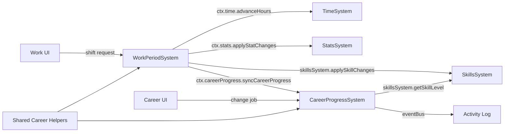

# План: Актуализация WorkPeriodSystem + CareerProgressSystem

## Статус: Draft (Wave 1 — P0)

## Цель

Стабилизировать базовый gameplay-loop (работа/доход/карьерный прогресс):
- устранить дублирование методов между двумя системами;
- починить skills shape (чтение через canonical `SkillsSystem`);
- заменить duck-typing на прямые ссылки;
- обеспечить canonical wiring через SystemContext.

---

## 1. Текущий срез (as-is)

### WorkPeriodSystem

| Аспект | Состояние |
|--------|-----------|
| Файл | `src/domain/engine/systems/WorkPeriodSystem/index.ts` (581 строка) |
| Типы | `src/domain/engine/systems/WorkPeriodSystem/index.types.ts` |
| Константы | `src/domain/engine/systems/WorkPeriodSystem/index.constants.ts` |
| Утилиты | `src/domain/engine/systems/WorkPeriodSystem/index.utils.ts` |
| Wiring | В `system-context.ts` как `workPeriod` |
| SkillsSystem | Создаёт `new SkillsSystem()` в `init()` |
| TimeSystem | **Duck-typing:** `systems.find(s => typeof s.advanceHours === 'function')` (строка 190) |

#### API

```
WorkPeriodSystem
├── init(world: GameWorld): void
├── handleWeekRollover(newWeekNumber): void        // сброс недели, увольнение за недоработку
├── applyWorkShift(workHours, workEventChoice): string  // основная смена
├── applyWorkPeriodResult(workDays, workEventChoice): string
├── _dismissForUnderwork(params): void              // увольнение
├── _pruneExpiredJobRehireBlocks(timeComponent): void
├── _syncCareerProgress(): string                   // дублирует CareerProgressSystem
├── _syncCareerCurrentJob(): void                   // дублирует CareerProgressSystem
├── _ensureWorkComponentFromCareer(playerId): Record | null  // legacy fallback
├── _resolveSalaryPerHour(workComponent): number    // дублирует
├── _resolveDailyWorkHours(workComponent): number
├── _getEducationRank(level): number                // дублирует
├── _mergeStatChanges(...chunks): Record            // дублирует StatsSystem
├── _applyStatChanges(stats, changes): void         // дублирует StatsSystem
├── _summarizeStatChanges(changes): string          // дублирует
├── _clamp(value, min, max): number                 // дублирует StatsSystem
├── _formatMoney(value): string                     // дублирует
└── _toFiniteNumber(value, fallback): number
```

### CareerProgressSystem

| Аспект | Состояние |
|--------|-----------|
| Файл | `src/domain/engine/systems/CareerProgressSystem/index.ts` (280 строк) |
| Типы | `src/domain/engine/systems/CareerProgressSystem/index.types.ts` |
| Константы | `src/domain/engine/systems/CareerProgressSystem/index.constants.ts` |
| Wiring | В `system-context.ts` как `careerProgress` |
| SkillsSystem | Создаёт `new SkillsSystem()` в `init()` |

#### API

```
CareerProgressSystem
├── init(world: GameWorld): void
├── getCareerTrack(): CareerTrackEntry[]            // список доступных должностей
├── syncCareerProgress(): string                    // автоматическое повышение
├── changeCareer(jobId): ChangeCareerResult         // ручная смена должности
├── getCurrentJob(): Record | null
├── _getEducationRank(level): number                // дублирует WorkPeriodSystem
├── _getEducationLabelByRank(rank): string          // дублирует
├── _syncCareerCurrentJob(): void                   // дублирует WorkPeriodSystem
├── _resolveSalaryPerHour(career): number           // (в _getFiniteNumber)
├── _formatMoney(value): string                     // дублирует
├── _getFiniteNumber(value, fallback): number       // дублирует _toFiniteNumber
└── _clamp(value, min, max): number                 // (неявно через Object.assign)
```

### Дублирование между системами

| Метод | WorkPeriodSystem | CareerProgressSystem | Идентичны? |
|-------|------------------|---------------------|------------|
| `_syncCareerCurrentJob()` | ✅ (строка 558) | ✅ (строка 257) | **Да** |
| `_getEducationRank()` | ✅ (строка 426) | ✅ (строка 231) | **Да** |
| `_resolveSalaryPerHour()` | ✅ (строка 464) | через `_getFiniteNumber` | **Почти** |
| `_formatMoney()` | ✅ (строка 460) | ✅ (строка 249) | **Да** |
| `_toFiniteNumber()` / `_getFiniteNumber()` | ✅ (строка 553) | ✅ (строка 253) | **Да** |
| `_applyStatChanges()` + `_clamp()` | ✅ (строка 445) | — | Дублирует StatsSystem |
| `_mergeStatChanges()` | ✅ (строка 435) | — | Дублирует StatsSystem |
| `_summarizeStatChanges()` | ✅ (строка 452) | — | Дублирует StatsSystem |

---

## 2. Проблемы

### P0 — Блокеры

| # | Проблема | Влияние |
|---|----------|---------|
| W-1 | **Дублирование 6+ методов** между WorkPeriodSystem и CareerProgressSystem | При фиксе бага нужно менять 2 места; рассинхрон при забывании |
| W-2 | **Skills читаются как `Record<string, number>`** (плоский number) вместо `SkillsSystem.getSkillLevel()` | `skills.professionalism ?? 0` — неверно, если данные в формате `{ level, xp }` |
| W-3 | **Duck-typing для TimeSystem** в WorkPeriodSystem (`systems.find(s => typeof s.advanceHours === 'function')`) | Хрупко; может найти неправильную систему |

### P1 — Качество

| # | Проблема | Влияние |
|---|----------|---------|
| W-4 | **Dual write (work + career)** — обе системы пишут в оба компонента через `Object.assign` | Рассинхрон при ошибке между двумя assign |
| W-5 | **Нет интеграции с EventQueueSystem** — используют прямой `eventBus.dispatchEvent` | Events не проходят через canonical ingress |
| W-6 | **Нет telemetry** на career events, work shifts, salary | Невозможно диагностировать баланс |
| W-7 | **`new SkillsSystem()` в init()** вместо canonical через SystemContext | Каждый создаёт свой экземпляр |

### P2 — Расширения

| # | Проблема | Влияние |
|---|----------|---------|
| W-8 | **`_ensureWorkComponentFromCareer()`** — сложный legacy fallback (50 строк) | Усложняет поддержку |
| W-9 | **Нет career event choices** — work events захардкожены | Ограниченный gameplay |
| W-10 | **Нет part-time / overtime механик** | Негибкий рабочий график |

---

## 3. Целевая архитектура

### Contracts + Boundaries



### Разделение ответственности

| Ответственность | Владелец | Потребитель |
|----------------|----------|-------------|
| Рабочие смены, зарплата, weekly flow | **WorkPeriodSystem** | UI, TimeSystem |
| Карьерный трек, повышения, смена должности | **CareerProgressSystem** | UI, WorkPeriodSystem |
| `_syncCareerCurrentJob()` | **CareerProgressSystem** | WorkPeriodSystem вызывает `ctx.careerProgress` |
| `_resolveSalaryPerHour()`, `_formatMoney()`, `_getEducationRank()` | **Shared helpers** (`utils/career-helpers.ts`) | Обе системы |
| `_applyStatChanges()`, `_clamp()` | **StatsSystem** (canonical) | Обе системы делегируют |

### Контракт WorkPeriodSystem v2

```typescript
interface WorkPeriodSystemV2 {
  init(world: GameWorld): void
  handleWeekRollover(newWeekNumber: number): void
  applyWorkShift(workHours: number, eventChoice?: WorkEventChoice): string
  applyWorkPeriodResult(workDays: number, eventChoice?: WorkEventChoice): string
}
```

### Контракт CareerProgressSystem v2

```typescript
interface CareerProgressSystemV2 {
  init(world: GameWorld): void
  getCareerTrack(): CareerTrackEntry[]
  syncCareerProgress(): string
  changeCareer(jobId: string): ChangeCareerResult
  getCurrentJob(): Record<string, unknown> | null
  syncCurrentJob(): void  // единственный владелец _syncCareerCurrentJob
}
```

---

## 4. Синхронизация с другими системами

| Система | Что синхронизировать | Контракт |
|---------|---------------------|----------|
| `TimeSystem` | `ctx.time.advanceHours()` — единственный способ сдвига времени | WorkPeriodSystem вызывает через SystemContext |
| `StatsSystem` | Все stat-мутации через `ctx.stats.applyStatChanges()` | Делегирование |
| `SkillsSystem` | Чтение через `getSkillLevel()`, запись через `applySkillChanges()` | Canonical shape |
| `EventQueueSystem` | Career/work events через canonical ingress | EventIngress |
| `PersistenceSystem` | `work` + `career` компоненты в save/load | Mapper registry |
| `FinanceActionSystem` | Salary info для MonthlySettlement | Через queries |

---

## 5. Execution plan

### Этап 1: Shared helpers (~1 ч)

| Шаг | Описание | Файлы |
|-----|----------|-------|
| 1.1 | Создать `src/domain/engine/utils/career-helpers.ts` с функциями: `resolveSalaryPerHour()`, `formatMoney()`, `getEducationRank()`, `getEducationLabelByRank()`, `toFiniteNumber()` | Новый файл |
| 1.2 | Заменить использование в WorkPeriodSystem на импорт из career-helpers | `WorkPeriodSystem/index.ts` |
| 1.3 | Заменить использование в CareerProgressSystem на импорт из career-helpers | `CareerProgressSystem/index.ts` |

### Этап 2: Canonical wiring (~1.5 ч)

| Шаг | Описание | Файлы |
|-----|----------|-------|
| 2.1 | **Заменить duck-typing TimeSystem** на `world.getSystem(TimeSystem)` или через SystemContext | `WorkPeriodSystem/index.ts:190` |
| 2.2 | **Заменить `new SkillsSystem()`** на canonical через SystemContext или `world.getSystem(SkillsSystem)` | Обе системы |
| 2.3 | **Удалить `_applyStatChanges` / `_clamp` / `_mergeStatChanges` / `_summarizeStatChanges`** — делегировать в StatsSystem | Обе системы |
| 2.4 | **Починить skills shape:** заменить `skills.professionalism ?? 0` на `this.skillsSystem.getSkillLevel('professionalism')` | `CareerProgressSystem/index.ts:44,77,158`; `WorkPeriodSystem/index.ts:378,386` |

### Этап 3: Устранение дубля _syncCareerCurrentJob (~30 мин)

| Шаг | Описание | Файлы |
|-----|----------|-------|
| 3.1 | Оставить `_syncCareerCurrentJob()` только в CareerProgressSystem (переименовать в `syncCurrentJob()`) | `CareerProgressSystem/index.ts` |
| 3.2 | WorkPeriodSystem: заменить вызовы на `ctx.careerProgress.syncCurrentJob()` или прямой вызов через world | `WorkPeriodSystem/index.ts` |
| 3.3 | Удалить `_syncCareerProgress()` из WorkPeriodSystem — делегировать в `ctx.careerProgress.syncCareerProgress()` | `WorkPeriodSystem/index.ts:376-424` |

### Этап 4: Telemetry (~30 мин)

| Шаг | Описание | Файлы |
|-----|----------|-------|
| 4.1 | Добавить telemetry: `work_shift`, `work_salary_payout`, `work_pending_salary` | `WorkPeriodSystem/index.ts`, `utils/telemetry.ts` |
| 4.2 | Добавить telemetry: `career_promotion`, `career_demotion`, `career_change` | `CareerProgressSystem/index.ts`, `utils/telemetry.ts` |
| 4.3 | Добавить telemetry: `work_dismissal_underwork`, `work_week_rollover` | `WorkPeriodSystem/index.ts` |

### Этап 5: Тесты (~1.5 ч)

| Шаг | Описание | Файлы |
|-----|----------|-------|
| 5.1 | Unit: `resolveSalaryPerHour` — все варианты (perHour, perDay, perWeek, из CAREER_JOBS) | `test/unit/domain/engine/career-helpers.test.ts` |
| 5.2 | Unit: `getEducationRank` — все уровни | там же |
| 5.3 | Unit: career unlock через canonical `SkillsSystem.getSkillLevel()` | `test/unit/domain/engine/career-progress.test.ts` |
| 5.4 | Unit: work shift — salary calc, stat changes, time advance | `test/unit/domain/engine/work-period.test.ts` |
| 5.5 | Unit: week rollover — dismissal for underwork, rehire blocks | там же |
| 5.6 | Regression: все существующие тесты зелёные | — |

---

## 6. Telemetry + Tests

### Telemetry-счётчики

| Счётчик | Когда инкрементируется |
|---------|------------------------|
| `work_shift` | При каждой отработанной смене |
| `work_salary_payout` | При выплате зарплаты (сумма) |
| `work_pending_salary` | При начислении в pending (сумма) |
| `work_dismissal_underwork` | При увольнении за недоработку |
| `work_week_rollover` | При каждом week rollover |
| `career_promotion` | при автоматическом повышении |
| `career_demotion` | При понижении |
| `career_change` | При ручной смене должности |

### Тесты

| Тип | Количество | Что покрывает |
|-----|-----------|---------------|
| Unit (helpers) | ≥2 | salary resolution, education rank |
| Unit (career) | ≥2 | career unlock, skill level check |
| Unit (work) | ≥2 | work shift, week rollover |
| Regression | все существующие | Нет регрессий |

---

## 7. Definition of Done

- [ ] **Нет дублирующихся методов** между WorkPeriodSystem и CareerProgressSystem.
- [ ] **Shared helpers** в `utils/career-helpers.ts` для общих утилит.
- [ ] **Skills через canonical** — `SkillsSystem.getSkillLevel()`, нигде нет `skills.key ?? 0`.
- [ ] **TimeSystem через прямую ссылку** — `world.getSystem(TimeSystem)`, без duck-typing.
- [ ] **Stat-мутации через StatsSystem** — нет локальных `_applyStatChanges` / `_clamp`.
- [ ] **`_syncCareerCurrentJob`** — только в CareerProgressSystem.
- [ ] **`_syncCareerProgress`** — только в CareerProgressSystem.
- [ ] **Telemetry** покрывает work shifts, salary, career events.
- [ ] **Все существующие тесты зелёные** + ≥6 новых unit-тестов.
- [ ] **`SYSTEM_REGISTRY.md`** обновлён.

---

## Связанные документы

- [Wave 1 общий план](plans/wave1-p0-core-stability-plan.md)
- [Дорожная карта](plans/systems-planning-roadmap.md)
- [Master sync plan](plans/system-sync-plan.md)
- [Stats system refresh](plans/stats-system-refresh-plan.md)
- [System Registry](src/domain/engine/systems/SYSTEM_REGISTRY.md)
