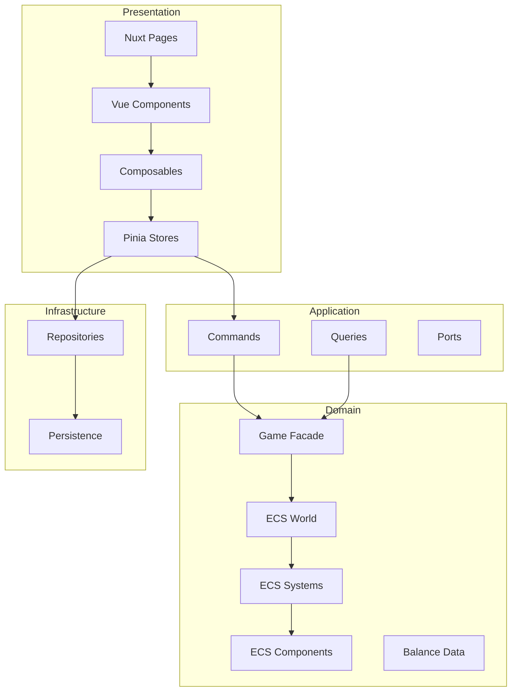
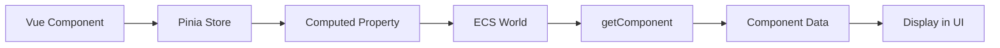

# Обзор архитектуры проекта Game Life

**Последнее обновление:** 10 апреля 2026
**Технологический стек:** Nuxt 4 + Vue 3 + TypeScript + Pinia

---

## Обзор

Проект Game Life использует 4-х слойную архитектуру (Clean Architecture) с чётким разделением ответственности:

1. **Domain Layer** (Доменный слой) - бизнес-логика и ECS
2. **Application Layer** (Прикладной слой) - Use Cases
3. **Infrastructure Layer** (Инфраструктурный слой) - внешние зависимости
4. **Presentation Layer** (Презентационный слой) - Vue UI и Nuxt

---

## Архитектурные слои



---

## 1. Domain Layer (Доменный слой)

**Путь:** `src/domain/`

**Назначение:** Бизнес-логика игры, ECS архитектура, данные баланса

### Структура

```
src/domain/
├── ecs/                    # ECS (Entity-Component-System)
│   ├── world.ts            # ECS World контейнер
│   ├── components/         # Компоненты (данные)
│   ├── systems/            # Системы (логика)
│   ├── types/              # TypeScript типы
│   ├── constants/          # Константы компонентов
│   ├── policies/           # Политики форматирования
│   └── utils/              # Утилиты ECS
│
├── balance/                # Баланс и статический контент
│   ├── actions/            # ~222 действия в 10 категориях
│   ├── career-jobs.ts      # Должности и зарплаты
│   ├── education-programs.ts # Программы обучения
│   ├── housing-levels.ts    # Уровни жилья
│   ├── game-events.ts       # Игровые события
│   ├── default-save.ts     # Сейв по умолчанию
│   └── ...                # Другие файлы баланса
│
└── game-facade/           # Фасад доменного слоя
    ├── system-context.ts   # Контекст систем
    ├── commands.ts        # Команды домена
    ├── queries.ts         # Запросы домена
    └── index.ts          # createWorldFromSave, gameDomainFacade
```

### ECS (Entity-Component-System)

**Архитектура:** Чистое разделение данных (Components), логики (Systems) и идентификаторов (Entities)

**Компоненты (Components):**
- Данные игрока: time, stats, skills, wallet, career, education
- Жизненные: housing, furniture, relationships
- Финансовые: finance, investment, credits, subscriptions
- События: eventQueue, eventHistory, activityLog
- Игровое состояние: lifetimeStats, completedActions, cooldowns

**Системы (Systems) - 18 шт.:**
- TimeSystem - управление временем
- StatsSystem - статистика
- SkillsSystem - навыки
- WorkPeriodSystem - рабочие периоды
- RecoverySystem - восстановление
- ActionSystem - система действий
- ActivityLogSystem - журнал активности
- CareerProgressSystem - прогресс карьеры
- FinanceActionSystem - финансовые действия
- InvestmentSystem - инвестиции
- MonthlySettlementSystem - ежемесячный расчёт
- EventQueueSystem - очередь событий
- EventChoiceSystem - выбор решений в событиях
- EventHistorySystem - история событий
- EducationSystem - образование
- PersistenceSystem - сохранение/загрузка
- MigrationSystem - миграция данных

### Game Facade

**Назначение:** Упрощённый интерфейс к сложной ECS архитектуре

**Основные функции:**
- `createWorldFromSave(saveData)` - создание ECS World из сохранения
- `gameDomainFacade` - объединение команд и запросов в одном объекте
- `getSystemContext(world)` - контекст систем с кэшированием

### Balance Data

**Назначение:** Статический контент игры

**Категории действий:** shop, fun, home, social, education, finance, career, hobby, health, selfdev

---

## 2. Application Layer (Прикладной слой)

**Путь:** `src/application/game/`

**Назначение:** Use Cases, координация между Domain и Infrastructure

### Структура

```
src/application/game/
├── commands.ts       # Команды приложения
├── queries.ts        # Запросы приложения
├── types.ts         # Типы приложения
└── ports/           # Порты (интерфейсы для инфраструктуры)
    └── SaveRepository.ts
```

### Commands

**Назначение:** Обработка команд от презентационного слоя

**Основные команды:**
- `executeLifestyleAction` - выполнение действий восстановления
- `simulateWorkShift` - симуляция рабочего периода
- `startEducationProgram` - начало обучения
- `advanceEducation` - прогресс обучения
- `executeFinanceDecision` - финансовые решения
- `executeAction` - выполнение действий
- `resolveEventDecision` - выбор в событиях
- `collectInvestment` - сбор инвестиций
- `advanceTime` - продвижение времени
- `applyMonthlySettlement` - месячный расчёт

### Queries

**Назначение:** Запросы данных от доменного слоя

**Основные запросы:**
- `getCareerTrack` - карьерный трек
- `getActivityLogEntries` - записи журнала
- `canStartEducationProgram` - проверка возможности обучения
- `getFinanceOverview` - обзор финансов
- `getInvestments` - инвестиции
- `canExecuteAction` - проверка возможности действия
- `peekScheduledEvent` - просмотр следующего события
- `getActivityLog` - журнал активности
- `getActivityTimelineWindow` - окно времени активности
- `getEventQueue` - очередь событий
- `getFinanceSnapshot` - снимок финансов

### Ports

**Назначение:** Интерфейсы для инфраструктуры

**SaveRepository:**
- `save(data)` - сохранение данных
- `load()` - загрузка данных
- `remove()` - удаление данных

---

## 3. Infrastructure Layer (Инфраструктурный слой)

**Путь:** `src/infrastructure/persistence/`

**Назначение:** Реализация внешних зависимостей

### Структура

```
src/infrastructure/persistence/
└── LocalStorageSaveRepository.ts
```

### Реализация

**LocalStorageSaveRepository:**
- Реализует интерфейс `SaveRepository`
- Сохраняет данные в `localStorage`
- Загружает данные из `localStorage`
- Удаляет данные из `localStorage`
- Обрабатывает ошибки чтения/записи

---

## 4. Presentation Layer (Презентационный слой)

**Путь:** `src/components/`, `src/pages/`, `src/composables/`, `src/stores/`, `src/nuxt-pages/`

**Назначение:** UI, пользовательский ввод, реактивность

### Структура

```
src/
├── components/           # Vue компоненты
│   ├── layout/          # Layout компоненты
│   │   ├── GameLayout.vue
│   │   └── BottomNav.vue
│   ├── ui/              # UI компоненты
│   │   ├── GameButton.vue
│   │   ├── ProgressBar.vue
│   │   ├── StatBar.vue
│   │   ├── Modal.vue
│   │   ├── Toast.vue
│   │   ├── Tooltip.vue
│   │   └── RoundedPanel.vue
│   └── game/            # Игровые компоненты
│
├── pages/               # Vue страницы (15 шт.)
│   ├── StartPage.vue
│   ├── MainPage.vue
│   ├── RecoveryPage.vue
│   ├── CareerPage.vue
│   ├── FinancePage.vue
│   ├── EducationPage.vue
│   ├── EventQueuePage.vue
│   ├── SkillsPage.vue
│   ├── HobbyPage.vue
│   ├── HealthPage.vue
│   ├── SelfdevPage.vue
│   ├── ShopPage.vue
│   ├── SocialPage.vue
│   ├── HomePage.vue
│   └── ActivityLogPage.vue
│
├── nuxt-pages/          # Nuxt страницы (роутинг)
│   ├── index.vue        # Главная страница
│   └── game/
│       └── [section].vue # Динамические страницы
│
├── composables/          # Vue composables
│   ├── useActions.ts    # Работа с действиями
│   ├── useFinance.ts    # Финансы
│   ├── useEvents.ts     # События
│   ├── useToast.ts      # Уведомления
│   └── useActivityLog.ts # Журнал активности
│
├── stores/               # Pinia stores
│   └── game.store.ts    # Главный хранилище игры
│
└── middleware/           # Nuxt middleware
    └── game-init.ts     # Инициализация игры
```

### Pinia Store

**useGameStore:**

**Назначение:** Централизованное состояние игры с ECS интеграцией

**Основные методы:**
- `initWorld(saveData)` - инициализация ECS World
- `save()` - сохранение в localStorage
- `load()` - загрузка из localStorage
- `executeAction(actionId)` - выполнение действий
- `advanceTime(hours)` - продвижение времени
- `applyRecoveryAction(cardData)` - применение действия восстановления
- `applyWorkShift(hours)` - применение рабочего периода
- ... и другие методы

**Computed свойства:**
- `stats`, `time`, `wallet`, `skills`, `career`, `housing`, `education`
- Доступ к компонентам ECS через computed

**Реактивность:**
- ECS World в `shallowRef` для оптимизации
- `triggerRef(world)` для обновления реактивности

### Nuxt Routing

**Файловый роутинг:**

- `src/nuxt-pages/index.vue` → `/` - стартовая страница
- `src/nuxt-pages/game/[section].vue` → `/game/:section` - динамические страницы

**Middleware:**
- `game-init.ts` - автоматическая инициализация при входе в `/game/*`

### Composables

**Назначение:** Переиспользуемая логика для Vue компонентов

**useActions:**
- `canExecute(actionId)` - проверка возможности
- `executeAction(actionId)` - выполнение
- `getActions(category)` - получение действий по категории

**useFinance:**
- `getFinanceOverview()` - обзор финансов
- `executeFinanceDecision(decisionId)` - выполнение решений

**useEvents:**
- `getNextEvent()` - следующее событие
- `resolveEventChoice(choiceId)` - выбор решения

**useToast:**
- `showToast(message, type)` - отображение уведомления

**useActivityLog:**
- `getActivityLog(filter, limit)` - журнал активности

---

## Поток данных

### User Action Flow


### Data Request Flow



---

## Интеграционные точки

### Nuxt Integration

- **Files:** `nuxt.config.ts`, `src/nuxt-pages/`
- **Routing:** Файловый роутинг, middleware `game-init.ts`
- **Auto-import:** Компоненты, composables, stores импортируются автоматически
- **SPA Mode:** `ssr: false` - только клиентский рендеринг

### Pinia Integration

- **Store:** `useGameStore` - централизованное состояние
- **ECS World:** `shallowRef` для оптимизации производительности
- **Computed:** Доступ к компонентам ECS через computed
- **Reactivity:** `triggerRef` для явного обновления

### Vue Router Integration

- **Routes:** Автоматическая генерация из `src/nuxt-pages/`
- **Middleware:** `game-init.ts` для инициализации
- **Navigation:** `navigateTo()` для переходов

---

## Преимущества архитектуры

### 1. Разделение ответственности

- **Domain:** Только бизнес-логика, без UI и инфраструктуры
- **Application:** Use Cases без бизнес-логики
- **Infrastructure:** Реализация внешних зависимостей
- **Presentation:** UI без бизнес-логики

### 2. Тестируемость

- **Domain:** Легко тестировать ECS системы изолированно
- **Application:** Unit тесты для Use Cases
- **Infrastructure:** Mock репозиториев для тестов

### 3. Масштабируемость

- **ECS:** Легко добавлять новые системы и компоненты
- **Application:** Новые Use Cases без изменения Domain
- **Infrastructure:** Смена реализации репозитория (например, IndexedDB)

### 4. Переиспользуемость

- **Composables:** Переиспользуемая логика UI
- **Components:** Модульные Vue компоненты
- **Game Facade:** Упрощённый интерфейс к ECS

---

## Производительность

### Оптимизации

1. **shallowRef для ECS World**
   - World объект реактивен, но не его свойства
   - Избегает глубокой реактивности

2. **Computed свойства для компонентов ECS**
   - Ленивая загрузка компонентов ECS
   - Кэширование результатов

3. **triggerRef для явного обновления**
   - Обновление реактивности только при необходимости
   - Избегает ненужных перерисовок

4. **Auto-import Nuxt**
   - Компоненты и composables импортируются автоматически
   - Оптимизация bundle size

---

## Рекомендации по разработке

### Добавление новой функции

1. **Domain Layer:**
   - Добавить компоненты ECS (если нужно)
   - Создать систему ECS для логики
   - Обновить Game Facade (команды/запросы)

2. **Application Layer:**
   - Добавить Use Case в commands.ts
   - Добавить запрос в queries.ts (если нужно)

3. **Presentation Layer:**
   - Создать Vue компонент страницы
   - Создать composable для логики UI
   - Добавить computed свойства в store

4. **Testing:**
   - Unit тесты для ECS систем
   - Unit тесты для Use Cases
   - Integration тесты для компонентов

### Добавление новой страницы

1. Создать Vue компонент в `src/pages/`
2. Добавить маппинг в `src/nuxt-pages/game/[section].vue`
3. Создать composable для логики страницы (если нужно)
4. Добавить ссылку в навигацию MainPage
5. Обновить документацию `PAGES_REFERENCE.md`

### Добавление новой ECS системы

1. Создать файл системы в `src/domain/ecs/systems/`
2. Добавить систему в SystemContext
3. Реализовать логику в доменном слое
4. Добавить тесты в `test/unit/domain/ecs/`
5. Обновить документацию `ECS_DOMAIN_MAP.md`

---

## Дополнительные документы

- **[PAGES_REFERENCE.md](PAGES_REFERENCE.md)** - Справочник Vue страниц и Nuxt роутинга
- **[START_GAME_DOCUMENTATION.md](START_GAME_DOCUMENTATION.md)** - Документация старта игры
- **[IMPLEMENTATION_STATUS.md](IMPLEMENTATION_STATUS.md)** - Статус реализации модулей
- **[../ecs/ECS_ARCHITECTURE.md](../ecs/ECS_ARCHITECTURE.md)** - ECS архитектура доменного слоя

---

*Документ создан для архитектуры Nuxt 4 + Vue 3 + TypeScript + Pinia*
