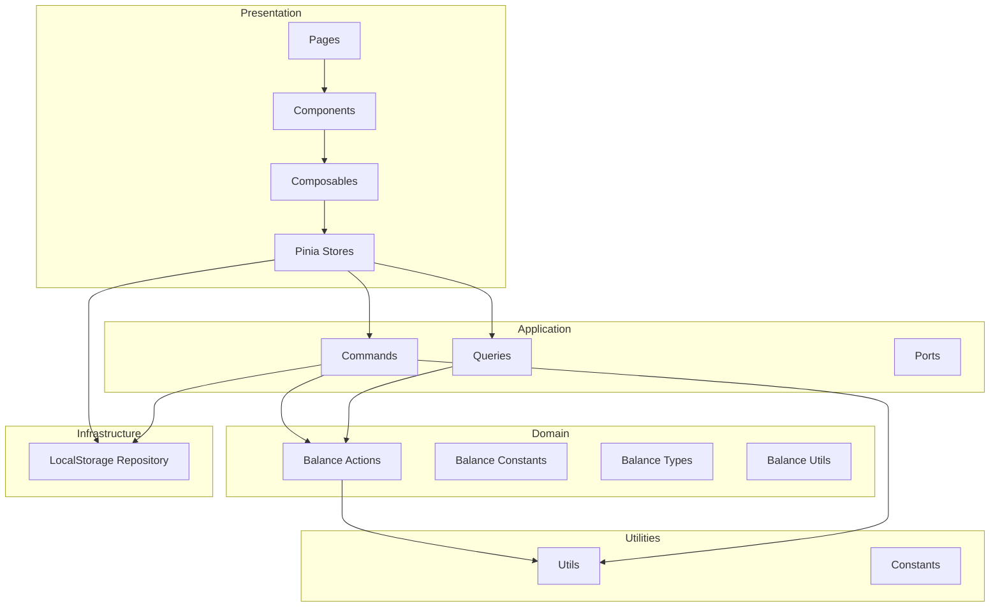
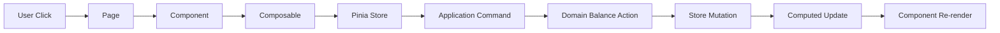
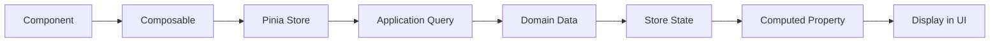

# Обзор архитектуры проекта Game Life

**Последнее обновление:** 2 июля 2026
**Технологический стек:** Nuxt 4 + Vue 3 + TypeScript + Pinia + Nitro Server API

---

## Обзор

Проект Game Life использует слоистую архитектуру с чётким разделением ответственности по направлению зависимостей:

```
utils/constants → domain → application → infrastructure → stores/composables → components → pages
```

Импорты идут только вниз по цепочке зависимостей. Если код нужен верхним слоям, он должен быть открыт через ближайший `index.ts`.

---

## Архитектурные слои


```mermaid
graph TB
    subgraph Presentation
        P1[Pages]
        P2[Components]
        P3[Composables]
        P4[Pinia Stores]
    end

    subgraph Application
        A1[Commands]
        A2[Queries]
        A3[Ports]
    end

    subgraph Domain
        D1[Balance Actions]
        D2[Balance Constants]
        D3[Balance Types]
        D4[Balance Utils]
    end

    subgraph Infrastructure
        I1[LocalStorage Repository]
    end

    subgraph Utilities
        U1[Utils]
        U2[Constants]
    end

    P1 --> P2
    P2 --> P3
    P3 --> P4
    P4 --> A1
    P4 --> A2
    A1 --> D1
    A2 --> D1
    P4 --> I1
    A1 --> I1
    D1 --> U1
    A1 --> U1
```

---

## Правила импортов между слоями

| Слой | Может импортировать |
|------|---------------------|
| Pages | components, composables, stores, middleware |
| Components | composables, stores, utils, constants, другие components |
| Composables | stores, application, domain, utils, constants |
| Stores | application, domain, infrastructure, utils, constants |
| Application | domain, utils, constants |
| Domain | только utils, constants |
| Infrastructure | domain, utils, constants |
| Utils | ничего из других слоев |
| Constants | ничего из других слоев |

---

## 1. Domain Layer (Доменный слой)

**Путь:** `src/domain/`

**Назначение:** Бизнес-логика игры, данные баланса, утилиты домена

**Зависимости:** только `utils` и `constants`

### Структура

```
src/domain/
├── game-world/            # GameWorld aggregate (ADR-0005, Strategy A)
│   ├── GameWorld.ts       # State-container класс (slices: time/stats/wallet/...)
│   ├── GameWorld.types.ts # GameWorldSnapshot, slice types
│   ├── bridge.ts          # @deprecated миграционный bridge (fromStores/applyToStores)
│   ├── bridge.types.ts    # StoresSnapshot, StoresLoadTarget
│   ├── game-facade/       # Тонкая обёртка над GameWorld
│   └── commands/          # Domain commands + pure mutations
│       ├── commands.types.ts
│       ├── mutations.ts        # Pure мутации над world (stat/money/time/career/...)
│       ├── execute-action.ts
│       ├── simulate-work-shift.ts
│       ├── resolve-event-decision.ts
│       └── index.ts
│
├── game-mode/             # Server-first migration: типы режимов (Stage 1)
│   ├── game-mode.types.ts # GameMode, GameModeConfig, SyncStatus
│   └── index.ts
│
├── api-contract/          # Server-first migration: shared API типы (Stage 1)
│   ├── types.ts           # ApiResponse, SyncResponse, ApiErrorCode, ...
│   └── index.ts
│
└── balance/
    ├── actions/            # ~222 игровых действий в 10 категориях
    │   ├── index.ts       # Реэкспорт всех действий
    │   ├── action-schema.ts  # Схема действий
    │   ├── career-actions.ts
    │   ├── education-actions.ts
    │   ├── finance-actions.ts
    │   ├── fun-actions.ts
    │   ├── health-actions.ts
    │   ├── home-actions.ts
    │   ├── selfdev-actions.ts
    │   ├── shop-actions.ts
    │   ├── social-actions.ts
    │   ├── hobby-actions.ts
    │   └── child-actions.ts
    │
    ├── constants/          # Статические данные баланса
    │   ├── career-jobs.ts  # Должности и зарплата
    │   ├── education-programs.ts # Программы обучения
    │   ├── education-paths.ts # Пути обучения
    │   ├── housing-levels.ts # Уровни жилья
    │   ├── game-events.ts  # Игровые события
    │   ├── recovery-tabs.ts # Табы восстановления
    │   ├── skill-progression-config.ts # Конфигурация прогрессии навыков
    │   ├── skill-modifiers.ts # Модификаторы навыков
    │   ├── skill-effects-generator.ts # Генератор эффектов навыков
    │   ├── skill-constants.ts # Константы навыков
    │   ├── childhood-events/ # События детства
    │   ├── childhood-skills.ts # Навыки детства
    │   ├── personality-traits.ts # Черты личности
    │   ├── default-save.ts # Сейв по умолчанию
    │   ├── initial-save.ts # Начальный сейв
    │   ├── activity-log.ts # Настройки журнала активности
    │   ├── work-result-tiers.ts # Тиры результатов работы
    │   ├── work-economy.ts # Экономика работы
    │   ├── monthly-expenses-defaults.ts # Ежемесячные расходы
    │   └── index.ts
    │
    ├── types/              # TypeScript типы домена
    │   ├── index.ts        # Реэкспорт всех типов
    │   ├── activity-log.ts
    │   ├── childhood-event.ts
    │   ├── childhood-skill.ts
    │   ├── life-memory.ts
    │   ├── personality.ts
    │   └── ...
    │
    └── utils/              # Утилиты домена
        ├── index.ts        # Реэкспорт всех утилит
        ├── build-new-game-save.ts
        ├── build-adult-game-save.ts
        ├── education-ranks.ts
        ├── hourly-rates.ts
        ├── skill-system.ts
        ├── skill-ui-explainability.ts
        ├── skill-tooltip-content.ts
        ├── stat-changes-format.ts
        └── index.ts
```

### Категории действий

- **shop** - покупки
- **fun** - развлечения
- **home** - домашние дела
- **social** - социальные действия
- **education** - образование
- **finance** - финансы
- **career** - карьера
- **hobby** - хобби
- **health** - здоровье
- **selfdev** - саморазвитие

---

## 2. Application Layer (Прикладной слой)

**Путь:** `src/application/game/`

**Назначение:** Use Cases, координация между Domain и Infrastructure

**Зависимости:** domain, utils, constants

### Структура

```
src/application/game/
├── commands.ts                # Pure commands (signature: (world: GameWorld, ...) => Result)
├── queries.ts                 # Pure queries (signature: (world: GameWorld, ...) => Data)
├── SPAExecutor.ts             # createSPAExecutor(snapshotProvider, loadTarget) - sync SPA executor (Фаза 4)
├── spa-async-executor.ts      # Async-адаптер над pure commands (server-first Stage 2)
├── server-executor.ts         # ServerExecutor: $fetch к Nitro API (Stage 5)
├── server-query-executor.ts   # ServerQueryExecutor: $fetch GET endpoints (Stage 5)
├── executor-factory.ts        # createExecutor(mode) — DI factory (Stage 2)
├── state-sync.ts              # loadWorldFromServer, syncWorldWithServer (Stage 5.3)
├── error-handler.ts           # parseApiError, isNetworkError (Stage 5.4)
├── offline-queue.ts           # OfflineQueueManager (Stage 5.5)
├── legacy.ts                  # @deprecated appGameCommands/appGameQueries shim
├── index.types.ts             # GameExecutor, GameQueryExecutor, CommandOutcome, ...
├── async-executor.types.ts    # AsyncGameExecutor, AsyncGameQueryExecutor (Stage 1)
├── server-executor.types.ts   # ServerExecutorOptions (Stage 5)
├── server-sync.types.ts       # StateSyncResult, ConflictInfo, ParsedApiError (Stage 5)
├── offline-queue.types.ts     # QueuedAction, SyncOutcome (Stage 5)
├── index.ts                   # Реэкспорт
└── ports/
    ├── SaveRepository.ts          # @deprecated (пустой, тип вынесен)
    └── SaveRepository.types.ts    # Порт для persistence
```

### Architecture (ADR-0005 + Server-first migration)

Application layer чистый: 0 импортов Pinia, 0 импортов infrastructure. Все команды принимают `world: GameWorld` первым аргументом.

**Server-first миграция (Stages 1-7 завершены):**
- `createExecutor(mode)` factory выбирает executor по game-mode (DI, без импортов infrastructure)
- SPA режим: `spa-async-executor.ts` оборачивает pure commands в `Promise.resolve`
- Server режим: `server-executor.ts` делает `$fetch` к Nitro API
- Hybrid режим: SPA fallback с offline queue
- `OfflineQueueManager` буферизует действия при offline, синхронизируется через `POST /api/game/sync`

См. [`SERVER_MIGRATION.md`](../SERVER_MIGRATION.md) для полного описания.

### Commands

**Основные команды:**
- `executeLifestyleAction` - выполнение действий восстановления
- `simulateWorkShift` - симуляция рабочего периода
- `changeCareer` - смена карьеры
- `startEducationProgram` - начало обучения
- `advanceEducation` - прогресс обучения
- `executeFinanceDecision` - финансовые решения
- `resolveEventDecision` - выбор в событиях
- `advanceTime` - продвижение времени

### Queries

**Основные запросы:**
- `getCareerTrack` - карьерный трек
- `getActivityLogEntries` - записи журнала
- `canStartEducationProgram` - проверка возможности обучения
- `getFinanceOverview` - обзор финансов
- `canExecuteAction` - проверка возможности действия
- `getEventQueue` - очередь событий

### Ports

**SaveRepository:**
- `save(data)` - сохранение данных
- `load()` - загрузка данных

---

## 3. Infrastructure Layer (Инфраструктурный слой)

**Путь:** `src/infrastructure/persistence/`

**Назначение:** Реализация внешних зависимостей

**Зависимости:** domain, utils, constants

### Структура

```
src/infrastructure/persistence/
├── LocalStorageSaveRepository.ts # Реализация SaveRepository через localStorage
├── constants.ts                   # Константы persistence
└── save-event-migration.ts        # Миграция event schema в save load-path
```

### Реализация

**LocalStorageSaveRepository:**
- Реализует интерфейс `SaveRepository`
- Сохраняет данные в `localStorage`
- Загружает данные из `localStorage`
- Обрабатывает ошибки чтения/записи

---

## 4. Presentation Layer (Презентационный слой)

**Путь:** `src/components/`, `src/pages/`, `src/composables/`, `src/stores/`

**Назначение:** UI, пользовательский ввод, реактивность

### Компоненты

**Префиксные соглашения:**
- `Ui*` — только в `src/components/ui/`
- Layout компоненты — в `src/components/layout/`
- Game-специфичные — в `src/components/game/`
- Page-специфичные — в `src/components/pages/`

**Примеры UI компонентов:**
- `GameButton` — кнопка
- `ProgressBar` — прогресс-бар
- `StatBar` — бар стата
- `Modal` — модальное окно
- `Toast` — уведомление
- `Tooltip` — тултип
- `RoundedPanel` — панель

### Pinia Stores

**Основные stores:**
- `game.store` — главный хранилище игры
- `time-store` — система времени
- `player-store` — данные игрока
- `wallet-store` — кошелёк
- `career-store` — карьера
- `education-store` — образование
- `finance-store` — финансы
- `housing-store` — жильё
- `skills-store` — навыки
- `events-store` — события
- `actions-store` — действия
- `activity-store` — активность
- `stats-store` — статы

### Composables

**Основные composables:**
- `useActions` — работа с действиями
- `useFinance` — финансы
- `useEvents` — события
- `useToast` — уведомления
- `useActivityLog` — журнал активности
- `useSkills` — навыки
- `useTime` — система времени
- `useCareer` — карьера
- `useEducation` — образование
- `useWallet` — кошелёк
- `useHousing` — жильё
- `useGameModal` — модальные окна
- `useModalStack` — стек модальных окон

### Страницы (Nuxt Pages)

**Структура:**
```
src/pages/game/
├── index.vue              # Главная страница игры (Dashboard)
├── home/index.vue         # Дом (восстановление)
├── actions/index.vue      # Действия (восстановление)
├── work/index.vue         # Работа
├── finance/index.vue      # Финансы
├── education/index.vue    # Образование
├── skills/index.vue       # Навыки
├── events/index.vue       # События
└── shop/index.vue         # Магазин
```

---

## Структура проекта

```
src/
├── pages/               # Nuxt pages (маршруты)
├── components/
│   ├── layout/          # Layout компоненты
│   ├── ui/              # UI компоненты (общие)
│   ├── game/            # Game-специфичные компоненты
│   ├── pages/           # Page-специфичные компоненты
│   └── global/          # Глобальные компоненты
├── stores/              # Pinia stores
├── composables/         # Vue composables
├── domain/              # Domain layer
│   └── balance/         # Баланс: actions, constants, types, utils
├── application/         # Application layer (commands/queries)
├── infrastructure/      # Адаптеры, persistence
├── middleware/          # Nuxt route middleware
├── plugins/             # Nuxt/Vue плагины
├── utils/               # Утилиты
├── constants/           # Константы
├── config/              # Конфигурация (feature flags, UI-группировки)
└── assets/              # SCSS, изображения
```

---

## Поток данных

### User Action Flow


```mermaid
flowchart LR
    A[User Click] --> B[Page]
    B --> C[Component]
    C --> D[Composable]
    D --> E[Pinia Store]
    E --> F[Application Command]
    F --> G[Domain Balance Action]
    G --> H[Store Mutation]
    H --> I[Computed Update]
    I --> J[Component Re-render]
```

### Data Request Flow


```mermaid
flowchart LR
    A[Component] --> B[Composable]
    B --> C[Pinia Store]
    C --> D[Application Query]
    D --> E[Domain Data]
    E --> F[Store State]
    F --> G[Computed Property]
    G --> H[Display in UI]
```

---

## Интеграционные точки

### Nuxt Integration

- **Config:** `nuxt.config.ts`
- **Routing:** Файловый роутинг в `src/pages/`
- **Middleware:** `middleware/game-init.ts` для инициализации игры
- **Auto-import:** Компоненты, composables, stores импортируются автоматически
- **SPA Mode:** `ssr: false` - только клиентский рендеринг

### Pinia Integration

- **Stores:** Централизованное состояние в `src/stores/`
- **Auto-import:** Настроено через `imports.dirs: ['stores']`
- **Type-safe:** Все типизированы через TypeScript

### Aliases

Настроены алиасы в `nuxt.config.ts`:
- `@domain` → `src/domain/index.ts`
- `@utils` → `src/utils/index.ts`
- `@constants` → `src/constants/index.ts`
- `@composables` → `src/composables/index.ts`

---

## Преимущества архитектуры

### 1. Разделение ответственности

- **Domain:** Только бизнес-логика, без UI и инфраструктуры
- **Application:** Use Cases без бизнес-логики
- **Infrastructure:** Реализация внешних зависимостей
- **Presentation:** UI без бизнес-логики

### 2. Тестируемость

- **Domain:** Unit тесты для баланса и утилит
- **Application:** Unit тесты для commands/queries
- **Infrastructure:** Mock репозиториев для тестов
- **Composables:** Тесты с Vue Test Utils

### 3. Масштабируемость

- **Domain:** Легко добавлять новые действия и константы
- **Application:** Новые Use Cases без изменения Domain
- **Infrastructure:** Смена реализации репозитория (IndexedDB, API)

### 4. Переиспользуемость

- **Composables:** Переиспользуемая логика UI
- **Components:** Модульные Vue компоненты
- **Domain:** Баланс можно использовать в другом контексте

---

## Рекомендации по разработке

### Добавление новой функции

1. **Domain Layer:**
   - Добавить действие в `src/domain/balance/actions/`
   - Добавить константы при необходимости
   - Обновить типы в `src/domain/balance/types/`

2. **Application Layer:**
   - Добавить команду в `commands.ts` (если меняет состояние)
   - Добавить запрос в `queries.ts` (если нужен)

3. **Presentation Layer:**
   - Создать Vue компонент в `src/components/`
   - Создать composable для логики UI (при необходимости)
   - Использовать existing stores или создать новый

4. **Testing:**
   - Unit тесты для domain
   - Unit тесты для application
   - Component тесты при необходимости

### Добавление новой страницы

1. Создать Vue компонент в `src/pages/game/`
2. Создать page-specific компоненты в `src/components/pages/`
3. Создать composable для логики страницы (при необходимости)
4. Обновить навигацию в компонентах
5. Обновить документацию `PAGES_REFERENCE.md`

---

## Дополнительные документы

- **[PAGES_REFERENCE.md](PAGES_REFERENCE.md)** - Справочник Vue страниц и роутинга
- **[START_GAME_DOCUMENTATION.md](START_GAME_DOCUMENTATION.md)** - Документация старта игры
- **[IMPLEMENTATION_STATUS.md](IMPLEMENTATION_STATUS.md)** - Статус реализации модулей
- **[ROADMAP.md](ROADMAP.md)** - План разработки
- **[../adr/](../adr/)** - Architecture Decision Records

---

**Последнее обновление:** 2 июня 2026