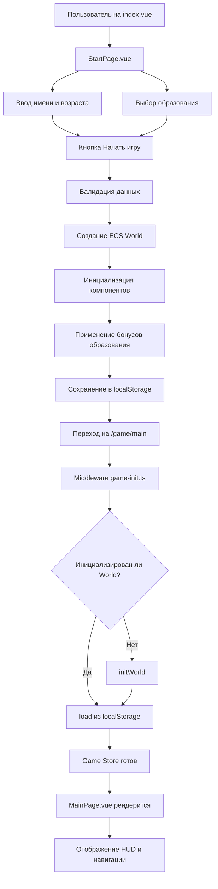

# Документация старта игры

**Дата создания:** 10 апреля 2026
**Версия игры:** 0.3.0
**Технологический стек:** Nuxt 4 + Vue 3 + TypeScript

---

## Обзор

В этом релизе реализована полноценная система создания персонажа и начального образования на базе Vue 3. Игрок может:

- Создать персонажа с именем и возрастом
- Выбрать путь образования (без образования, школа, школа+институт)
- Начать игру через инициализацию ECS World

---

## StartPage.vue

**Файл:** `src/pages/StartPage.vue`

### Назначение

Первая страница игры, где игрок создаёт своего персонажа и выбирает начальный путь развития.

### Функциональность

#### 1. Ввод имени персонажа

- **UI:** Панель с полем ввода
- **Валидация:**
  - Минимум 2 символа
  - Максимум 20 символов
  - Не пустое значение
- **Отображение:** Введённое имя показывается в поле
- **Компонент:** Использует стандартные Vue компоненты (Input, Button)

#### 2. Выбор начального возраста

- **Диапазон:** 18-30 лет
- **Управление:** Кнопки `-` и `+`
- **Отображение:** Крупный текст с текущим возрастом
- **Подсказка:** "Рекомендуется 18-25 лет"

#### 3. Выбор пути образования

Три варианта с разными результатами:

| Путь | Образование | Навыки | Бонусы | Последующая страница |
|------|-------------|---------|---------|-------------------|
| Без образования | Нет | 0 | Начальные деньги | MainPage (игра) |
| Школа | Среднее | +2 ко всем базовым навыкам | Начальный опыт в выбранной профессии | MainPage (игра) |
| Школа+институт | Высшее | +5 ко всем базовым навыкам, +1 профессиональный | Начальный опыт в выбранной профессии, возможность старовой работы | MainPage (игра) |

#### 4. Начало игры

- **Кнопка:** "Начать игру"
- **Валидация:** Проверяет заполненность всех полей
- **Действие:**
  1. Создаёт ECS World через `createWorldFromSave()`
  2. Инициализирует начальные компоненты игрока
  3. Сохраняет имя и возраст в ECS
  4. Применяет бонусы образования
  5. Сохраняет игру в localStorage
  6. Перенаправляет на `/game/main`

---

## Инициализация игры

### Nuxt Middleware: game-init.ts

**Файл:** `src/middleware/game-init.ts`

### Назначение

Автоматическая инициализация ECS World и загрузка сохранения при входе в игровые страницы.

### Логика работы

```typescript
export default defineNuxtRouteMiddleware((to) => {
  // Пропускаем не игровые маршруты
  if (!to.path.startsWith('/game')) {
    return
  }

  // Получаем Game Store
  const gameStore = useGameStore()

  // Инициализируем если нужно
  if (!gameStore.isInitialized) {
    gameStore.initWorld()
    gameStore.load()
  }
})
```

### Что делает middleware:

1. **Проверяет маршрут:** Работает только для путей, начинающихся с `/game`
2. **Проверяет инициализацию:** Проверяет флаг `isInitialized` в GameStore
3. **Создаёт ECS World:** Вызывает `initWorld()` для создания ECS World
4. **Загружает сохранение:** Вызывает `load()` для загрузки из localStorage
5. **Выполняется до рендеринга:** Гарантирует, что данные готовы

---

## Pinia Store: game.store.ts

**Файл:** `src/stores/game.store.ts`

### Назначение

Централизованное хранилище состояния игры с интеграцией ECS World.

### Основные методы

#### initWorld()

Создаёт ECS World и инициализирует начальное состояние:

```typescript
function initWorld(saveData?: Record<string, unknown>) {
  const w = createWorldFromSave(saveData)
  if (saveData?.playerName) {
    playerName.value = saveData.playerName as string
  }
  world.value = w
}
```

#### save()

Сохраняет текущее состояние в localStorage:

```typescript
function save() {
  if (!world.value) return
  const data = world.value.toJSON()
  saveRepository.save(data as unknown as Record<string, unknown>)
}
```

#### load()

Загружает сохранение из localStorage:

```typescript
function load(): boolean {
  const data = saveRepository.load()
  if (!data || !world.value) return false
  world.value.fromJSON(data)
  refresh()
  return true
}
```

### ECS World Integration

- **shallowRef:** ECS World хранится в shallowRef для оптимизации
- **Computed свойства:** Доступ к компонентам ECS через computed
- **triggerRef:** Обновление реактивности после изменений

```typescript
const world = shallowRef<ECSWorld | null>(null)
const playerName = ref<string>('')

// Computed свойства для компонентов ECS
const stats = computed(() => world.value?.getComponent<StatsComponent>(PLAYER_ENTITY, 'stats'))
const time = computed(() => world.value?.getComponent<TimeComponent>(PLAYER_ENTITY, 'time'))
// ... и так далее

// Обновление реактивности
function refresh() {
  if (world.value) {
    triggerRef(world)
  }
}
```

---

## Поток данных при старте игры

### Последовательность действий



### Слои данных

```
User Input (StartPage.vue)
    ↓
Vue Component (StartPage)
    ↓
Composable (если используется)
    ↓
Pinia Store (useGameStore)
    ↓
Application Layer (commands.ts)
    ↓
Domain Layer (gameDomainFacade)
    ↓
ECS World (создание сущности 'player')
    ↓
Components ECS (playerName, age, stats, skills, etc.)
    ↓
triggerRef(world) - обновление реактивности
    ↓
Vue Components (MainPage)
    ↓
Отображение игрового интерфейса
```

---

## Создание персонажа в ECS

### ECS Компоненты игрока

При создании персонажа инициализируются следующие компоненты:

```typescript
// Имя игрока
world.addComponent(PLAYER_ENTITY, {
  playerName: 'Алексей'
})

// Возраст
world.addComponent(PLAYER_ENTITY, {
  age: 25
})

// Статистика (6 шкал)
world.addComponent(PLAYER_ENTITY, {
  hunger: 100,
  energy: 100,
  stress: 0,
  mood: 80,
  health: 100,
  physical: 80
})

// Навыки
world.addComponent(PLAYER_ENTITY, {
  skills: {
    // Базовые навыки (начинаются с бонусами образования)
    cooking: initialSkill,
    cleaning: initialSkill,
    // ... другие навыки
  }
})

// Деньги
world.addComponent(PLAYER_ENTITY, {
  wallet: initialMoney
})

// Время
world.addComponent(PLAYER_ENTITY, {
  gameDays: 0,
  age: initialAge,
  currentPhase: 'work' // work, recovery, sleep
})

// Карьера
world.addComponent(PLAYER_ENTITY, {
  career: {
    currentJob: null,
    level: 0
  }
})
```

### Применение бонусов образования

```typescript
function applyEducationBonuses(world: ECSWorld, education: string) {
  switch (education) {
    case 'none':
      // Без бонусов
      break
    case 'school':
      // +2 ко всем базовым навыкам
      modifySkills(world, 2)
      break
    case 'institute':
      // +5 ко всем базовым навыкам
      modifySkills(world, 5)
      // +1 профессиональный навык
      addProfessionalSkill(world, 1)
      break
  }
}
```

---

## Навигация после старта

### Переход на MainPage

После успешного создания персонажа происходит:

1. **Nuxt Router перенаправляет** на `/game/main`
2. **Middleware game-init.ts** проверяет инициализацию
3. **Game Store загружает** сохранение (если есть) или использует свежесозданный World
4. **MainPage.vue рендерится** с данными игрока
5. **HUD отображается** с статистикой, деньгами, временем

### Структура MainPage

MainPage.vue содержит:

- **HUD (Heads-Up Display):** Отображение статистики, денег, времени
- **Навигация:** Кнопки для перехода на другие страницы (восстановление, карьера, финансы и т.д.)
- **Центральное содержимое:** В зависимости от выбранной секции

---

## Компоненты StartPage

### Используемые UI компоненты

```vue
<template>
  <div class="start-page">
    <!-- Панель ввода имени -->
    <Input
      v-model="playerName"
      placeholder="Введите имя персонажа"
      :validation="validateName"
    />

    <!-- Выбор возраста -->
    <div class="age-selector">
      <Button @click="decreaseAge">-</Button>
      <span class="age-value">{{ age }}</span>
      <Button @click="increaseAge">+</Button>
    </div>

    <!-- Выбор образования -->
    <div class="education-options">
      <Button
        v-for="option in educationOptions"
        :key="option.id"
        @click="selectEducation(option.id)"
        :selected="selectedEducation === option.id"
      >
        {{ option.name }}
      </Button>
    </div>

    <!-- Кнопка начала игры -->
    <Button
      @click="startGame"
      :disabled="!isValid"
      primary
    >
      Начать игру
    </Button>
  </div>
</template>
```

### Валидация формы

```typescript
function isValid(): boolean {
  return playerName.value.length >= 2 &&
         playerName.value.length <= 20 &&
         age.value >= 18 &&
         age.value <= 30 &&
         selectedEducation.value !== null
}
```

---

## Сохранение начального состояния

### Структура save-файла

```json
{
  "version": "0.3.0",
  "playerName": "Алексей",
  "entities": {
    "player": {
      "playerName": { "value": "Алексей" },
      "age": { "value": 25 },
      "stats": { "hunger": 100, "energy": 100, ... },
      "skills": { "cooking": 2, "cleaning": 2, ... },
      "wallet": { "balance": 10000 },
      "time": { "gameDays": 0, "age": 25, ... },
      "career": { "currentJob": null, "level": 0 },
      "education": { "completedSchool": false, ... }
    }
  },
  "createdAt": "2026-04-10T12:00:00Z",
  "lastSaved": "2026-04-10T12:00:00Z"
}
```

---

## Восстановление игры

### Кнопка "Новая игра"

MainPage содержит кнопку для сброса игры:

```vue
<Button @click="resetGame" secondary>
  Новая игра
</Button>
```

### Логика сброса

```typescript
function resetGame() {
  // Проверка подтверждения
  if (!confirm('Вы уверены, что хотите начать новую игру? Весь прогресс будет потерян.')) {
    return
  }

  // Очистка localStorage
  localStorage.removeItem('game-life-save')

  // Сброс Game Store
  playerName.value = ''
  world.value = null

  // Перенаправление на StartPage
  await navigateTo('/')
}
```

---

## Дополнительные замечания

### Reactivity and Performance

- **shallowRef:** ECS World в shallowRef для избежания глубокой реактивности
- **Computed свойства:** Доступ к компонентам ECS через computed для ленивой загрузки
- **triggerRef:** Только явное обновление реактивности после изменений

### Error Handling

- **Валидация формы:** Проверки перед созданием персонажа
- **Error boundaries:** Vue компоненты обрабатывают ошибки
- **Fallback:** Если сохранение повреждено, создается новый World

### Accessibility

- **ARIA labels:** На всех формах и кнопках
- **Keyboard navigation:** Поддержка навигации клавиатурой
- **Screen reader:** Доступность для экранных дикторов

---

*Документ создан для архитектуры Nuxt 4 + Vue 3 + TypeScript + Pinia*
