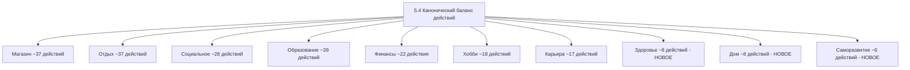

# План реорганизации раздела 5.4 — Канонический баланс действий

## Проблема

В файле `doc/GDD/modules/04_balance.md` строки 67–244 содержат список действий в двух форматах:
1. **Строки 67–88**: Небольшая markdown-таблица с 18 действиями — «старый» канонический баланс
2. **Строки 89–244**: rohsirennый список действий в **CSV-формате** — не отображается как таблица в markdown

Между ними есть дублирование — одни и те же действия описаны дважды с разными числовыми значениями.

## Задачи

### 1. Удалить дублирующую таблицу
Удалить строки 67–88 — старую markdown-таблицу. Оставить только расширенные данные из CSV, преобразовав их в markdown.

### 2. Преобразовать CSV в markdown-таблицы
Каждый блок CSV-данных превратить в отдельную markdown-таблицу с заголовком категории.

### 3. Согласовать навыки с кодом
В эффектах действий используются названия навыков. Нужно привести их в соответствие с реальными ключами из `src/balance/skills-constants.js`:

| Название в документе | Ключ в коде | Категория |
|---|---|---|
| Тайм-менеджмент | timeManagement | basic |
| Коммуникация | communication | basic |
| Финансовая грамотность | financialLiteracy | basic |
| Здоровый образ жизни | healthyLifestyle | basic |
| Адаптивность | adaptability | basic |
| Дисциплина | discipline | basic |
| Физическая форма | physicalFitness | basic |
| Эмоциональный интеллект | emotionalIntelligence | basic |
| Организованность | organization | basic |
| Креативность | basicCreativity | basic |
| Стрессоустойчивость | stressResistance | basic |
| Самоконтроль | selfControl | basic |
| Любознательность | curiosity | basic |
| Эмпатия | empathy | basic |
| Память | memory | basic |
| Профессионализм | professionalism | professional |
| Лидерство | leadership | professional |
| Переговоры | negotiations | professional |
| Аналитическое мышление | analyticalThinking | professional |
| Специализация | specialization | professional |
| Техническая грамотность | technicalLiteracy | professional |
| Кулинария | cooking | professional |
| Маркетинг | marketing | professional |
| Финансовый анализ | financialAnalysis | professional |
| Управление персоналом | personnelManagement | professional |
| Продажи | sales | professional |
| Стратегическое мышление | strategicPlanning | professional |
| Юридическая грамотность | legalLiteracy | professional |
| Медицинские знания | medicalKnowledge | professional |
| Харизма | charisma | social |
| Юмор | humor | social |
| Терпение | patience | social |
| Оптимизм | optimism | social |
| Ответственность | responsibility | social |
| Щедрость | generosity | social |
| Интуиция | intuition | social |
| Мудрость | wisdom | social |
| Художественное мастерство | artisticMastery | creative |
| Музыкальные способности | musicalAbility | creative |
| Писательское мастерство | writing | creative |
| Фотография | photography | creative |
| Садоводство | gardening | creative |
| Ремесло | handiness | creative |
| Танец | dance | creative |
| Актёрское мастерство | acting | creative |
| Дизайн интерьера | interiorDesign | creative |
| Кулинарное искусство | culinaryArt | creative |

**Примечание**: «Комфорт дома» и «Социальные связи» — это не навыки, а бонусные шкалы/модификаторы. Их можно оставить как эффекты, но не как навыки.

### 4. Добавить новые действия для разнообразия

#### Магазин — добавить ~6 действий
| Действие | Время | Стоимость | Эффекты |
|---|---|---|---|
| Купить абонемент в фитнес-клуб | 1ч | 8000/мес | Физическая форма +1/нед, Здоровье +2/нед |
| Купить домашнее животное | 2ч | 15000 | Настроение +10, Комфорт дома +8, Расходы +500/нед |
| Заказать здоровую доставку еды на неделю | 1ч | 5500 | Голод +35 на неделю, Здоровье +3 |
| Купить путёвку на выходные | 1.5ч | 12000 | Открывает «Поездка на выходные» |
| Купить инструмент для хобби — гитара | 1ч | 8500 | Музыкальные способности +1, Настроение +8 |
| Арендовать рабочее место в коворкинге | 1ч | 6000/мес | Профессионализм +1/нед, Карьера + шанс |

#### Отдых — добавить ~6 действий
| Действие | Время | Стоимость | Эффекты |
|---|---|---|---|
| Утренняя пробежка | 1ч | 0 | Физическая форма +4, Энергия +6, Стресс -5 |
| Плавание в бассейне | 1.5ч | 600 | Физическая форма +5, Стресс -12, Здоровье +3 |
| Шахматы / головоломки | 1.5ч | 0 | Аналитическое мышление +1, Настроение +6 |
| Генеральная уборка | 4ч | 500 | Комфорт дома +20, Организованность +2, Стресс -8 |
| Шопинг-терапия | 3ч | 3000+ | Настроение +16, Стресс -8 |
| Загорать / отдых на пляже | 4ч | 300 | Настроение +14, Стресс -10, Здоровье +2 |

#### Социальное — добавить ~8 действий
| Действие | Время | Стоимость | Эффекты |
|---|---|---|---|
| Пригласить друзей на ужин домой | 4ч | 2500 | Отношения +14, Настроение +16, Кулинария +1 |
| Познакомиться с новым человеком | 2ч | 500 | Отношения +6, Харизма +1, Настроение +5 |
| Написать старому другу | 0.5ч | 0 | Отношения +4, Настроение +4 |
| Свидание вслепую | 3ч | 1500 | Отношения +8 или -4, Настроение +10 или -5 |
| Поучаствовать в квесте/тимбилдинге | 4ч | 2000 | Отношения +12, Лидерство +1, Настроение +14 |
| Посетить открытое мероприятие | 3ч | 1000 | Социальные связи +8, Настроение +10 |
| Совместный выезд на природу | 8ч | 3500 | Отношения +20, Настроение +18, Стресс -14 |
| Поучаствовать в марафоне/забеге | 6ч | 1500 | Физическая форма +6, Отношения +8, Здоровье +3 |

#### Образование — добавить ~8 действий
| Действие | Время | Стоимость | Эффекты |
|---|---|---|---|
| Посещение библиотеки | 3ч | 0 | Обучение +10, Любознательность +1 |
| Участие в хакатоне/конкурсе | 8ч | 0 | Специализация +2, Профессионализм +2, шанс приза |
| Изучение истории | 2ч | 0 | Мудрость +1, Любознательность +1 |
| Изучение философии | 2.5ч | 0 | Мудрость +2, Эмоциональный интеллект +1 |
| Практика скорочтения | 1.5ч | 0 | Память +2, Любознательность +1 |
| Изучение основ права | 3ч | 0 | Юридическая грамотность +2 |
| Пройти онлайн-тестирование | 1ч | 500 | Навык +1, Самопознание |
| Изучение экологии и биологии | 2ч | 0 | Медицинские знания +1, Здоровый образ жизни +1 |

#### Финансы — добавить ~6 действий
| Действие | Время | Стоимость | Эффекты |
|---|---|---|---|
| Продать ненужные вещи | 3ч | — | +2000–8000 руб, Организованность +1 |
| Сдать недвижимость в аренду | 3ч | — | Пассивный доход +5000/мес |
| Открыть накопительный счёт | 1ч | 5000+ | Финансовая грамотность +1, Стресс -4 |
| Частично погасить ипотеку | 2ч | переменная | Стресс -12, Настроение +8 |
| Купить недвижимость | 6ч | 500000+ | Актив, Комфорт дома +25, Стресс -5 |
| Инвестировать в ПИФ | 2ч | 30000+ | Пассивный доход, Финансовый анализ +1 |

#### Хобби — расширить с 10 до ~18 действий
| Действие | Время | Стоимость | Эффекты |
|---|---|---|---|
| Столярное дело / работа с деревом | 3ч | 1200 | Ремесло +3, Настроение +10 |
| Оригами / бумажное искусство | 1.5ч | 300 | Креативность +2, Терпение +1 |
| Виноделие / домашнее пивоварение | 4ч | 2000 | Кулинарное искусство +2, Настроение +8 |
| Астрономия — наблюдение за звёздами | 3ч | 500 | Любознательность +2, Настроение +12 |
| Блогерство / подкаст | 4ч | 0 | Писательское мастерство +2, Маркетинг +1 |
| Каллиграфия | 2ч | 800 | Креативность +2, Дисциплина +1 |
| Стрит-арт / граффити | 3ч | 1500 | Художественное мастерство +2, Настроение +10 |
| Создание музыки на компьютере | 3ч | 0 | Музыкальные способности +2, Креативность +2 |

#### Карьера — расширить с 9 до ~16 действий
| Действие | Время | Стоимость | Эффекты |
|---|---|---|---|
| Запросить повышение | 1ч | 0 | Шанс повышения +20%, Переговоры +1 |
| Перейти на удалённую работу | 2ч | 0 | Стресс -8, Комфорт дома +5 |
| Начать side-project | 6ч | 5000 | Специализация +2, шанс доп. дохода |
| Менторство коллег | 3ч | 0 | Лидерство +2, Отношения +6 |
| Выступить на конференции | 4ч | 2000 | Харизма +2, Профессионализм +1, Социальные связи +8 |
| Написать статью для профильного журнала | 5ч | 0 | Писательское мастерство +1, Профессионализм +2 |
| Пройти аттестацию | 3ч | 0 | Профессионализм +2, шанс повышения |
| Открыть свой бизнес | 8ч | 200000+ | Пассивный доход?, Риск, Лидерство +2 |

### 5. Добавить новые категории

#### Здоровье — ~8 действий
| Действие | Время | Стоимость | Эффекты |
|---|---|---|---|
| Пройти медосмотр | 3ч | 3000 | Здоровье +8, Медицинские знания +1 |
| Сдать анализы | 2ч | 1500 | Здоровье +5, раннее обнаружение проблем |
| Посетить стоматолога | 2ч | 4000 | Здоровье +6, Настроение -3 |
| Пойти к психологу | 2ч | 3500 | Стресс -15, Эмоциональный интеллект +2 |
| Принять витамины | 0.5ч | 500 | Здоровье +4, Энергия +3 |
| Пройти курс лечебного массажа | 2ч | 4000 | Здоровье +8, Стресс -18 |
| Вакцинация | 1ч | 1200 | Здоровье +5, защита от болезней |
| Лечение простуды — постельный режим | 8ч | 800 | Здоровье +12, Энергия +15, пропускает работу |

#### Дом — ~8 действий
| Действие | Время | Стоимость | Эффекты |
|---|---|---|---|
| Мелкий ремонт | 3ч | 2000 | Комфорт дома +10, Ремесло +1 |
| Обустроить рабочее место | 2ч | 5000 | Профессионализм +1/нед, Комфорт дома +8 |
| Приготовить ужин дома | 2ч | 600 | Кулинария +2, Голод +30, Настроение +6 |
| Заказать клининг | 1ч | 3000 | Комфорт дома +15, Стресс -5 |
| Обустроить балкон / террасу | 4ч | 8000 | Комфорт дома +12, Настроение +8, Садоводство +1 |
| Установить систему умного дома | 3ч | 15000 | Комфорт дома +18, Техническая грамотность +1 |
| Постирать и убрать вещи | 2ч | 300 | Комфорт дома +8, Организованность +1 |
| Завести комнатное растение | 1ч | 500 | Комфорт дома +5, Садоводство +1, Настроение +3 |

#### Саморазвитие — ~6 действий
| Действие | Время | Стоимость | Эффекты |
|---|---|---|---|
| Утренняя рутина — зарядка + планирование | 1ч | 0 | Энергия +5, Дисциплина +1, Организованность +1 |
| Вечерняя рутина — рефлексия + подготовка | 1ч | 0 | Стресс -8, Мудрость +1, Эмоциональный интеллект +1 |
| Цифровой детокс — день без гаджетов | 8ч | 0 | Стресс -18, Настроение +10, Терпение +1 |
| Практика благодарности | 0.5ч | 0 | Настроение +8, Оптимизм +1 |
| Пройти личностный тест | 1.5ч | 500 | Самопознание, Интуиция +1 |
| Личное коучинг-занятие | 2ч | 4000 | Дисциплина +2, Мотивация +, Стресс -8 |

## Итоговая структура раздела 5.4



**Итого: ~220 действий** — было ~148, станет ~220.

## Формат итогового документа

Каждая категория оформляется так:

```markdown
#### Магазин

| Действие | Время | Стоимость | Эффекты |
|----------|-------|-----------|---------|
| Быстрый перекус | 0.5ч | 150 | Голод +22, Энергия +4, Стресс -2 |
| ... | ... | ... | ... |
```

Заголовок таблицы — **без** столбца «Категория», т.к. категория уже вынесена в подзаголовок.
