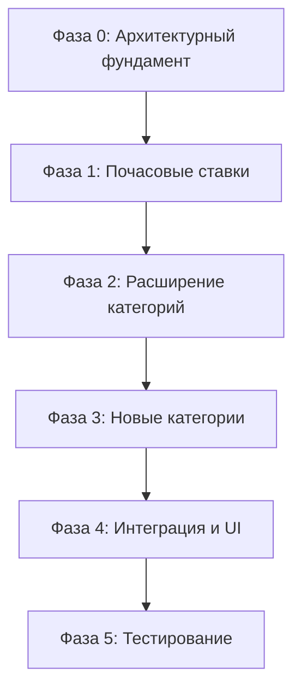

# План внедрения системы действий из GDD 04_balance.md

## 1. Обзор

### Цель плана
Внедрить полную систему действий (~220 действий в 10 категориях) из GDD [`04_balance.md`](doc/GDD/modules/04_balance.md) в кодовую базу Game Life, заменив текущую частичную реализацию (~23 действия, ~10% покрытие) на архитектурно целостную систему с почасовыми ставками, условиями доступности, подписками и новыми категориями.

### Текущее состояние vs целевое

| Метрика | Текущее | Целевое |
|---------|---------|---------|
| Действия | ~23 из ~220 | ~220 |
| Категории | 7 из 10 | 10 |
| Формат данных | Flat `statChanges` | Почасовые ставки + flat-бонусы |
| Условия доступности | Нет | `requirements` по навыкам, возрасту, образованию |
| Подписки | Нет | Фитнес, онлайн-сервисы, коворкинг |
| Кредиты | Нет | Кредиты, ипотека, долги |
| Уровни жилья | 3 | 5 |
| Штрафы за недосып | Не влияют | Влияют на энергию, стресс, эффективность |
| Возрастные штрафы | Нет | +0.5–1%/год после 40 |

### Общий подход — поэтапный



Каждая фаза завершается рабочим, тестируемым состоянием. Фаза 0 — критическая, без неё невозможно двигаться дальше.

---

## 2. Фаза 0: Архитектурный фундамент

**Приоритет:** P0 — критический  
**Зависимости:** нет  
**Цель:** Создать единый реестр действий и систему их обработки, устранив дублирование данных.

### 2.1. Расширенный формат карточки действия

Текущий формат в [`game-state.js`](src/game-state.js:231) (`RECOVERY_TABS[].cards[]`) не поддерживает многие механики из GDD. Необходимо расширить:

```js
// Новый формат action card
{
  // === Обязательные поля ===
  id: string,                    // Уникальный идентификатор: 'shop_quick_snack'
  category: string,              // Категория: 'shop' | 'fun' | 'home' | 'social' | 'education' | 'finance' | 'career' | 'hobby' | 'health' | 'selfdev'
  title: string,                 // Отображаемое название
  hourCost: number,              // Время в часах (обязательно)
  price: number,                 // Стоимость в рублях (0 = бесплатно)

  // === Эффекты на шкалы (flat-бонусы, применяются 1 раз) ===
  statChanges: {
    hunger?: number,
    energy?: number,
    stress?: number,
    mood?: number,
    health?: number,
    physical?: number,
  },

  // === Эффекты на навыки ===
  skillChanges?: { [skillKey: string]: number },

  // === Жилищные эффекты ===
  housingComfortDelta?: number,
  housingUpgradeLevel?: number,
  furnitureId?: string,

  // === Отношения ===
  relationshipDelta?: number,

  // === Финансы ===
  reserveDelta?: number,
  investmentReturn?: number,
  investmentDurationDays?: number,
  salaryMultiplierDelta?: number,
  educationLevel?: string,

  // === НОВЫЕ ПОЛЯ ===

  // Почасовые ставки (Фаза 1) — если заданы, statChanges игнорируются для этих шкал
  hourlyRates?: {
    hunger?: number,              // Изменение за 1 час (отрицательное = уменьшение)
    energy?: number,
    stress?: number,
    mood?: number,
    health?: number,
    physical?: number,
  },

  // Условия доступности
  requirements?: {
    minAge?: number,
    minSkills?: { [skillKey: string]: number },
    minEducationRank?: number,    // -1=нет, 0=среднее, 1=высшее
    housingLevel?: number,        // Минимальный уровень жилья
    requiresFurniture?: string[], // Необходимая мебель
    requiresItem?: string,        // Необходим купленный предмет (абонемент и т.д.)
    requiresRelationship?: boolean, // Наличие хотя бы 1 отношения
  },

  // Подписка (ежемесячная оплата)
  subscription?: {
    monthlyCost: number,          // Стоимость в месяц
    effectPerWeek?: {             // Эффект каждую неделю
      statChanges?: {},
      skillChanges?: {},
    },
  },

  // Кулдаун (минимальное время между повторами)
  cooldown?: {
    hours: number,                // Минимальные часы между использованиями
  },

  // Одноразовое действие
  oneTime?: boolean,              // true = можно выполнить только 1 раз

  // Флаги типа действия
  actionType?: 'sleep' | 'work' | 'recovery' | 'education' | 'social' | 'shopping' | 'hobby' | 'health' | 'selfdev',

  // Описание для UI
  effect: string,                 // Текстовое описание эффектов
  mood: string,                   // Подсказка/настроение
}
```

### 2.2. Файловая структура реестра действий

Данные действий перенести из [`game-state.js`](src/game-state.js:231) в отдельные файлы внутри `src/balance/actions/`:

```
src/balance/actions/
├── index.js              # Экспорт всех категорий + утилиты
├── shop-actions.js       # ~35 действий категории Магазин
├── fun-actions.js        # ~35 действий категории Отдых
├── home-actions.js       # ~16 действий категории Дом
├── social-actions.js     # ~28 действий категории Социальное
├── education-actions.js  # ~38 действий категории Образование
├── finance-actions.js    # ~21 действий категории Финансы
├── career-actions.js     # ~16 действий категории Карьера
├── hobby-actions.js      # ~18 действий категории Хобби
├── health-actions.js     # ~8 действий категории Здоровье
└── selfdev-actions.js    # ~6 действий категории Саморазвитие
```

**Файл [`src/balance/actions/index.js`](src/balance/actions/index.js):**
```js
// Экспорт всех действий + функция getActionsByCategory(categoryId)
// Экспорт ACTION_CATEGORIES — массив категорий с метаданными
```

### 2.3. Создание ActionSystem

Новая ECS-система [`src/ecs/systems/ActionSystem.js`](src/ecs/systems/ActionSystem.js) — единая точка обработки всех действий:

**Ответственность:**
- Проверка `requirements` (доступность действия)
- Проверка `cooldown` (кулдауны)
- Проверка `oneTime` (одноразовые действия)
- Расчёт итоговых эффектов (почасовые ставки × часы + flat-бонусы)
- Применение модификаторов навыков
- Применение модификаторов возраста
- Применение штрафов за недосып
- Вызов `TimeSystem.advanceHours()`
- Обновление подписок

**Методы:**
```js
class ActionSystem {
  init(world)
  canExecute(actionId) → { available: boolean, reason?: string }
  execute(actionId) → { success: boolean, summary: string }
  getAvailableActions(categoryId?) → Action[]
  getActionById(actionId) → Action | null
  processSubscriptions() → void  // Вызывается при месячном триггере
}
```

### 2.4. Удаление дублирования

После создания `ActionSystem`:

1. **Удалить** `RECOVERY_TABS` из [`game-state.js`](src/game-state.js:231) — данные переносятся в `src/balance/actions/`
2. **Удалить** `FINANCE_ACTIONS` из [`game-state.js`](src/game-state.js:492) — данные переносятся в `src/balance/actions/finance-actions.js`
3. **Удалить** `EDUCATION_PROGRAMS` из [`game-state.js`](src/game-state.js:330) — данные переносятся в `src/balance/actions/education-actions.js`
4. **Удалить** `CAREER_JOBS` из [`game-state.js`](src/game-state.js:373) — уже есть в [`src/balance/career-jobs.js`](src/balance/career-jobs.js)
5. **Удалить** `HOUSING_LEVELS` из [`game-state.js`](src/game-state.js:468) — уже есть в [`src/balance/housing-levels.js`](src/balance/housing-levels.js)
6. **Рефакторинг** [`RecoverySystem.js`](src/ecs/systems/RecoverySystem.js) — делегировать обработку действий в `ActionSystem`, оставить только UI-связанные методы

### 2.5. Новые компоненты ECS

Добавить в [`src/ecs/components/index.js`](src/ecs/components/index.js):

```js
export const SUBSCRIPTION_COMPONENT = 'subscriptions';    // Активные подписки
export const COOLDOWN_COMPONENT = 'cooldowns';            // Кулдауны действий
export const COMPLETED_ACTIONS_COMPONENT = 'completedActions'; // Одноразовые выполненные
export const CREDIT_COMPONENT = 'credits';                // Кредиты и долги
```

### 2.6. Конкретные файлы

| Действие | Файл | Тип |
|----------|------|-----|
| Создать | `src/balance/actions/index.js` | Новый |
| Создать | `src/balance/actions/shop-actions.js` | Новый |
| Создать | `src/balance/actions/fun-actions.js` | Новый |
| Создать | `src/balance/actions/home-actions.js` | Новый |
| Создать | `src/balance/actions/social-actions.js` | Новый |
| Создать | `src/balance/actions/education-actions.js` | Новый |
| Создать | `src/balance/actions/finance-actions.js` | Новый |
| Создать | `src/balance/actions/career-actions.js` | Новый |
| Создать | `src/balance/actions/hobby-actions.js` | Новый |
| Создать | `src/balance/actions/health-actions.js` | Новый |
| Создать | `src/balance/actions/selfdev-actions.js` | Новый |
| Создать | `src/ecs/systems/ActionSystem.js` | Новый |
| Изменить | `src/ecs/components/index.js` | Добавить 4 компонента |
| Изменить | `src/ecs/systems/index.js` | Экспорт ActionSystem |
| Изменить | `src/balance/index.js` | Экспорт actions |
| Изменить | `src/game-state.js` | Удалить RECOVERY_TABS, FINANCE_ACTIONS, EDUCATION_PROGRAMS, CAREER_JOBS, HOUSING_LEVELS |
| Изменить | `src/ecs/systems/RecoverySystem.js` | Делегирование в ActionSystem |
| Изменить | `src/scenes/recovery/RecoveryTabSceneCore.js` | Использовать ActionSystem вместо RecoverySystem |

**Ориентировочный объём:** ~1500–2000 строк (данные действий) + ~400 строк (ActionSystem) + ~200 строк (рефакторинг)

---

## 3. Фаза 1: Почасовые ставки шкал

**Приоритет:** P0 — критический  
**Зависимости:** Фаза 0  
**Цель:** Реализовать систему почасовых ставок из раздела 5.2 GDD.

### 3.1. Таблица базовых почасовых ставок

Создать файл [`src/balance/hourly-rates.js`](src/balance/hourly-rates.js):

```js
export const HOURLY_RATES = {
  work: {
    hunger: -2.2,
    energy: -2.7,
    stress: +1.9,
    mood: -1.0,
    health: -0.25,
    physical: -0.5,
  },
  neutral: {
    hunger: -1.4,
    energy: -1.6,
    stress: +0.6,
    mood: +0.4,
    health: -0.1,
    physical: -0.2,
  },
  sleep: {
    hunger: -0.6,
    energy: +6.8,
    stress: -3.1,
    mood: +2.5,
    health: +0.2,
    physical: +0.1,
  },
};
```

### 3.2. Интеграция с ActionSystem

В [`ActionSystem.execute()`](src/ecs/systems/ActionSystem.js) при обработке действия:

1. Определить `actionType` из карточки действия
2. Получить базовые почасовые ставки из `HOURLY_RATES[actionType]`
3. Умножить на `hourCost` для получения базового эффекта
4. Добавить flat-бонусы из `statChanges` карточки
5. Применить модификаторы навыков из [`skill-modifiers.js`](src/balance/skill-modifiers.js)
6. Применить возрастные штрафы (см. 3.4)
7. Применить штрафы за недосып (см. 3.3)

### 3.3. Штрафы за недосып

Реализовать в [`TimeSystem.js`](src/ecs/systems/TimeSystem.js:110) или [`ActionSystem.js`](src/ecs/systems/ActionSystem.js):

`sleepDebt` уже считается в [`TimeSystem.advanceHours()`](src/ecs/systems/TimeSystem.js:134). Необходимо:

1. При `sleepDebt > 0` применять штрафы к **следующему дню**:
   - Энергия: `-sleepDebt * 1.5` (дополнительно к базовому расходу)
   - Стресс: `+sleepDebt * 0.8`
   - Эффективность работы: `-(sleepDebt * 2)%` к `workEfficiencyMultiplier`

2. Добавить компонент или поле в `STATS_COMPONENT`:
   ```js
   sleepDebtPenalty: number  // Активный штраф, пересчитывается при advanceHours
   ```

3. Сброс `sleepDebt` при сне ≥ 7ч (уже частично реализовано в [`TimeSystem.js:141`](src/ecs/systems/TimeSystem.js:141))

### 3.4. Возрастные штрафы

Создать функцию в [`src/balance/hourly-rates.js`](src/balance/hourly-rates.js):

```js
export function getAgingPenalty(currentAge) {
  if (currentAge < 40) return 1.0;
  // +0.75% за каждый год после 40 (среднее между 0.5% и 1%)
  return 1.0 + (currentAge - 40) * 0.0075;
}
```

Применяется как множитель ко всем **негативным** изменениям шкал.

### 3.5. Модификаторы навыков

Уже реализовано в [`skill-modifiers.js`](src/balance/skill-modifiers.js). Интегрировать в `ActionSystem`:

- `hungerDrainMultiplier` → модификатор расхода голода
- `energyDrainMultiplier` → модификатор расхода энергии
- `stressGainMultiplier` → модификатор прироста стресса
- `moodRecoveryMultiplier` → модификатор восстановления настроения
- `healthDecayMultiplier` → модификатор падения здоровья
- `allRecoveryMultiplier` → глобальный модификатор восстановления

Диапазон модификаторов: **от -40% до +30%** (по GDD раздел 5.2).

### 3.6. Конкретные файлы

| Действие | Файл | Тип |
|----------|------|-----|
| Создать | `src/balance/hourly-rates.js` | Новый (~80 строк) |
| Изменить | `src/ecs/systems/ActionSystem.js` | Расчёт ставок (~150 строк) |
| Изменить | `src/ecs/systems/TimeSystem.js` | Штрафы sleepDebt (~30 строк) |
| Изменить | `src/balance/index.js` | Экспорт hourly-rates |

**Ориентировочный объём:** ~260 строк

---

## 4. Фаза 2: Расширение существующих категорий

**Приоритет:** P1 — высокий  
**Зависимости:** Фаза 0, Фаза 1  
**Цель:** Добавить недостающие действия в 7 существующих категорий.

### 4.1. Магазин (3 → 35 действий)

**Текущее** ([`game-state.js:264`](src/game-state.js:264)): Быстрый перекус, Полноценный обед, Запас продуктов домой  
**Целевое** (GDD [`04_balance.md:73`](doc/GDD/modules/04_balance.md:73)): 35 действий

**Ключевые новые механики:**
- **Подписки:** `subscription.monthlyCost` — для «Подписка на онлайн-сервисы» (799/мес), «Купить абонемент в фитнес-клуб» (8000/мес), «Арендовать рабочее место в коворкинге» (6000/мес), «Заказать здоровую доставку еды на неделю» (5500)
- **Одноразовые покупки:** `oneTime: true` — для «Купить домашнее животное», «Купить музыкальный инструмент», «Бытовая техника»
- **Условия:** `requiresRelationship` — для «Детские товары» и «Подарок для партнёра»
- **Открывает действия:** «Купить путёвку на выходные» → открывает действие в Отдыхе

**Файл:** [`src/balance/actions/shop-actions.js`](src/balance/actions/shop-actions.js) (~350 строк)

### 4.2. Отдых (3 → 35 действий)

**Текущее** ([`game-state.js:277`](src/game-state.js:277)): Вечер дома, Кино или прогулка, Спортзал  
**Целевое** (GDD [`04_balance.md:112`](doc/GDD/modules/04_balance.md:112)): 35 действий

**Ключевые новые механики:**
- **Сон как действие:** «Сон (рекомендуемый 8 часов)» и «Короткий сон» — `actionType: 'sleep'`, используют почасовые ставки сна
- **Условие по предмету:** «Тренировка в спортзале» → `requiresItem: 'fitness_membership'`
- **Кулдауны:** «День в спа-центре» → `cooldown: { hours: 168 }` (раз в неделю)
- **Навыки через отдых:** Медитация → `emotionalIntelligence +1`, Шахматы → `analyticalThinking +1`

**Файл:** [`src/balance/actions/fun-actions.js`](src/balance/actions/fun-actions.js) (~350 строк)

### 4.3. Социальное (3 → 28 действий)

**Текущее** ([`game-state.js:302`](src/game-state.js:302)): Встретиться с другом, Позвонить родителям, Свидание  
**Целевое** (GDD [`04_balance.md:153`](doc/GDD/modules/04_balance.md:153)): 28 действий

**Ключевые новые механики:**
- **Случайные исходы:** «Ссора и примирение» → отношения -10 или +15 (рандом)
- **Свидание вслепую** → рандомный исход настроения и отношений
- **Условие отношений:** Многие действия требуют `requiresRelationship: true`
- **Нетворкинг** → шанс повышения (интеграция с CareerProgressSystem)

**Файл:** [`src/balance/actions/social-actions.js`](src/balance/actions/social-actions.js) (~280 строк)

### 4.4. Образование (3 программы → 38 действий)

**Текущее** ([`game-state.js:290`](src/game-state.js:290)): 3 программы (книга, курс, институт)  
**Целевое** (GDD [`04_balance.md:186`](doc/GDD/modules/04_balance.md:186)): 38 действий

**Ключевые новые механики:**
- **Действия-занятия:** Каждое действие — 1 занятие (не целая программа)
- **Разнообразие навыков:** Каждое действие даёт разные навыки (кулинария, фотография, программирование и т.д.)
- **Стоимость:** Некоторые действия платные (вебинар 1200₽, мастер-класс 2500₽, MBA 4500₽)
- **Подписка:** «Онлайн-курс» может требовать подписку на образовательную платформу

**Файл:** [`src/balance/actions/education-actions.js`](src/balance/actions/education-actions.js) (~380 строк)

### 4.5. Финансы (3 → 21 действие)

**Текущее** ([`game-state.js:316`](src/game-state.js:316)): Отложить в резерв, Открыть депозит, Пересмотреть бюджет  
**Целевое** (GDD [`04_balance.md:229`](doc/GDD/modules/04_balance.md:229)): 21 действие

**Ключевые новые механики:**
- **Кредитная система:** «Взять кредит» → создаёт запись в `CREDIT_COMPONENT` с ежемесячным платежом
- **Ипотека:** «Купить недвижимость» → кредит на 500000+ с ежемесячным платежом
- **Страхование:** «Страхование жизни/здоровья» → подписка 12000/год
- **Пассивный доход:** «Сдать недвижимость в аренду» → +5000/мес
- **Продажа вещей:** «Продать ненужные вещи» → +2000–8000₽ (рандом)

**Новый компонент `CREDIT_COMPONENT`:**
```js
{
  credits: [
    {
      id: string,
      type: 'consumer' | 'mortgage' | 'business',
      principal: number,       // Остаток долга
      monthlyPayment: number,  // Ежемесячный платёж
      interestRate: number,    // Годовая ставка %
      monthsRemaining: number, // Месяцев до погашения
    }
  ]
}
```

**Файл:** [`src/balance/actions/finance-actions.js`](src/balance/actions/finance-actions.js) (~210 строк)

### 4.6. Карьера (4 должности + работа → 16 действий)

**Текущее** ([`career-jobs.js`](src/balance/career-jobs.js)): 4 должности + рабочий период  
**Целевое** (GDD [`04_balance.md:278`](doc/GDD/modules/04_balance.md:278)): 16 действий + расширение должностей

**Ключевые новые механики:**
- **Действия карьеры:** Сверхурочная, собеседование, фриланс, нетворкинг, повышение, менторство
- **Условия по должности:** «Запросить повышение» → `requirements.minSkills.leadership >= 3`
- **Бизнес:** «Открыть свой бизнес» → 200000+₽, пассивный доход с риском
- **Side-project:** «Начать side-project» → шанс дополнительного дохода

**Расширение [`career-jobs.js`](src/balance/career-jobs.js):**
Добавить должности из GDD 5.3:
- Курьер/Фрилансер (свободный график, 400–900₽/ч)
- Продавец/Официант (40–48ч/нед, 460–700₽/ч)
- Специалист IT (40ч/нед, 1375–1875₽/ч)
- Менеджер среднего звена (40ч/нед, 2000–2750₽/ч)

**Файл:** [`src/balance/actions/career-actions.js`](src/balance/actions/career-actions.js) (~160 строк) + обновление [`career-jobs.js`](src/balance/career-jobs.js) (~50 строк)

### 4.7. Дом (5 → 16 действий)

**Текущее** ([`game-state.js:239`](src/game-state.js:239)): Хорошая кровать, Холодильник, Декор, 2 переезда  
**Целевое** (GDD [`04_balance.md:312`](doc/GDD/modules/04_balance.md:312)): 16 действий

**Ключевые новые механики:**
- **Расширение уровней жилья:** 3 → 5 уровней (добавить «Комната» как уровень 0 и «Дом» как уровень 4)
- **Одноразовые улучшения:** Мелкий ремонт, обустройство рабочего места, умный дом
- **Регулярные действия:** Приготовить ужин, постирать, клининг
- **Условия по жилью:** «Установить систему умного дома» → `requirements.housingLevel >= 2`

**Обновление [`housing-levels.js`](src/balance/housing-levels.js):**
```js
// Добавить 2 уровня:
{ level: 0, name: 'Комната', baseComfort: 15, monthlyHousingCost: 8000, upgradePrice: 0, maxItems: 6, comfortBonus: 0 }
{ level: 4, name: 'Дом', baseComfort: 90, monthlyHousingCost: 35000, upgradePrice: 2500000, maxItems: 30, comfortBonus: 1.0 }
```

**Файл:** [`src/balance/actions/home-actions.js`](src/balance/actions/home-actions.js) (~160 строк) + обновление [`housing-levels.js`](src/balance/housing-levels.js) (~20 строк)

### 4.8. Сводка по Фазе 2

| Категория | Текущее | Добавить | Файл |
|-----------|---------|----------|------|
| Магазин | 3 | +32 | `shop-actions.js` |
| Отдых | 3 | +32 | `fun-actions.js` |
| Социальное | 3 | +25 | `social-actions.js` |
| Образование | 3 | +35 | `education-actions.js` |
| Финансы | 3 | +18 | `finance-actions.js` |
| Карьера | 1 | +15 | `career-actions.js` |
| Дом | 5 | +11 | `home-actions.js` |
| **Итого** | **21** | **+168** | |

**Ориентировочный объём:** ~1900 строк (данные) + ~200 строк (кредитная система) + ~70 строк (расширение housing/career)

---

## 5. Фаза 3: Новые категории

**Приоритет:** P1 — высокий  
**Зависимости:** Фаза 0, Фаза 1  
**Цель:** Добавить 3 отсутствующие категории (Хобби, Здоровье, Саморазвитие).

### 5.1. Хобби (0 → 18 действий)

GDD [`04_balance.md:255`](doc/GDD/modules/04_balance.md:255)

**Список действий:**
Рисование, Игра на инструменте, Написание текста, Фотография, Садоводство, Ремесло, Танцы дома, Кулинарные эксперименты, Создание контента, Коллекционирование, Столярное дело, Оригами, Виноделие, Астрономия, Блогерство, Каллиграфия, Стрит-арт, Создание музыки на компьютере

**Ключевые механики:**
- Все действия развивают творческие навыки
- Некоторые требуют покупок из Магазина (краски, гитара)
- «Создание контента» и «Блогерство» → шанс монетизации через `hobbyIncomeMultiplier`
- Навыки: `artisticMastery`, `musicalAbility`, `writing`, `photography`, `gardening`, `handiness`, `dance`, `acting`, `interiorDesign`, `culinaryArt`

**Файл:** [`src/balance/actions/hobby-actions.js`](src/balance/actions/hobby-actions.js) (~180 строк)

### 5.2. Здоровье (0 → 8 действий)

GDD [`04_balance.md:299`](doc/GDD/modules/04_balance.md:299)

**Список действий:**
Пройти медосмотр, Сдать анализы, Посетить стоматолога, Пойти к психологу, Принять витамины, Пройти курс лечебного массажа, Вакцинация, Лечение простуды

**Ключевые механики:**
- «Лечение простуды» → `actionType: 'sleep'`, пропускает работу (8ч, постельный режим)
- «Вакцинация» → устанавливает флаг защиты от болезней (интеграция с будущей системой болезней)
- «Пойти к психологу» → снижение стресса + `emotionalIntelligence +2`
- «Принять витамины» → быстрое действие (0.5ч), `oneTime: false`, можно повторять

**Файл:** [`src/balance/actions/health-actions.js`](src/balance/actions/health-actions.js) (~80 строк)

### 5.3. Саморазвитие (0 → 6 действий)

GDD [`04_balance.md:332`](doc/GDD/modules/04_balance.md:332)

**Список действий:**
Утренняя рутина, Вечерняя рутина, Цифровой детокс, Практика благодарности, Пройти личностный тест, Личное коучинг-занятие

**Ключевые механики:**
- «Утренняя рутина» → можно выполнять только в начале дня (условие по `hourOfDay < 10`)
- «Вечерняя рутина» → можно выполнять только вечером (условие по `hourOfDay >= 18`)
- «Цифровой детокс» → 8ч, блокирует некоторые действия на следующий день?
- «Пройти личностный тест» → `oneTime: true`, открывает информацию о персонаже

**Файл:** [`src/balance/actions/selfdev-actions.js`](src/balance/actions/selfdev-actions.js) (~60 строк)

### 5.4. Сводка по Фазе 3

| Категория | Действий | Файл |
|-----------|----------|------|
| Хобби | 18 | `hobby-actions.js` |
| Здоровье | 8 | `health-actions.js` |
| Саморазвитие | 6 | `selfdev-actions.js` |
| **Итого** | **32** | |

**Ориентировочный объём:** ~320 строк

---

## 6. Фаза 4: Интеграция и UI

**Приоритет:** P2 — средний  
**Зависимости:** Фаза 2, Фаза 3  
**Цель:** Обновить навигацию, сцены и визуальные индикаторы.

### 6.1. Обновление навигации

**Файл:** [`src/shared/constants.js`](src/shared/constants.js:10)

Добавить 3 новых пункта в `NAV_ITEMS`:

```js
export const NAV_ITEMS = [
  { id: 'home', icon: 'Д', label: 'Дом' },
  { id: 'shop', icon: 'М', label: 'Магазин' },
  { id: 'fun', icon: 'Р', label: 'Развлеч.' },
  { id: 'education', icon: 'О', label: 'Обучение' },
  { id: 'skills', icon: 'Н', label: 'Навыки' },
  { id: 'social', icon: 'С', label: 'Соц. жизнь' },
  { id: 'finance', icon: 'Ф', label: 'Финансы' },
  { id: 'hobby', icon: 'Х', label: 'Хобби' },        // НОВЫЙ
  { id: 'health', icon: 'З', label: 'Здоровье' },    // НОВЫЙ
  { id: 'selfdev', icon: 'Р', label: 'Развитие' },   // НОВЫЙ
];
```

### 6.2. Новые сцены

Создать 3 новых сцены по шаблону существующих:

| Сцена | Файл | Расширяет |
|-------|------|-----------|
| HobbyScene | `src/scenes/HobbyScene.js` | `RecoveryTabSceneCore` |
| HealthScene | `src/scenes/HealthScene.js` | `RecoveryTabSceneCore` |
| SelfdevScene | `src/scenes/SelfdevScene.js` | `RecoveryTabSceneCore` |

Каждая сцена — тонкая обёртка:
```js
export class HobbyScene extends RecoveryTabSceneCore {
  constructor() { super('HobbyScene', 'hobby'); }
}
```

### 6.3. Обновление RecoveryTabSceneCore

**Файл:** [`src/scenes/recovery/RecoveryTabSceneCore.js`](src/scenes/recovery/RecoveryTabSceneCore.js)

**Изменения:**

1. **Источник данных:** Заменить `RECOVERY_TABS` на `ActionSystem.getAvailableActions(categoryId)`
2. **Индикатор доступности:** Серый фон + замок для недоступных действий + тултип с причиной
3. **Индикатор кулдауна:** Таймер на карточке, если действие в кулдауне
4. **Индикатор подписки:** Значок 🔄 для действий с подпиской, отображение `/мес`
5. **Индикатор одноразовости:** Значок ✨ для `oneTime` действий, уже выполненные — с галочкой
6. **Отображение требований:** Под карточкой — список требований (навыки, возраст, образование)

### 6.4. Обновление MainGameSceneECS

**Файл:** [`src/scenes/MainGameSceneECS.js`](src/scenes/MainGameSceneECS.js)

- Зарегистрировать 3 новых сцены в Phaser
- Добавить навигацию для новых категорий
- Отображать активные подписки в панели информации

### 6.5. Обновление отображения шкал

**Файлы:** Сцены с отображением шкал

- Добавить визуальный индикатор `sleepDebt` (рядом с энергией)
- Добавить индикатор возраста с цветовой кодировкой (зелёный < 40, жёлтый 40–55, красный > 55)
- Критические значения шкал (< 20 или > 85 для стресса) — мигание

### 6.6. Конкретные файлы

| Действие | Файл | Тип |
|----------|------|-----|
| Создать | `src/scenes/HobbyScene.js` | Новый (~10 строк) |
| Создать | `src/scenes/HealthScene.js` | Новый (~10 строк) |
| Создать | `src/scenes/SelfdevScene.js` | Новый (~10 строк) |
| Изменить | `src/shared/constants.js` | Добавить 3 пункта NAV |
| Изменить | `src/scenes/recovery/RecoveryTabSceneCore.js` | Поддержка ActionSystem + UI-индикаторы |
| Изменить | `src/scenes/MainGameSceneECS.js` | Регистрация сцен + навигация |

**Ориентировочный объём:** ~400 строк (в основном изменения в RecoveryTabSceneCore)

---

## 7. Фаза 5: Тестирование и балансировка

**Приоритет:** P2 — средний  
**Зависимости:** Все предыдущие фазы  
**Цель:** Обеспечить корректность работы системы действий.

### 7.1. Юнит-тесты для ActionSystem

**Файл:** `test/ecs/ActionSystem.test.js`

**Тест-кейсы:**
- `canExecute()` — проверка доступности по требованиям
- `canExecute()` — проверка кулдаунов
- `canExecute()` — проверка одноразовых действий
- `execute()` — применение flat statChanges
- `execute()` — применение hourlyRates × hourCost
- `execute()` — применение модификаторов навыков
- `execute()` — применение возрастных штрафов
- `execute()` — применение штрафов за недосып
- `execute()` — списание денег
- `execute()` — продвижение времени
- `execute()` — создание подписки
- `execute()` — создание кредита
- `processSubscriptions()` — ежемесячная обработка

### 7.2. Тесты для почасовых ставок

**Файл:** `test/ecs/hourly-rates.test.js`

**Тест-кейсы:**
- Базовые ставки для work/neutral/sleep
- 8ч работы: голод -17.6, энергия -21.6, стресс +15.2, настроение -8.0
- 8ч сна: энергия +54.4, стресс -24.8, настроение +20.0
- 6ч сна: энергия +40.8 (недостаточно для компенсации рабочего дня)
- Модификаторы навыков в диапазоне -40%..+30%
- Возрастной штраф: 45 лет → множитель 1.0375

### 7.3. Интеграционные тесты

**Файл:** `test/ecs/integration-actions.test.js`

**Тест-кейсы:**
- Полный цикл: работа 8ч → магазин (обед) → отдых (сон 8ч) → проверка шкал
- Подписка: покупка фитнеса → ежемесячное списание → еженедельный бонус
- Кредит: взятие кредита → ежемесячный платёж → погашение
- Недосып: 3 дня по 5ч сна → накопление sleepDebt → штрафы
- Кулдаун: выполнение действия → проверка недоступности → ожидание → доступность

### 7.4. Балансировка

После прохождения тестов — ручная балансировка:

1. **Симуляция недели:** 40ч работы + 56ч сна + 72ч свободного времени → шкалы должны быть стабильными
2. **Симуляция месяца:** доходы vs расходы → должен быть небольшой положительный баланс при умеренной игре
3. **Кризисные сценарии:** что если игрок не ест 2 дня? не спит 3 дня? тратит все деньги?
4. **Прогрессия:** от 18 до 30 лет — рост доходов должен соответствовать росту расходов

### 7.5. Конкретные файлы

| Действие | Файл | Тип |
|----------|------|-----|
| Создать | `test/ecs/ActionSystem.test.js` | Новый (~300 строк) |
| Создать | `test/ecs/hourly-rates.test.js` | Новый (~150 строк) |
| Создать | `test/ecs/integration-actions.test.js` | Новый (~200 строк) |

**Ориентировочный объём:** ~650 строк тестов

---

## 8. Сводная таблица файлов

### Новые файлы (создать)

| Файл | Фаза | Строки |
|------|------|--------|
| `src/balance/actions/index.js` | 0 | ~60 |
| `src/balance/actions/shop-actions.js` | 2 | ~350 |
| `src/balance/actions/fun-actions.js` | 2 | ~350 |
| `src/balance/actions/home-actions.js` | 2 | ~160 |
| `src/balance/actions/social-actions.js` | 2 | ~280 |
| `src/balance/actions/education-actions.js` | 2 | ~380 |
| `src/balance/actions/finance-actions.js` | 2 | ~210 |
| `src/balance/actions/career-actions.js` | 2 | ~160 |
| `src/balance/actions/hobby-actions.js` | 3 | ~180 |
| `src/balance/actions/health-actions.js` | 3 | ~80 |
| `src/balance/actions/selfdev-actions.js` | 3 | ~60 |
| `src/balance/hourly-rates.js` | 1 | ~80 |
| `src/ecs/systems/ActionSystem.js` | 0 | ~400 |
| `src/scenes/HobbyScene.js` | 4 | ~10 |
| `src/scenes/HealthScene.js` | 4 | ~10 |
| `src/scenes/SelfdevScene.js` | 4 | ~10 |
| `test/ecs/ActionSystem.test.js` | 5 | ~300 |
| `test/ecs/hourly-rates.test.js` | 5 | ~150 |
| `test/ecs/integration-actions.test.js` | 5 | ~200 |

### Существующие файлы (изменить)

| Файл | Фаза | Изменения |
|------|------|-----------|
| `src/ecs/components/index.js` | 0 | +4 компонента |
| `src/ecs/systems/index.js` | 0 | +1 экспорт |
| `src/balance/index.js` | 0,1 | +2 экспорта |
| `src/game-state.js` | 0 | Удалить ~200 строк данных |
| `src/ecs/systems/RecoverySystem.js` | 0 | Рефакторинг, делегирование |
| `src/scenes/recovery/RecoveryTabSceneCore.js` | 4 | Источник данных + UI |
| `src/shared/constants.js` | 4 | +3 пункта NAV |
| `src/scenes/MainGameSceneECS.js` | 4 | +3 сцены + навигация |
| `src/ecs/systems/TimeSystem.js` | 1 | Штрафы sleepDebt |
| `src/balance/housing-levels.js` | 2 | +2 уровня |
| `src/balance/career-jobs.js` | 2 | +4 должности |

---

## 9. Порядок реализации

```mermaid
gantt
    title Порядок реализации фаз
    dateFormat X
    axisFormat %s

    section Фаза 0
    Архитектурный фундамент - реестр, ActionSystem, рефакторинг    :f0, 0, 1

    section Фаза 1
    Почасовые ставки, штрафы за недосып, возрастные штрафы         :f1, 1, 2

    section Фаза 2
    Расширение 7 категорий - 168 новых действий                    :f2, 2, 3

    section Фаза 3
    3 новые категории - Хобби, Здоровье, Саморазвитие              :f3, 2, 3

    section Фаза 4
    UI, навигация, сцены, индикаторы                               :f4, 3, 4

    section Фаза 5
    Тесты и балансировка                                           :f5, 4, 5
```



**Фазы 2 и 3 можно выполнять параллельно** — они независимы друг от друга и зависят только от Фаз 0 и 1.

**Критический путь:** Фаза 0 → Фаза 1 → Фаза 2/3 → Фаза 4 → Фаза 5

---

## 10. Риски и митигации

| Риск | Вероятность | Влияние | Митигация |
|------|-------------|---------|-----------|
| Нарушение обратной совместимости сохранений | Средняя | Высокое | Миграция данных в `MigrationSystem`, версия сохранения |
| Баланс почасовых ставок сломает игровой цикл | Средняя | Высокое | Параметры ставок в отдельном файле, легко настраивать |
| 220 действий — слишком много для UI | Низкая | Среднее | Пагинация, фильтры по доступности, поиск |
| Производительность при 220 действиях | Низкая | Низкое | Ленивая загрузка категорий, кеширование доступности |
