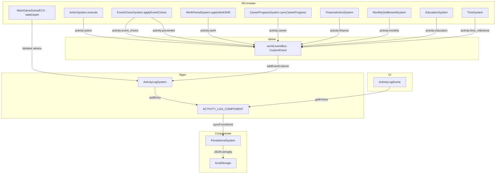

# План: Система логирования действий и событий (Activity Log)

## 1. Обзор системы

### 1.1. Назначение и цели

Система Activity Log предназначена для фиксации **всех значимых действий игрока и событий** в игре Game Life. Цели:

- Показать **хронологическую ленту** всего, что происходит с персонажем
- Отобразить **куда ходил**, **что делал**, **какие события происходили**
- Показать **последствия событий** — как изменились шкалы, навыки, деньги
- Зафиксировать **предотвращённые события** — когда навык персонажа повлиял на исход
- Обеспечить **фильтрацию по категориям** для быстрого поиска

### 1.2. Типы логируемых событий (категории)

| Категория | Константа | Описание | Цвет |
|-----------|-----------|----------|------|
| Действие | `LOG_ACTION` | Действия игрока через ActionSystem | `#4A7C9E` (синий) |
| Событие | `LOG_EVENT` | Случайные/сюжетные события и выборы | `#E8B94A` (жёлтый) |
| Изменение шкал | `LOG_STAT_CHANGE` | Значимые изменения шкал (крупные дельты) | `#FF6B6B` (красный) |
| Изменение навыков | `LOG_SKILL_CHANGE` | Повышение/понижение навыков | `#4EBF7A` (зелёный) |
| Финансы | `LOG_FINANCE` | Транзакции, зарплата, расходы | `#6FAE91` (бирюзовый) |
| Карьера | `LOG_CAREER` | Повышения, смены работы | `#D14D4D` (тёмно-красный) |
| Навигация | `LOG_NAVIGATION` | Переходы между сценами | `#9B9B9B` (серый) |
| Предотвращённое | `LOG_PREVENTED` | События, изменённые навыком | `#7ED9A0` (светло-зелёный) |
| Временное событие | `LOG_TIME` | Новый месяц, новый год, день рождения | `#C9A0DC` (фиолетовый) |
| Образование | `LOG_EDUCATION` | Начало/завершение курсов | `#6D9DC5` (голубой) |

### 1.3. Архитектурный подход

**Гибридный подход: event-driven через `world.eventBus` + прямая запись.**

```
┌──────────────┐     dispatchEvent      ┌──────────────────┐
│  ActionSystem │ ──────────────────────►│   world.eventBus  │
│  EventChoice  │                        │  (EventTarget)    │
│  WorkPeriod   │                        └────────┬─────────┘
│  CareerProg.  │                                 │ addEventListener
│  FinanceAct.  │                                 ▼
│  MonthlySet.  │                        ┌──────────────────┐
│  Education    │                        │ ActivityLogSystem │
│  TimeSystem   │                        │  (единый сборщик) │
└──────────────┘                        └────────┬─────────┘
                                                 │ addEntry
                                                 ▼
                                        ┌──────────────────┐
                                        │ ACTIVITY_LOG_     │
                                        │ COMPONENT         │
                                        └──────────────────┘
```

**Почему гибридный:**
- `world.eventBus` уже существует в [`ECSWorld`](src/ecs/world.js:10), но не используется — идеально для loosely-coupled логирования
- Системы-источники **не зависят** от ActivityLogSystem — они просто бросают события в шину
- ActivityLogSystem **подписывается** на события и решает, что записывать
- Для навигации между сценами — прямая запись из UI-слоя (нет доступа к eventBus в момент перехода)

**CustomEvent detail format:**
```js
world.eventBus.dispatchEvent(new CustomEvent('activity:action', {
  detail: { actionId, title, summary, statChanges, skillChanges, price, hourCost }
}));
```

---

## 2. Структура данных

### 2.1. Новый ECS-компонент `ACTIVITY_LOG_COMPONENT`

**Ключ компонента:** `'activity_log'`

**Структура данных компонента:**
```js
{
  entries: [],        // Array<ActivityLogEntry> — записи лога
  maxEntries: 500,    // Максимум хранимых записей (ротация)
  version: 1          // Версия формата для миграций
}
```

### 2.2. Константы типов записей

Добавить в [`src/ecs/components/index.js`](src/ecs/components/index.js:51):

```js
// Activity Log
export const ACTIVITY_LOG_COMPONENT = 'activity_log';

// Типы записей
export const LOG_TYPES = {
  ACTION: 'action',
  EVENT: 'event',
  STAT_CHANGE: 'stat_change',
  SKILL_CHANGE: 'skill_change',
  FINANCE: 'finance',
  CAREER: 'career',
  NAVIGATION: 'navigation',
  PREVENTED: 'prevented',
  TIME: 'time',
  EDUCATION: 'education',
};
```

### 2.3. Формат записи `ActivityLogEntry`

```js
{
  // Обязательные поля
  id: string,              // Уникальный ID записи (uuid-like: 'log_${timestamp}_${index}')
  type: string,            // Тип из LOG_TYPES
  timestamp: number,       // totalHours на момент записи
  gameDay: number,         // gameDays
  gameWeek: number,        // gameWeeks
  gameMonth: number,       // gameMonths
  gameYear: number,        // gameYears
  currentAge: number,      // currentAge персонажа
  title: string,           // Краткий заголовок (до 80 символов)
  description: string,     // Описание (до 200 символов)
  
  // Опциональные поля
  icon: string | null,     // Символ-иконка (emoji или буква)
  category: string | null, // Подкатегория (например, 'work_shift', 'random_event')
  
  // Метаданные (зависят от type)
  metadata: {
    // Для ACTION: { actionId, price, hourCost, statChanges, skillChanges }
    // Для EVENT: { eventId, choiceIndex, choiceLabel, outcome, statChanges, moneyDelta, skillChanges, skillCheckPassed }
    // Для FINANCE: { amount, direction: 'income'|'expense', balance }
    // Для CAREER: { oldJob, newJob, oldLevel, newLevel }
    // Для NAVIGATION: { fromScene, toScene }
    // Для PREVENTED: { eventId, reason, skillKey, skillValue }
    // Для TIME: { milestone: 'new_month'|'new_year'|'birthday' }
    // Для EDUCATION: { programId, programName, action: 'started'|'completed' }
  },
}
```

### 2.4. Ограничения на размер

- **Максимум записей:** 500 (настраиваемое значение в компоненте)
- **Ротация:** при превышении лимима удаляются самые старые записи (FIFO)
- **Оценка размера одной записи:** ~300–500 байт в JSON
- **Максимальный размер в localStorage:** ~250 КБ (500 × 500 байт)
- **Порог для агрегации:** изменения шкал < 5 единиц не логируются отдельно

---

## 3. ECS-инфраструктура

### 3.1. Компонент

**Файл:** [`src/ecs/components/index.js`](src/ecs/components/index.js) — добавить `ACTIVITY_LOG_COMPONENT` и `LOG_TYPES`

### 3.2. Система `ActivityLogSystem`

**Новый файл:** `src/ecs/systems/ActivityLogSystem.js`

```
class ActivityLogSystem
├── init(world)
│   ├── Сохранить ссылку на world
│   ├── Инициализировать ACTIVITY_LOG_COMPONENT если нет
│   └── Подписаться на eventBus: addEventListener для каждого типа
│
├── addEntry(entry)
│   ├── Сгенерировать id
│   ├── Добавить timestamp из TIME_COMPONENT
│   ├── Добавить в entries[]
│   ├── Проверить лимит → вызвать _rotateIfNeeded()
│   └── Вернуть созданную запись
│
├── getEntries(options?)
│   ├── options: { limit, offset, type, sinceDay }
│   └── Вернуть отфильтрованные записи (новые сверху)
│
├── getEntriesByType(type, limit?)
│   └── Фильтрация по type
│
├── getRecentEntries(count?)
│   └── Последние N записей
│
├── getEntriesByDayRange(fromDay, toDay)
│   └── Записи за диапазон дней
│
├── getEntryCount()
│   └── Общее количество записей
│
├── clearOldEntries(keepCount?)
│   └── Удалить старые записи, оставив keepCount
│
├── _rotateIfNeeded()
│   └── Если entries.length > maxEntries → удалить первые (самые старые)
│
├── _getCurrentTimestamp()
│   └── Получить totalHours, gameDay, gameWeek, gameMonth, gameYear, currentAge
│
├── _handleActionEvent(event)
│   └── Обработчик 'activity:action' → addEntry
│
├── _handleEventChoice(event)
│   └── Обработчик 'activity:event_choice' → addEntry
│
├── _handleFinanceEvent(event)
│   └── Обработчик 'activity:finance' → addEntry
│
├── _handleCareerEvent(event)
│   └── Обработчик 'activity:career' → addEntry
│
├── _handleTimeMilestone(event)
│   └── Обработчик 'activity:time_milestone' → addEntry
│
├── _handleEducationEvent(event)
│   └── Обработчик 'activity:education' → addEntry
│
└── _handleWorkEvent(event)
    └── Обработчик 'activity:work' → addEntry
```

### 3.3. Имена событий eventBus

| Событие | Когда отправляется | Кто отправляет |
|---------|-------------------|----------------|
| `activity:action` | После успешного выполнения действия | ActionSystem |
| `activity:event_choice` | После выбора в событии | EventChoiceSystem |
| `activity:work` | После рабочей смены | WorkPeriodSystem |
| `activity:career` | При карьерном повышении | CareerProgressSystem |
| `activity:finance` | При финансовой операции | FinanceActionSystem |
| `activity:monthly` | При месячном расчёте | MonthlySettlementSystem |
| `activity:education` | При действии образования | EducationSystem |
| `activity:time_milestone` | Новый месяц/год/день рождения | TimeSystem |
| `activity:prevented` | Когда навык предотвратил событие | EventChoiceSystem |

### 3.4. Интеграция с PersistenceSystem

**Файл:** [`src/ecs/systems/PersistenceSystem.js`](src/ecs/systems/PersistenceSystem.js)

**Сохранение** — в метод [`_syncFromWorld()`](src/ecs/systems/PersistenceSystem.js:154) добавить:
```js
// Activity Log
const activityLog = this.world.getComponent(playerId, 'activity_log');
if (activityLog) {
  saveData.activityLog = {
    entries: activityLog.entries,
    maxEntries: activityLog.maxEntries,
    version: activityLog.version,
  };
}
```

**Загрузка** — в метод [`_mergeAndMigrate()`](src/ecs/systems/PersistenceSystem.js:85) добавить:
```js
activityLog: parsed.activityLog || { entries: [], maxEntries: 500, version: 1 },
```

### 3.5. Интеграция с GameStateAdapter

**Файл:** [`src/ecs/adapters/GameStateAdapter.js`](src/ecs/adapters/GameStateAdapter.js)

**Инициализация** — в [`initializeFromSaveData()`](src/ecs/adapters/GameStateAdapter.js:32) добавить:
```js
// ActivityLogComponent
this.world.addComponent(playerId, ACTIVITY_LOG_COMPONENT, {
  entries: save.activityLog?.entries || [],
  maxEntries: save.activityLog?.maxEntries || 500,
  version: save.activityLog?.version || 1,
});
```

**Синхронизация** — в [`syncToSaveData()`](src/ecs/adapters/GameStateAdapter.js:146) добавить:
```js
// Activity Log
const activityLog = this.world.getComponent(playerId, ACTIVITY_LOG_COMPONENT);
if (activityLog) {
  save.activityLog = {
    entries: activityLog.entries,
    maxEntries: activityLog.maxEntries,
    version: activityLog.version,
  };
}
```

### 3.6. Интеграция с SceneAdapter

**Файл:** [`src/ecs/adapters/SceneAdapter.js`](src/ecs/adapters/SceneAdapter.js)

В метод [`addSystems()`](src/ecs/adapters/SceneAdapter.js:50) добавить после ActionSystem:
```js
// Activity Log System
const activityLogSystem = new ActivityLogSystem();
this.world.addSystem(activityLogSystem);
this.systems.activityLog = activityLogSystem;
```

---

## 4. Точки интеграции (где добавлять логирование)

### 4.1. ActionSystem — действия игрока

**Файл:** [`src/ecs/systems/ActionSystem.js`](src/ecs/systems/ActionSystem.js)
**Метод:** [`execute()`](src/ecs/systems/ActionSystem.js:162)

**Что логировать:** После успешного выполнения действия (после строки 293, перед `return`)

```js
// После формирования summary, перед return
this.world.eventBus.dispatchEvent(new CustomEvent('activity:action', {
  detail: {
    actionId,
    title: action.title || actionId,
    summary: parts.join(', ') || action.effect,
    price: action.price || 0,
    hourCost: action.hourCost || 0,
    statChanges,
    skillChanges: action.skillChanges || null,
    category: action.category || null,
  }
}));
```

**Формат записи в логе:**
- title: `action.title` (например, «Заказать пиццу»)
- description: summary изменений (например, «Голод +15, Энергия +5, -500₽»)
- icon: первая буква категории или emoji
- metadata: `{ actionId, price, hourCost, statChanges, skillChanges }`

### 4.2. EventChoiceSystem — выбор в событиях

**Файл:** [`src/ecs/systems/EventChoiceSystem.js`](src/ecs/systems/EventChoiceSystem.js)
**Метод:** [`applyEventChoice()`](src/ecs/systems/EventChoiceSystem.js:32)

**Что логировать:** После применения всех эффектов (после строки 109, перед `return`)

```js
// Логируем выбор в событии
this.world.eventBus.dispatchEvent(new CustomEvent('activity:event_choice', {
  detail: {
    eventId: event.id,
    eventTitle: event.title,
    choiceIndex,
    choiceLabel: choice.label,
    outcome: resolvedChoice.outcome,
    statChanges: resolvedChoice.statChanges || null,
    moneyDelta: resolvedChoice.moneyDelta || 0,
    skillChanges: resolvedChoice.skillChanges || null,
    skillCheckPassed: choice.skillCheck ? resolvedChoice._skillCheckPassed : null,
    type: event.type || 'story',
  }
}));
```

**Дополнительно:** В методе [`_resolveChoiceBySkillCheck()`](src/ecs/systems/EventChoiceSystem.js:266) — логировать предотвращённые события:

```js
// Если skill check был и прошёл — логируем как prevented
if (choice.skillCheck && passed) {
  this.world.eventBus.dispatchEvent(new CustomEvent('activity:prevented', {
    detail: {
      eventId: /* текущий event id */,
      reason: `Навык ${check.key} (${skillValue}) ≥ ${check.threshold}`,
      skillKey: check.key,
      skillValue,
      threshold: check.threshold,
    }
  }));
}
```

**Формат записи:**
- title: `event.title` (например, «Подозрительные люди у магазина»)
- description: `choice.outcome` + последствия
- metadata: `{ eventId, choiceIndex, choiceLabel, statChanges, moneyDelta, skillChanges }`

### 4.3. WorkPeriodSystem — рабочие периоды

**Файл:** [`src/ecs/systems/WorkPeriodSystem.js`](src/ecs/systems/WorkPeriodSystem.js)
**Метод:** [`applyWorkShift()`](src/ecs/systems/WorkPeriodSystem.js:37)

**Что логировать:** После начисления зарплаты и применения статов (после строки ~100)

```js
this.world.eventBus.dispatchEvent(new CustomEvent('activity:work', {
  detail: {
    workHours,
    totalSalary: totalSalaryWithBonus,
    jobName: workComponent.name || 'Работа',
    statChanges: combinedStatChanges,
    eventBonus: eventSalaryBonus,
  }
}));
```

**Формат записи:**
- title: `«Рабочая смена: ${workHours}ч»`
- description: `«${jobName}, зарплата: +${totalSalary}₽»`
- metadata: `{ workHours, totalSalary, jobName, statChanges }`

### 4.4. CareerProgressSystem — карьерные изменения

**Файл:** [`src/ecs/systems/CareerProgressSystem.js`](src/ecs/systems/CareerProgressSystem.js)
**Метод:** [`syncCareerProgress()`](src/ecs/systems/CareerProgressSystem.js:59)

**Что логировать:** При обнаружении нового уровня (после строки ~92, где обновляется career)

```js
this.world.eventBus.dispatchEvent(new CustomEvent('activity:career', {
  detail: {
    oldJob: { id: career.id, name: career.name, level: currentLevel },
    newJob: { id: unlockedJob.id, name: unlockedJob.name, level: unlockedJob.level },
    newSalaryPerHour: unlockedJob.salaryPerHour,
  }
}));
```

**Формат записи:**
- title: `«Повышение: ${unlockedJob.name}»`
- description: `«Уровень ${currentLevel} → ${unlockedJob.level}, зарплата ${unlockedJob.salaryPerHour}₽/ч»`

### 4.5. FinanceActionSystem — финансовые операции

**Файл:** [`src/ecs/systems/FinanceActionSystem.js`](src/ecs/systems/FinanceActionSystem.js)
**Метод:** `executeFinanceAction()` (или аналогичный метод выполнения)

**Что логировать:** При выполнении финансового действия

```js
this.world.eventBus.dispatchEvent(new CustomEvent('activity:finance', {
  detail: {
    actionId: financeAction.id,
    title: financeAction.title,
    amount: financeAction.amount || 0,
    direction: financeAction.amount > 0 ? 'expense' : 'neutral',
    reserveDelta: financeAction.reserveDelta || 0,
    balance: wallet.money,
  }
}));
```

### 4.6. MonthlySettlementSystem — месячные расчёты

**Файл:** [`src/ecs/systems/MonthlySettlementSystem.js`](src/ecs/systems/MonthlySettlementSystem.js)
**Метод:** [`applyMonthlySettlement()`](src/ecs/systems/MonthlySettlementSystem.js:31)

**Что логировать:** После расчёта (в конце метода)

```js
this.world.eventBus.dispatchEvent(new CustomEvent('activity:monthly', {
  detail: {
    monthNumber,
    monthlyTotal,
    liquidPaid,
    reservePaid,
    shortage,
  }
}));
```

**Формат записи:**
- title: `«Месячный расчёт #${monthNumber}»`
- description: `«Расходы: ${monthlyTotal}₽${shortage > 0 ? `, дефицит: ${shortage}₽` : ''}»`

### 4.7. EducationSystem — обучение

**Файл:** [`src/ecs/systems/EducationSystem.js`](src/ecs/systems/EducationSystem.js)
**Методы:** [`startEducationProgram()`](src/ecs/systems/EducationSystem.js:58), `completeCourse()` (или аналогичный)

**Что логировать:** При начале и завершении курса

```js
// Начало
this.world.eventBus.dispatchEvent(new CustomEvent('activity:education', {
  detail: {
    programId: resolvedProgram.id,
    programName: resolvedProgram.title,
    action: 'started',
    cost: resolvedProgram.cost,
  }
}));

// Завершение
this.world.eventBus.dispatchEvent(new CustomEvent('activity:education', {
  detail: {
    programId: course.id,
    programName: course.name,
    action: 'completed',
  }
}));
```

### 4.8. TimeSystem — значимые временные события

**Файл:** [`src/ecs/systems/TimeSystem.js`](src/ecs/systems/TimeSystem.js)
**Метод:** [`advanceHours()`](src/ecs/systems/TimeSystem.js) (или метод, обрабатывающий периоды)

**Что логировать:** При переходе на новый месяц, новый год, день рождения

```js
// В месте, где обнаруживается переход месяца
this.world.eventBus.dispatchEvent(new CustomEvent('activity:time_milestone', {
  detail: {
    milestone: 'new_month',
    monthNumber: newMonth,
    yearNumber: currentYear,
  }
}));

// День рождения
this.world.eventBus.dispatchEvent(new CustomEvent('activity:time_milestone', {
  detail: {
    milestone: 'birthday',
    newAge: currentAge,
  }
}));
```

### 4.9. Навигация между сценами

**Подход:** Прямая запись в ActivityLogSystem из [`MainGameSceneECS.createNavigation()`](src/scenes/MainGameSceneECS.js:268)

В каждом обработчике `hit.on('pointerup', ...)` добавить:
```js
const activityLog = this.sceneAdapter.getSystem('activityLog');
if (activityLog) {
  activityLog.addEntry({
    type: 'navigation',
    title: `Переход: ${item.label}`,
    description: `Перешёл в раздел «${item.label}»`,
    icon: item.icon,
    category: item.id,
    metadata: { fromScene: 'MainGameScene', toScene: targetScene },
  });
}
```

---

## 5. UI — Сцена ActivityLogScene

### 5.1. Дизайн сцены

```
┌─────────────────────────────────────────────┐
│  ← Назад          Журнал событий            │  ← Header (40px)
├─────────────────────────────────────────────┤
│  [Все] [Действия] [События] [Финансы] ...   │  ← Фильтры (50px)
├─────────────────────────────────────────────┤
│  ┌─────────────────────────────────────────┐│
│  │ 📅 День 45 · Неделя 7 · Месяц 2        ││  ← Разделитель дня
│  ├─────────────────────────────────────────┤│
│  │ 🔵 Пойти на работу                      ││  ← Карточка записи
│  │    Рабочая смена: 8ч, +3 200₽           ││
│  │    Энергия -21, Стресс +15              ││
│  │    14:30                                ││
│  ├─────────────────────────────────────────┤│
│  │ 🟡 Случайная встреча                    ││
│  │    Выбрал: «Помочь»                     ││
│  │    Настроение +5, +500₽                 ││
│  │    16:00                                ││
│  ├─────────────────────────────────────────┤│
│  │ ...                                     ││
│  └─────────────────────────────────────────┘│  ← Scrollable area
│                                             │
└─────────────────────────────────────────────┘
```

### 5.2. Бесконечный свиток

**Референс:** [`RecoveryTabSceneCore`](src/scenes/recovery/RecoveryTabSceneCore.js:34) — реализация свитока с `cardsContainer`, маской и обработчиками `wheel`/`pointer`.

**Ключевые компоненты:**
- `scrollMaskRect` — маска для обрезки контента
- `cardsContainer` — контейнер карточек
- `cardsScrollY` — текущее смещение свитка
- Обработчики: `onCardsWheel`, `onScrollPointerDown/Move/Up`

**Пагинация (ленивая загрузка):**
- Начальная загрузка: последние 50 записей
- При свитке вверх: подгрузка по 25 записей
- Флаг `allLoaded` — все записи загружены

### 5.3. Карточки записей

Каждая карточка содержит:

| Элемент | Описание |
|---------|----------|
| Цветная полоска слева | 4px, цвет по типу записи |
| Иконка | Символ из `icon` поля или emoji по типу |
| Заголовок | `title` записи, bold 16px |
| Описание | `description`, regular 13px, серый |
| Время | `День ${gameDay}, ${hourOfDay}:00`, мелкий шрифт |
| Метаданные | Свёрнутые детали (раскрываются по клику) |

**Цвета по типам** (из раздела 1.2):

```js
const LOG_TYPE_COLORS = {
  action: '#4A7C9E',
  event: '#E8B94A',
  stat_change: '#FF6B6B',
  skill_change: '#4EBF7A',
  finance: '#6FAE91',
  career: '#D14D4D',
  navigation: '#9B9B9B',
  prevented: '#7ED9A0',
  time: '#C9A0DC',
  education: '#6D9DC5',
};
```

### 5.4. Фильтры по категориям

Горизонтальный ряд кнопок-чипов:
- **Все** — показать все записи
- **Действия** — `LOG_TYPES.ACTION`
- **События** — `LOG_TYPES.EVENT`
- **Финансы** — `LOG_TYPES.FINANCE`
- **Карьера** — `LOG_TYPES.CAREER`
- **Обучение** — `LOG_TYPES.EDUCATION`

При переключении фильтра — перезагрузка карточек с `getEntriesByType()`.

### 5.5. Кнопка навигации из MainGameSceneECS

**Файл:** [`src/shared/constants.js`](src/shared/constants.js) — добавить элемент в [`NAV_ITEMS`](src/shared/constants.js:10):

```js
{ id: 'activityLog', icon: '📋', label: 'Журнал' },
```

**Файл:** [`src/scenes/MainGameSceneECS.js`](src/scenes/MainGameSceneECS.js) — в [`createNavigation()`](src/scenes/MainGameSceneECS.js:268) добавить обработчик:

```js
if (item.id === 'activityLog') {
  this.scene.start('ActivityLogScene');
  return;
}
```

### 5.6. Структура файлов UI

```
src/scenes/ActivityLogScene.js          — Основная сцена журнала
```

Сцена строится по паттерну [`RecoveryTabSceneCore`](src/scenes/recovery/RecoveryTabSceneCore.js):
- `create()` — инициализация SceneAdapter, загрузка сохранения, создание UI
- `createHeader()` — заголовок + кнопка «Назад»
- `createFilters()` — горизонтальный ряд фильтров
- `createContent()` — scrollable область с карточками
- `createLogCard(entry)` — создание одной карточки
- `loadEntries(reset?)` — загрузка/перезагрузка записей
- Свиток: `onCardsWheel`, `onScrollPointerDown/Move/Up`, `clampCardsScroll`

---

## 6. План миграции / расширения EventHistorySystem

### 6.1. Стратегия: сосуществование, не замена

**`EVENT_HISTORY_COMPONENT` остаётся без изменений.** Он используется:
- [`EventHistorySystem`](src/ecs/systems/EventHistorySystem.js) — для записи и запросов
- [`EventChoiceSystem._recordEvent()`](src/ecs/systems/EventChoiceSystem.js:117) — для записи факта события
- [`PersistenceSystem._syncFromWorld()`](src/ecs/systems/PersistenceSystem.js:283) — для сохранения

**`ACTIVITY_LOG_COMPONENT` — новая, параллельная система** с более богатой структурой записей.

### 6.2. Обратная совместимость

| Аспект | Решение |
|--------|---------|
| Старые сейвы без `activityLog` | `_mergeAndMigrate()` добавит `{ entries: [], maxEntries: 500, version: 1 }` |
| `GameStateAdapter` | Если `save.activityLog` отсутствует — инициализировать пустым |
| `EventHistorySystem` | Не трогать. Продолжает работать как раньше |
| `EventChoiceSystem._recordEvent()` | Не трогать. Оставить для обратной совместимости |

### 6.3. Будущая консолидация (не в этом плане)

В будущем можно мигрировать `EVENT_HISTORY_COMPONENT` → `ACTIVITY_LOG_COMPONENT`, но это требует изменения всех потребителей `EventHistorySystem`. Сейчас — просто дублирование: событие записывается и в старую историю, и в новый лог.

---

## 7. Порядок реализации (этапы)

### Этап 1: Компонент + Система (ядро)

**Создать инфраструктуру без точек интеграции.**

| # | Задача | Файл |
|---|--------|------|
| 1.1 | Добавить `ACTIVITY_LOG_COMPONENT` и `LOG_TYPES` в компоненты | [`src/ecs/components/index.js`](src/ecs/components/index.js) |
| 1.2 | Создать `ActivityLogSystem` с API: `addEntry`, `getEntries`, `getEntriesByType`, `getRecentEntries`, `clearOldEntries` | `src/ecs/systems/ActivityLogSystem.js` (новый) |
| 1.3 | Добавить `ActivityLogSystem` в реестр систем | [`src/ecs/systems/index.js`](src/ecs/systems/index.js) |
| 1.4 | Зарегистрировать систему в `SceneAdapter.addSystems()` | [`src/ecs/adapters/SceneAdapter.js`](src/ecs/adapters/SceneAdapter.js:50) |
| 1.5 | Добавить инициализацию компонента в `GameStateAdapter.initializeFromSaveData()` | [`src/ecs/adapters/GameStateAdapter.js`](src/ecs/adapters/GameStateAdapter.js:32) |
| 1.6 | Добавить синхронизацию в `GameStateAdapter.syncToSaveData()` | [`src/ecs/adapters/GameStateAdapter.js`](src/ecs/adapters/GameStateAdapter.js:146) |
| 1.7 | Добавить сохранение в `PersistenceSystem._syncFromWorld()` | [`src/ecs/systems/PersistenceSystem.js`](src/ecs/systems/PersistenceSystem.js:154) |
| 1.8 | Добавить загрузку в `PersistenceSystem._mergeAndMigrate()` | [`src/ecs/systems/PersistenceSystem.js`](src/ecs/systems/PersistenceSystem.js:85) |
| 1.9 | Написать тесты для `ActivityLogSystem` | `test/ecs/ActivityLogSystem.test.js` (новый) |

### Этап 2: Интеграция с ActionSystem и EventChoiceSystem

**Подключить основные источники событий.**

| # | Задача | Файл |
|---|--------|------|
| 2.1 | Добавить `dispatchEvent('activity:action')` в `ActionSystem.execute()` | [`src/ecs/systems/ActionSystem.js`](src/ecs/systems/ActionSystem.js:162) |
| 2.2 | Добавить `dispatchEvent('activity:event_choice')` в `EventChoiceSystem.applyEventChoice()` | [`src/ecs/systems/EventChoiceSystem.js`](src/ecs/systems/EventChoiceSystem.js:32) |
| 2.3 | Добавить `dispatchEvent('activity:prevented')` в `EventChoiceSystem._resolveChoiceBySkillCheck()` | [`src/ecs/systems/EventChoiceSystem.js`](src/ecs/systems/EventChoiceSystem.js:266) |
| 2.4 | Обновить тесты | [`test/ecs/ActionSystem.test.js`](test/ecs/ActionSystem.test.js) |

### Этап 3: Интеграция с остальными системами

**Подключить все оставшиеся источники.**

| # | Задача | Файл |
|---|--------|------|
| 3.1 | Добавить `dispatchEvent('activity:work')` в `WorkPeriodSystem.applyWorkShift()` | [`src/ecs/systems/WorkPeriodSystem.js`](src/ecs/systems/WorkPeriodSystem.js:37) |
| 3.2 | Добавить `dispatchEvent('activity:career')` в `CareerProgressSystem.syncCareerProgress()` | [`src/ecs/systems/CareerProgressSystem.js`](src/ecs/systems/CareerProgressSystem.js:59) |
| 3.3 | Добавить `dispatchEvent('activity:finance')` в `FinanceActionSystem` | [`src/ecs/systems/FinanceActionSystem.js`](src/ecs/systems/FinanceActionSystem.js) |
| 3.4 | Добавить `dispatchEvent('activity:monthly')` в `MonthlySettlementSystem.applyMonthlySettlement()` | [`src/ecs/systems/MonthlySettlementSystem.js`](src/ecs/systems/MonthlySettlementSystem.js:31) |
| 3.5 | Добавить `dispatchEvent('activity:education')` в `EducationSystem` | [`src/ecs/systems/EducationSystem.js`](src/ecs/systems/EducationSystem.js) |
| 3.6 | Добавить `dispatchEvent('activity:time_milestone')` в `TimeSystem` | [`src/ecs/systems/TimeSystem.js`](src/ecs/systems/TimeSystem.js) |
| 3.7 | Обновить тесты | `test/ecs/` |

### Этап 4: UI — ActivityLogScene

**Создать сцену журнала.**

| # | Задача | Файл |
|---|--------|------|
| 4.1 | Создать `ActivityLogScene` с header, фильтрами, scrollable областью | `src/scenes/ActivityLogScene.js` (новый) |
| 4.2 | Реализовать рендеринг карточек записей с цветовой кодировкой | `src/scenes/ActivityLogScene.js` |
| 4.3 | Реализовать свиток (по паттерну `RecoveryTabSceneCore`) | `src/scenes/ActivityLogScene.js` |
| 4.4 | Реализовать фильтры по категориям | `src/scenes/ActivityLogScene.js` |
| 4.5 | Реализовать ленивую загрузку (пагинацию) | `src/scenes/ActivityLogScene.js` |
| 4.6 | Зарегистрировать сцену в конфигурации Phaser | [`src/bootstrap.js`](src/bootstrap.js) |

### Этап 5: Интеграция с MainGameSceneECS

**Добавить навигацию к журналу.**

| # | Задача | Файл |
|---|--------|------|
| 5.1 | Добавить элемент в `NAV_ITEMS` | [`src/shared/constants.js`](src/shared/constants.js:10) |
| 5.2 | Добавить обработчик навигации в `createNavigation()` | [`src/scenes/MainGameSceneECS.js`](src/scenes/MainGameSceneECS.js:268) |
| 5.3 | Добавить логирование навигации (опционально) | [`src/scenes/MainGameSceneECS.js`](src/scenes/MainGameSceneECS.js) |

### Этап 6: Тестирование

| # | Задача | Файл |
|---|--------|------|
| 6.1 | Unit-тесты `ActivityLogSystem` (addEntry, getEntries, rotation) | `test/ecs/ActivityLogSystem.test.js` |
| 6.2 | Integration-тест: ActionSystem → eventBus → ActivityLogSystem | `test/ecs/ActivityLogSystem.test.js` |
| 6.3 | Integration-тест: EventChoiceSystem → eventBus → ActivityLogSystem | `test/ecs/ActivityLogSystem.test.js` |
| 6.4 | Тест сохранения/загрузки через PersistenceSystem | `test/ecs/ActivityLogSystem.test.js` |
| 6.5 | Ручное тестирование UI сцены | — |

---

## 8. Риски и ограничения

### 8.1. Производительность при большом количестве записей

**Риск:** При 500 записях рендеринг всех карточек в Phaser может тормозить.

**Решение:**
- Ленивая загрузка: рендерить только видимые карточки (пагинация по 25–50 шт.)
- Удаление карточек при свитке за пределы видимости
- Пороговое логирование: не логировать мелкие изменения шкал (< 5 единиц)

### 8.2. Размер сохранений в localStorage

**Риск:** 500 записей × ~400 байт = ~200 КБ. localStorage обычно ограничен 5–10 МБ.

**Решение:**
- Лимит 500 записей с ротацией (FIFO)
- Компактный формат: не хранить полные объекты `before/after`, только дельты
- При достижении 80% лимита localStorage — принудительная очистка старых записей до 250

### 8.3. Влияние на существующий код

**Риск:** Добавление `dispatchEvent` в каждую систему может сломать существующие тесты.

**Решение:**
- `dispatchEvent` не блокирует выполнение — ошибки в шине не влияют на основную логику
- В тестах мокать `world.eventBus.dispatchEvent` при необходимости
- Все изменения в существующих системах — **только добавление** `dispatchEvent` в конце методов

### 8.4. Создание SceneAdapter на каждую сцену

**Риск:** Каждая сцена создаёт новый `SceneAdapter` → новый `ECSWorld` → новый `ActivityLogSystem`. Подписки на `eventBus` теряются при переходе между сценами.

**Решение:**
- Это не проблема: ActivityLogSystem подписывается на `eventBus` при `init()`, а данные хранятся в компоненте, который сохраняется/загружается через `PersistenceSystem`
- При загрузке сцены — `ActivityLogSystem` инициализируется, подписывается на шину, и все новые события записываются
- Перед уходом со сцены — данные синхронизируются через `syncToSaveData()` → `saveGame()`

### 8.5. Дублирование с EventHistorySystem

**Риск:** События записываются и в `EVENT_HISTORY_COMPONENT`, и в `ACTIVITY_LOG_COMPONENT`.

**Решение:**
- В текущем этапе — допустимое дублирование
- `EVENT_HISTORY_COMPONENT` хранит минимальную информацию (для статистики)
- `ACTIVITY_LOG_COMPONENT` хранит полную информацию (для UI)
- В будущем можно консолидировать

---

## 9. Диаграмма потока данных



## 10. Сводка новых файлов

| Файл | Тип | Описание |
|------|-----|----------|
| `src/ecs/systems/ActivityLogSystem.js` | Новый | ECS-система логирования |
| `src/scenes/ActivityLogScene.js` | Новый | Phaser-сцена журнала |
| `test/ecs/ActivityLogSystem.test.js` | Новый | Тесты системы |

## 11. Сводка изменяемых файлов

| Файл | Изменение |
|------|-----------|
| [`src/ecs/components/index.js`](src/ecs/components/index.js) | +`ACTIVITY_LOG_COMPONENT`, +`LOG_TYPES` |
| [`src/ecs/systems/index.js`](src/ecs/systems/index.js) | +экспорт `ActivityLogSystem` |
| [`src/ecs/adapters/SceneAdapter.js`](src/ecs/adapters/SceneAdapter.js) | +регистрация `ActivityLogSystem` |
| [`src/ecs/adapters/GameStateAdapter.js`](src/ecs/adapters/GameStateAdapter.js) | +инициализация/синхронизация компонента |
| [`src/ecs/systems/PersistenceSystem.js`](src/ecs/systems/PersistenceSystem.js) | +сохранение/загрузка activityLog |
| [`src/ecs/systems/ActionSystem.js`](src/ecs/systems/ActionSystem.js) | +dispatchEvent в `execute()` |
| [`src/ecs/systems/EventChoiceSystem.js`](src/ecs/systems/EventChoiceSystem.js) | +dispatchEvent в `applyEventChoice()` и `_resolveChoiceBySkillCheck()` |
| [`src/ecs/systems/WorkPeriodSystem.js`](src/ecs/systems/WorkPeriodSystem.js) | +dispatchEvent в `applyWorkShift()` |
| [`src/ecs/systems/CareerProgressSystem.js`](src/ecs/systems/CareerProgressSystem.js) | +dispatchEvent в `syncCareerProgress()` |
| [`src/ecs/systems/FinanceActionSystem.js`](src/ecs/systems/FinanceActionSystem.js) | +dispatchEvent |
| [`src/ecs/systems/MonthlySettlementSystem.js`](src/ecs/systems/MonthlySettlementSystem.js) | +dispatchEvent в `applyMonthlySettlement()` |
| [`src/ecs/systems/EducationSystem.js`](src/ecs/systems/EducationSystem.js) | +dispatchEvent |
| [`src/ecs/systems/TimeSystem.js`](src/ecs/systems/TimeSystem.js) | +dispatchEvent для milestone |
| [`src/shared/constants.js`](src/shared/constants.js) | +элемент в `NAV_ITEMS` |
| [`src/scenes/MainGameSceneECS.js`](src/scenes/MainGameSceneECS.js) | +обработчик навигации к журналу |
| [`src/bootstrap.js`](src/bootstrap.js) | +регистрация `ActivityLogScene` |
