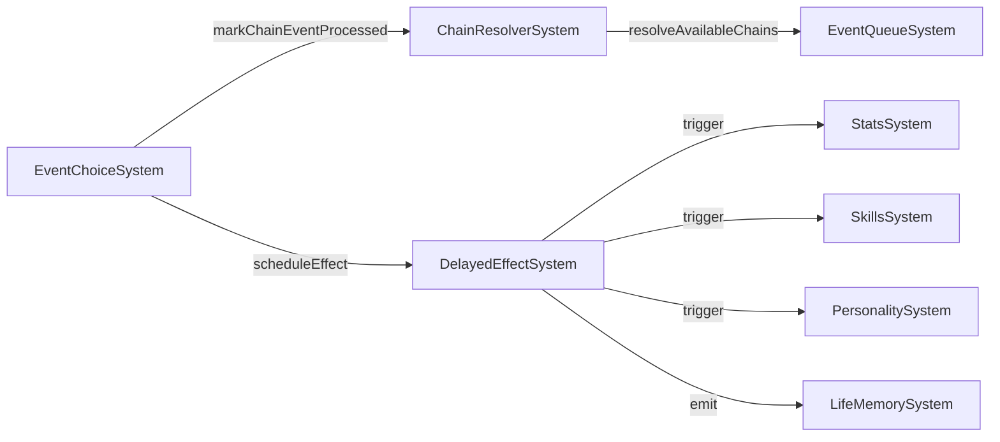
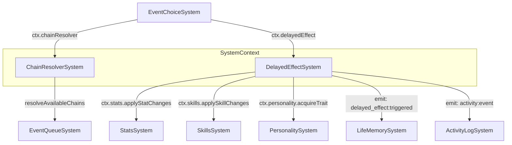

# План: Актуализация ChainResolverSystem + DelayedEffectSystem

## Статус: Draft (Wave 3 — P2)

## Цель

Стабилизировать контур цепочечных событий и отложенных последствий — ключевых механик для глубины симуляции:
- обеспечить canonical wiring через SystemContext;
- устранить дублирование с StatsSystem;
- связать с EventChoiceSystem, LifeMemorySystem, PersonalitySystem.

---

## 1. Текущий срез (as-is)

### ChainResolverSystem

| Аспект | Состояние |
|--------|-----------|
| Файл | `src/domain/engine/systems/ChainResolverSystem/index.ts` (223 строки) |
| Типы | `src/domain/engine/systems/ChainResolverSystem/index.types.ts` — `ChainStateComponent`, `ChainProgress`, `ChainStepRecord` |
| Константы | Inline — `AGE_GROUP_RANGES` в файле системы |
| Wiring | **Partial** — не в `system-context.ts` |
| Зависимости | `ALL_CHILDHOOD_EVENTS`, `getChildhoodEventsByChain` из balance |

#### API

```
ChainResolverSystem
├── init(world: GameWorld): void
├── update(world, deltaHours): void                    // пустой — цепочки по запросу
├── resolveAvailableChains(currentAge): ChildhoodEventDef[]  // основная логика
├── markChainEventProcessed(chainTag, eventId, choiceIndex): void
├── getChainProgress(chainTag): ChainProgress | null
├── getAllChainProgress(): Record<string, ChainProgress>
├── isChainStarted(chainTag): boolean
├── isChainCompleted(chainTag): boolean
├── _isAgeAppropriate(event, currentAge): boolean
├── _getCurrentAge(): number | null
├── _getCurrentGameDay(): number
├── _ensureComponent(): void
└── _getComponent(): ChainStateComponent | null
```

### DelayedEffectSystem

| Аспект | Состояние |
|--------|-----------|
| Файл | `src/domain/engine/systems/DelayedEffectSystem/index.ts` (178 строк) |
| Типы | `src/domain/engine/systems/DelayedEffectSystem/index.types.ts` — `DelayedEffectEntry`, `DelayedEffectsComponent` |
| Wiring | **Partial** — не в `system-context.ts` |
| SkillsSystem | Создаёт `new SkillsSystem()` в `init()` |
| PersonalitySystem | Создаёт `new PersonalitySystem()` в `init()` |

#### API

```
DelayedEffectSystem
├── init(world: GameWorld): void
├── update(world, deltaHours): void                    // проверка triggerAge
├── scheduleEffect(entry): DelayedEffectEntry          // планирование
├── getPendingEffects(): DelayedEffectEntry[]
├── getTriggeredEffects(): DelayedEffectEntry[]
├── getAllEffects(): DelayedEffectEntry[]
├── _triggerEffect(entry): void                        // применение: stats, skills, trait, memory
├── _getCurrentAge(): number | null
├── _ensureComponent(): void
├── _getComponent(): DelayedEffectsComponent | null
└── _clamp(value, min, max): number                    // ДУБЛИРУЕТ StatsSystem
```

### Взаимосвязь систем



---

## 2. Проблемы

### P0 — Блокеры

| # | Проблема | Влияние |
|---|----------|---------|
| CD-1 | **Обе системы не в system-context.ts** — нельзя получить через canonical context | EventChoiceSystem не может делегировать |
| CD-2 | **DelayedEffectSystem: `new SkillsSystem()` + `new PersonalitySystem()`** вместо canonical | Дублирование экземпляров |
| CD-3 | **DelayedEffectSystem: `_clamp()` дублирует StatsSystem** | Расхождение логики |
| CD-4 | **DelayedEffectSystem: `_triggerEffect` мутирует stats напрямую** вместо делегирования в StatsSystem | Обход canonical-ядра |

### P1 — Качество

| # | Проблема | Влияние |
|---|----------|---------|
| CD-5 | **ChainResolverSystem: `AGE_GROUP_RANGES` inline** — не в constants | Сложно настраивать баланс |
| CD-6 | **ChainResolverSystem: `update()` пустой** — мёртвый код | Путаница |
| CD-7 | **DelayedEffectSystem: `_nextEffectId` глобальный счётчик** — не сбрасывается между тестами | Нестабильные ID в тестах |
| CD-8 | **Нет telemetry** на chain resolution и delayed effects | Невозможно отслеживать |
| CD-9 | **Нет ActivityLog интеграции** — chain/delayed события не логируются | Игрок не видит историю |

### P2 — Расширения

| # | Проблема | Влияние |
|---|----------|---------|
| CD-10 | **Нет conditional chains** — цепочки не могут ветвиться | Линейный storytelling |
| CD-11 | **Нет delayed effect cancellation** — нельзя отменить запланированный эффект | Негибкая модель |
| CD-12 | **Нет chain statistics** — нет аналитики по цепочкам | Сложно балансировать |

---

## 3. Целевая архитектура

### Contracts + Boundaries



### Контракт ChainResolverSystem v2

```typescript
interface ChainResolverSystemV2 {
  init(world: GameWorld): void
  resolveAvailableChains(currentAge: number): ChildhoodEventDef[]
  markChainEventProcessed(chainTag: string, eventId: string, choiceIndex: number): void
  getChainProgress(chainTag: string): ChainProgress | null
  getAllChainProgress(): Record<string, ChainProgress>
  isChainStarted(chainTag: string): boolean
  isChainCompleted(chainTag: string): boolean
}
```

### Контракт DelayedEffectSystem v2

```typescript
interface DelayedEffectSystemV2 {
  init(world: GameWorld): void
  update(world: GameWorld, deltaHours: number): void
  scheduleEffect(entry: Omit<DelayedEffectEntry, 'id' | 'triggered'>): DelayedEffectEntry
  getPendingEffects(): DelayedEffectEntry[]
  getTriggeredEffects(): DelayedEffectEntry[]
  getAllEffects(): DelayedEffectEntry[]
  cancelEffect(effectId: string): boolean  // NEW
}
```

---

## 4. Синхронизация с другими системами

| Система | Что синхронизировать | Контракт |
|---------|---------------------|----------|
| `system-context.ts` | Добавить `chainResolver` и `delayedEffect` | Canonical access |
| `EventChoiceSystem` | Вызывать `ctx.chainResolver.markChainEventProcessed()`, `ctx.delayedEffect.scheduleEffect()` | Делегирование |
| `StatsSystem` (Wave 1) | `_triggerEffect` → `ctx.stats.applyStatChanges()` | Делегирование |
| `SkillsSystem` | `new SkillsSystem()` → canonical через SystemContext | Canonical wiring |
| `PersonalitySystem` | `new PersonalitySystem()` → canonical через SystemContext | Canonical wiring |
| `LifeMemorySystem` | Подписка на `delayed_effect:triggered` — уже работает | Event pipeline |
| `ActivityLogSystem` | Emit `activity:event` при trigger | Logging |
| `PersistenceSystem` | `chain_state`, `delayed_effects` компоненты в save/load | Persistence |

---

## 5. Execution plan

### Предусловие: Wave 1 завершена (StatsSystem canonical)

### Этап 1: Canonical wiring (~1 ч)

| Шаг | Описание | Файлы |
|-----|----------|-------|
| 1.1 | Добавить `ChainResolverSystem` и `DelayedEffectSystem` в `SystemContext` | `system-context.ts`, `index.types.ts` |
| 1.2 | DelayedEffectSystem: заменить `new SkillsSystem()` на canonical | `DelayedEffectSystem/index.ts:33-34` |
| 1.3 | DelayedEffectSystem: заменить `new PersonalitySystem()` на canonical | `DelayedEffectSystem/index.ts:35-36` |

### Этап 2: Устранение дублей (~30 мин)

| Шаг | Описание | Файлы |
|-----|----------|-------|
| 2.1 | DelayedEffectSystem: удалить `_clamp()` — делегировать в StatsSystem | `DelayedEffectSystem/index.ts:173-175` |
| 2.2 | DelayedEffectSystem: `_triggerEffect` — делегировать stat changes в StatsSystem | `DelayedEffectSystem/index.ts:111-120` |

### Этап 3: Рефакторинг (~1 ч)

| Шаг | Описание | Файлы |
|-----|----------|-------|
| 3.1 | ChainResolverSystem: вынести `AGE_GROUP_RANGES` в `index.constants.ts` | `ChainResolverSystem/index.constants.ts` |
| 3.2 | ChainResolverSystem: удалить пустой `update()` | `ChainResolverSystem/index.ts:45-47` |
| 3.3 | DelayedEffectSystem: заменить глобальный `_nextEffectId` на instance-based | `DelayedEffectSystem/index.ts:12` |
| 3.4 | DelayedEffectSystem: добавить `cancelEffect(effectId)` | `DelayedEffectSystem/index.ts` |

### Этап 4: Интеграция + Telemetry (~1 ч)

| Шаг | Описание | Файлы |
|-----|----------|-------|
| 4.1 | EventChoiceSystem: использовать canonical `ctx.chainResolver` и `ctx.delayedEffect` | `EventChoiceSystem/index.ts` |
| 4.2 | DelayedEffectSystem: emit `activity:event` при trigger | `DelayedEffectSystem/index.ts` |
| 4.3 | Telemetry: `chain_resolved`, `chain_completed`, `delayed_effect_scheduled`, `delayed_effect_triggered` | Обе системы |

### Этап 5: Тесты (~1.5 ч)

| Шаг | Описание | Файлы |
|-----|----------|-------|
| 5.1 | Unit: ChainResolver — resolve, mark, progress, completion | `test/unit/domain/engine/chain-resolver.test.ts` |
| 5.2 | Unit: DelayedEffect — schedule, trigger, cancel, age check | `test/unit/domain/engine/delayed-effect.test.ts` |
| 5.3 | Unit: DelayedEffect — delegation to StatsSystem/SkillsSystem | там же |
| 5.4 | Regression: все существующие тесты зелёные | — |

---

## 6. Telemetry + Tests

### Telemetry-счётчики

| Счётчик | Когда инкрементируется |
|---------|------------------------|
| `chain_resolved` | При нахождении доступного chain-события |
| `chain_completed` | При завершении цепочки |
| `delayed_effect_scheduled` | При планировании эффекта |
| `delayed_effect_triggered` | При срабатывании эффекта |
| `delayed_effect_cancelled` | При отмене эффекта |

### Тесты

| Тип | Количество | Что покрывает |
|-----|-----------|---------------|
| Unit (Chain) | ≥2 | resolve, progress, completion |
| Unit (Delayed) | ≥3 | schedule, trigger, cancel, delegation |
| Regression | все существующие | Нет регрессий |

---

## 7. Definition of Done

- [ ] **Обе системы в SystemContext** — `ctx.chainResolver`, `ctx.delayedEffect`.
- [ ] **Нет `new SkillsSystem()` / `new PersonalitySystem()`** — canonical.
- [ ] **Нет `_clamp()`** — делегирование в StatsSystem.
- [ ] **`_triggerEffect` делегирует stat changes** в StatsSystem.
- [ ] **`AGE_GROUP_RANGES`** в constants.
- [ ] **`cancelEffect()`** добавлен.
- [ ] **Telemetry** покрывает обе системы.
- [ ] **EventChoiceSystem** использует canonical context.
- [ ] **Все существующие тесты зелёные** + ≥5 новых unit-тестов.
- [ ] **`SYSTEM_REGISTRY.md`** обновлён.

---

## Связанные документы

- [Дорожная карта](plans/systems-planning-roadmap.md)
- [Master sync plan](plans/system-sync-plan.md)
- [Stats system refresh](plans/stats-system-refresh-plan.md) (Wave 1)
- [Life memory system plan](plans/life-memory-system-plan.md)
- [Personality system plan](plans/personality-system-plan.md)
- [System Registry](src/domain/engine/systems/SYSTEM_REGISTRY.md)
