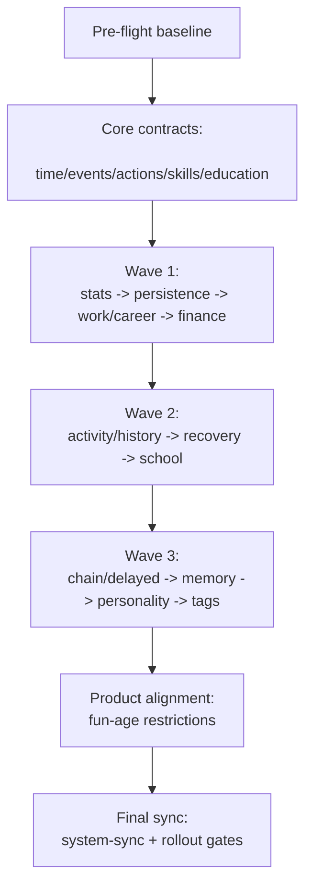

# План-карта выполнения всех планов

## Статус: Master execution roadmap (единая очередь работ)

## Цель

Зафиксировать единый порядок выполнения всех планов из каталога `plans`, чтобы команда видела:

- какую последовательность брать в работу;
- какие зависимости обязательны;
- какие gate-критерии нужны перед переходом к следующей фазе.

---

## 1) Источники (планы, включенные в карту)

### Базовые master-планы

- `plans/system-sync-plan.md`
- `plans/current-systems-optimization-plan.md` (закрыт, как pre-flight baseline)
- `plans/wave1-p0-core-stability-plan.md`
- `plans/execution-master-roadmap-plan.md`

### Доменные core-планы

- `plans/time-system-refresh.plan.md`
- `plans/event-system-sync.plan.md`
- `plans/actions-system-refresh-plan.md`
- `plans/skills-system-refresh-plan.md`
- `plans/education-age-context-plan.md`

### Wave 1 (P0 core stability)

- `plans/persistence-migration-refresh-plan.md`
- `plans/work-career-system-refresh-plan.md`
- `plans/finance-economy-system-refresh-plan.md`
- `plans/stats-system-refresh-plan.md`

### Wave 2 (P1 quality + explainability)

- `plans/activity-history-system-refresh-plan.md`
- `plans/recovery-system-refresh-plan.md`
- `plans/school-system-refresh-plan.md`

### Wave 3 (P2 depth systems)

- `plans/chain-delayed-effects-plan.md`
- `plans/life-memory-system-plan.md`
- `plans/personality-system-plan.md`
- `plans/tags-system-plan.md`

### Product plan

- `plans/fun-age-restrictions-plan.md`

---

## 2) Главная последовательность выполнения

1. **Фаза 0 — Baseline и контроль контракта**
   - Опираемся на завершенный pre-flight (`current-systems-optimization-plan.md`).
   - Проверяем, что baseline тестов стабилен перед новой волной изменений.

2. **Фаза 1 — Core contracts (time/events/actions/skills/education)**
   - Выполняем контракты и синхронизацию из:
     - `time-system-refresh.plan.md`
     - `event-system-sync.plan.md`
     - `actions-system-refresh-plan.md`
     - `skills-system-refresh-plan.md`
     - `education-age-context-plan.md`
   - Это фундамент для последующих системных волн.

3. **Фаза 2 — Wave 1 (P0 stability)**
   - Последовательность внутри волны:
     1. `stats-system-refresh-plan.md`
     2. `persistence-migration-refresh-plan.md`
     3. `work-career-system-refresh-plan.md`
     4. `finance-economy-system-refresh-plan.md`

4. **Фаза 3 — Wave 2 (P1 quality)**
   - Последовательность:
     1. `activity-history-system-refresh-plan.md`
     2. `recovery-system-refresh-plan.md`
     3. `school-system-refresh-plan.md`

5. **Фаза 4 — Wave 3 (P2 depth)**
   - Последовательность:
     1. `chain-delayed-effects-plan.md`
     2. `life-memory-system-plan.md`
     3. `personality-system-plan.md`
     4. `tags-system-plan.md`

6. **Фаза 5 — Product alignment**
   - Синхронизация продуктовой логики и ограничений возраста:
     - `fun-age-restrictions-plan.md`
   - Проверка, что age-gating консистентен с actions/education/school/personality.

7. **Фаза 6 — Final sync and rollout**
   - Финальная консолидация в `system-sync-plan.md`.
   - Подтверждение master DoD и rollout-gates.

---

## 3) Dependency-граф (укрупненно)

---

## 4) Критичные зависимости между планами

- `event-system-sync.plan.md` зависит от `time-system-refresh.plan.md`: period hooks и dedup завязаны на time lifecycle.
- `education-age-context-plan.md` зависит от `time + events + skills`: step learning и learningEfficiency требуют корректной оркестрации.
- `stats-system-refresh-plan.md` зависит от core contracts: stat-делегирование нужно унифицировать до массовых рефакторов.
- `persistence-migration-refresh-plan.md` должен идти ранним в Wave 1: изменения опасны без устойчивого save/load.
- `work-career-system-refresh-plan.md` зависит от `stats + skills`: gameplay-loop и зарплата используют эти контракты.
- `finance-economy-system-refresh-plan.md` зависит от `work-career + stats`: settlement и реальный доход строятся сверху.
- `recovery-system-refresh-plan.md` зависит от Wave 1: использует canonical stats/helpers/investment контур.
- `school-system-refresh-plan.md` зависит от `stats + education + time`: школьная прогрессия синхронизируется с общим lifecycle.
- `chain-delayed-effects-plan.md` зависит от `stats + events + personality`: delayed effects должны делегировать в canonical системы.
- `life-memory-system-plan.md` зависит от `chain-delayed-effects-plan.md`: memory-поток питается delayed effects.
- `personality-system-plan.md` зависит от `life-memory-system-plan.md`: personality использует memory/delayed сигналы.
- `tags-system-plan.md` зависит от `skills-system-refresh-plan.md`: tag-modifiers встраиваются в общий modifiers pipeline.
- `fun-age-restrictions-plan.md` зависит от `actions + school + education`: age-gating должен совпадать с доступностью контента.

---

## 5) Wave-by-wave Go/No-Go gates

### Gate A (после Фазы 1)

- Core-контракты согласованы: time/event/action/skills/education.
- Нет P0 рассинхронов UI vs engine.
- Smoke + integration тесты стабильны.

### Gate B (после Wave 1)

- `stats` canonical (без локальных `_applyStatChanges` дублей).
- Save/load backward compatible.
- Work/career/finance контуры работают end-to-end.

### Gate C (после Wave 2)

- Activity/history explainability работает.
- Recovery и School встроены в canonical контур.
- Базовая telemetry покрывает пользовательские пути.

### Gate D (после Wave 3)

- Depth-системы интегрированы без нарушения core performance budget.
- Нет дублей и обходов canonical систем.
- Regression-пакет стабилен.

### Gate E (финальный)

- `system-sync-plan.md` обновлён фактическим состоянием.
- Master DoD выполнен.
- Rollout readiness подтверждён.

---

## 6) Времязатраты (оценка)

### Оценка по фазам

- **Фаза 0** — Baseline check + smoke before start: `1-2 ч`.
- **Фаза 1** — Core contracts (time/events/actions/skills/education): `24-40 ч`.
- **Фаза 2** — Wave 1 (stats + persistence/migration + work/career + finance): `20-30 ч`.
- **Фаза 3** — Wave 2 (activity/history + recovery + school): `12-20 ч`.
- **Фаза 4** — Wave 3 (chain/delayed + memory + personality + tags): `14-24 ч`.
- **Фаза 5** — Product alignment (fun-age restrictions sync): `4-8 ч`.
- **Фаза 6** — Final sync + rollout readiness + stabilization: `6-12 ч`.
- **Итого (линейно)** — все фазы последовательно: `81-136 ч`.

### Критический путь и параллелизм

- **Критический путь (минимум):** Фаза 0 -> Фаза 1 -> Фаза 2 -> Фаза 3 -> Фаза 4 -> Фаза 5 -> Фаза 6.
- **Параллелизм допустим только внутри фазы,** если не нарушаются зависимости из раздела 4.
- **Практический ориентир для 1 инженера:** 4-7 календарных недель (с тестами и стабилизацией).
- **Практический ориентир для 2 инженеров:** 3-5 недель при аккуратной синхронизации и частых merge-gates.

### Буферы

- Добавлять **15-20% буфер** на интеграционные регрессии и доработку тестов.
- Для фаз 2-4 предусматривать отдельные окна на hotfix после интеграции.

---

## 7) Практический режим выполнения (итерации)

Для каждой фазы/волны:

1. Берём 1 план в активную реализацию.
2. Закрываем его DoD + локальные тесты.
3. Обновляем `system-sync-plan.md` (статус, риски, остатки).
4. Только после этого стартуем следующий план по цепочке зависимостей.

Рекомендованный размер итерации: **1 план = 1 delivery batch**.

---

## 8) Риски и митигации

- Параллельное изменение зависимых планов: высокое влияние; митигация — соблюдать последовательность фаз и gates.
- Drift контрактов между документами: высокое влияние; митигация — `system-sync-plan.md` как single source of truth.
- Регрессии после массовых рефакторов: высокое влияние; митигация — тест-gate после каждой волны.
- Перекрытие ответственности систем: среднее влияние; митигация — явные boundaries в каждом плане.
- Непрозрачный статус выполнения: среднее влияние; митигация — вести phase-state в этом master roadmap и `system-sync-plan.md`.

---

## 9) Definition of Done для этой план-карты

- [x] Зафиксирована единая последовательность выполнения всех планов.
- [x] Определены межплановые зависимости и критический путь.
- [x] Определены wave gates (Go/No-Go) для переходов.
- [x] Добавлена оценка времязатрат по фазам и критическому пути.
- [x] Указан финальный цикл синхронизации через `system-sync-plan.md`.
- [x] Карта годится как рабочий порядок для команды.
