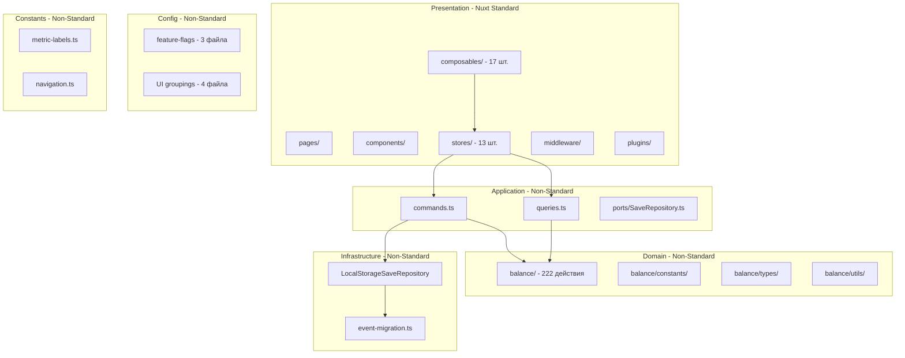

# Анализ архитектуры Game Life: Clean Architecture vs Nuxt 4

**Дата:** 24 апреля 2026  
**Версия Nuxt:** 4.4.2  
**Режим:** SPA (ssr: false)

---

## Содержание

1. [Краткое описание текущей архитектуры](#1-краткое-описание-текущей-архитектуры)
2. [Сравнение с Nuxt 4 стандартом](#2-сравнение-с-nuxt-4-стандартом)
3. [Плюсы и минусы перехода к чистой Nuxt 4 архитектуре](#3-плюсы-и-минусы-перехода)
4. [Зачем нужны domain, infrastructure, config](#4-зачем-нужны-domain-infrastructure-config)
5. [Config vs Constants — в чём разница](#5-config-vs-constants--в-чём-разница)
6. [Рекомендации](#6-рекомендации)

---

## 1. Краткое описание текущей архитектуры

### Стек технологий

| Технология | Версия | Назначение |
|-----------|--------|-----------|
| Nuxt | 4.4.2 | Фреймворк (SPA режим) |
| Vue | 3.5.32 | UI фреймворк |
| Pinia | 3.0.4 | State management |
| TypeScript | 6.0.2 | Типизация (strict) |
| Vitest | 4.1.4 | Тестирование |

### Архитектурный подход

Проект использует **4-слойную Clean Architecture** поверх Nuxt 4:



### Инвентаризация нестандартных каталогов

| Каталог | Файлов | Назначение | Зависит от |
|---------|--------|-----------|-----------|
| `src/domain/` | ~40 | ECS + баланс + типы + утилиты | Только от себя |
| `src/application/` | 5 | Use cases: commands, queries, ports | От stores + domain |
| `src/infrastructure/` | 3 | localStorage persistence | От application ports |
| `src/config/` | 7 | Feature flags + UI-группировки | От domain types |
| `src/constants/` | 3 | Метки, навигация | От domain types |

---

## 2. Сравнение с Nuxt 4 стандартом

### Стандартная структура Nuxt 4

Nuxt 4 ожидает следующую организацию внутри `srcDir` (по умолчанию `app/`, в проекте — `src/`):

```
src/                    # srcDir
├── app.vue             # Корневой компонент
├── pages/              # Файловый роутинг        → ✅ Есть
├── components/         # Vue компоненты           → ✅ Есть
├── composables/        # Vue composables          → ✅ Есть (17 шт.)
├── stores/             # Pinia stores             → ✅ Есть (13 шт.)
├── utils/              # Утилиты (auto-import)    → ✅ Есть (2 файла)
├── plugins/            # Nuxt плагины             → ✅ Есть
├── middleware/          # Route middleware          → ✅ Есть
├── assets/             # CSS/SCSS/изображения     → ✅ Есть
├── layouts/            # Layout компоненты         → ⚠️ Нет (не нужны)
├── server/             # Server API routes        → ⚠️ Нет (SPA режим)
├── domain/             # —                        → ❌ Не стандарт Nuxt
├── application/        # —                        → ❌ Не стандарт Nuxt
├── infrastructure/     # —                        → ❌ Не стандарт Nuxt
├── config/             # —                        → ❌ Не стандарт Nuxt
└── constants/          # —                        → ❌ Не стандарт Nuxt
```

### Соответствие стандарту

| Каталог | Статус | Комментарий |
|---------|--------|-------------|
| `pages/` | ✅ | Файловый роутинг работает корректно |
| `components/` | ✅ | Настроен auto-import через `components[]` |
| `composables/` | ✅ | Glob-паттерн для auto-import |
| `stores/` | ✅ | `imports.dirs` настроен |
| `utils/` | ✅ | Auto-import через Nuxt |
| `middleware/` | ✅ | `game-init.ts` |
| `plugins/` | ✅ | `auto-save.client.ts` |
| `assets/` | ✅ | SCSS с глобальными переменными |
| `shared/` | ✅ | `shared/types/` на уровне корня |
| `domain/` | ⚠️ | Не стандарт Nuxt, но обоснованно |
| `application/` | ⚠️ | Не стандарт Nuxt, есть проблемы |
| `infrastructure/` | ⚠️ | Не стандарт Nuxt, минимальный |
| `config/` | ⚠️ | Не стандарт Nuxt, смешанные ответственности |
| `constants/` | ⚠️ | Не стандарт Nuxt, дублирует с config |

### Ключевое наблюдение: `srcDir`

Nuxt 4 по умолчанию использует `app/` вместо `src/`. Проект использует `srcDir: 'src/'` — это **полностью поддерживаемая** конфигурация Nuxt. Переименование `src/` → `app/` не даёт технических преимуществ.

---

## 3. Плюсы и минусы перехода к чистой Nuxt 4 архитектуре

### Вариант A: Чистая Nuxt 4 (убрать все нестандартные каталоги)

| Аспект | Плюсы | Минусы |
|--------|-------|--------|
| **Соответствие конвенциям** | Единая конвенция — меньше сюрпризов для новых разработчиков | Теряется явное разделение слоёв |
| **Auto-import** | Всё в `utils/` автоимпортируется Nuxt без доп. настройки | `domain/` уже настроен через alias `@domain` — работает и сейчас |
| **Простота** | Меньше каталогов — проще навигация для маленьких проектов | С ростом проекта код превращается в «суп» из несвязанных файлов |
| **Обновления Nuxt** | Меньше риска при миграции на новые версии | Нестандартные каталоги не мешают обновлениям — они просто не трогаются Nuxt |
| **Тестируемость** | — | Потеря возможности тестировать слои изолированно |
| **Domain logic** | — | ECS + баланс (~40 файлов) смешаются с UI-утилитами в `utils/` |
| **Инфраструктура** | — | `LocalStorageSaveRepository` потеряет интерфейс `SaveRepository` |

### Вариант B: Гибридная архитектура (текущий подход с доработками)

| Аспект | Плюсы | Минусы |
|--------|-------|--------|
| **Разделение ответственности** | Чёткие границы: domain → application → infrastructure → presentation | Нужно понимать два набора конвенций: Nuxt + Clean Architecture |
| **Тестируемость** | Domain и infrastructure тестируются без Vue/Nuxt | Больше каталогов — больше файлов для понимания |
| **Domain isolation** | ECS и баланс защищены от случайного связывания с UI | Требуется дисциплина при разработке |
| **Гибкость инфраструктуры** | Легко заменить localStorage на IndexedDB или API | Для SPA-игры это может быть overengineering |
| **Nuxt совместимость** | Стандартные каталоги работают как обычно | Нестандартные каталоги не попадают в auto-import автоматически |

### Вывод

Для проекта **Game Life** гибридная архитектура предпочтительнее. Причины:

1. **Игровая логика — это не UI.** ECS World, 21 система, 222 действия — это доменный слой, который не должен зависеть от Vue/Nuxt.
2. **Проект уже вырос.** ~40 файлов в domain — это не «маленький проект», где всё можно положить в `utils/`.
3. **Nuxt не конфликтует.** Нестандартные каталоги просто существуют рядом — Nuxt их не трогает.

---

## 4. Зачем нужны domain, infrastructure, config

### `src/domain/` — Доменный слой

**Что содержит:**
- `balance/actions/` — каталог из 222 игровых действий в 10 категориях
- `balance/constants/` — статические данные: career-jobs, education-programs, game-events, housing-levels, default-save и др.
- `balance/types/` — TypeScript типы домена
- `balance/utils/` — утилиты: skill-system, hourly-rates, education-ranks, stat-changes-format

**Что даёт:**
- **Изоляция бизнес-логики.** Код в `domain/` не знает о Vue, Nuxt, Pinia — он работает с чистыми данными
- **Тестируемость.** Unit-тесты домена не требуют монтинга Vue-компонентов
- **Переиспользуемость.** Домен можно использовать в другом контексте (например, в server-side расчётах)
- **Явные границы.** Разработчик видит: «этот файл в domain — значит, здесь не должно быть UI-кода»

**Оценка:** ✅ **Оставить.** Это ядро игры, не подлежащее «уплощению» в `utils/`.

### `src/application/` — Прикладной слой

**Что содержит:**
- `game/commands.ts` — 10 команд (executeLifestyleAction, simulateWorkShift, changeCareer и др.)
- `game/queries.ts` — 11 запросов (getCareerTrack, getFinanceOverview, canExecuteAction и др.)
- `game/ports/SaveRepository.ts` — интерфейс для persistence
- `game/index.types.ts` — типы

**Проблема:**
`commands.ts` и `queries.ts` **напрямую импортируют Pinia stores** (`useCareerStore`, `useWalletStore` и т.д.). Это нарушает принцип Clean Architecture — прикладной слой не должен зависеть от презентационного (Pinia — это presentation layer).

Фактически, `application/` сейчас — это **тонкая прослойка между stores и domain**, которая:
- Дублирует логику, уже существующую в stores и composables
- Не даёт преимуществ изоляции, т.к. зависит от stores
- Создаёт ложное ощущение разделения слоёв

**Оценка:** ⚠️ **Требует рефакторинга.** Либо исправить зависимость от stores (перейти на dependency injection), либо упразднить и перенести логику в composables.

### `src/infrastructure/` — Инфраструктурный слой

**Что содержит:**
- `persistence/LocalStorageSaveRepository.ts` — реализация `SaveRepository` через localStorage
- `persistence/constants.ts` — ключ сохранения
- `persistence/event-migration.ts` — миграция данных событий

**Что даёт:**
- **Инверсия зависимостей.** Domain и Application зависят от интерфейса `SaveRepository`, а не от конкретной реализации
- **Заменяемость.** Можно подставить IndexedDB, API, или in-memory реализацию без изменения бизнес-логики
- **Тестируемость.** Легко мокировать persistence в тестах

**Оценка:** ✅ **Оставить.** Минимальный, но правильный слой. Однако стоит рассмотреть перенос в `domain/persistence/`, т.к. это единственный потребитель.

### `src/config/` — Конфигурация

**Что содержит:**
- `feature-flags.ts` — feature flags для time-системы (runtime-переключатели)
- `actions-feature-flags.ts` — feature flags для actions-системы
- `event-feature-flags.ts` — feature flags для event-системы
- `action-categories.ts` — категории действий для UI (id, label, icon)
- `work-categories.ts` — типы работ и отрасли для UI
- `education-tab-groups.ts` — распределение действий по табам
- `shop-tab-groups.ts` — распределение товаров по табам

**Смешанные ответственности:**
1. **Feature flags** (3 файла) — это runtime-конфигурация с изменяемым состоянием
2. **UI-группировки** (4 файла) — это статические данные, по сути — константы

**Оценка:** ⚠️ **Разделить.** Feature flags оставить как конфигурацию, UI-группировки перенести в `constants/` или в соответствующие composables.

---

## 5. Config vs Constants — в чём разница

### Определения

| Характеристика | Config | Constants |
|----------------|--------|-----------|
| **Изменяемость** | Может меняться в runtime | Неизменяемые значения |
| **Среда** | Зависит от окружения (dev/prod) | Одинаковы везде |
| **Структура** | Интерфейс + defaults + getter/setter | Простые `export const` |
| **Назначение** | Управляет поведением приложения | Предоставляет данные для отображения |

### Что реально в `src/config/`

| Файл | Тип | Обоснование |
|------|-----|-------------|
| `feature-flags.ts` | **Config** ✅ | Есть `currentFlags`, getter/setter — runtime-состояние |
| `actions-feature-flags.ts` | **Config** ✅ | Аналогично — runtime-переключатели |
| `event-feature-flags.ts` | **Config** ✅ | Аналогично — runtime-переключатели |
| `action-categories.ts` | **Constants** ⚠️ | Статический массив, не меняется в runtime |
| `work-categories.ts` | **Constants** ⚠️ | Статические данные о типах работ |
| `education-tab-groups.ts` | **Constants** ⚠️ | Статический Set ID действий |
| `shop-tab-groups.ts` | **Constants** ⚠️ | Статические Set-ы ID товаров |

### Что реально в `src/constants/`

| Файл | Тип | Обоснование |
|------|-----|-------------|
| `metric-labels.ts` | **Constants** ✅ | Статические маппинги ключ → русская метка |
| `navigation.ts` | **Constants** ✅ | Статические массивы навигации |

### Вывод

**`config/` — это НЕ просто частный случай констант.** Внутри `config/` находятся две разные категории файлов:

1. **Feature flags** — настоящая конфигурация с runtime-состоянием. Это не константы, т.к. их значения могут меняться через setter или localStorage.
2. **UI-группировки** — действительно константы, ошибочно помещённые в `config/`. Их следует перенести.

**Разница между config и constants:**
- **Config** = «Как приложение должно работать?» (feature flags, environment settings)
- **Constants** = «Какие данные приложение использует?» (labels, navigation, static mappings)

---

## 6. Рекомендации

### Общая стратегия: Гибридная архитектура с точечной доработкой

Проекту **не нужно** переходить к чистой Nuxt 4 архитектуре. Clean Architecture поверх Nuxt — правильный подход для игры с нетривиальной бизнес-логикой. Однако требуется несколько точечных улучшений.

### Рекомендация 1: Оставить `src/domain/` без изменений

`src/domain/` — ядро игры. ECS + баланс + типы + утилиты. Этот каталог:
- Не зависит от Vue/Nuxt
- Легко тестируется
- Имеет чёткие границы

**Действие:** Без изменений.

### Рекомендация 2: Упразднить `src/application/` в текущем виде

Текущий `src/application/game/commands.ts` и `queries.ts` нарушают Clean Architecture, напрямую импортируя Pinia stores. Это создаёт циклическую зависимость: presentation → application → presentation.

**Два варианта решения:**

**Вариант A (рекомендуемый):** Перенести логику из `commands.ts` и `queries.ts` в соответствующие composables и stores. Composables уже выполняют роль «application layer» в Nuxt-парадигме.

**Вариант B:** Исправить `application/`, убрав зависимость от stores. Передавать данные через параметры, а не через `useXxxStore()`. Но это потребует значительного рефакторинга.

**Порт `SaveRepository.ts`** — перенести в `src/domain/` рядом с потребителем.

### Рекомендация 3: Оставить `src/infrastructure/` как есть

Минимальный каталог из 3 файлов. Правильно реализует инверсию зависимостей через порт `SaveRepository`.

**Действие:** Без изменений. Если `SaveRepository.ts` переносится в domain (из рекомендации 2), то infrastructure можно упразднить, перенеся `LocalStorageSaveRepository.ts` в `src/domain/persistence/`.

### Рекомендация 4: Разделить `src/config/`

| Файл | Куда перенести | Причина |
|------|---------------|---------|
| `feature-flags.ts` | Оставить в `config/` | Runtime-конфигурация |
| `actions-feature-flags.ts` | Оставить в `config/` | Runtime-конфигурация |
| `event-feature-flags.ts` | Оставить в `config/` | Runtime-конфигурация |
| `action-categories.ts` | → `constants/` | Статические данные |
| `work-categories.ts` | → `constants/` | Статические данные |
| `education-tab-groups.ts` | → `constants/` | Статические данные |
| `shop-tab-groups.ts` | → `constants/` | Статические данные |

После разделения `config/` будет содержать только feature flags — настоящую конфигурацию.

### Рекомендация 5: Объединить `src/constants/` с перенесёнными из config

После переноса UI-группировок из `config/` каталог `constants/` будет содержать:
- `metric-labels.ts` — метки статов
- `navigation.ts` — навигация
- `action-categories.ts` — категории действий (из config)
- `work-categories.ts` — типы работ (из config)
- `education-tab-groups.ts` — табы обучения (из config)
- `shop-tab-groups.ts` — табы магазина (из config)

Это логичная группировка: все статические данные, не меняющиеся в runtime.

### Рекомендация 6: Не переименовывать `src/` → `app/`

`srcDir: 'src/'` — поддерживаемая конфигурация Nuxt. Переименование:
- Не даёт технических преимуществ
- Потребует обновления всех import-путей
- Может сломать существующие скрипты и CI

### Итоговая структура (рекомендуемая)

```
src/
├── app.vue                    # Nuxt entry point
├── pages/                     # Nuxt file-based routing
├── components/                # Vue components (auto-import)
├── composables/               # Vue composables (auto-import, 17 шт.)
├── stores/                    # Pinia stores (auto-import, 13 шт.)
├── utils/                     # Utility functions (auto-import)
├── middleware/                 # Nuxt middleware
├── plugins/                   # Nuxt plugins
├── assets/                    # CSS/SCSS
│
├── domain/                    # Бизнес-логика (ECS + баланс)
│   └── balance/
│       ├── actions/           # 222 игровых действия
│       ├── constants/         # Статические данные баланса
│       ├── types/             # TypeScript типы
│       └── utils/             # Утилиты домена
│
├── config/                    # ТОЛЬКО runtime-конфигурация
│   ├── feature-flags.ts       # Time system flags
│   ├── actions-feature-flags.ts
│   └── event-feature-flags.ts
│
├── constants/                 # Все статические данные
│   ├── metric-labels.ts       # Метки для UI
│   ├── navigation.ts          # Навигация
│   ├── action-categories.ts   # Категории действий (← из config)
│   ├── work-categories.ts     # Типы работ (← из config)
│   ├── education-tab-groups.ts # Табы обучения (← из config)
│   └── shop-tab-groups.ts     # Табы магазина (← из config)
│
└── infrastructure/            # Внешние зависимости
    └── persistence/
        ├── LocalStorageSaveRepository.ts
        ├── constants.ts
        └── event-migration.ts

shared/                        # Shared types (Nuxt 4 standard)
└── types/
    └── index.ts
```

### Приоритеты внедрения

1. **Низкий риск, высокая ценность:** Перенос UI-группировок из `config/` → `constants/`
2. **Средний риск, высокая ценность:** Рефакторинг `application/` (упразднение или исправление)
3. **Низкий риск, низкая ценность:** Перенос `SaveRepository.ts` в `domain/` (если application упраздняется)

---

## Приложение: Архитектурные принципы для команды

1. **Nuxt-каталоги** (`pages/`, `components/`, `composables/`, `stores/`, `utils/`) — для UI-слоя. Следуем конвенциям Nuxt.
2. **`domain/`** — только чистая бизнес-логика. Без импортов из Vue, Nuxt, Pinia.
3. **`config/`** — только runtime-изменяемые настройки (feature flags).
4. **`constants/`** — только статические неизменяемые данные.
5. **`infrastructure/`** — реализации внешних интерфейсов (persistence, API).
6. **Alias-ы** в `nuxt.config.ts` обеспечивают удобный доступ: `@domain`, `@constants`, `@utils`.
