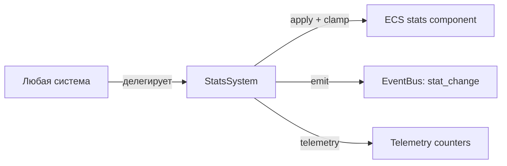
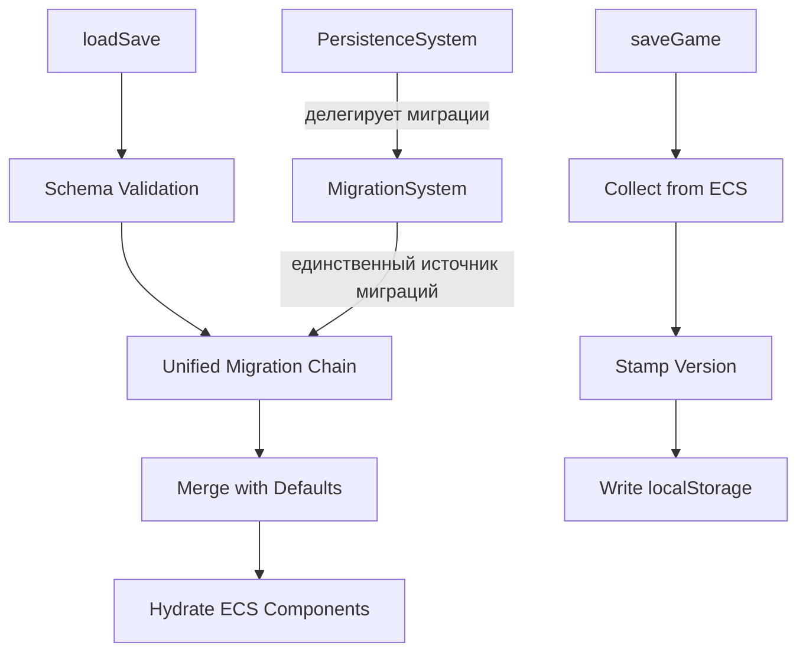
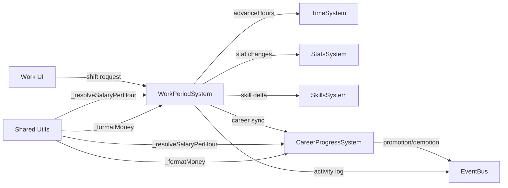
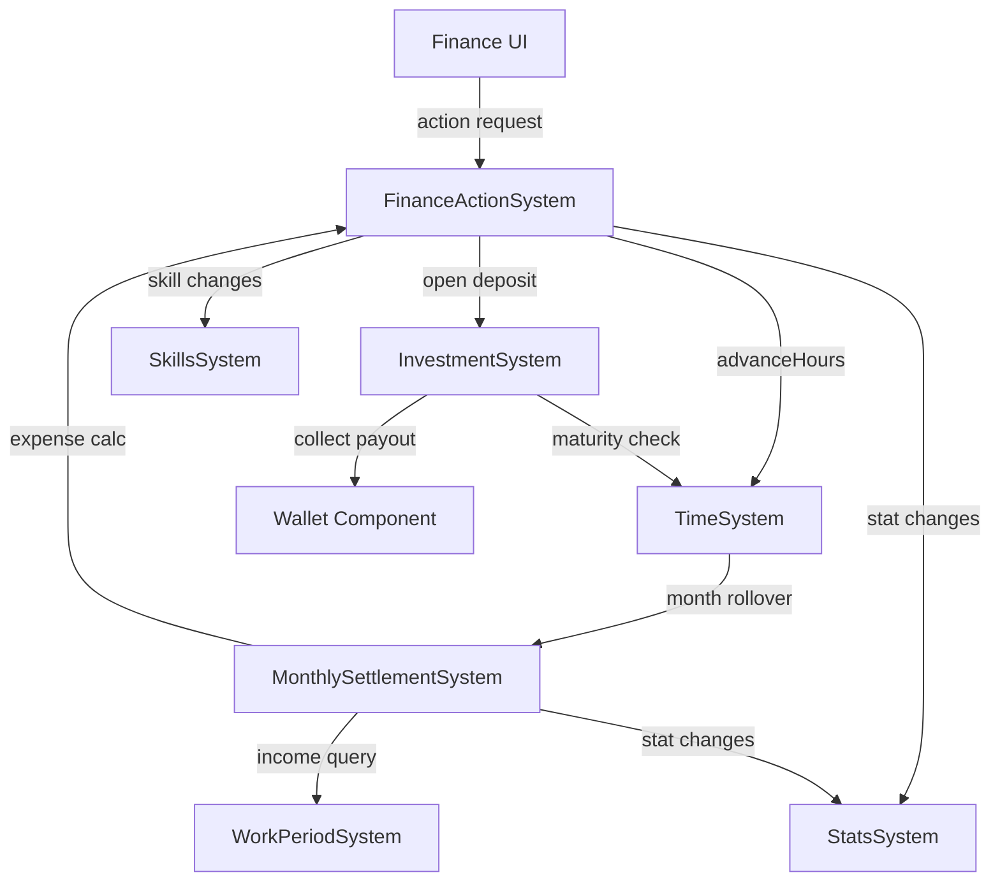

# Wave 1 — P0 Core Stability Plan

## Статус: Draft

## Цель

Стабилизировать 4 критических контура, без которых дальнейший rollout рискован:

1. **Persistence + Migration** — устойчивый save/load и миграции.
2. **Work + Career** — базовый gameplay-loop (работа/доход/прогресс).
3. **Finance + Economy** — единый финансовый контур.
4. **Stats** — embedded-ядро для большинства эффектов.

Каждый подтема следует шаблону из `plans/systems-planning-roadmap.md`:
`Текущий срез → Проблемы → Целевая архитектура → Синхронизация → Execution plan → Telemetry/Tests → DoD`.

---

## Межсистемные зависимости (порядок реализации)

```
StatsSystem (база)
  ↓
PersistenceSystem + MigrationSystem (save/load ядра)
  ↓
WorkPeriodSystem + CareerProgressSystem (gameplay-loop)
  ↓
FinanceActionSystem + MonthlySettlementSystem + InvestmentSystem (экономика)
```

> **Обоснование:** StatsSystem — фундамент для всех эффектов. Persistence должен быть стабилен до того, как мы меняем runtime-логику работы/финансов. Work/Career — источник дохода, который нужен финансовому контуру.

---

## 1. StatsSystem — стабилизация embedded-ядра

### 1.1 Текущий срез (as-is)

| Аспект | Состояние |
|--------|-----------|
| Файл | `src/domain/engine/systems/StatsSystem/index.ts` (70 строк) |
| Wiring | **Не в system-context.ts** — embedded, создается вручную в каждой системе |
| API | `applyStatChanges()`, `getStats()`, `summarizeStatChanges()`, `mergeStatChanges()`, `_clamp()` |
| Потребители | ActionSystem, WorkPeriodSystem, FinanceActionSystem, MonthlySettlementSystem, RecoverySystem, EducationSystem |

### 1.2 Проблемы

| # | Проблема | Критичность | Где |
|---|----------|-------------|-----|
| S-1 | **Дублирование `_applyStatChanges()` + `_clamp()`** в 5+ системах вместо делегирования в StatsSystem | P0 | WorkPeriodSystem, FinanceActionSystem, MonthlySettlementSystem, EducationSystem, RecoverySystem |
| S-2 | **Нет stat change events** — изменения статов не трассируются через eventBus | P1 | StatsSystem |
| S-3 | **Нет telemetry** на stat changes — невозможно диагностировать баланс | P1 | StatsSystem |
| S-4 | **Не в system-context.ts** — каждая система создаёт свой экземпляр | P1 | system-context.ts |
| S-5 | **Нет валидации stat keys** — неизвестные ключи молча применяются | P2 | StatsSystem |

### 1.3 Целевая архитектура



**Контракт:**

- Единственная точка мутации статов — `StatsSystem.applyStatChanges()`.
- Все системы делегируют stat-мутации через `ctx.stats.applyStatChanges()`.
- `_clamp()` и `_applyStatChanges()` удаляются из систем-дублей.
- StatsSystem добавляется в `SystemContext` как `stats`.

### 1.4 Execution plan

| Шаг | Описание | Файлы | Оценка |
|-----|----------|-------|--------|
| S-E1 | Добавить StatsSystem в `system-context.ts` | `system-context.ts`, `index.types.ts` | 30 мин |
| S-E2 | Заменить `_applyStatChanges` / `_clamp` на делегирование в StatsSystem | WorkPeriodSystem, FinanceActionSystem, MonthlySettlementSystem, EducationSystem, RecoverySystem | 2 ч |
| S-E3 | Добавить telemetry-хуки в StatsSystem (`stat_change:*`) | StatsSystem, telemetry.ts | 30 мин |
| S-E4 | Unit-тесты: clamp, merge, unknown keys | `test/unit/domain/engine/stats-system.test.ts` | 1 ч |

### 1.5 Definition of Done

- [ ] StatsSystem в `SystemContext.stats`.
- [ ] Ни одна система не содержит локальных `_applyStatChanges` / `_clamp`.
- [ ] Telemetry считает `stat_change:{key}` для каждого применения.
- [ ] Все существующие тесты зелёные + ≥4 новых unit-теста.

---

## 2. PersistenceSystem + MigrationSystem — стабильный save/load

### 2.1 Текущий срез (as-is)

| Аспект | PersistenceSystem | MigrationSystem |
|--------|-------------------|-----------------|
| Файл | `PersistenceSystem/index.ts` (575 строк) | `MigrationSystem/index.ts` (47 строк) |
| Версия | `currentVersion = '1.1.0'`, `currentSaveVersion = 2` | `currentVersion = '1.0.0'` |
| Миграции | 2 реальных (`0.1.0`, `0.2.0`) | 0 (пустой `migrations: {}`) |
| Wiring | Через store/world, **не в system-context.ts** | Partial, не в system-context.ts |
| Валидация | Минимальная (money, gameDays, totalHours, stats, housing) | Заглушка (всегда `isValid: true`) |

### 2.2 Проблемы

| # | Проблема | Критичность | Где |
|---|----------|-------------|-----|
| P-1 | **Две системы с перекрывающейся миграционной логикой** — PersistenceSystem имеет свои миграции, MigrationSystem — пустой стаб с другой версией | P0 | PersistenceSystem, MigrationSystem |
| P-2 | **`_syncFromWorld()` — ручной маппинг каждого компонента** — хрупкий, не type-safe, при добавлении нового компонента легко забыть обновить | P0 | PersistenceSystem:164-312 |
| P-3 | **`_mergeAndMigrate()` — spread-based deep merge** — может потерять вложенные данные | P0 | PersistenceSystem:92-159 |
| P-4 | **Минимальная валидация** — нет schema validation, нет проверки полноты компонентов | P1 | PersistenceSystem:418-453 |
| P-5 | **Нет стратегии восстановления при corruption** — при ошибке просто fallback на default save | P1 | PersistenceSystem:55-58 |
| P-6 | **Нет auto-save** — сохранение только по действию игрока | P2 | — |
| P-7 | **`normalizeJobShape()` дублирует логику** из WorkPeriodSystem/CareerProgressSystem | P1 | PersistenceSystem:538-558 |

### 2.3 Целевая архитектура



**Контракт:**

- **MigrationSystem** — единственный источник миграций. PersistenceSystem делегирует ему.
- **Версия одна:** `currentVersion` только в MigrationSystem.
- **`_syncFromWorld()`** — рефактор на registry-based подход (компоненты регистрируются, маппинг автоматический).
- **Валидация** — schema-based (минимум: required fields + type checks).

### 2.4 Синхронизация с другими системами

| Система | Что синхронизировать |
|---------|---------------------|
| TimeSystem | `time` компонент — канонический источник, save/load через `_syncFromWorld` |
| WorkPeriodSystem | `work` + `career` компоненты — согласованность с `normalizeJobShape` |
| FinanceActionSystem | `wallet` + `finance` компоненты |
| StatsSystem | `stats` компонент |
| SkillsSystem | `skills` + `skillModifiers` компоненты |
| InvestmentSystem | `investment` компонент (array) |

### 2.5 Execution plan

| Шаг | Описание | Файлы | Оценка |
|-----|----------|-------|--------|
| P-E1 | **Консолидация миграций:** перенести миграции из PersistenceSystem в MigrationSystem, установить единую версию `1.2.0` | MigrationSystem, PersistenceSystem | 1.5 ч |
| P-E2 | **Удалить дублирующий migration-код из PersistenceSystem:** `_applyMigrations`, `_migrateFrom_0_1_0`, `_migrateFrom_0_2_0` — делегировать в MigrationSystem | PersistenceSystem | 1 ч |
| P-E3 | **Registry-based `_syncFromWorld`:** компоненты регистрируются как `{ component, mapper }` вместо ручного маппинга | PersistenceSystem | 2 ч |
| P-E4 | **Усилить валидацию:** required fields + type checks для критичных компонентов (time, stats, wallet, work) | PersistenceSystem | 1 ч |
| P-E5 | **Добавить backup при corruption:** перед fallback сохранять сломанный сейв в `game-life-save-backup` | PersistenceSystem | 30 мин |
| P-E6 | **Unit-тесты:** миграции, валидация, merge, backup | `test/unit/domain/engine/persistence.test.ts` | 1.5 ч |

### 2.6 Definition of Done

- [ ] Единая точка миграций — MigrationSystem.
- [ ] PersistenceSystem делегирует миграции, не содержит собственных `_migrateFrom_*`.
- [ ] `_syncFromWorld` — registry-based, не ручной маппинг.
- [ ] Валидация проверяет ≥5 критичных полей.
- [ ] Backup при corruption.
- [ ] Все существующие тесты зелёные + ≥5 новых unit-тестов.
- [ ] Save/load совместим с текущими сейвами (backward compatible).

---

## 3. WorkPeriodSystem + CareerProgressSystem — стабильный gameplay-loop

### 3.1 Текущий срез (as-is)

| Аспект | WorkPeriodSystem | CareerProgressSystem |
|--------|------------------|---------------------|
| Файл | `WorkPeriodSystem/index.ts` (581 строка) | `CareerProgressSystem/index.ts` (280 строк) |
| Wiring | В system-context.ts | В system-context.ts |
| SkillsSystem | Создаёт `new SkillsSystem()` в `init()` | Создаёт `new SkillsSystem()` в `init()` |
| TimeSystem | Duck-typing: `systems.find(s => typeof s.advanceHours === 'function')` | — |
| Компоненты | `work` + `career` (dual write) | `career` + `work` (dual write) |

### 3.2 Проблемы

| # | Проблема | Критичность | Где |
|---|----------|-------------|-----|
| W-1 | **Дублирование методов:** `_syncCareerCurrentJob()`, `_getEducationRank()`, `_resolveSalaryPerHour()`, `_formatMoney()`, `_clamp()`, `_applyStatChanges()` — идентичны в обеих системах | P0 | WorkPeriodSystem, CareerProgressSystem |
| W-2 | **Skills читаются как `Record<string, number>`** (плоский number) вместо использования `SkillsSystem._extractLevel()` | P0 | CareerProgressSystem:44,77,158; WorkPeriodSystem:378,386 |
| W-3 | **Duck-typing для TimeSystem** в WorkPeriodSystem вместо прямой ссылки | P0 | WorkPeriodSystem:190 |
| W-4 | **Dual write (work + career)** без транзакционной безопасности — рассинхрон при ошибке между двумя `Object.assign` | P1 | Обе системы |
| W-5 | **Нет интеграции с EventQueueSystem** — используют прямой `eventBus.dispatchEvent` вместо `EventIngress` | P1 | Обе системы |
| W-6 | **Нет telemetry** на career events, work shifts, salary calculations | P1 | Обе системы |
| W-7 | **`_ensureWorkComponentFromCareer()`** — сложный fallback-код для legacy-формата | P2 | WorkPeriodSystem:500-551 |

### 3.3 Целевая архитектура



**Контракт:**

- Общие утилиты выносятся в shared helpers (`_resolveSalaryPerHour`, `_formatMoney`, `_getEducationRank`).
- Skills читаются **только** через `SkillsSystem.getSkillLevel()` / `hasSkillLevel()`.
- TimeSystem — прямая ссылка через `SystemContext.time` (уже есть в context, но WorkPeriodSystem не использует).
- `_applyStatChanges` делегируется в `StatsSystem.applyStatChanges()`.
- Career events проходят через `EventQueueSystem` (canonical ingress).

### 3.4 Синхронизация с другими системами

| Система | Что синхронизировать |
|---------|---------------------|
| TimeSystem | `advanceHours()` — единственный способ сдвига времени |
| StatsSystem | Все stat-мутации через `ctx.stats.applyStatChanges()` |
| SkillsSystem | Чтение через `getSkillLevel()`, запись через `applySkillChanges()` |
| EventQueueSystem | Career/work events через canonical ingress |
| PersistenceSystem | `work` + `career` компоненты в save/load |

### 3.5 Execution plan

| Шаг | Описание | Файлы | Оценка |
|-----|----------|-------|--------|
| W-E1 | **Вынести shared helpers** в `utils/career-helpers.ts`: `_resolveSalaryPerHour`, `_formatMoney`, `_getEducationRank`, `_getEducationLabelByRank` | Новый файл + обе системы | 1 ч |
| W-E2 | **Заменить duck-typing TimeSystem** на прямую ссылку через `SystemContext` или `world.getSystem(TimeSystem)` | WorkPeriodSystem | 30 мин |
| W-E3 | **Починить skills shape:** заменить `skills.professionalism ?? 0` на `this.skillsSystem.getSkillLevel('professionalism')` | CareerProgressSystem, WorkPeriodSystem | 1 ч |
| W-E4 | **Удалить дублирующие `_applyStatChanges` / `_clamp`** — делегировать в StatsSystem | Обе системы | 30 мин |
| W-E5 | **Удалить дублирующий `_syncCareerCurrentJob`** — вынести в CareerProgressSystem как единственный владелец | WorkPeriodSystem → вызывает `ctx.careerProgress.syncCurrentJob()` | 30 мин |
| W-E6 | **Добавить telemetry** на work shifts, salary, career changes | Обе системы, telemetry.ts | 30 мин |
| W-E7 | **Unit-тесты:** salary calculation, career unlock, skills shape, week rollover | `test/unit/domain/engine/work-career.test.ts` | 1.5 ч |

### 3.6 Definition of Done

- [ ] Нет дублирующихся методов между WorkPeriodSystem и CareerProgressSystem.
- [ ] Skills читаются через `SkillsSystem.getSkillLevel()` — нигде нет прямого `skills.key ?? 0`.
- [ ] TimeSystem — прямая ссылка, без duck-typing.
- [ ] Stat-мутации через `StatsSystem.applyStatChanges()`.
- [ ] Telemetry: `work_shift`, `career_promotion`, `career_demotion`, `salary_payout`.
- [ ] Все существующие тесты зелёные + ≥5 новых unit-тестов.

---

## 4. FinanceActionSystem + MonthlySettlementSystem + InvestmentSystem — единый финансовый контур

### 4.1 Текущий срез (as-is)

| Аспект | FinanceActionSystem | MonthlySettlementSystem | InvestmentSystem |
|--------|--------------------|------------------------|------------------|
| Файл | 309 строк | 150 строк | 154 строки |
| Wiring | В system-context.ts | В system-context.ts | В system-context.ts |
| SkillsSystem | `new SkillsSystem()` | `new SkillsSystem()` | — |
| EventQueueSystem | — | `new EventQueueSystem()` | — |
| TimeSystem | Прямая ссылка (исправлено в pre-flight) | — | — |

### 4.2 Проблемы

| # | Проблема | Критичность | Где |
|---|----------|-------------|-----|
| F-1 | **Дублирование investment-логики:** `FinanceActionSystem._openInvestment()` и `_getInvestmentState()` дублируют InvestmentSystem | P0 | FinanceActionSystem:226-260 |
| F-2 | **Дублирование `_applyStatChanges` / `_clamp`** — должно делегироваться в StatsSystem | P0 | FinanceActionSystem, MonthlySettlementSystem |
| F-3 | **MonthlySettlement не считает реальный доход** — hardcoded `Доход: 0 ₽`, не интегрирован с WorkPeriodSystem | P0 | MonthlySettlementSystem:109 |
| F-4 | **MonthlySettlement создаёт свой EventQueueSystem** вместо использования canonical | P1 | MonthlySettlementSystem:38-39 |
| F-5 | **FinanceActionSystem создаёт свой SkillsSystem** вместо использования canonical | P1 | FinanceActionSystem:29-30 |
| F-6 | **Нет интеграции Investment maturity с TimeSystem** — инвестиции не проверяются при advance time | P1 | — |
| F-7 | **Нет telemetry** на финансовые операции | P1 | Все три системы |
| F-8 | **`_resolveHourCost`** — формула `dayCost * 2` не объяснима | P2 | FinanceActionSystem:295-298 |

### 4.3 Целевая архитектура



**Контракт:**

- **FinanceActionSystem** делегирует investment-операции в InvestmentSystem (не дублирует).
- **MonthlySettlementSystem** запрашивает доход через WorkPeriodSystem/CareerProgressSystem.
- Все системы используют canonical StatsSystem, SkillsSystem, EventQueueSystem через SystemContext.
- Investment maturity проверяется при time advance (hook).

### 4.4 Синхронизация с другими системами

| Система | Что синхронизировать |
|---------|---------------------|
| WorkPeriodSystem | Monthly income для settlement |
| StatsSystem | Все stat-мутации через canonical |
| SkillsSystem | Finance skill effects через canonical |
| TimeSystem | `advanceHours()` для finance actions; month rollover hook для settlement |
| EventQueueSystem | Financial events через canonical ingress |
| PersistenceSystem | `wallet`, `finance`, `investment` компоненты |

### 4.5 Execution plan

| Шаг | Описание | Файлы | Оценка |
|-----|----------|-------|--------|
| F-E1 | **Удалить дублирование investment-логики:** `FinanceActionSystem._openInvestment()` → делегирует в `InvestmentSystem.openInvestment()`; `_getInvestmentState()` → делегирует | FinanceActionSystem | 1 ч |
| F-E2 | **Удалить `_applyStatChanges` / `_clamp`** — делегировать в StatsSystem | FinanceActionSystem, MonthlySettlementSystem | 30 мин |
| F-E3 | **MonthlySettlement: реальный доход** — запрашивать salary из WorkPeriodSystem/CareerProgressSystem вместо hardcoded 0 | MonthlySettlementSystem | 1.5 ч |
| F-E4 | **Заменить `new SkillsSystem()` / `new EventQueueSystem()`** на canonical через SystemContext | FinanceActionSystem, MonthlySettlementSystem | 30 мин |
| F-E5 | **Добавить telemetry** на finance actions, settlements, investments | Все три системы, telemetry.ts | 30 мин |
| F-E6 | **Integration test:** полный финансовый цикл (work → salary → settlement → investment) | `test/integration/finance/finance-flow.test.ts` | 1.5 ч |

### 4.6 Definition of Done

- [ ] FinanceActionSystem не содержит investment-логики — делегирует в InvestmentSystem.
- [ ] MonthlySettlement считает реальный доход из WorkPeriodSystem.
- [ ] Нет локальных `_applyStatChanges` / `_clamp` — всё через StatsSystem.
- [ ] Нет `new SkillsSystem()` / `new EventQueueSystem()` — canonical через SystemContext.
- [ ] Telemetry: `finance_action:*`, `monthly_settlement`, `investment_open`, `investment_collect`.
- [ ] Все существующие тесты зелёные + ≥4 новых тестов (unit + integration).

---

## Общий Execution Plan (timeline)

### Фаза 1: StatsSystem (базовый слой) — ~4 ч

| Шаг | Зависимости |
|-----|-------------|
| S-E1: Добавить в system-context | — |
| S-E2: Убрать дубли из 5 систем | S-E1 |
| S-E3: Telemetry | S-E1 |
| S-E4: Тесты | S-E1, S-E2 |

**Gate:** Все системы используют canonical StatsSystem. Нет локальных `_applyStatChanges`.

### Фаза 2: Persistence + Migration — ~7.5 ч

| Шаг | Зависимости |
|-----|-------------|
| P-E1: Консолидация миграций | — |
| P-E2: Удалить дублирующий migration-код | P-E1 |
| P-E3: Registry-based syncFromWorld | P-E2 |
| P-E4: Усилить валидацию | P-E2 |
| P-E5: Backup при corruption | P-E2 |
| P-E6: Тесты | P-E1..P-E5 |

**Gate:** Единая точка миграций. Save/load backward compatible. Валидация ≥5 полей.

### Фаза 3: Work + Career — ~5.5 ч

| Шаг | Зависимости |
|-----|-------------|
| W-E1: Shared helpers | Фаза 1 (StatsSystem) |
| W-E2: Прямая ссылка TimeSystem | — |
| W-E3: Skills shape fix | — |
| W-E4: Убрать дубли stat changes | Фаза 1 |
| W-E5: Единственный _syncCareerCurrentJob | — |
| W-E6: Telemetry | — |
| W-E7: Тесты | W-E1..W-E6 |

**Gate:** Нет дублей методов. Skills через canonical. TimeSystem через прямую ссылку.

### Фаза 4: Finance + Economy — ~5.5 ч

| Шаг | Зависимости |
|-----|-------------|
| F-E1: Убрать дубли investment | — |
| F-E2: Убрать дубли stat changes | Фаза 1 |
| F-E3: Реальный доход в settlement | Фаза 3 (WorkPeriodSystem) |
| F-E4: Canonical SkillsSystem/EventQueueSystem | — |
| F-E5: Telemetry | — |
| F-E6: Integration tests | F-E1..F-E5 |

**Gate:** Investment-логика не дублируется. Settlement считает реальный доход.

---

## Итого: ~22.5 ч

| Фаза | Оценка | Критический путь |
|-------|--------|-----------------|
| Фаза 1: StatsSystem | 4 ч | База для всех следующих |
| Фаза 2: Persistence + Migration | 7.5 ч | Параллельно с Фазой 1 (независима) |
| Фаза 3: Work + Career | 5.5 ч | После Фазы 1 |
| Фаза 4: Finance + Economy | 5.5 ч | После Фаз 1 + 3 |

> **Оптимизация:** Фазы 1 и 2 можно выполнять параллельно (нет зависимостей). Фазы 3 и 4 — последовательно (Фаза 4 зависит от Фазы 3 через MonthlySettlement → WorkPeriodSystem).

---

## Общие риски и митигации

| Риск | Вероятность | Влияние | Митигация |
|------|-------------|---------|-----------|
| Регрессия при удалении `_applyStatChanges` дублей | средняя | высокое | Фаза 1 сначала, потом все системы разом |
| Save/load несовместимость после рефакторинга Persistence | средняя | критическое | Backward compatible миграции + backup |
| Skills shape (`number` vs `{ level, xp }`) ломает career unlock | средняя | высокое | Использовать `SkillsSystem.getSkillLevel()` везде |
| MonthlySettlement income calc расходится с фактическим | средняя | среднее | Integration test полного цикла |
| Dual write (work + career) рассинхрон | низкая | среднее | CareerProgressSystem — единственный владелец `_syncCareerCurrentJob` |

---

## Общее Definition of Done (Wave 1)

- [ ] **StatsSystem** — canonical, в SystemContext, нет дублей `_applyStatChanges` / `_clamp`.
- [ ] **Persistence + Migration** — единая точка миграций, registry-based sync, усиленная валидация, backup.
- [ ] **Work + Career** — нет дублей методов, skills через canonical, TimeSystem через прямую ссылку.
- [ ] **Finance + Economy** — investment не дублируется, settlement считает реальный доход, canonical wiring.
- [ ] **Telemetry** покрывает все 4 контура.
- [ ] **Все тесты зелёные** (существующие + ≥18 новых).
- [ ] **Save/load backward compatible** с текущими сейвами.
- [ ] **`plans/system-sync-plan.md`** обновлён с результатами Wave 1.

---

## Связанные документы

- [Дорожная карта](plans/systems-planning-roadmap.md)
- [Master sync plan](plans/system-sync-plan.md)
- [Actions system refresh](plans/actions-system-refresh-plan.md)
- [Skills system refresh](plans/skills-system-refresh-plan.md)
- [Education age context](plans/education-age-context-plan.md)
- [System Registry](src/domain/engine/systems/SYSTEM_REGISTRY.md)
